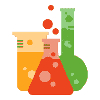

# 酶:React 的 JavaScript 测试工具

> 原文：<https://medium.com/airbnb-engineering/enzyme-javascript-testing-utilities-for-react-a417e5e5090f?source=collection_archive---------0----------------------->

作者:利兰·理查森

测试代码对于复杂代码库的可维护性至关重要，但是测试易于编写、维护和理解也同样重要。前端代码也不例外，你的 UI 中的行为也应该被测试。

大约三个月前，Airbnb 开源了用于测试 React 组件的 JavaScript 库[酵素](https://github.com/airbnb/enzyme/)。自那以后，反响非常积极，目前有超过 3000 名明星和超过 50 名投稿人，其中 45 人不在 Airbnb。

从历史上看，由于各种原因，测试 UI 一直很难完成，但是使用 React 消除了许多障碍。我们希望酶能很好地去除剩余的细菌！

# 声明性 ui 是可测试的 ui

Airbnb.com 的所有新 UI 特性现在都是使用 [React](https://facebook.github.io/react/) 实现的，它将应用程序的 UI 构建成一组可重用的“组件”。组件是一种方式，它通过一个幂等的 ***render*** 函数来声明 UI 的呈现方式，这个函数是应用程序状态的一个纯函数。

纯函数(以及 React 组件)更容易测试，因为在给定一些应用程序状态的情况下，它们只是返回一个关于组件的 UI 应该是什么样子的*描述*，而不是实际改变 UI 并产生副作用。这种“描述”被称为“虚拟 DOM ”,是一种树状数据结构。

对 React 渲染树的状态做出断言会包含大量样板代码，很难阅读，这降低了测试的价值。此外，在结果树上直接断言会将您的测试与实现细节强耦合，最终使您的测试变得极其脆弱。

Enzyme 通过围绕渲染 React 组件提供流畅的界面，使询问有关 React 组件渲染输出的问题变得简单而直观。

# React Conf 2016

上周在 react 大会上，我做了一个关于酶和测试 React 成分的简短发言。如果你还没看过，那就去看看吧！

# 例子

为了了解酶是如何工作的，我们来看一个例子:待办事项列表。

假设我们有这两个组件:

这是一个相对简单的例子，但是让我们看看我们能做出什么样的断言。

酶导出三种不同的“模式”来渲染和测试组件，*[***挂载***](http://airbnb.io/enzyme/docs/api/mount.html) ，以及 [***渲染***](http://airbnb.io/enzyme/docs/api/render.html) 。***S***[***hallow***](http://airbnb.io/enzyme/docs/api/shallow.html)是推荐的开始模式，因为它可以更好地将测试隔离到单个组件。如果*对你的用例不起作用(例如，如果你是依靠真实 DOM 的存在)， [***挂载***](http://airbnb.io/enzyme/docs/api/mount.html) 或 [***渲染***](http://airbnb.io/enzyme/docs/api/render.html) 很可能会。**

******注:*** *本例将使用* [*摩卡*](https://mochajs.org/) *和* [*柴期待*](http://chaijs.com/) *的组合，但两者都不需要使用酶。***

**我们还可以测试一下 ***ToDoList*** 组件:**

**然后我们就完事了！**

# **这与 React 的 TestUtils 相比如何？**

**如果您以前尝试过测试 React 组件，您可能会意识到 React 提供了[测试实用程序](https://facebook.github.io/react/docs/test-utils.html)来实现一些相同的目标。**

**Enzyme 使用 React 提供的几个实用程序来构建它的 API，但是提供了一个非常不同的接口和几个方法来减少样板文件和减少测试与实现之间的耦合。**

# **走向**

**Enzyme 解决的问题绝不是 Airbnb 特有的。有希望的是，通过开源酶，许多其他人会发现测试反应成分更容易和更容易。我们为未来的发展计划了许多功能，欢迎来自社区的贡献。你可以在 [Github 库](https://github.com/airbnb/enzyme)中派生 Enzyme 或者打开特性请求。**

## **在 [airbnb.io](http://airbnb.io) 查看我们所有的开源项目，并在 Twitter 上关注我们:[@ Airbnb eng](https://twitter.com/AirbnbEng)+[@ Airbnb data](https://twitter.com/AirbnbData)**