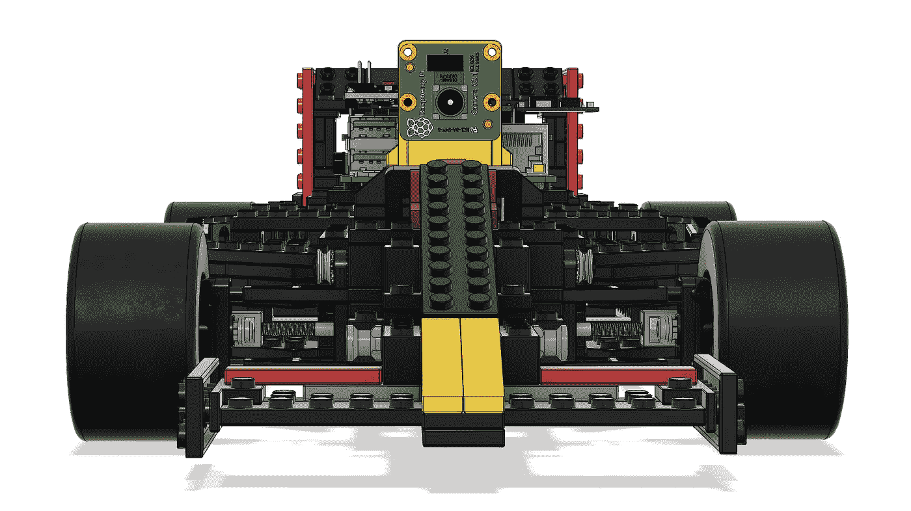
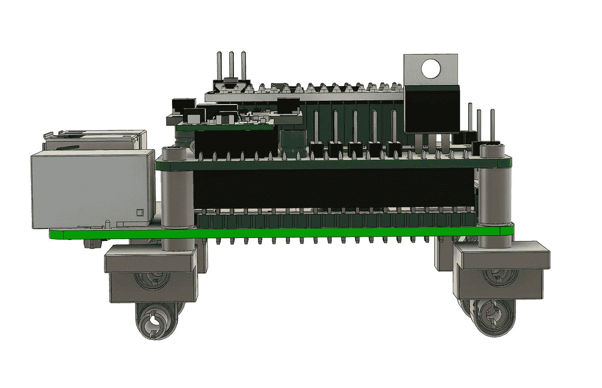
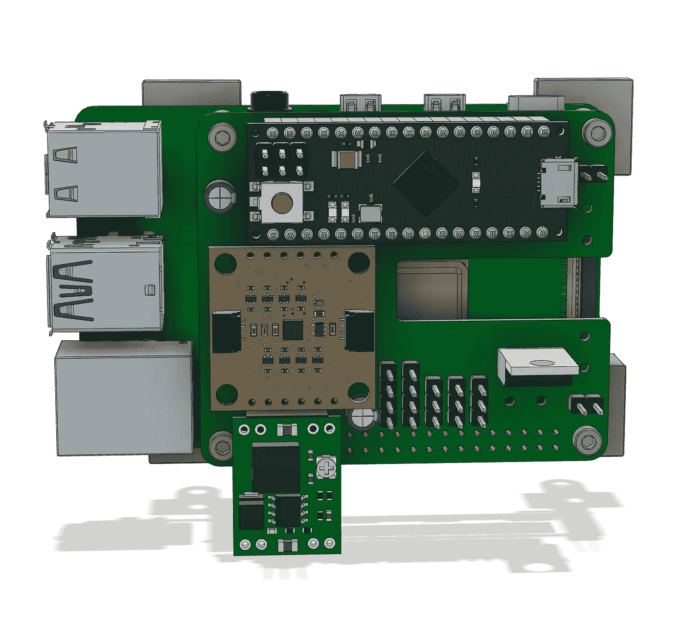
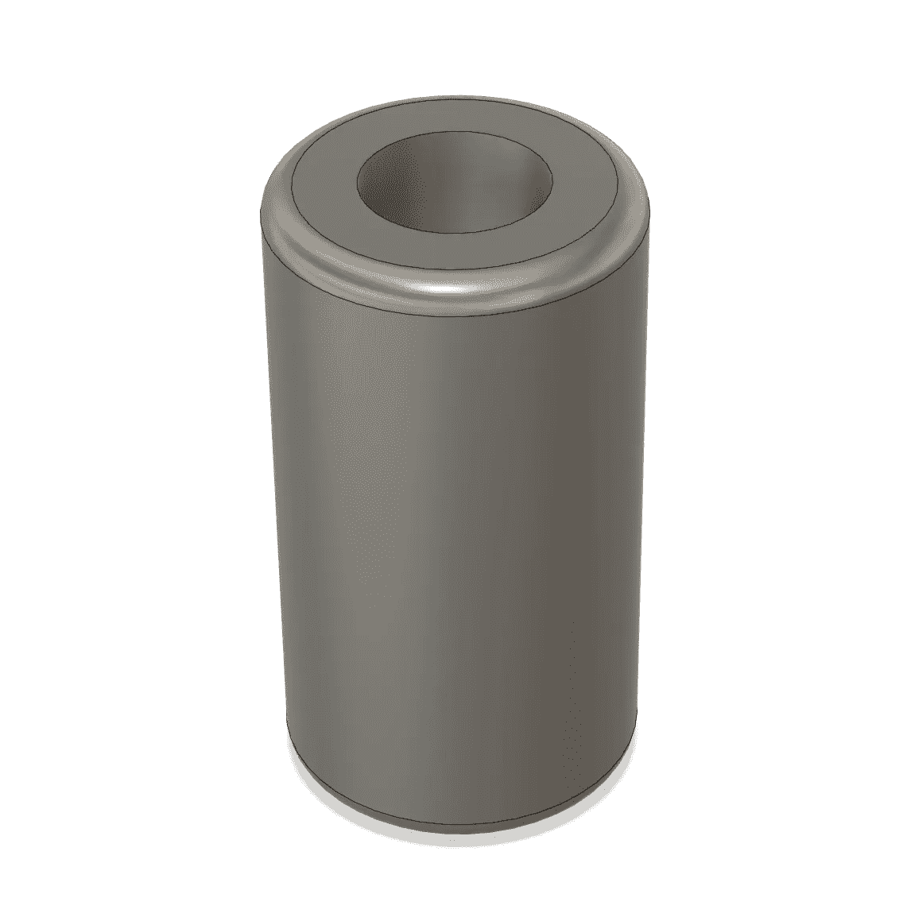
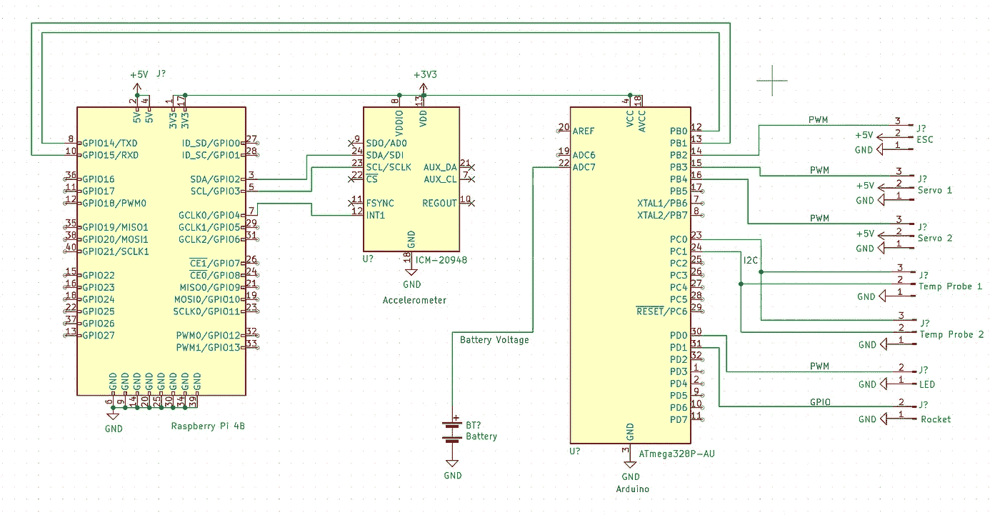
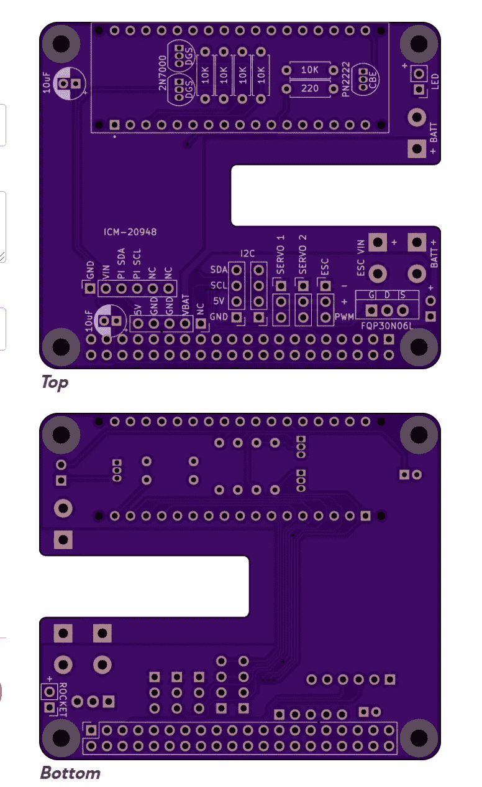

# 第 7 集—为 Raspberry Pi 制作 PCB 帽

> 原文：<https://medium.com/oracledevs/episode-7-building-a-pcb-hat-for-raspberry-pi-772352687878?source=collection_archive---------0----------------------->

CAD Model of Eff-Uno Racer

克里斯·本森

注意:如果你想在 GitHub 的 markdown 上阅读这篇文章，请点击[这里](https://github.com/chrisbensen/chris-blogs/blob/main/π-racer/season1/episode7/episode7.md)。

你可以在 GitHub [这里](https://github.com/chrisbensen/eff-uno-racer)关注这个项目。

有几集已经过去了，却没有附带的博客。有很多 CAD，3D 打印，搅拌机和其他幕后的东西，坦率地说很无聊。此外，为了“算法”的目的，我已经把东西分成一口大小的块。但是现在有相当多的东西要谈！我一直在建立一个定制的 PCB Pi 帽子！这是非常令人兴奋的，因为谁不想做一个定制的 Pi 帽子呢？今天我和一个朋友聊天，第一个反应是“你能做到吗？”

说到搅拌机，我要暂时跑题，视频系列有一个新的介绍场景。看看吧！我们还将做更多的 Blender，所以请继续关注并查看这个视频，了解如何在预算内渲染云。

# 皮帽子

Pi Hat 是一个 100%定制的 PCB，由我设计和指定。我从 SQFMI 那里得到了一些帮助，包括详细的布局和繁重的工作。SQFMI 和我一起工作，建立了代码卡和代码手表，这在过去变成了 Watchy。我用来设计 PCB 板的软件叫做 Eagle。有一个 Fusion 360 Eagle 插件但是我没有用过。

Pi Assembly

Pi Assembly

我在 Thingiverse [这里](https://www.thingiverse.com/download:10394744)创建了一个间隔 3D 打印。这必须是最简单的 3D 打印之一，但它很好地保持了 Pi 和 Hat 的分离。实际上，我已经在许多其他 Pi 项目中这样做了，所以这个垫片非常有用！

Pi Hat Spacer

第一步是用试验板制作所有东西的原型。我在第一集和第二集里记录了这条路。同时设计线路图，但起初它通常不会看起来这么好。

线路图省略了一些电阻、电容和线路电平转换器，这是为了简化，这样你就可以知道哪个引脚连接在哪里。

在这一点上，你知道你想要的工作和不工作。也许你有一些朋友筹码。但是你很清楚你想要制造什么样的 PCB 板。

# 构建定制 PCB 板

正如许多人注意到的，有一个 Arduino 和一个 Raspberry Pi 4。这顶帽子在 Pi 的上面，一个 Arduino 坐在帽子的上面。我需要一个专用的高频微控制器来控制 ESC，ESC 控制 DC 无刷电机。通过这样做，许多微控制器擅长的工作被推给了 Arduino，让 Pi 成为大脑。Arduino Micro 很好地完成了这一切。对于他们所做的事情来说，他们有点昂贵，所以我打算在未来使用覆盆子 Pico 或 Teensy。那时我正处于削减成本的阶段。现在我正处于让这东西工作的阶段。

因此，一旦所有的电子设备都确定下来，外形因素开始布局，首先是放置我称之为基础件且不能移动的东西。例如 4 针 Pi 连接器。然后开始移动东西，这样它们就合适了，痕迹也就干净了，你就有了这样的东西。

在订购 PCB 之前，你需要仔细检查每样东西 2-3 次。如果你想签出 GERBER 文件，你可以在这里找到它们。你甚至可以把它送到 OSH Park(或任何其他可以制造 PCB 的地方)去做，或者随便看看。如果你想自己做一些，大概要花 26 美元，他们会生产 3 件。

BOM 可以在这里找到，但我已经把它分解出来，列出了我在这篇博客中使用的项目:

*   (1)Arduino Micro[https://store.arduino.cc/products/arduino-micro](https://store.arduino.cc/products/arduino-micro)
*   (1) Sparkfun ICM-20948 加速度计【https://www.sparkfun.com/products/17241 
*   (1) Pololu D24V50F5 调压器【https://www.pololu.com/product/2851 
*   (5)https://www.sparkfun.com/products/10969[10K 电阻器](https://www.sparkfun.com/products/10969)
*   (1) 220 电阻器
*   (2) 10uF 16V 电容[https://www . Amazon . com/电解-电容-电容-调节-冰箱/dp/B08L5ZL87P](https://www.amazon.com/Electrolytic-Capacitors-Capacitor-Conditioning-Refrigerator/dp/B08L5ZL87P)
*   (2)2n 7000[https://www . Amazon . com/CHANZON-100p cs-2n 7000-Transistor-Channel/DP/b 083 tf4k 6 l](https://www.amazon.com/CHANZON-100pcs-2N7000-Transistor-Channel/dp/B083TF4K6L)
*   (1)pn 2222[https://www.sparkfun.com/products/13689](https://www.sparkfun.com/products/13689)[https://www . Amazon . com/ada fruit-NPN-Bipolar-Transistors-pn 2222/DP/b 00 xw 2 ok 7m](https://www.amazon.com/Adafruit-NPN-Bipolar-Transistors-PN2222/dp/B00XW2OK7M)
*   (1)fqp 30N 06 l[https://www . Amazon . com/bo jack-RFP 30N 06 le-MOSFET-N 沟道晶体管/dp/B07WR86ZGS](https://www.amazon.com/BOJACK-RFP30N06LE-MOSFET-N-Channel-Transistor/dp/B07WR86ZGS)
*   (1) 5 针 0.1 英寸(2.54 毫米)间距接头用于调压器的单排公接头 5 针母接头 1.0 间距[https://www.sparkfun.com/products/18218](https://www.sparkfun.com/products/18218)
*   (1) 6 针 0.1 英寸(2.54 毫米)间距接头加速度计单排公接头 6 针母接头 1.0 间距[https://www.sparkfun.com/products/18219](https://www.sparkfun.com/products/18219)
*   (2) 17 或 18 针 0.1 英寸(2.54 毫米)间距接头用于 Arduino 的单排公接头 18 针母接头 1.0 间距母接头[https://www . mouser . com/product detail/3M-Electronic-Solutions-Division/929870-01-18-RA？QS = neFkstNq % 252 b 6 hwvp % 2 fqzdgcyg % 3D % 3D](https://www.mouser.com/ProductDetail/3M-Electronic-Solutions-Division/929870-01-18-RA?qs=neFkstNq%252B6Hwvp%2FqzdGcyg%3D%3D)[https://www . Amazon . com/gp/product/b 07 cggsdwf/ref = ppx _ yo _ dt _ b _ asin _ title _ o00 _ s00？ie = UTF8&PSC = 1](https://www.amazon.com/gp/product/B07CGGSDWF/ref=ppx_yo_dt_b_asin_title_o00_s00?ie=UTF8&psc=1)https://www.sparkfun.com/products/115
*   (1)2 个 20 英寸 0.1 英寸(2.54 毫米)pi Pi 管座的内螺纹管座[https://www.sparkfun.com/products/14017](https://www.sparkfun.com/products/14017)[https://www . Amazon . com/gp/product/b 00 R1 ll m1 m/ref = ppx _ yo _ dt _ b _ asin _ title _ o00 _ s00？ie=UTF8 & psc=1](https://www.amazon.com/gp/product/B00R1LLM1M/ref=ppx_yo_dt_b_asin_title_o00_s00?ie=UTF8&psc=1)
*   男头球[https://www.sparkfun.com/products/116](https://www.sparkfun.com/products/116)
*   电线[https://www . Amazon . com/BNTECHGO-Silicone-Flexible-Strands-Stranded/DP/b01ao 7586 o](https://www.amazon.com/BNTECHGO-Silicone-Flexible-Strands-Stranded/dp/B01AO7586O)

我可以谈论细节，但我真的不知道每个人感兴趣的是什么，所以我打算建议大家看这个视频，一旦视频发布，我会将其嵌入到这个博客中，并可以自由提问。也许您会得到一些反馈，这将节省一些时间，或者是一种更好的做事方式。我喜欢建设性的反馈。我当然不是什么都知道。让我参与的最好方法是通过推特上的这个链接，但我也会回答媒体上的评论。

**第 1 集-定制覆盆子 Pi 零面包板**

[https://youtu.be/-BF6zZbBVFA](https://youtu.be/-BF6zZbBVFA)
https://youtu.be/GUiLuG1Drjg
事情:[https://www.thingiverse.com/thing:4868187](https://www.thingiverse.com/thing:4868187)
博客:[https://chrisbensen . media . com/starting-a-new-project-pi-zero-custom-board-834 df 6414 ac6](https://chrisbensen.medium.com/starting-a-new-project-pi-zero-custom-breadboard-834df6414ac6)

**第 2 集-Pi 控制电机**

简短:[https://youtu.be/9aLBQ6m8_kI](https://youtu.be/9aLBQ6m8_kI)
扩展:[https://www.youtube.com/watch?v=0F65hw3ntPk](https://www.youtube.com/watch?v=0F65hw3ntPk)
Oracle devs Blog:[https://media . com/oracledevs/pi-controlled-motors-b5cf 81 EEA 42 f](/oracledevs/pi-controlled-motors-b5cf81eea42f)
Blog:[https://chrisbensen.medium.com/pi-controlled-motors-](https://chrisbensen.medium.com/pi-controlled-motors-)

**第 3 集-打造赛车框架**

视频短片:[https://youtu.be/LdEc4mMFxYc](https://youtu.be/LdEc4mMFxYc)
博客:[https://chrisbensen . media . com/build-a-race-car-frame-out-of-a-toy-c7be 93 e 53 b 3](https://chrisbensen.medium.com/building-a-race-car-frame-out-of-a-toy-c7bec93e53b3)thinks:[https://www.thingiverse.com/thing:4942247](https://www.thingiverse.com/thing:4942247)

**第 4 集——将无刷 DC 电机放入玩具车**

YouTube:[https://youtu.be/HyF0RWx8g84](https://youtu.be/HyF0RWx8g84)
事:[https://www.thingiverse.com/thing:4940804](https://www.thingiverse.com/thing:4940804)

**第 5 集——下一阶段:3D 打印 RC 伺服电机适配器**

YouTube:【https://youtu.be/jEd3AQucW5Q 

**第 6 集——在玩具砖块上使用圆周率**

YouTube:[https://www.youtube.com/watch?v=0sjXmYHnOKY&list = PLPIzp-E1 msrz 0 wavm 20 tkxtm 7 hm 5 jnhxc&index = 1](https://www.youtube.com/watch?v=0sjXmYHnOKY&list=PLPIzp-E1msrZ0WAvm20TkXtm7Hm5JnHxc&index=1)