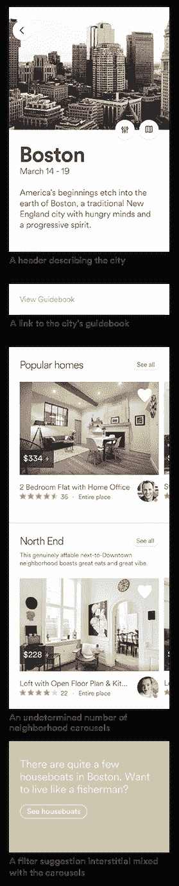

# Epoxy: Airbnb 在 Android 上的视图架构

> 原文：<https://medium.com/airbnb-engineering/epoxy-airbnbs-view-architecture-on-android-c3e1af150394?source=collection_archive---------0----------------------->

伊莱·哈特

介绍环氧:【github.com/airbnb/epoxy 

Android 的 RecyclerView 是显示项目列表的强大工具，但它的使用充斥着样板文件和配置。我们团队的一个常见需求是显示复杂的列表，例如多视图类型、分页、平板支持和项目动画。我们发现自己一遍又一遍地复制相同的配置模式。我们开发了[环氧树脂](https://github.com/airbnb/epoxy)来缓解这种趋势，并简化静态和动态加载内容的基于列表的视图的创建。

Epoxy 采用一种可组合的方法来构建列表。列表中的每一项都由一个模型表示，该模型定义了该项的布局、id 和范围。该模型还处理将数据绑定到项目的视图，并在视图被回收时释放视图的资源。这些模型按照您希望它们显示的顺序添加到 Epoxy 的适配器中，适配器为您处理显示它们的复杂性。

# 用环氧树脂显示搜索结果

让我们看一个实际例子来说明这是如何工作的。这是 Airbnb 应用程序的一个视图，显示了一个城市中社区的搜索结果。



打破这种观点，我们有:

*   描述城市的标题
*   城市指南的链接
*   不确定数量的邻近旋转木马
*   一个过滤器建议与传送带间隙混合

除此之外，有时还会显示一些其他视图，例如:

*   分页时结果末尾的加载指示器
*   出现网络问题时的错误消息
*   当您滚动浏览所有结果时，会出现一个文本行。
*   在某些国家显示的价格免责声明

这为我们提供了八种独特的视图类型，我们需要使用 RecyclerView 将它们组合起来，以便整个页面可以滚动，并呈现在一致的界面中。

设置这么多视图类型的 RecyclerView 适配器通常会很麻烦。我们将有一个复杂的类来指定视图类型 id、项目计数、跨度计数、视图持有者、点击监听器等等。

使用 Epoxy 的组合方法，我们的适配器可以专注于指定要显示的项目，而显示它们的细节被委托给模型。

大致如下所示:

```
public class SearchAdapter extends EpoxyAdapter {
    public void bindSearchData(SearchData data) {
      header.setCity(data.city);
      guidebookRow.showIf(data.hasGuideBook()); for (Neighborhood neighborhood : data.neighborhoods) {
        addModel(new NeighborhoodCarouselModel(neighborhood));
      } loader.showIf(data.hasMoreToLoad());
      notifyModelsChanged();
    }
  }
```

我们的 bindSearchData()方法接受一个包含构建视图所需的所有信息的对象。它是幂等的，每当某些东西可能已经改变时就调用它，并且它重建模型状态以反映新的搜索数据。在最后一行中，我们告诉 Epoxy 计算新模型和旧模型之间的差异，它通知 RecyclerView 确切的变化，如果有的话。

这类似于 javascript 中的 [React](https://facebook.github.io/react/) 处理用户界面的方式。代码只需要描述应该显示什么，适配器负责如何显示它的细节。我们不需要显式定义任何信息，比如项目 id、计数或视图持有者。此外，我们免除了通知发生了什么变化的所有责任。

这提供了一个很好的体系结构，在这个体系结构中，活动从各种来源加载数据，比如数据库、缓存或网络请求。它将该状态存储在传递给适配器的对象中，适配器构建其模型以反映当前状态。每当状态对象发生变化时，无论是由于用户输入还是新加载的数据，新的状态都会传递给适配器，模型也会再次更新。可以在模型上设置点击监听器，以便在发生变化时回调活动。

这种方法清晰地划分了职责。随着设计的改变或新功能的增加，模型可以很容易地换入或换出。由于组合方法和适配器提供的抽象，复杂性保持较低。

通常，由于适配器项目频繁更改，性能可能会受到影响。然而，Epoxy 添加了一个不同的算法来检测模型中的变化，并且只更新实际发生变化的视图。

## **跟踪适配器项目变更**

普通适配器的另一个复杂性是跟踪项目变化。项目可能会被添加、删除、更新或移动，并且适配器必须被通知这些更改才能正常工作。如果操作正确，这些 notify 调用允许 RecyclerView 只重绘发生了更改的视图，并显示这些更改。然而，在已经很复杂的适配器中手动管理这一点可能很困难。

Epoxy 通过在模型上使用不同的算法来解决这个问题。任何时候您更改模型设置，Epoxy 都会发现差异，并将更改集报告给 RecyclerView。这简化了您的适配器代码，免费提供了项目更改动画，并通过仅在必要时重新绑定视图来提高性能。

这种区分算法依赖于实现 hashCode 的每个模型，因此它可以检测模型何时发生了变化。Epoxy 提供了一个注释处理器，因此您的模型可以简单地注释应该在模型状态中考虑的字段。生成的子类为您实现了正确的 hashCode 方法，以及每个字段的 getter 和 setter 方法。

继续我们上面的例子，我们的头模型看起来像这样:

```
public class HeaderModel extends EpoxyModel<HeaderView> {
    @EpoxyAttribute City city;

    @Override
    public void bind(HeaderView headerView){
        headerView.setImage(city.getImage());
        headerView.setTitle(city.getName());
        headerView.setDescription(city.getDescription());
    }

    @LayoutRes
    public int getDefaultLayout() {
        return R.layout.model_header_view;
    }
}
```

HeaderModel_ class 是用我们需要的“setCity”方法生成的，我们在向模型列表添加标题时使用该类的一个实例。只有当城市对象改变时，标题视图才会更新。这假设 City 对象也实现了一个适当的 hashCode 方法来定义它的状态。

您还会注意到，该模型实现了 getDefaultLayout()来返回布局资源。该资源用于扩展传递给模型的 bind 方法的视图，其中数据实际上是在视图上设置的。此外，布局在适配器中用作项目的视图类型 id。

## **默认稳定 id**

为了正常工作，默认情况下，Epoxy 在 RecyclerView 中启用稳定的 ids。这使得区分成为可能，并支持项目动画和保存状态。每个模型负责定义它的 id，我们在动态生成的模型上手动设置一个 id。例如，每个邻域轮播模型都分配有网络请求中的邻域对象给出的 id。

像 header 这样的静态视图更棘手。没有与它固有关联的 id，所以我们必须编造一个。Epoxy 通过为每个新创建的模型自动生成一个 id 来简化这一过程。在 app 进程的生命周期中，id 保证在所有其他生成的模型 id 中是唯一的，负 id 用于避免与您可能手动设置的 id 冲突。

这里唯一的问题是，我们必须在适配器的生命周期中使用相同的模型，以便 id 保持不变。对于我们的 header 模型(和其他静态视图),这意味着我们将它声明为一个字段，使它成为 final，并以内联方式初始化它。然后，我们根据需要将它添加到模型列表中，并像往常一样更新它的数据。id 是唯一的，不需要我们做额外的工作。

## **保存视图状态**

Epoxy 还增加了对保存列表中视图状态的支持，这是 RecyclerView 默认缺少的。例如，我们上面的搜索设计中的转盘可以水平滑动，为了获得良好的用户体验，我们希望保存这个转盘的滚动位置。如果用户在结果中向下滚动，然后返回，他们应该会看到一个与离开时相同状态的转盘。类似地，如果他们旋转他们的手机或切换应用程序并回来，我们应该呈现相同的状态，尽管活动被重新创建。

对于普通的 RecyclerView 适配器，这将需要相当大的开销来实现。然而，Epoxy 为保存任何模型的视图状态提供了通用支持。它通过利用稳定的 id 将视图的打包状态与模型 id 相关联来实现这一点。

要使用它，只需添加以下内容:

```
@Override
public boolean shouldSaveViewState {
    return true;
}
```

到你的模型，环氧树脂将保存它的状态，当它离开屏幕，并恢复当它回来。默认情况下，它被设置为 false，这样内存和滚动性能就不会因为保存不必要视图的状态而受到影响。

# 使用环氧树脂作为静态成分

回收器视图通常只在显示从远程源(如网络请求或数据库)加载的动态内容时使用。否则，用 XML 指定组件的滚动视图会更简单。不过，使用 Epoxy，您可以获得 RecyclerView 的好处，而不需要比 ScrollView 更多的工作。我们通过下图中的列表详细信息页面来做到这一点。


用 ScrollView 构建它是最简单的。然而，我们使用了带有环氧树脂的 RecyclerView 来给我们更快的页面加载时间和简单的动画。

这种性能优势对我们至关重要，因为当用户浏览搜索结果时，这个页面经常被加载。单击搜索结果会将共享元素中的列表图像动态显示到此详细信息页面。让这个动画流畅对于愉快的搜索体验很重要，但是它要求我们有一个加载非常快的列表细节视图。

让我们详细看看这个屏幕上的视图，以及它们如何影响性能。首先，顶部的照片实际上是一个水平的回收视图，所以人们可以浏览列表的图像。在中间，我们有一个静态地图视图，显示该列表在哪里，在底部，我们有另一个 RecyclerView，显示该地区的类似列表。在它们之间散布着一些描述清单的文本行和小图片。

总之，这给了我们一个相当复杂的视图层次，有许多位图。这使得测量和布局过程需要更长时间，并且需要更多内存来加载图像。

此外，我们从各种来源加载数据——数据库、内存缓存和多个网络请求——来支持此页面。这对于向用户显示即时数据非常有用，但是如果处理不当，会导致花费额外的时间来更新视图。

在大型视图层次结构、大量位图和多次视图刷新之间，我们有充分的理由担心性能。令人欣慰的是，Epoxy 让我们能够提供出色的用户体验，尽管有以下三个原因:

*   因为我们使用 RecyclerView，所以当用户第一次打开这个屏幕时，只加载视图层次结构的一小部分。这可以避免过早地加载地图位图、底部转盘以及它们之间的所有视图。这有助于更快的布局时间，更少的内存使用，最重要的是更平滑的过渡。
*   随着加载的数据越来越多，我们不需要反复使视图层次无效，从而减少了丢帧的机会。如果类似的列表请求返回，并且传送带不在屏幕上，我们不需要做任何事情。如果日期变更导致新的总价，Epoxy 所做的就是更新价格文本字段。这增加了输入过渡的平滑度，并防止用户滚动时丢帧。
*   项目变化是免费的动画。随着数据的变化，我们可以用平滑的动画隐藏、显示或更新视图。例如，点击一个翻译评论的按钮就可以很好地插入一个加载器，当可用时，加载器就会转换到翻译的文本。这避免了默认情况下会发生的即时视图变化的不和谐性质。

# 环氧树脂的未来

我们很高兴现在将 Epoxy 作为一个[开源库](https://github.com/airbnb/epoxy)共享，并欢迎有兴趣与我们一起改进它的开发者的贡献。我们正在积极开发 Epoxy 来改进它的注释处理器、差分算法和通用工具。我们希望其他开发人员可以找到这个库的新用途，并帮助我们将它发展成一个更好的工具。

## 在 [airbnb.io](http://airbnb.io) 查看我们所有的开源项目，并在 Twitter 上关注我们:[@ Airbnb eng](https://twitter.com/AirbnbEng)+[@ Airbnb data](https://twitter.com/AirbnbData)