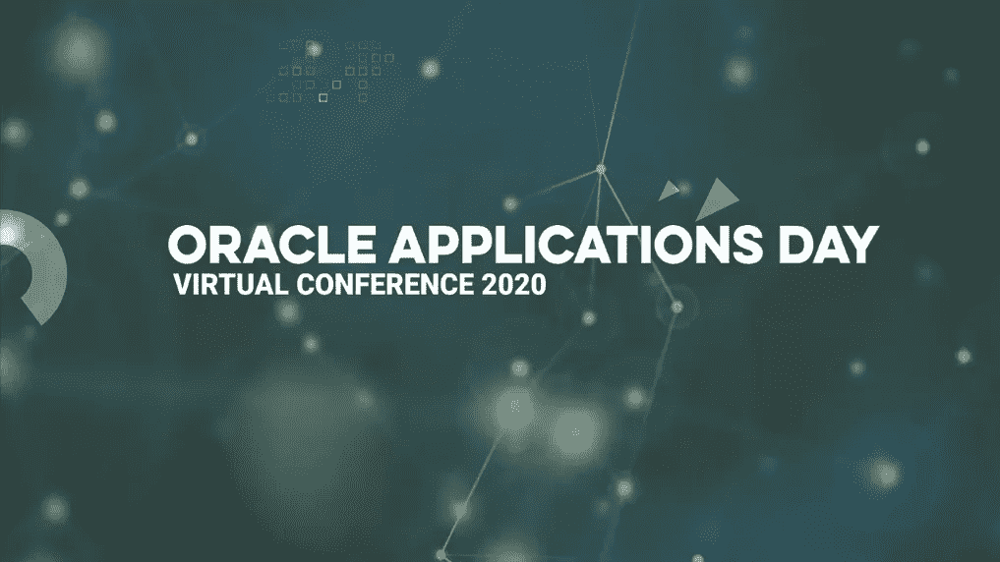

# 2020 年 Oracle 应用日的 ERP 云亮点

> 原文：<https://medium.com/version-1/erp-cloud-highlights-from-oracle-applications-day-2020-4e7f301b698e?source=collection_archive---------2----------------------->

2020 年第 1 版 Oracle 应用程序日是我们为 Oracle 客户和业务用户举办的最大型活动。2020 年 10 月 15 日，来自英国和爱尔兰的 200 多名代表以及来自世界各地的演讲者首次参加了第一版。任何希望重新观看会议或第一次错过活动的人都可以点播所有会议的记录。

一个多月前，我加入了第 1 版，和其他代表一样，我渴望听到现有客户的声音，了解他们如何通过创新来提升组织的价值；以及一路上学到的经验教训，其他有类似经历的人可以从中受益，从而使他们和他们的组织受益。对于那些想在观看完整视频之前了解 Oracle ERP 云流程的一些关键信息的人来说，这里是我的一些亮点…

**主题演讲——汤姆·奥康纳——第一版 CEO**

以对所有与会者和演讲者的热烈欢迎开始这一天，Tom 设定了一个场景，即使在当前疫情局势带来的所有商业挑战的背景下，也有希望，有前进的道路，并且有机会改善我们的客户和合作伙伴组织的财富。

这在实践中是如何发生的将取决于你的组织的优先事项是什么，它们是:

*   数字化转型
*   自动化/成本优化
*   商业价值
*   避免技术债务

Tom 强调，我们在第 1 版中的[核心价值观之一是客户至上，并且“我们的工作是给你最好的建议，让你为了长期业务利益做出明智的决定，而不管这是否符合第 1 版的短期利益”](https://www.version1.com/our-difference/)

我们希望我们能够帮助您了解您的旅程，并使您能够为您和您的组织做出最佳决策——无论您从哪里开始，想要到达哪里。

**颠覆时代的敏捷艺术——克里斯·莱昂(SVP &甲骨文人力资本管理(HCM)云总经理)、甲骨文**

Chris Leone 介绍了 Oracle 如何与 HCM 客户合作，成功适应和驾驭不断变化和颠覆的新世界，并首先祝贺 Spire Healthcare(英国最大的私营医疗保健提供商之一)和 Version 1 在锁定期间成功实施了几项 Oracle 云实施中的一项。

Chris 随后介绍了 Oracle 对 Covid 的回应以及客户可获得的 FOC 支持的最新情况。关键信息包括:

*   **敏捷性是关键:**包括西奈山和 Co-Op 是如何应对和适应与 Covid 相关的挑战和机遇的显著例子
*   **超越变化:**强调更新现有业务流程和创建新流程的重要性，同时保持员工的参与度和生产力。这涵盖了如何有效地调动人才，如何通过简化的日常任务利用“旅程”实现变革，以及人员分析如何提供有助于业务决策的见解。
*   **合作关系:**甲骨文云社区如何帮助分享知识，根据用户需求确定未来发展蓝图，并提供最佳实践以造福所有人。

SaaS:如果没有，为什么没有？如果不是现在，什么时候？—Colm Gillard(Oracle Cloud ERPM 和 HCM 业务负责人)，第 1 版

基于 Colm 在几十个成功的大规模 Oracle 转型项目中的经验，这是任何考虑 Oracle 云转型的人都必须观看的会议。

使用 Neo 在《黑客帝国》*电影*中的红色药丸和蓝色药丸之间的决定进行类比，本会议描述了内部部署应用程序与软件即服务(SaaS)之间的差异，并根据我们部署 SaaS 的经验提供了一些真实的示例和考虑事项，同时也消除了一些误解。这些是在一些关键差异的上下文中描述的，这些差异涉及:版本/升级、采用、补丁、安全性和创新能力。

Colm 介绍了 Covid 如何影响组织，并就我们如何观察他们未来的企业系统路线图受到的影响以及我们的客户正在适应的一些方式给出了他的想法，即:涡轮增压财务规划、提升员工技能和实现转型(带小 t)可以帮助加速走向新常态。

Colm 深入探讨了变化带来的一些挑战，以及版本 1 和我们的客户如何成功应对这些挑战。其中一个例子是 Guys and St Thomas NHS Foundation Trust ' s journey，它也可以点播。

最后，Colm 总结道“这仍然是一个旅程，所以不要忘记地图”,如果您对如何从 Oracle SaaS 获得业务优势有任何疑问，请联系我们。

**盖伊和圣托马斯国民保健基金会信托公司的 ERP 云之旅— Catherine Eyre(首席会计师)**

Catherine 提供了一个非常实用的分步指南，介绍了在选择第 1 版作为实施合作伙伴之前，他们如何构建业务案例以及如何与 Oracle 合作。

他们的内部业务案例讨论涵盖了无所作为的风险、时间表、他们采取的流程以及他们迄今为止在 Oracle ERP 云实施之旅中的一些决策和理由。

Catherine 讲述了他们对升级内部解决方案的考虑，以及为什么最终选择了云/SaaS 模式(*剧透:升级和实施云的成本非常相似*)。

做出这个决定后，Guys & St Thomas 认识到他们需要一些咨询支持来为项目奠定基础(目标、愿景、范围等)，还需要一个值得信赖的实施合作伙伴版本 1 来实现他们 2021 年 4 月上线的目标。

Catherine 向我们介绍了他们如何管理第 1 天的沟通，以确保期望值正确一致(我们称之为转型，带有一个小 t)，从而为他们继续 SaaS 之旅提供一个成功采用的平台。

**Future Ready Finance——Nick Jackson——特许管理会计师协会(CIMA)主席，甲骨文销售开发主管，金融数字化转型**

Nick 的会议分享了他在金融数字化转型前沿工作中收集的许多全球见解。

Nick 首先指出，组织所面临的变革的速度和规模从未像现在这样显著，而且只会继续产生影响。Covid 加剧了这种情况，增加了不确定性，同时也要求组织在其工作方式中建立更大的弹性。

他接着描述了金融业将如何帮助重建信心和推动复苏；以及相关的恢复阶段，即:应对、忍耐、创新、恢复、重新想象。这些阶段有助于解决客户和雇主的直接需求，保护业务连续性，识别和利用新的机会，重新获得完整的功能，并致力于持续发展。

也许有争议的是，Nick 认为目标运营模式(TOM)定义不再是最佳方法。随着变化的步伐，他得出结论，最好提供一个关注今天、明天的模型，关键是提供灵活性以涵盖我们目前不知道的内容，以便我们能够以更敏捷的方式适应未来带来的任何挑战。

Nick 还分享了一些关于财务职能如何变化的预测，从记录系统转向解释系统、参与系统，并转向治理和监督系统和技术，以帮助设定战略方向。这带来了巨大的机会，但也带来了与此机会相关的技能差距，主要围绕数据和分析、网络安全、业务解决方案架构师和战略业务合作伙伴。

没有坚实的基础，变革和敏捷是很难实现的。Nick 总结了云对支持这一变化的重要性，以及云如何为第一天的节省奠定基础，这是第二天节省的平台。至关重要的是，虽然变化的速度很快，但这种快节奏并不需要一次性解决所有问题。它可以以一种更温和的方式进行，重点关注实时应用，然后利用收集到的信息进行洞察，最终影响您的业务。

廷德尔·莱利是如何利用 OIC 的&OAC——塞伦·哈利勒(导演)廷德尔·莱利

seren Halil(Tindall Riley 主管)从客户的角度讲述了他们如何利用 Oracle 集成云(OIC)和 Oracle 分析云(OAC)来构建 Oracle 云迁移，该迁移在 3 个月内以创纪录的速度按预算完成。

作为一家全球主要的航运保险公司，Tindall Riley 使用了他们的 Business Objects 报告工具，该工具经过多年的改进，完全符合他们的业务需求。但是，由于他们的基础企业解决方案跟不上业务需求的变化，这意味着他们需要改变 Oracle Cloud ERP 解决方案中未来的报告方式；决定采用 Oracle 集成云(OIC)和 Oracle 分析云(OAC)来满足这一需求。

Seren 描述了他们在 OAC 的决策是如何得到支持的，以及需求收集和验证业务需求是如何导致增强的报告，从而有助于推动 Tindall Riley 的全球业务。

最后，Seren 描述了 Oracle 云给他们带来的好处，包括它如何减轻 Tindell Riley 内部的压力、自动化某些流程，以及“实际上已经收回了成本”。

**Oracle 融合云自动化测试— Adam Hammel，第 1 版**

转移到 SaaS 和季度发布有巨大的优势，但也带来了一些较小的代价，即更常规的回归测试。Adam 讲述了[版本 1 的最大化自动化测试解决方案](https://www.version1.com/it-service/erp/maximise/automatedtesting/)旨在解决的一些挑战，以及我们为增强客户利益而做出的一些设计决策。

需要克服的一些挑战包括:

*   减少 SME 员工在回归测试窗口期间花费的时间和精力，以便他们可以专注于增值活动
*   创建可重复的测试脚本，这些脚本随着 Oracle 产品的不断发展而不断更新，这样只需点击一下按钮就可以运行测试
*   在未来之前做出正确的技术决策促进解决方案和我们客户的投资
*   拥有经过全面审计的跟踪记录，有助于我们的客户证明合规性、降低风险并防止问题/罚款

会议以该解决方案的简短演示结束，演示该解决方案如何帮助我们的客户减少测试工作量、降低成本，并最大限度地提高员工为其业务带来的价值。

**云应用的托管服务— Rachel Blake & Raj Bopari，第 1 版**

自 1996 年以来，版本 1 已经为 150 多家客户提供了 Oracle 托管服务，同时保持了 98%以上的客户保留率。随着向 Oracle 云应用程序的迁移，托管服务的格局发生了变化，Rachel 和 Raj 讲述了版本 1 如何继续在云中提供价值。

本专题讲座将概述云季度更新流程和优势、Wave 1/2/3 的一些注意事项，以及如何管理每月维护和每周高优先级更新的详细信息。

Rachel 接着描述了第 1 版托管服务产品(根据个人需求定制)如何帮助管理和优化您的实施。这种支持可以是任何形式，从客户内部专业知识的轻度支持，一直到完全托管的服务，或者介于两者之间的任何形式。每项服务都包括季度运行状况检查服务，可确保一切顺利运行并提供改进建议，还可以包括回归测试建议/支持，可以手动或自动执行。

**参与业务、保持专注的六个简单步骤&实施变革——克里斯·麦克布莱恩，第 1 版**

您对项目成功的判断是项目上线了吗？还是从解决方案交付和新的工作方式中实现收益？

Chris 介绍了总体项目和 Covid 的变革背景，Covid 推动了与今年早些时候不同的变革/转型需求。

这带来了变更管理的弹性，并将其包含在您的项目中。

考虑到这一点，Chris 描述了我们行之有效的实施变革的六阶段流程，以及实用的建议、模板、资源配置和时间安排的详细信息以及经验教训。

这一切都始于弄清楚我们在做什么，为什么和如何去做；并最终跟踪收益的监控和交付方式，以及成功的宣布方式和时间。

这种方法融入并符合我们的项目方法，以确保变革与技术部署相结合，从而确保交付业务成果，而不仅仅是技术上线；从而确保我们忠实于第 1 版“客户至上”的核心价值观，支持客户取得成功。

**总之:**

该活动涵盖了 Oracle 云之旅的方方面面，从考虑云是否适合您，到编写奠定基础并验证您的选择的业务案例的步骤，从我们客户的角度出发的旅程，在此过程中使用的一些工具，以及我们的客户如何在每一步都得到支持。

正如汤姆前面提到的，不管你从哪里开始，想去哪里，都有希望，都有前进的道路。如果你需要一个以前走过这条路的人，有一张地图，愿意把你的利益放在第一位，并能带你踏上旅程，那么请不要犹豫，通过[gregory.alexander@version1.com](http://gregory.alexander@version1.com)或[https://www.linkedin.com/in/gregoryalexander1/](https://www.linkedin.com/in/gregoryalexander1/)与版本 1 取得联系

[**所有会议的录像现在都可以点播给任何希望重新观看会议或第一次错过活动的人。**](https://www.version1.com/virtual-event-erp-oracle-applications-day-2020/)

# OracleApps2020 # Oracle #版本 1