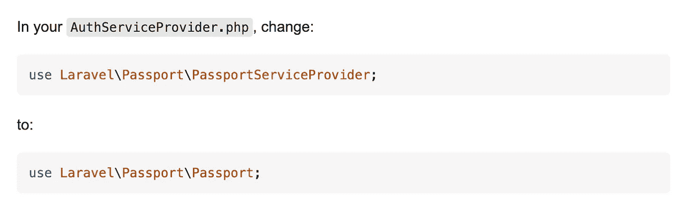

# 错误:找不到类“Laravel \ Passport \ PassportServiceProvider”。我该怎么办？

> 原文：<https://medium.easyread.co/error-class-laravel-passport-passportserviceprovider-not-found-what-should-i-do-d12c018df6dd?source=collection_archive---------2----------------------->


Photo by [Stone Hood](https://unsplash.com/@stonehood?utm_source=medium&utm_medium=referral) on [Unsplash](https://unsplash.com?utm_source=medium&utm_medium=referral)

嗨，伙计们，现在我有了新的笔记本电脑来做所有的事情。好开心。我希望我能用我的新资产做些大事。Aamiin。好了，转到主题，当我继续我的基于 Laravel 的项目时，当我打开它并运行`php artisan serve`命令时，我得到如下的错误消息:

`Class "Laravel\Passport\PassportServiceProvider" not found`。那是什么意思？

我搜索并从这个来源得到了解释，他说:



嗯，默认情况下，我的导入包是相同的。但至少我知道文件在哪里。所以，我决定寻找任何来源，我得到了解决它的方法。

```
composer require laravel/passport 
php artisan migrate 
php artisan passport:install
```

我试了试，taraaaa，我的错误解决了。我希望你们也有同样的错误，当你们看到这篇文章的时候能够解决。

注意安全，保持健康，周末愉快！

# 参考

[](https://stackoverflow.com/questions/44787458/laravel-passport-install-class-not-found) [## 未找到 Laravel Passport 安装类

### 我正在尝试配置我的 Laravel 应用程序来使用 Passport，但是在我的…

stackoverflow.com](https://stackoverflow.com/questions/44787458/laravel-passport-install-class-not-found)  [## 找不到“laravel \ Passport \ PassportServiceProvider”

### 如何解决这个问题？我安装了 passport，安装后，我删除了它，现在它显示错误…

laracasts.com](https://laracasts.com/discuss/channels/laravel/laravelpassportpassportserviceprovider-not-found) 

[给朋友打电话]

事实上，要让我说的话成为现实是有可能的。我可以支持我的公司生产--------------------------------------------------------------------------------------------------------《beneteen.com 》--------------------------------------------------------------