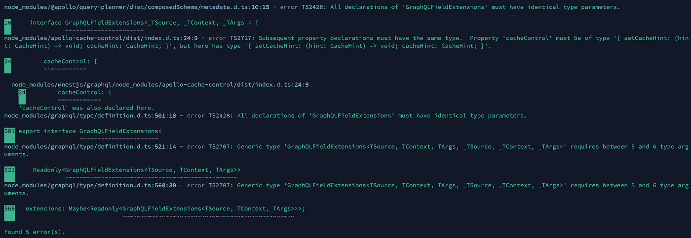

# 错误:使用 Graphql 和 Nestjs 时，如何解决“GraphQLFieldExtensions and friends”及其衍生词

> 原文：<https://medium.easyread.co/error-how-to-solve-graphqlfieldextensions-and-friends-its-derivatives-when-use-graphql-and-718a5d318fd1?source=collection_archive---------2----------------------->



在一个月内，我几乎放弃修复错误，因为图片显示在顶部。但是在这个时候，我发现了如何修复它们。对于这个例子，我使用了 Nestjs 和 Graphql。我该怎么处理？

只要查一下你的`package.json`，然后卸载 4 个包。他们是，

1.  [@nestjs/graphql](http://twitter.com/nestjs/graphql) ，
2.  graph QL-工具，
3.  graphql，
4.  阿波罗-服务器-快递，

然后，重新安装。

在你的终端上复制这个命令，请打开它。

**卸载软件包**

```
npm uninstall [@nestjs/graphql](http://twitter.com/nestjs/graphql) graphql-tools graphql apollo-server-express
```

**安装包**

```
npm install [@nestjs/graphql](http://twitter.com/nestjs/graphql) graphql-tools graphql apollo-server-express
```

希望我能帮到你们。

[给朋友打电话]

你好朋友，支持我，让我仍然可以写其他有趣的文章。你可以通过购买原创、自制的产品来支持我，当然也可以只在 [@beneteen](http://twitter.com/beneteen) 或[beneteen.com](https://beneteen.com/)购买本地品牌

# 参考

[](https://github.com/apollographql/apollo-server/issues/3339) [## cacheControl 类型问题问题# 3339 apollographql/Apollo-server

### 此时您不能执行该操作。您已使用另一个标签页或窗口登录。您已在另一个选项卡中注销，或者…

github.com](https://github.com/apollographql/apollo-server/issues/3339)