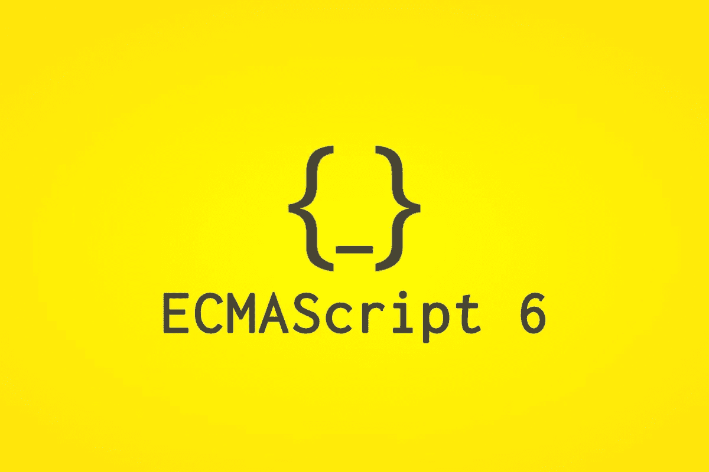

# ES5 = > ES6…如果你想成为一名杀戮者，这是一本必读的书😎在 JavaScript ES6 中

> 原文：<https://medium.com/quick-code/es5-es6-a-must-read-if-you-wanna-be-a-slayer-in-javascript-es6-959a8215e252?source=collection_archive---------3----------------------->



每个 JavaScript 开发人员都会发现 EcmaScript 版本，每隔一两年就会有新的版本加入到语言中。

但是，当 ES6 在 2015 年推出时，JavaScript 真正取得了长足的进步。

在本文中，我们将简要介绍 ES6 中的这些变化和新增功能。

所以，准备好吧，伙计们，这趟旅程将会充满刺激和大量的 JavaScript ES6。

# 箭头功能= >

创建箭头函数的语法类似于常规函数的语法，但有几处不同。

第一个区别是不再需要“function”关键字。
第二个区别是在参数和函数体之间添加了箭头“= >”。

**示例::**

```
const printMyName = (name) => {return `My name is ${name}`}console.log(printMyName('Bhavishya')) // prints Bhavishya
```

这里有一个箭头函数的简写语法，我们从函数定义中去掉了花括号。然后，我们将想要返回的表达式放在箭头的右边。
对 return 关键字没有要求，因为我们添加的表达式是隐式返回的。

让我们用简写语法编写上面的代码，

```
const printMyName = name => `My name is ${name}`console.log(printMyName('Bhavishya')) // prints "Bhavishya"
```

箭头函数不绑定`this`关键字。

# 承诺

Promise 是回调函数的替代方法，可以简化异步代码的管理。

您可以使用`new`操作符创建一个承诺。
它需要两个参数`reslove and reject`。一个承诺可以有三种状态之一:1 .待定 2 .履行完毕 3 .拒绝

```
const myPromise = new Promise((resolve, reject) => {setTimeout(() => {resolve('Example data')}, 2000)})
```

但是在创建了一个`promise`之后，当通过调用承诺上的`then`来实现或拒绝承诺时，我们必须对数据做些什么。

```
// Using myPromise from abovemyPromise.then((data) => {console.log(data) // prints "Example data"}, (err) => {console.log(err)})
```

类似地，我们有基于承诺的`fetch`，它用于访问任何 API，当它返回一个承诺时，从它返回的数据可以被其他承诺访问和进一步处理。

# 发电机

生成器是一种特殊的函数，能够暂停自己，稍后恢复，允许其他代码同时运行。

这个函数可以阻止自己运行，并允许回调队列中的其他函数运行或执行。

这一切都是用一个关键词完成的:`yield`。当生成器包含该关键字时，执行会暂停。

一个生成器可以包含许多`yield`关键字，因此可以多次暂停，并且由`*function`关键字来标识。

# 让和 const

`var`传统上是**函数作用域**。

`let`是一个新的变量声明，其作用域是**块**。

`const`和`let`一样，但是**是不可变的**。

更详细的解释可以参考我关于 var，let，const 的文章。

[](/@bhavishya2107/javascript-es6-let-const-and-why-you-should-be-using-them-instead-of-var-11da9914c9a4) [## JavaScript ES6: let & const 以及为什么应该使用它们而不是 var。

### ES6 指的是 ECMA 脚本编程语言的版本 6。ECMA 脚本是 JavaScript 的标准化名称。

medium.com](/@bhavishya2107/javascript-es6-let-const-and-why-you-should-be-using-them-instead-of-var-11da9914c9a4) 

# 模板文字

使用模板文字非常简单，它避免了用“+”号连接字符串或 javaScript 代码。

我们使用反勾号来初始化模板文字，每当我们想写 JS 时，我们使用语法${javaScript code}。

这可以通过一个例子来理解，

```
//function with no template literalsconst myHobby = () => {
let name = "Bhavishya"
let hobby = "Travelling"
return name + ' ' + 'loves' + ' ' + hobby
}myHobby() // "Bhavishya loves travelling"
```

现在让我们看一下模板文字的相同函数，

```
//function with template literalsconst myHobby = () => {
let name = "Bhavishya"
let hobby = "Travelling"
return `${name} loves ${hobby}`
}myHobby() // "Bhavishya loves travelling"
```

# 默认参数

现在，我们可以为函数中传递的参数分配默认参数。

```
var myfun = (name = 'Bhavishya', age = 24) => {console.log(name,age)}myfun() // Bhavishya 24
```

# 数组和对象析构

析构使得将数组和对象赋给其他变量变得更加容易。

旧语法:

```
const obj = {
name:"Bhavishya",
age:24,
country:"India"
}let name = obj.name;
let age = obj.age;
let country = obj.countryconsole.log(name) // "Bhavishya"
console.log(age) // 24
console.log(country) // "India"
```

使用 ES6 语法:

```
const obj = {
name:"Bhavishya",
age:24,
country:"India"
}let {name,age,country} = objconsole.log(name) // "Bhavishya"
console.log(age) // 24
console.log(country) // "India"
```

这类似于数组只需用方括号替换花括号。

```
const arr = ["Bhavishya",24,"India"];let [name,age,country] = arrconsole.log(name) // "Bhavishya"
console.log(age) //24
console.log(country) // "India"
```

# 剩余参数和扩散算子

rest 参数用于获取数组的参数或在函数中添加其他参数。

让我们看看下面的代码，

```
function myFun(a, b, ...manyMoreArgs) { console.log("a", a); 
  console.log("b", b);
  console.log("manyMoreArgs", manyMoreArgs); }

myFun("one", "two", "three", "four", "five", "six");

// Console Output:
// a, one
// b, two
// manyMoreArgs, [three, four, five, six]
```

这里，函数`myFun`控制传递给该函数的参数。
`...manyMoreArgs`可以传递任意多的参数，并以参数数组的形式返回。

spread 运算符的语法与 rest 参数相同，但是 spread 运算符接受数组本身，而不仅仅是参数。我们可以使用 Spread 参数来获取数组的值。

```
const arr=['I','am','Bhavishya','Hi','Friends','How are you?'];

const Func=(...array)=>{
  return array;
}

console.log(Func(arr));

//output  ['I','am','Bhavishya','Hi','Friends','How are you?']
```

# 班级

2015 年 JavaScript 引入了类。
类是面向对象编程(OOP)的核心。它们使你的代码安全并被封装。使用类给你的代码一个好的结构，并保持它的组织性。

```
//Syntax
class myClass {
  constructor() {
  }
}
```

类是在类名前用关键字`class`声明的。

让我们看一个例子，

我们使用`class`方法，并用关键字`new`为该类创建一个新实例。

要从另一个类继承，使用`extends`关键字，后跟您想要继承的类的名称。

圣母玛利亚，在一篇文章中可以消化这么多新特性。但是等等，ES6 还有更多🤣你仍然需要知道更多关于完全杀戮和称呼你自己为 ES6 杀戮者的信息！！！


# 地图和布景

**Map** 和 **Set** (以及它们各自的垃圾收集 **WeakMap** 和 **WeakSet** )是两种非常流行的数据结构的官方实现。

# 新的字符串方法

任何字符串值都有一些新的实例方法:

*   `repeat()`将字符串重复指定的次数:`'Ho'.repeat(3) //HoHoHo`

# 新对象方法

ES6 在对象名称空间下引入了几个静态方法:

*   `Object.is()`判断两个值是否相同
*   `Object.assign()`用于浅层复制一个对象
*   `Object.setPrototypeOf`设置一个对象原型

所以，就这样了**谢谢各位！！！为了阅读我的文章，请让我知道你是否对我解释的文章或概念有任何疑问，请在底部写下回复。**

在 twitter 上关注我，保持联系，让我知道你感到困难的其他领域，以便我阅读自己，并尝试用我的文章解释它。

[https://twitter.com/bhavishya2107](https://twitter.com/bhavishya2107)

# 谢谢你！！！

## 掌声是受欢迎的🤗

> 不断学习，编码😎分享你的知识🤩

# 参考:

*   Mozilla 有非常有用的文档(加上他们的“自己尝试”选项非常适合实验):
    [https://developer . Mozilla . org/en-US/docs/Web/JavaScript/New _ in _ JavaScript/ECMAScript _ 2015 _ support _ in _ Mozilla](https://developer.mozilla.org/en-US/docs/Web/JavaScript/New_in_JavaScript/ECMAScript_2015_support_in_Mozilla)