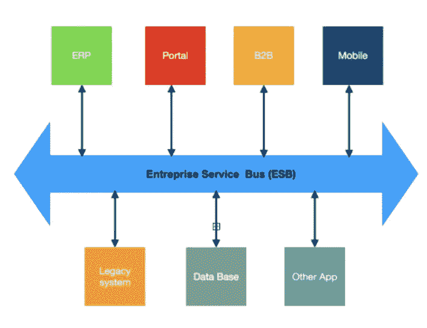
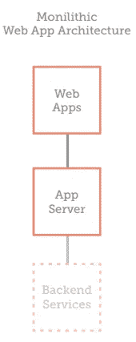
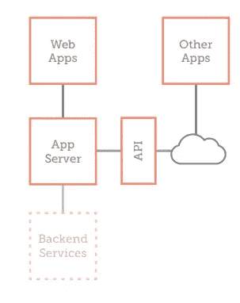
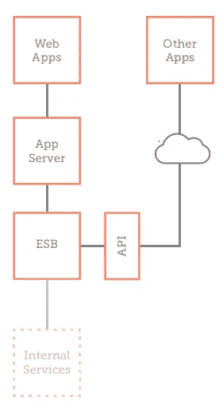
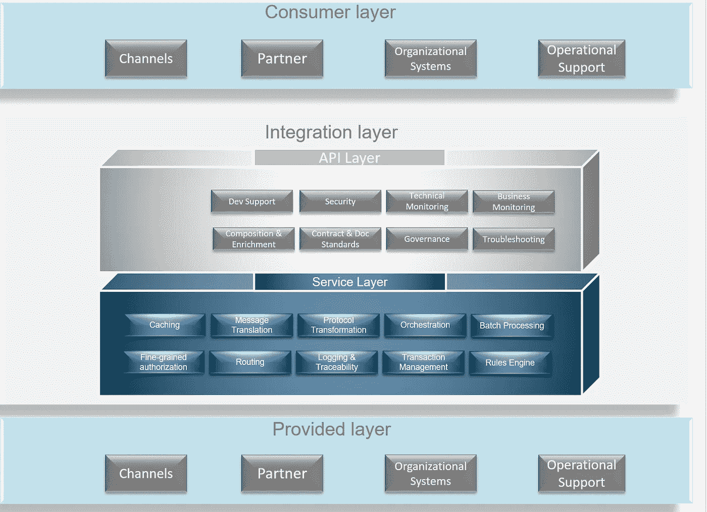
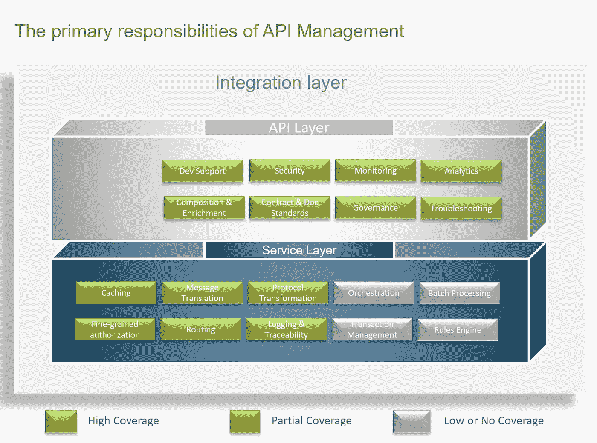
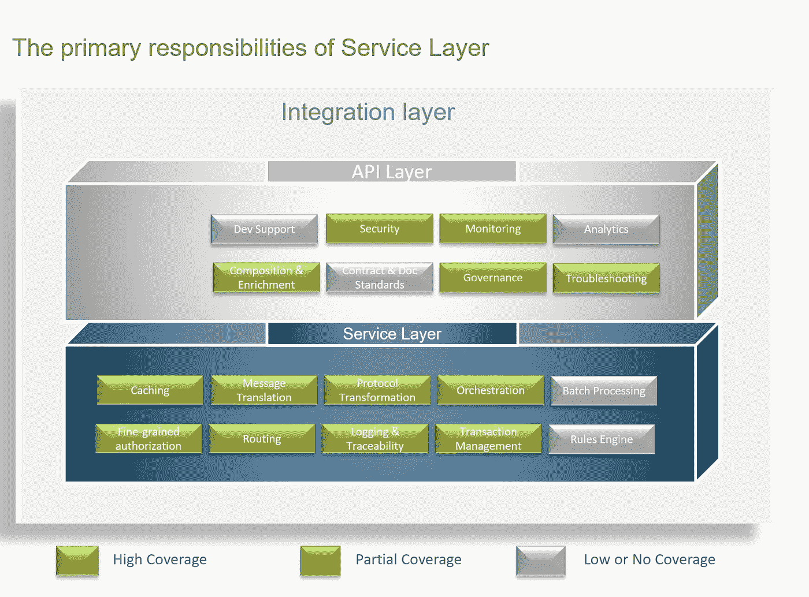
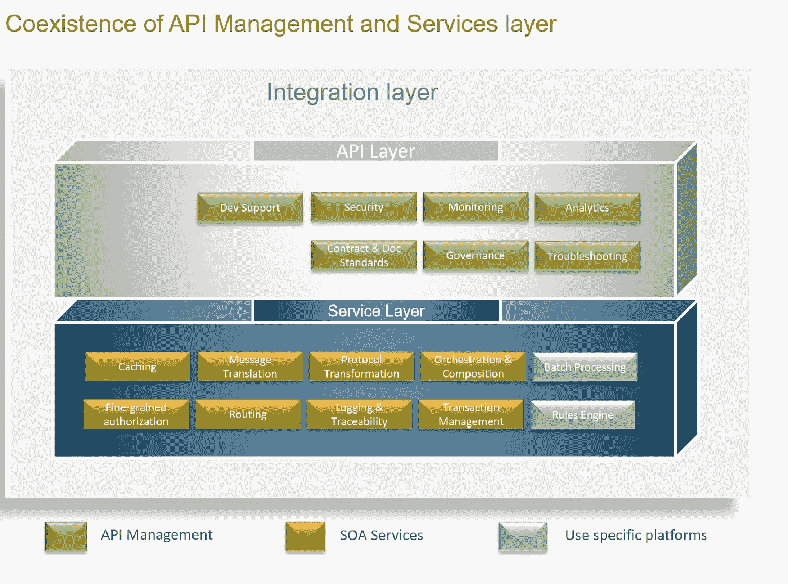
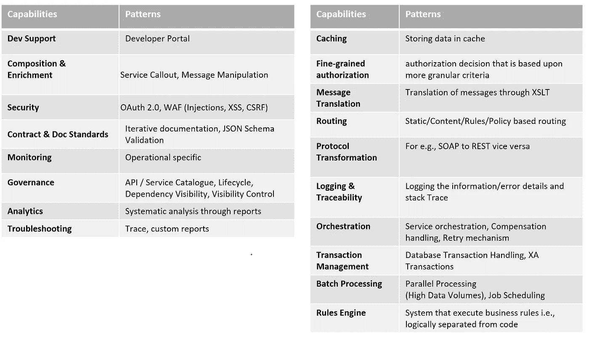

# ESB 和 API 主导的架构=敌人还是朋友……..

> 原文：<https://medium.com/oracledevs/esb-api-led-architecture-enemies-or-friends-45b29a2e2d6b?source=collection_archive---------0----------------------->

集成一直是企业面临的挑战。在这个数字经济中，为了与客户、合作伙伴联系，创造企业应对数字革命所需的产品、应用和服务，您必须连接系统、数据和设备。很久以前，当集成始于服务时，企业始于点对点集成。

# ESB 的诞生及其好处

企业在点对点上苦苦挣扎，这产生了像意大利面条一样混乱的代码。之后，基于 SOA 的架构发现 ESB 是更好的集成解决方案。ESB 集成通过提供一个简单的、定义良好的、可扩展的“可插拔”系统，有助于清除大量点对点集成造成的混乱。此外，ESB 集成提供了一种利用现有系统并向新应用程序公开它们的方法。

但是时代在变，技术在发展，对于今天复杂的企业技术架构——具有混合基础设施和快速增长的终端数量——仅仅 ESB 集成已经不够了。ESB 集成提出了技术和组织两方面的挑战，降低了组织的“集成能力”的有效性。

ESB 不足以应对当前市场变化的五大原因。

*   ESB 以很高的成本推广单片架构。
*   ESB 不是敏捷性和创新的最佳选择。
*   ESB 描述了组织的挑战——由于业务的不同部分需要以不同的速度移动，ESB 面临着过程和政治瓶颈。ESB 可能是定义一个集成、设计并处于就绪状态的瓶颈，这可能是瓶颈且耗时的。
*   ESB 并不完全适合基于云的架构——随着云和 Saas 应用程序的增加，与 ESB 的集成还不够。使用 ESB 与不同 Saas 应用程序和 API 的云适配器集成会有点困难。
*   一种尺寸并不适合所有情况——ESB 对所有集成一视同仁，但是它们的构建应该有特定的目的。

集成分为三大类:

**->-**设备集成-支持多通道；例如，移动、web 和合作伙伴。

**-**->流程集成——这些集成提供编排逻辑，将跨越多个后端系统的集成联系在一起。

->系统集成——这些为我们的应用程序提供连接。

所有这些集成类别都有不同的行为和需求。虽然 ESB 通常支持流程和系统功能，但它们很少为设备集成提供直接支持。因此，客户必须购买额外的产品*(例如 API 网关)*，增加了成本和复杂性，并且反过来，随着集成在多个产品之间来回流动，引入了监控、管理和安全缺口。

# API 的出现及其好处

API 或应用程序编程接口指的是用于构建应用程序的一组工具、例程或协议。它通知软件如何交互。出现了各种允许远程访问过程 API 的方法，通过不同种类的计算机之间互操作所需的数据打包和解包，绕过了典型的程序员开销。

软件 API 的好处不止一个。API 支持与异构系统和数据的集成，从而将新的业务模型、产品和服务推向前沿。

它是在不使用应用程序接口的情况下从给定应用程序访问数据的网关。API 使多个服务能够相互通信，并与其他现有的业务系统通信，从而公开信息孤岛，并为数据集成开辟新的可能性。

Typical Monolithic Architecture.

这是典型的基于 ESB 的架构。当我们使用 ESB 和 API GW 架构时，情况可能如下所示

API Adapted web-based architecture

API Adapted ESB based architecture

组织中集成层的要求。

Basic Requirements of the Integration layer

API 管理和 ESB 可以独立存在，这取决于场景和关注点。在大多数情况下，公司将从两者中受益。在这些情况下，只要我们设法增强它们各自的优势，架构甚至会更加健壮:

Native Coverage of API management platform

Native coverage of Service layer/ESB

coexistence of API management & ESB as friends.

上图中提到的术语概述。

# API 管理/API 主导架构在其集成架构中的优势

*   **更加灵活的集成，加快交付速度，降低成本**
*   标准化界面，支持与合作伙伴集成的多渠道和灵活性
*   建立治理和实时监控集成
*   API 使用的安全性和控制
*   优化应用程序性能的机制
*   职责分离
*   可量测性

ESB 不会消失，但是它们也是专门构建的，以支持组件之间受控的紧密集成。它们是支持服务间高度结构化集成的中心总线。从定义上来说，这种情况是向分解架构的范式转变的对立面。也就是说，您最终希望将所有这些细粒度的部分放在一起，无论是从大量松散耦合和高度内聚的组件构建复合 API，还是将细粒度的 API 编排在一起以提供更高级别的抽象 API，该 API 只是为像 onboarding 这样的用例寻找动态组件，其中大多数属性已经设置好并且不变。

一个完整的生命周期 API 管理解决方案，允许您对这些分解的组件之间的访问和通信进行治理和观察。通过这样做，您可以公开组件，让开发人员、合作伙伴和第三方能够访问该功能，以创新和意想不到的方式使用它，同时保持松散耦合和高度内聚的架构范例的优势。

# 结论

ESB 已经死了，不是真的。ESB 对于任何企业的 EAI 策略仍然很重要，但是新的破坏性数字和混合范例已经带来了新的需求。为了足够敏捷地保持与市场和用户的相关性，您必须摆脱手工集成工厂的思维模式，在这种思维模式中，IT 构建每一个连接，而是成为集成推动者。由于有如此多的方式来连接如此多的新组件，您的业务分析师、开发人员和第三方用户的自我实现是必须的。API 网关是这一策略的核心，它与 ESB 一起提供您的企业发展和交付最佳客户体验所需的全部功能。但随着时间的推移和 API 主导和事件驱动架构的发展，ESB 在未来可能会过时，但截至目前，ESB 和 API GW/Management 都是相辅相成的。

所以他们不是敌人而是**朋友，从**到现在**。**