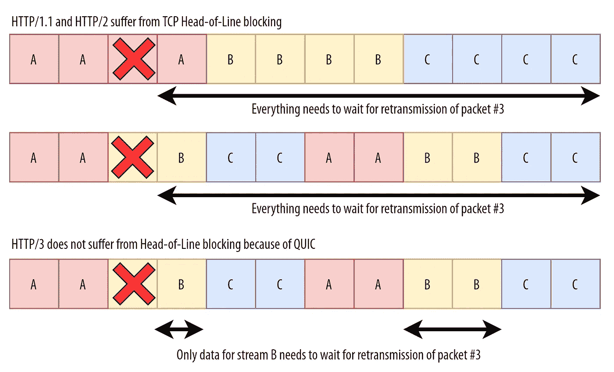

# HTTP 基本指南

> 原文：<https://medium.com/globant/essential-guide-to-http-b7d6f7023b7f?source=collection_archive---------2----------------------->

*特点、优点、缺点和安全方面*

source: [https://pixabay.com/](https://pixabay.com/)

# 概观

**HTTP** 代表超文本传输协议。HTTP 是一个应用层协议，用于传输超媒体文档，如 HTML。专为客户端和服务器之间的通信而设计。HTTP 遵循经典的客户机-服务器模型。HTTP 客户端向 HTTP 服务器发送请求消息，作为回报，服务器对该消息做出响应。

在本文中，我们将描述不同版本的 HTTP 协议，如 HTTP-1.1、HTTP-2 和 HTTP-3。

# HTTP/1.1

HTTP/1.1 是 HTTP 的第一个标准版本，于 1997 年发布，它通常被设计得简单易懂。HTTP/1.1 头使得该协议易于扩展和试验。

> **HTTP/1.1 的特点**

*   TCP 连接可以被多个资源重用，不需要多次打开连接。后续请求的等待时间减少了，因为没有在握手上花费时间。
*   引入了一个新的主机头，允许在同一个 IP 地址上托管不同的域。
*   它支持流水线操作:我们可以发送另一个请求，而不必等待第一个请求完全传输。
*   引入了内容协商。客户端和服务器可以就交换哪些内容达成一致。
*   引入了附加的高速缓存控制机制。为此我们可以使用 ***缓存控制*** 头。
*   服务器可以分块发送响应。

> **安全方面**

*   严格传输安全头通知浏览器所有端点都应该从 HTTP 重定向到 HTTPS。
*   个人信息可能会被泄露，因为它是基于纯文本的协议。
*   由于缓存控制机制，可能会发生 DNS 欺骗，以避免服务器观察 DNS 报告的 TTL(离开时间)信息。
*   建议对数据交换进行加密。
*   建议使用 TLS 加载活动资源，如 HTTPS。
*   所有 cookies 都必须设置安全标志。
*   禁用内容安全策略的内联脚本。

> **优点**

*   Keep-alive 报头显著减少了连接中的延迟。
*   多个域名可以使用同一个 IP 地址。
*   它还支持管道，我们可以发送多个未完成的请求，但响应仍然是序列化的。

> **缺点**

*   仅限于处理单个 TCP 连接的一个请求。
*   标头信息在每个请求中都重复出现。

# HTTP/2

HTTP/1.1 已经服务于互联网世界超过 15 年，但是对于新的现代 web，大多数应用程序需要在多种多媒体内容格式的支持下进行动态信息更新。此外，HTTP/1.1 也有它的缺点，所以为了克服它的缺点并考虑新的现代 web 应用程序的需要，引入了 HTTP/2。

HTTP/2 主要是为了高性能和健壮性而创建的，这是通过引入一些新的特性来实现的，如报头压缩、多路复用、请求优先级和服务器推送机制。

> **HTTP/2 的特性**

*   **复用**

*二进制成帧层将 HTTP 有效载荷分解成独立的小帧。这些帧通过 HTTP2 发送，没有使用单一 TCP 连接的行首阻塞。对于多个请求，我们可以通过一个 TCP 连接发送，HTTP/2 消除了在客户机和服务器之间建立多个连接的需要。*

*   **支持流优先级**

*客户端可以决定首先加载哪些资源，从而提高渲染页面的性能。*

*   **二进制编码**

*HTTP/2 使用二进制命令(0 和 1)来完成请求-响应循环。这消除了使用文本命令时出现的安全问题。*

*   **使用 HPAC 的报头压缩**

*它使用 HPAC 进行报头压缩，即每个报头在被 HPAC 传输之前压缩其值。*

*   **服务器推送机制**

*服务器可以发送渲染页面所需的资源，而无需等待客户端的请求，这些资源存储在客户端缓存中以备后用。*

> **安全方面**

*   它更安全，因为它使用二进制数据传输，现在攻击者不能操纵头部。
*   HTTP/2 包含二进制命令，并支持压缩 HTTP 头元数据，遵循“模糊安全”方法来保护客户端和服务器之间传输的敏感数据。
*   与 HTTP 1.1 相比，它使用了一种高级报头压缩算法，即 HPACK 算法消除了针对基于文本的应用层协议的安全相关威胁。
*   HTTP/2 完全支持加密，并需要传输层安全性(TLS1.2)的改进版本，以获得更好的数据保护。

> **优点**

*   多路复用使 HTTP/2 比它的前辈快得多。
*   一个服务器可以在一个 TCP 连接中发送多个资源。
*   它为客户端提供了一个服务器推送选项，以进一步加快进程。
*   它提供了与大多数浏览器的更高兼容性以及与以前协议的向后兼容性。
*   对于大多数浏览器，HTTP2 是 SSL/TLS 证书的强制要求。

> **缺点**

*   不需要加密。
*   Cookie 安全性仍然是一个问题。
*   它遭受线路头部阻塞问题，即，如果在数据传输中单个分组失败，那么所有其他分组等待失败分组的重传。
*   与 HTTP/1 相比，HTTP/2 的新的关键特性提高了性能，但同时也给 HTTP 实现带来了额外的攻击面。

# HTTP/3

HTTP/3 是 HTTP 的第三个主要版本。它使用 TCP 协议上的 **QUIC** (快速 UDP 互联网连接)协议在客户端和服务器之间进行通信。
QUIC 使用 UDP 连接客户端和服务器。它实现了 TCP 的几乎所有功能，如流量控制和拥塞控制，以及一些附加功能，如 0-RTT 连接、连接迁移和独立字节流。

> **HTTP/3 的特点**

**QUIC 正在使用 TLS 1.3**

*它是完全加密的，这意味着它加密所有报头字段和传输层信息，如数据包编号*

**支持多个独立的字节流**

source:[https://cloud.netlifyusercontent.com/assets/344dbf88-fdf9-42bb-adb4-46f01eedd629/7981cb82-395c-4484-8873-46fd92804b4d/hol-blocking-basic.png](https://cloud.netlifyusercontent.com/assets/344dbf88-fdf9-42bb-adb4-46f01eedd629/7981cb82-395c-4484-8873-46fd92804b4d/hol-blocking-basic.png)

**支持连接迁移**

*当用户切换网络时，QUIC 使用连接 id 来识别正确的目的地*

> **安全方面**

*   端到端加密:默认情况下，QUIC 是完全加密的，它有助于防止无孔不入的监控等攻击。
*   由于 QUIC 使用 TLS 1.3 来交换密钥，因此它使用短暂的 Diffie-Hellman 密钥交换协议，该协议为应用程序提供了前向保密功能。
*   重放攻击保护:如果用相同的密钥重复请求，这样的请求会被服务器识别并丢弃。初始请求不支持 QUIC 重播保护。
*   IP 欺骗保护:在握手过程中，它使用所有必需的签名地址证明进行地址验证。它使用源地址令牌，其中包含加密的客户端地址和服务器时间戳。
*   与 HTTP2 相比，0-RTT 连接功能可以减少连接时间，但对于最常见的攻击之一，即可能导致重放攻击，攻击者可以在请求中发送初始数据包，这可能会迫使服务器认为该请求来自以前的客户端。
*   QUIC 使用连接 ID 进行数据交换，如果攻击者在初始请求期间操纵这些 ID，则可能会导致连接 ID 操纵攻击。

> **优点**

*   这对最终用户来说更安全。
*   更快的连接建立，它只需要一个来回的连接。
*   它支持多个独立的字节流，消除了行首阻塞问题。
*   与以前的版本相比，它支持更多的流。

> **缺点**

*   由于引入了新的底层传输层，采用 HTTP3 更具挑战性。
*   QUIC 不提供请求优先级
*   由于 0 RTT 特性，可能会出现安全问题。
*   数据包检测更具挑战性。

# 结论

随着时间的推移，HTTP 协议的整体安全性有所提高，但是新版本也带来了一系列新的挑战。

请求方法、状态代码和消息字段是在这些 HTTP 协议版本中使用和发展的一些日常事物。这些协议之间的实现差异在于它们的传输层。

像 HTTP/1.1 和 HTTP/2，在其架构中使用传输层的 TCP。另一方面，HTTP/3 正在使用新的基于 UDP 的 QUIC 协议进行数据传输，以改善整体 web 体验。它提供了 HTTP2 的所有基本特性和一些附加特性。

# 团队积分

> 特别感谢[桑托什·瓦尔马](https://medium.com/u/e2f019b8d321?source=post_page-----b7d6f7023b7f--------------------------------)、[阿克沙塔·谢拉尔](https://medium.com/u/cdb3c9096bff?source=post_page-----b7d6f7023b7f--------------------------------)和[迪克沙·高塔姆](https://medium.com/u/5db22db5c9d6?source=post_page-----b7d6f7023b7f--------------------------------)。