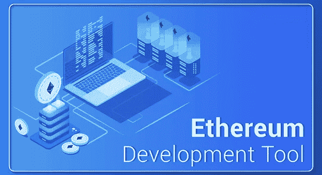
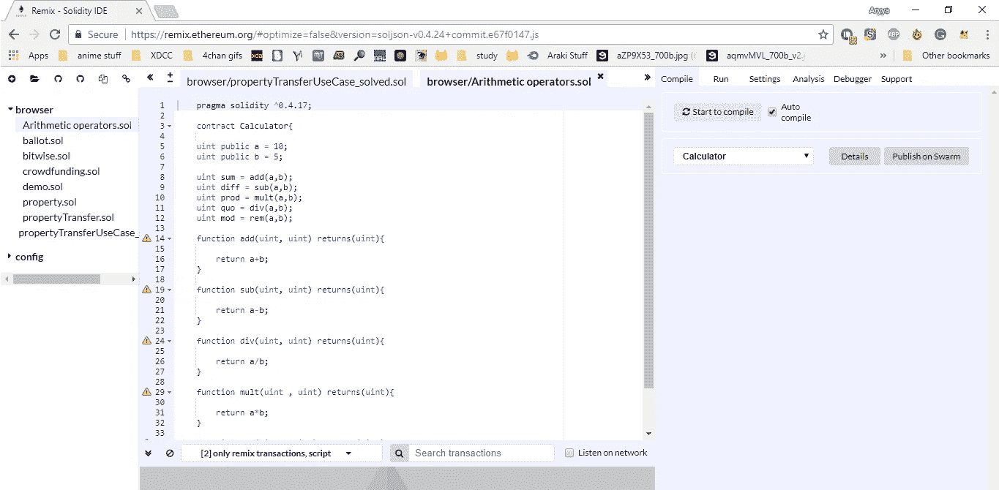
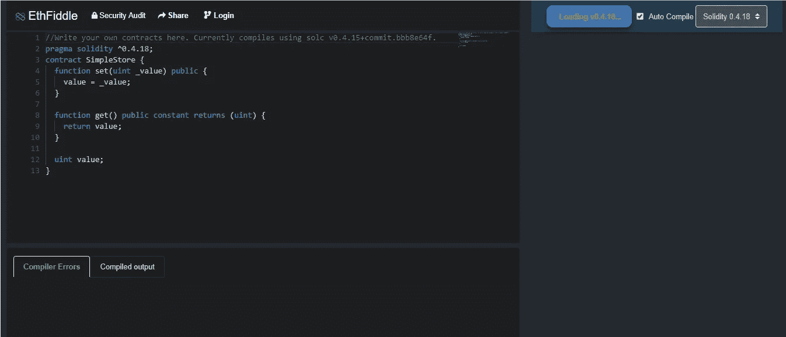
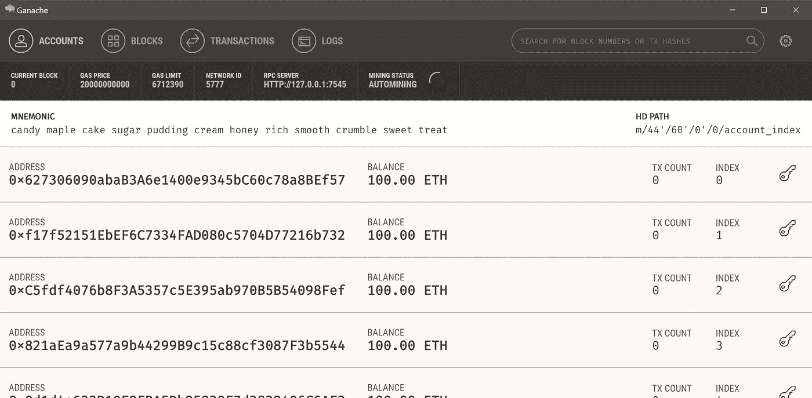
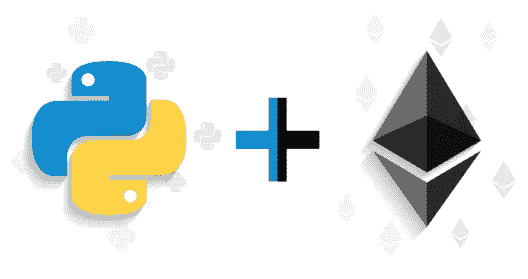
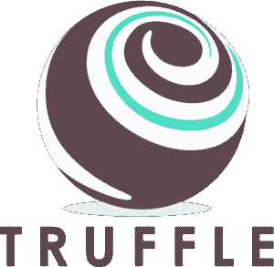
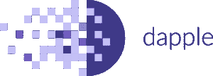
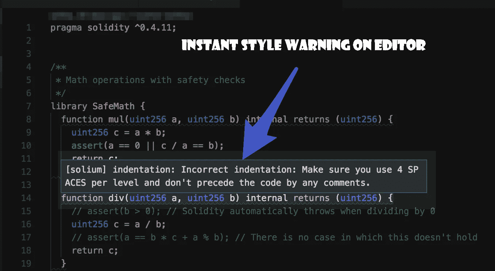
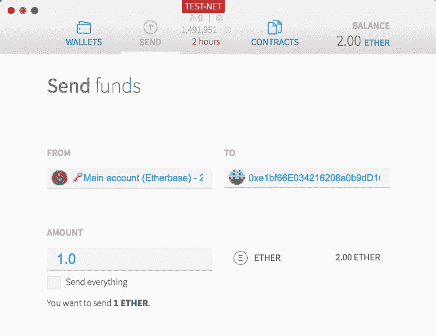

# 创建以太坊 Dapps 的顶级以太坊开发工具

> 原文：<https://medium.com/edureka/ethereum-development-tools-7175503a1ac7?source=collection_archive---------7----------------------->

Ethereum Development Tools — Edureka

以太坊通过在其系统上实现智能合约支持，为区块链开启了无数可能性。这反过来又为绝大多数开发者打开了以太坊，让他们通过用以太坊特有的语言开发智能合约，如 **Solidity** 、 **Serpent** 和 **LLL** ，来创建任何一种可以在区块链上运行的应用。抛开语言不谈，几个*以太坊开发工具*已经被开发了很多年，让我们作为开发者的生活变得不那么繁琐。

可以找到各种各样的文章，关于以太坊和智能合约的发展，但是很少有文章讨论让这些变得如此无缝的工具。因此，我决定写一篇文章，深入探讨各种以太坊开发工具。

# 以太坊开发工具

为了方便起见，我将工具分为四大类，即:

1.  集成开发环境
    1.1 Remix
    1.2 EthFiddle
2.  带有 RPC 接口的本地测试节点
    2.1 Ganache/Test RPC
    2.2 Pythereum
3.  基于命令行的开发工具
    3.1 Truffle
    3.2 Embark
    3.3 Dapp/Dapple
4.  代码分析器
    4.1 Solium
    4.2 Open-Zeppelin
5.  浏览器
    5.1 薄雾
    5.2 元蒙版

因此，让我们从以太坊开发工具列表开始，讨论 ide。

# 集成开发环境

开发人员在构建应用程序的旅程中的第一项任务是编写核心逻辑，这通常是在集成开发环境中键入的。IDE 的总体目标和主要好处是提高开发人员的工作效率。ide 通过减少设置时间、提高开发任务的速度、让开发人员了解最新情况以及标准化开发过程来提高生产率。说到扎实，第一个想到的 IDE 就是 Remix。

## 再搅拌

Remix 以前被称为 Browser-Solidity，是一个基于 web 的 IDE，专门针对 Solidity 和以太坊开发环境。

***优点:***

*   用最新的编译器版本编译代码
*   在定制环境中部署和运行智能合约，如 JavaScript 虚拟机或注入的 Web3.js 提供程序。
*   允许你从 GitHub 和 Swarm 导入代码

***缺点:***

*   初学者很难理解

## 以太网

除了 Remix 之外，还有另一个基于浏览器的 ide 也很棒，但有其他用途。这个叫做 Ethfiddle，非常适合用来展示代码。虽然 remix 提供了在不同网络和环境下测试代码的灵活性，但由于其简单的嵌入特性，ethfiddle 完全是为了在演示文稿上共享您的代码。

***优点:***

*   轻松嵌入和共享功能

***缺点:***

*   速度慢，功能不如混音丰富

对于本地编译你的固化代码，SOLC 编译器可以很容易地安装使用节点包管理器。除此之外，像 ***Sublime Text*** 和 ***Atom*** 这样的开源文本编辑器对可靠性语法突出显示有很好的包支持。

# 带有 RPC 接口的本地测试节点

众所周知，区块链上的一切本质上都是不可改变的。即使对智能合约的更新也不能注册到相同的地址，而必须作为新实例部署到新地址。这也意味着智能合同不能在主区块链网络上测试，因为一旦部署到主网络上，任何更改都是不可能的。因此，测试网络/节点构成了以太坊开发工具不可或缺的一部分，因为以太坊开发人员使用本地测试节点来测试契约的交互。

让我们讨论一下最受欢迎的本地测试网络

## 加纳切

首先是 Ganache-CLI，它是以太坊开发者使用最广泛的本地测试节点。Ganache 是一个用于以太坊开发的个人区块链，可以用来部署契约、开发应用程序和运行测试。它既可以作为桌面应用程序使用，也可以作为命令行工具使用(以前称为 TestRPC)。Ganache 可用于 Windows、Mac 和 Linux。

使用 ganache，您可以

> 快速查看所有帐户的状态，包括其地址、私钥、交易和余额。
> 
> 查看 Ganache 内部区块链的日志输出，包括响应和其他重要的调试信息。
> 
> 只需一次单击即可配置高级挖掘，设置块时间以最适合您的开发需求。
> 
> 检查所有块和事务，以深入了解幕后发生了什么。

## 腐霉属

接下来，在列表上，我们有**python ereum**，这是一个用 python 编写的本地测试节点工具。它比 ganache 轻量级得多，但功能不够丰富。

使用 pythereum，您可以

> 用创世块创建一个新的测试区块链
> 
> 用传入的起源状态创建新的测试状态。
> 
> 使用给定的私钥向给定的地址发送具有给定值和数据的事务。

# 基于命令行的开发工具

有三个主要的基于命令行的以太坊开发工具，即

1.  松露
2.  从事
3.  斑纹

让我们一个一个地简单看一下。

## 松露

所以在我们的清单上第一个是 Truffle，它也是三个列出的工具中最受欢迎的一个。Truffle 是以太坊的开发环境、测试框架和资产管道，旨在让以太坊开发者的生活更轻松。“ConsenSYS”公司负责块菌的开发和维护。

有了松露，你会得到:

> 内置智能合约编译、链接、部署和二进制管理。
> 
> Mocha 和 Chai 的自动化合约测试。
> 
> 支持自定义构建流程的可配置构建管道。
> 
> 可脚本化的部署和迁移框架。
> 
> 部署到许多公共和私有网络的网络管理。
> 
> 用于直接合同通信的交互式控制台。
> 
> 在开发过程中即时重建资产。
> 
> 在 Truffle 环境中执行脚本的外部脚本运行程序。

## 从事

以太坊开发工具列表中的下一个是 **Embark** 。Embark 是一个框架，允许你使用无服务器的 html5 应用程序轻松开发和部署分散式应用程序(DApps)。Embark 目前集成了 EVM 区块链(以太坊)、分散存储(IPFS)和分散通信平台(耳语和轨道)。支持 Swarm 进行部署。

使用 Embark，您可以:

> 自动部署契约，并使它们在您的 JS 代码中可用。Embark 会观察变更，如果您更新了合同，Embark 会自动重新部署合同(如果需要)和 dapp
> 
> 使用 JavaScript 通过契约执行测试驱动的开发
> 
> 跟踪已部署的合同；仅在真正需要时部署
> 
> 通过登船数据库轻松存储和检索 DApp 上的数据。包括上传和检索文件。
> 
> 将整个应用程序部署到 IPFS 或 Swarm。
> 
> 轻松管理相互依赖的合同的复杂系统。

## Dapp

最后一个基于命令行的以太坊开发工具是 **Dapple** 。目前，Dapple 已经被弃用，取而代之的是一个名为 **Dapp** 的新工具，它是由同一组开发人员开发的。Dapp 是一个用于智能合约开发的简单命令行工具。它支持以下常见用例:

*   包装管理
*   源代码构建
*   单元测试
*   简单的合同部署

# 代码分析器

为一个分散的网络编写干净安全的代码不是一件容易的事情。从存储和安全的角度来看，有很多东西需要担心，尤其是当你的大部分代码都在处理别人的钱的时候。该州任何错误的回滚都可能导致重大损失。为了避免这种情况，开发了特殊的代码分析器来帮助开发人员编写干净安全的代码。

Solium 和 Open-Zeppelin 就是两个这样的工具，当谈到以太坊开发工具时，人们会想到它们

## Solium

Solium 是一个 solidity code linter，它允许您编写健壮而时尚的智能合同。Solium 的工作方式就像一个解释器，它不断地检查你的代码的风格和安全问题

使用 Solium，您可以:

*   分析你的可靠性代码的风格和安全性问题，并修复它们。
*   在您的组织中标准化智能合约实践，与您的构建系统集成并放心部署

# 敞开式齐柏林飞艇

Open-Zeppelin 是一个用于编写安全智能合同的可靠框架。使用 open-zeppelin，开发人员可以使用通用的契约安全模式，用 solidity 语言构建分布式应用程序、协议和组织。open zeppelin 的伟大之处在于它与 Truffle 无缝集成，让您的生活稍微轻松一些。

# 浏览器

区块链以太坊需要一个专门满足其需求的浏览器，以便查看有关状态、收据和交易的信息。让我们来讨论一下开发人员用来分析他们在区块链上的应用程序交互的最流行的浏览器

## 下雾

Mist 浏览器(以前称为以太坊 Dapp 浏览器)是以太坊的最终用户界面。它是浏览和使用 Dapps 的首选工具，是专门为非技术用户设计的。

使用 mist，您可以:

> 发送交易记录
> 
> 接收交易
> 
> 储存乙醚
> 
> 创建多签名钱包
> 
> 部署智能合同
> 
> 查看区块链的状态

## 元掩码

虽然 metamask 并不是真正的“浏览器”，但它将谷歌 Chrome 变成了一个以太坊浏览器，允许它从区块链获取数据，并允许用户安全地发送或接收签名交易。该扩展将以太坊 web3 API 注入到每个网站的 javascript 上下文中，以便 dapps 可以直接从区块链中读取。Metamask 可以作为浏览器扩展轻松安装在 chrome、opera、opera 和 firefox 上。

如果你想查看更多关于人工智能、DevOps、道德黑客等市场最热门技术的文章，你可以参考 Edureka 的官方网站。

请留意本系列中的其他文章，它们将解释区块链的其他各个方面。

> 1.[区块链教程](/edureka/blockchain-tutorial-d05f9c36b62b)
> 
> 2.[以太坊教程](/edureka/ethereum-tutorial-with-smart-contracts-db7f80175646)
> 
> 3.[以太坊专用网络](/edureka/ethereum-private-network-tutorial-22ef4119e4c3)
> 
> 4.[什么是智能合约？](/edureka/smart-contracts-301d39565b76)
> 
> 5.[坚固性教程](/edureka/solidity-tutorial-ca49906bdd47)
> 
> 6.[松露以太坊教程](/edureka/developing-ethereum-dapps-with-truffle-7533289c8b2)
> 
> 7.[总账结构](/edureka/hyperledger-fabric-184667460-edc184667460)
> 
> 8.Hyperledge vs 以太坊

*原载于 2018 年 6 月 4 日*[*www.edureka.co*](https://www.edureka.co/blog/ethereum-development-tools/)*。*