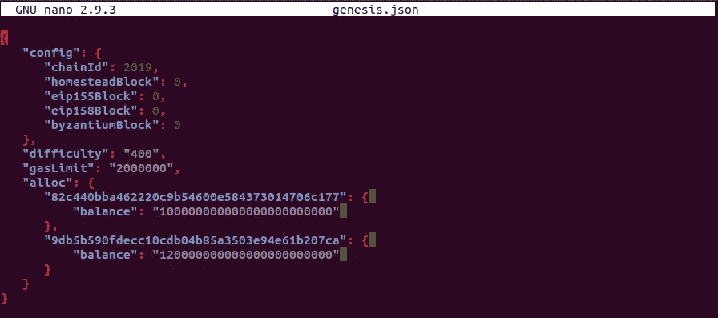
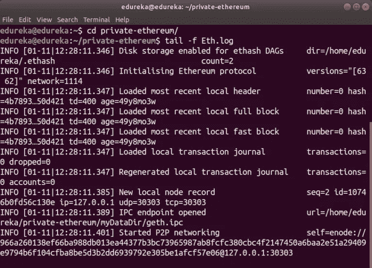
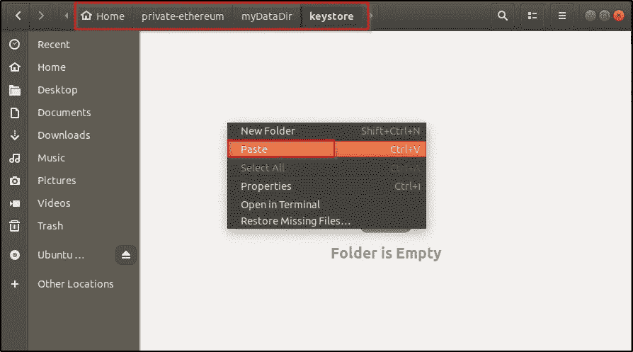

# 使用以太坊私有网络创建自己的以太坊区块链

> 原文：<https://medium.com/edureka/ethereum-private-network-tutorial-22ef4119e4c3?source=collection_archive---------1----------------------->


Ethereum Private Network Tutorial — Edureka

在本以太坊私人网络教程中，您将学习如何创建一个**私人以太坊网络**，以及如何在两个账户之间进行交易。

这些是我将在本教程中涉及的主题:

*   什么是以太坊专网？
*   为什么要用以太坊专网？
*   以太坊专用网络的特点
*   在 Ubuntu 上安装以太坊
*   演示:创建以太坊专用网络并进行交易

# 什么是以太坊专网？

以太坊私有网络是完全私有的区块链，与主以太坊网络隔离。以太坊专网主要是组织为了限制区块链的读取权限而创建的。只有拥有正确权限的节点才能访问该区块链。该网络中的节点不连接到主网络节点，并且它们的范围仅限于该私有区块链。


# 为什么要用以太坊专网？

以太坊私有网络是组织用来存储私有数据的，这些数据不应该被组织外的人看到。如果有人不想使用公共测试网络，以太坊私有网络也用于测试和实验区块链。

# 以太坊专用网络的特点

如前所述，以太坊专用网络用于测试目的。但是，当已经有公共测试网络可用时，为什么有人还要费事去创建一个新的网络呢？嗯，以太坊私人网络有自己的一套功能，如下所列:

*   它充当分布式数据库
*   以太坊私有网络中的区块链可以包含私有数据(因为网络不是公共的)
*   访问可以是基于权限的
*   进行交易可以免费
*   账户可以自己分配以太网，甚至不需要购买虚拟以太网

继续，让我们进入以太坊私有网络教程的动手部分。

# 在 Ubuntu 上安装以太坊

要创建以太坊专用网络，我们首先需要在系统中安装以太坊。在以太坊专网教程的这一节，你将学习如何在 Ubuntu 上安装以太坊。

要安装以太坊，请在终端中运行以下命令:

```
$ sudo apt-get install software-properties-common
$ sudo add-apt-repository -y ppa:ethereum/ethereum
$ sudo apt-get update
$ sudo apt-get install ethereum
```

搞定了。这将在您的系统上安装以太坊。

先说专网创建。

# 演示:创建以太坊专用网络并进行交易

在这个以太坊私人网络教程中，我们将从一个帐户发送以太到另一个帐户，因此，我们需要帐户。现在让我们看看如何为我们的区块链创建帐户。

## 为以太坊专用网络创建帐户

在创建新帐户之前，让我们为我们的工作场所创建一个新目录。为此，请参考以下命令:

```
$ mkdir private-ethereum
$ cd private-ethereum
```

要进行交易，我们至少需要两个账户:收款人和汇款人。

要创建两个帐户，请运行以下命令两次:

```
$ geth --datadir ./datadir account new
```

当询问时，输入每个帐户的**密码**。不要忘记这个密码！

一旦这些命令成功运行，将创建两个帐户，帐户地址将显示在屏幕上。


将这些地址保存在某个地方，因为我们将来会用到它们。

## 正在创建源文件

Genesis 文件包含定义区块链的属性。Genesis 文件是区块链的起点，因此，必须创建 Genesis 文件来创建区块链。现在，让我们创建创世纪文件。

首先，创建一个名为 **genesis.json** 的文件

```
$ nano genesis.json
```

现在，将以下代码复制并粘贴到该文件中:

```
{
  "config": {
    "chainId": 2019,
    "homesteadBlock": 0,
    "eip155Block": 0,
    "eip158Block": 0,
    "byzantiumBlock": 0
  },
  "difficulty": "400",
  "gasLimit": "2000000",
  "alloc": {
    "82c440bba462220c9b54600e584373014706c177": { 
    "balance": "100000000000000000000000" 
    },
    "9db5b590fdecc10cdb04b85a3503e94e61b207ca": { 
    "balance": "120000000000000000000000" 
    }
  }
}
```

**注意:**在上面的代码中，将 **alloc** 部分下的地址替换为您在上一步中创建的帐户的地址。



保存并退出。

让我简单解释一下创世纪文件的内容:

**chainId** —这是用于区分区块链
**homesteadBlock、eip155Block、eip158Block、byzantiumbblock**的链标识号——这些属性与链分叉和版本化相关。我们的教程不需要这些，所以我们把它们设为 0。
**难度** —这个数字决定了开采这些区块的难度。对于专用网络，最好设置一个较低的数字，因为它可以让您快速挖掘数据块，从而提高事务处理速度。
**gasLimit** —这个数字是每个区块可以使用的气体总量。我们不希望我们的网络达到极限，所以我们设置了这个高值。
**alloc** —该部分用于将乙醚分配给已经创建的账户。

创世纪文件准备好了。现在，是时候启动区块链了。

## 实例化数据目录

在启动区块链之前，我们要实例化数据目录。数据目录是存储区块链相关数据的目录。要实例化数据目录，请运行以下命令:

```
$ geth --datadir ./myDataDir init ./genesis.json
```

成功实例化后，您应该会看到以下输出:


数据目录实例化后，我们现在可以启动区块链了。

## 启动以太坊私有区块链

要启动区块链，请运行以下命令:

```
$ geth --datadir ./myDataDir --networkid 1114 console 2>> Eth.log
```

搞定了。你的私人以太坊区块链上线运行了。

在上面的命令中，我们在一个名为 **Eth.log** 的单独文件中发送所有日志。如果没有找到，Geth 将自动创建一个新文件。

这段代码的输出应该如下所示:


现在，我们已经进入**geth**控制台，在这里我们可以为我们的区块链运行命令。

## 阅读日志

在上一节中，我提到我们将日志存储在另一个文件中。在这一节中，我将告诉您如何从这个文件中读取日志。

我们将从一个单独的终端读取日志，所以首先让我们打开一个新的终端。首先，切换到 **private-ethereum** 目录，然后运行以下命令来读取日志:

```
$ tail -f Eth.log
```



现在，您可以在终端中看到日志。每当区块链中有一些活动时，这些日志就会动态更新。

## 将帐户导入专用网络

您可能还记得，我们创建了两个帐户来进行交易。但是，我们没有将这些帐户添加到我们的网络中。所以，在这一节以太坊私网教程里，我会告诉你如何导入账号。

当我们创建一个账户时，账户的所有细节都存储在账户创建时提到的目录下的一个 **UTC 文件**中(路径:**)。/datadir/keystore** 。为了导入帐户，我们需要复制这些文件并粘贴到 Data 目录下的 **keystore** 目录中(路径:**)。/myDataDir/keystore**



仅此而已！帐户被导入。很简单，不是吗？为了验证导入，我们将在**geth**控制台中运行以下命令。

```
> eth.accounts
```

这将显示所有可用帐户的列表。

为了检查这些账户的余额，我们将使用以下命令:

```
> web3.fromWei(eth.getBalance(<address_of_account>), "ether")
```


我们已经准备好交易所需的一切。为什么要等？我们开始吧！

# 进行交易

在这个以太坊专网教程中，我们会从一个账号发送一些以太到另一个账号。

发送以太网的语法如下:

```
> eth.sendTransaction({from:”address”, to:”address”, value: web3.toWei(amount, "ether")})
```

我们将使用以下命令从帐户 1 向帐户 2 发送 1000 份乙醚:

```
> eth.sendTransaction({from:eth.accounts[0], to:eth.accounts[1], value: web3.toWei(1000, "ether")})
```

没起作用？别担心。对我也没用。这是因为默认情况下帐户是锁定的，不允许交易。


因此，首先，我们需要解锁发送者帐户。还记得创建帐户时使用的密码吗？你必须这么做，因为你必须用它来解锁账户。我们将使用以下命令解锁帐户:

```
personal.unlockAccount(eth.accounts[0], "<password>")
```

现在我们将成功发送乙醚:

```
> eth.sendTransaction({from:eth.accounts[0], to:eth.accounts[1], value: web3.toWei(1000, "ether")})
```

这应该会返回一个事务 ID。


搞定了。您已成功交易！

为了核实这笔交易，让我们核对一下两个账户的余额。

```
>web3.fromWei(eth.getBalance("0x82c440bba462220c9b54600e584373014706c177"), "ether")> web3.fromWei(eth.getBalance("0x9db5b590fdecc10cdb04b85a3503e94e61b207ca"), "ether")
```


耶！我们可以看到 1000 个乙醚从一个账号发到另一个账号！

*恭喜你！您已经创建了一个以太坊专用网络，并进行了交易。我希望这篇以太坊私有网络教程能够提供丰富的信息，帮助你了解以太坊私有网络。现在，继续尝试新创建的私有网络。*

如果你想查看更多关于人工智能、DevOps、道德黑客等市场最热门技术的文章，你可以参考 Edureka 的官方网站。

请留意本系列中的其他文章，它们将解释区块链的其他各个方面。

> 1.[区块链教程](/edureka/blockchain-tutorial-d05f9c36b62b)
> 
> 2.[以太坊教程](/edureka/ethereum-tutorial-with-smart-contracts-db7f80175646)
> 
> 3.[什么是智能合约？](/edureka/smart-contracts-301d39565b76)
> 
> 4.[坚固性教程](/edureka/solidity-tutorial-ca49906bdd47)
> 
> 5.[松露以太坊教程](/edureka/developing-ethereum-dapps-with-truffle-7533289c8b2)
> 
> 6.[最佳以太坊开发工具](/edureka/ethereum-development-tools-7175503a1ac7)
> 
> 7.[总账结构](/edureka/hyperledger-fabric-184667460-edc184667460)
> 
> 8. [Hyperledge vs 以太坊](/edureka/hyperledger-vs-ethereum-bdc868e10817)

*原载于 2019 年 1 月 18 日*[*www.edureka.co*](https://www.edureka.co/blog/ethereum-private-network-tutorial)*。*