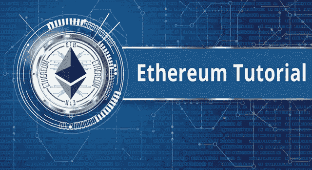
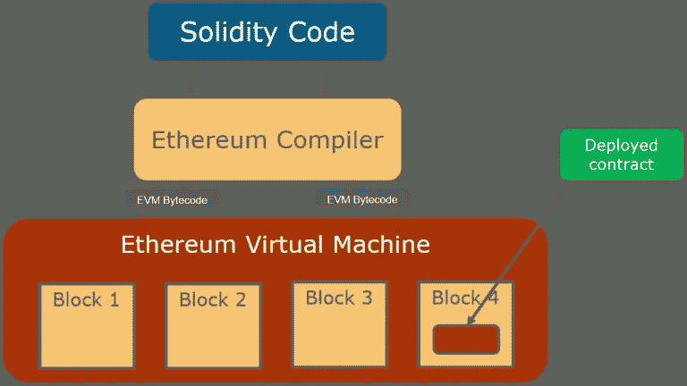
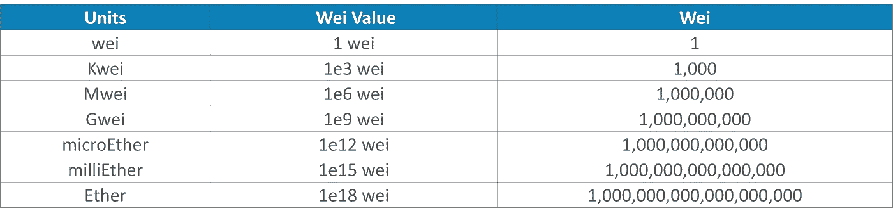
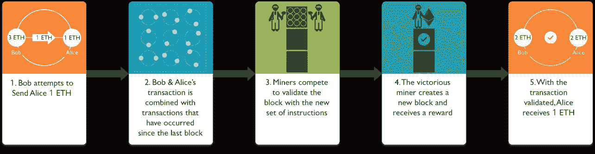
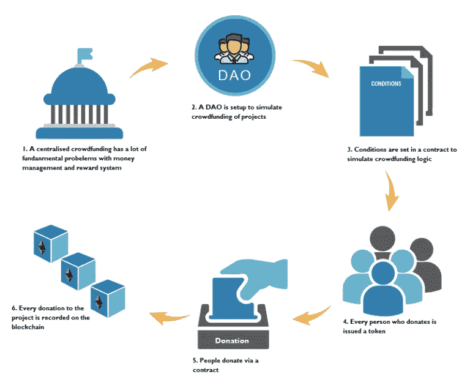

# 以太坊 101 -深入了解以太坊！

> 原文：<https://medium.com/edureka/ethereum-tutorial-with-smart-contracts-db7f80175646?source=collection_archive---------7----------------------->



Ethereum Tutorial — Edureka

在这篇以太坊教程文章中，我将解释以太坊体系结构的内部工作原理，并通过一个简单的智能契约向您展示以太坊的实现。

我认为以太坊是一个可编程的区块链，未来将服务于大多数 B2C 企业。以太坊允许开发人员自由创建在区块链上执行的复杂模型，而不是限制他们进行像比特币区块链这样的预定义操作。

通过这种方法，以太坊将自己变成了一个平台，用于大量分散的应用程序和组织，包括但不限于加密货币。

我将在这个“以太坊教程”博客中详尽地讨论各种主题。这些主题包括:

*   以太坊账户
*   以太坊虚拟机
*   以太坊网络
*   乙醚和气体
*   以太坊采矿

# 以太坊账户

以太坊网络有两种类型的账户，即:

*   外部账户
*   合同账户

这些账户，无论是外部账户还是合同账户，都被称为“状态对象”，构成以太网的“状态”。每个状态对象都有一个明确定义的状态。对于外部账户，状态由账户余额组成，而对于合约账户，状态由存储器存储和余额定义。

我将外部账户简称为账户。这些账户由网络的外部代理拥有和代表，包括每个普通用户、矿工、自动代理等。

这些帐户通常在 RSA 等公钥加密算法的帮助下得到控制。外部账户的主要目的是作为用户与以太坊区块链交互的媒介。

另一方面，契约帐户是驻留在区块链特定地址的代码集合。这些契约由外部帐户调用，或者由其他契约通过特定的行动号召功能调用。这些合同是用像 Solidity、Serpent 或 LLL 这样的高级脚本语言编写的。驻留在以太坊区块链上的每个合同都以一种称为 EVM(以太坊虚拟机)字节码的特定格式存储，这是一种以太坊特定的二进制格式。既然我已经告诉了你关于 EVM 字节码的事情，我解释一下 EVM 才公平。

# 以太坊虚拟机

以太坊以一种质朴的方式定义了一套通用的协议，这些协议已经成为分散式应用程序开发的支柱。其核心是以太坊虚拟机。下图解释了该架构:



值得注意的是，以太坊虚拟机不仅是完全沙盒化的，而且是完全隔离的。这意味着当前在 EVM 上运行的代码不能访问网络或文件系统，并且可以有节制地访问其他契约。

既然我们了解了平台的核心，让我们更深入地看看网络节点。

# 以太坊网络

以太坊网络是一个公共区块链网络。它形成了在网络上运行的所有分散的对等应用和组织的基础。网络由两种类型的节点组成，即满节点和轻量节点。

**完整节点**包含自 genesis 块以来的全部事务历史。它们充分证明了区块链网络的完整性。完整的节点必须包含根据以太坊规范建立的规则验证过的每一个交易。

**另一方面，轻量级节点**只包含整个区块链的一个子集。这些类型的节点主要用在电子钱包中，电子钱包本质上必须是轻量级的，因此整个区块链不能存储在其上。相反，这些节点不验证每个块或事务，并且可能没有当前区块链状态的副本。它们依赖完整的节点来提供缺失的细节(或者只是缺少特定的功能)。轻型节点的优势在于它们可以更快地启动和运行，可以在更多计算/内存受限的设备上运行，并且不会消耗几乎同样多的存储。

每个公共区块链都有一种货币与之相连。以太坊也不例外。让我们更深入地了解一下以太坊的加密货币。

# 乙醚和气体

以太是用于支付以太坊网络交易的加密货币的名称。除了支付一般交易和服务费用，乙醚还被用来购买天然气，而天然气又被用来支付 EVM 内的计算费用。

乙醚是公制单位，有很多面额，有助于准确支付交易和汽油。最小的货币单位叫做卫。下表列出了各种面额及其具体名称:



如前所述，我们知道 EVM 负责运行部署在其网络上的代码。那么，是什么阻止了人们在 EVM 上运行无限循环并使其内存完全超载呢？这就是气体概念的由来。

Gas 被用作为网络上的计算资源付费的度量。网络上的每个合同都有一个设定的最大天然气量，可以用于计算。这被称为"**气体极限**"其他相关气体术语如下:

> **汽油价格**:这是汽油的成本，以乙醚等代币及其其他面额表示。为了稳定气价，气价是浮动值，使得如果代币或货币的成本波动，气价变化以保持相同的实际值。
> 
> **天然气费**:这实际上是运行特定交易或程序(称为合同)所需支付的天然气数量。

因此，如果有人试图运行一段永远运行的代码，该契约最终将超过其 gas 限制，并且调用该契约的整个事务将回滚到其先前的状态。

现在我们知道了货币，让我们来看看产生新货币的过程。

# 采矿

以太坊，很像其他公共区块链技术，通过基于激励的模型来确保安全性。这被称为工作验证机制。下图显示了以太坊采矿的工作原理:



从更技术性的角度来看，所使用的工作证明算法被称为 Ethash，这是一种受 Dagger-Hashimoto 算法启发的散列算法。

现在我们已经看到了以太坊的工作架构，并讨论了它的基本元素，让我们看看一个现实世界的问题以及解决该问题的以太坊方法。

# 分散式众筹用例

## **问题陈述**:

在当今世界，一个好的“想法”并不是成功创业的一切。实现一个想法需要大量的资金和努力。这就是像“Kickstarter”这样的组织出现的原因。他们为项目提供公众曝光度，这是他们的项目运作所需的捐款，但这种动机的集中架构也有其缺点，主要表现在回报的处理方式上。由于集中的权力机构做出所有的决定，系统倾向于这样的规则:

*   错过活动最后期限的人不能再参加了
*   任何改变主意的捐赠者都不能出来

## **接近**:

我们采用分散的方法来解决问题，如下图所示:



## **解决方案**:

下面是针对上述问题陈述的 solidity 智能合约。

```
pragma solidity ^0.4.16;

interface token {
function transfer(address receiver, uint amount);
}

contract Crowdsale {
address public beneficiary;
uint public fundingGoal;
uint public amountRaised;
uint public deadline;
uint public price;
token public tokenReward;
mapping(address => uint256) public balanceOf;
bool fundingGoalReached = false;
bool crowdsaleClosed = false;

event GoalReached(address recipient, uint totalAmountRaised);
event FundTransfer(address backer, uint amount, bool isContribution);

/**
* Constrctor function
*
* Setup the owner
*/
function Crowdsale(
address ifSuccessfulSendTo; // the address of the owner when funding is successful
uint fundingGoalInEthers; // target amount to raise
uint durationInMinutes; //given time
uint etherCostOfEachToken; //cost of equity in ether
address addressOfTokenUsedAsReward; //token address
) {
beneficiary = ifSuccessfulSendTo;
fundingGoal = fundingGoalInEthers * 1 ether;
deadline = now + durationInMinutes * 1 minutes;
price = etherCostOfEachToken * 1 ether;
tokenReward = token(addressOfTokenUsedAsReward);
}

/**
* Fallback function
*
* The function without name is the default function that is called whenever anyone sends funds to a contract
*/
function () payable {
require(!crowdsaleClosed);
uint amount = msg.value;
balanceOf[msg.sender] += amount;
amountRaised += amount;
tokenReward.transfer(msg.sender, amount / price);
FundTransfer(msg.sender, amount, true);
}

modifier afterDeadline() { if (now <= deadline) _; }

/**
* Check if goal was reached
*
* Checks if the goal or time limit has been reached and ends the campaign
*/
function checkGoalReached() afterDeadline {
if (amountRaised >= fundingGoal){
fundingGoalReached = true;
GoalReached(beneficiary, amountRaised);
}
crowdsaleClosed = true;
}

/**
* Withdraw the funds
*
* Checks to see if goal or time limit has been reached, and if so, and the funding goal was reached,
* sends the entire amount to the beneficiary. If goal was not reached, each contributor can withdraw
* the amount they contributed.
*/
function safeWithdrawal() afterDeadline {
if (!fundingGoalReached) {
uint amount = balanceOf[msg.sender];
balanceOf[msg.sender] = 0;
if (amount > 0) {
if (msg.sender.send(amount)) {
FundTransfer(msg.sender, amount, false);
} else {
balanceOf[msg.sender] = amount;
}
}
}

if (fundingGoalReached && beneficiary == msg.sender) {
if (beneficiary.send(amountRaised)) {
FundTransfer(beneficiary, amountRaised, false);
} else {
//If we fail to send the funds to beneficiary, unlock funders balance
fundingGoalReached = false;
}
}
}
}
```

到此，我们已经成功地结束了这个博客。如果你想查看更多关于人工智能、DevOps、道德黑客等市场最热门技术的文章，你可以参考 Edureka 的官方网站。

请留意本系列中的其他文章，它们将解释区块链的其他各个方面。

> 1.[区块链教程](/edureka/blockchain-tutorial-d05f9c36b62b)
> 
> 2.[以太坊专用网络](/edureka/ethereum-private-network-tutorial-22ef4119e4c3)
> 
> 3.[什么是智能合约？](/edureka/smart-contracts-301d39565b76)
> 
> 4.[坚固性教程](/edureka/solidity-tutorial-ca49906bdd47)
> 
> 5.[松露以太坊教程](/edureka/developing-ethereum-dapps-with-truffle-7533289c8b2)
> 
> 6.[最佳以太坊开发工具](/edureka/ethereum-development-tools-7175503a1ac7)
> 
> 7.[总账结构](/edureka/hyperledger-fabric-184667460-edc184667460)
> 
> 8. [Hyperledge vs 以太坊](/edureka/hyperledger-vs-ethereum-bdc868e10817)

*原载于 2018 年 3 月 7 日*[*【www.edureka.co*](https://www.edureka.co/blog/ethereum-tutorial-with-smart-contracts/)*。*