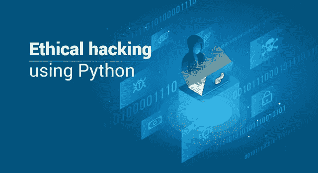
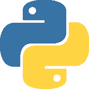

# 使用 Python 的道德黑客——两者的合作

> 原文：<https://medium.com/edureka/ethical-hacking-using-python-c489dfe77340?source=collection_archive---------0----------------------->



在有道德的黑客中，编写漂亮的脚本并自动化任何结构化的过程是常见的做法，范围从小型网络扫描到广域网数据包嗅探。近年来，Python 已经成为这类任务的首选语言，这是有充分理由的。在这篇关于使用 Python 进行道德黑客的文章中，我们将讨论让这两个人成为如此杰出的一对的原因

以下是我们将要讨论的主题清单:

*   什么是道德黑客？
*   Python 是什么？
*   为什么使用 Python 进行道德黑客攻击？
*   使用 Python 的简单字典攻击

# 什么是道德黑客？

黑客这个术语可以追溯到很久以前。确切地说，这一切都始于麻省理工学院的*铁路俱乐部*，这里首次创造了术语“*黑客”*和“*黑客”*。到现在快 50 年了，黑客已经演变成了当今时代的一门学科。随着人们对数据保护和数据隐私意识的增强，如今黑客行为已被视为一种非法活动。如果被抓住，根据造成的伤害程度，你很有可能会被起诉一段时间。尽管如此，为了保护自己免受各种黑客的攻击，雇佣道德黑客已经成为组织间的普遍做法。道德黑客的职责是在黑帽黑客发现之前，为某个组织找到并修复安全漏洞。

# Python 是什么？



Python 是一种通用脚本语言，因其简单性和强大的库而在专业人士和初学者中广受欢迎。Python 具有惊人的通用性，几乎可以用于任何类型的编程。从构建小规模的脚本来完成普通的任务，到大规模的系统应用——Python 可以在任何地方使用。事实上，美国宇航局实际上使用 Python 为他们的设备和太空机械编程。

Python 还可以用于处理文本、显示数字或图像、求解科学方程和保存数据。简而言之，Python 在幕后用于处理大量您可能需要或在设备上遇到的元素。

# 为什么使用 Python 进行道德黑客攻击？

Python 之所以广受欢迎，主要是因为它的超级强大且易于使用的库。当然 Python 有很棒的可读性，而且它真的很简单，但是没有什么比这些库让你作为开发人员的工作变得超级简单更好的了。这些库在各种领域都有用途，例如，人工智能有 *Pytorch* 和 *Tensorflow* ，而数据科学有 *Pandas* 、 *Numpy* 、 *Matplotlib* 。

同样，Python 在道德黑客方面也很出色，原因如下:

*   Pulsar、NAPALM、NetworkX 等漂亮的 python 库使得开发网络工具变得轻而易举
*   有道德的黑客通常开发小脚本，python 作为一种脚本语言为小程序提供了惊人的性能
*   Python 有一个庞大的社区，因此任何与编程相关的疑问都会被社区迅速解决
*   学习 Python 也为你打开了其他几个职业机会的大门

# 演示:使用 Python 的字典攻击

让我给你们做一个小演示，展示一个有道德的黑客如何在日常工作中使用 Python。假设您正在扫描一个 FTP 服务器和一个客户端之间的 3 次握手，并且您也成功地这样做了。但是你们可能已经知道了，密码从来没有真正以纯文本的形式存储过。它们在被存储到数据库之前总是被散列，并且通常散列本身被比较用于验证目的。让我们创建一个小的 Python 程序，使用字典攻击方法来破解密码。

```
import hashlib

flag = 0

pass_hash = input("md5 hash: ")

wordlist = input("File name: ")
try:
    pass_file = open(wordlist,"r")
except:
    print("No file found :(")
    quit()

for word in pass_file:

    enc_wrd =word.encode('utf-8')
    digest =hashlib.md5(enc_wrd.strip()).hexdigest()
    # print(word)
    # print(digest)
    # print(pass_hash)
    if digest.strip() == pass_hash.strip():
        print("password found")
        print("Password is " + word)
        flag = 1
        break

if flag == 0:
    print("password not in list")
```

这就把我们带到了关于使用 Python 进行道德黑客的文章的结尾。我希望这篇文章对你有所帮助，并增加了你的知识价值。如果你想查看更多关于人工智能、DevOps、云等市场最热门技术的文章，你可以参考 Edureka 的官方网站。

请留意本系列中的其他文章，它们将解释网络安全的各个方面。

> 1.[什么是网络安全？](/edureka/what-is-cybersecurity-778feb0da72)
> 
> 2.[网络安全框架](/edureka/cybersecurity-framework-89bbab5aaf17)
> 
> 3.[隐写术教程](/edureka/steganography-tutorial-1a3c5214a00f)
> 
> 4.[什么是网络安全？](/edureka/what-is-network-security-1f659407dcc)
> 
> 5.[什么是计算机安全？](/edureka/what-is-computer-security-c8eb1b38de5)
> 
> 6.[什么是应用安全？](/edureka/application-security-tutorial-e6a0dda25f5c)
> 
> 7.[渗透测试](/edureka/what-is-penetration-testing-f91668e2291a)
> 
> 8.[道德黑客教程](/edureka/ethical-hacking-tutorial-1081f4aacc53)
> 
> 9.[关于 Kali Linux 你需要知道的一切](/edureka/ethical-hacking-using-kali-linux-fc140eff3300)
> 
> 10.[什么是密码学？](/edureka/what-is-cryptography-c94dae2d5974)
> 
> 11. [DDOS 攻击](/edureka/what-is-ddos-attack-9b73bd7b9ba1)
> 
> 12.[使用 Python 的 MAC changer](/edureka/macchanger-with-python-ethical-hacking-7551f12da315)
> 
> 13 [ARP 欺骗](/edureka/python-arp-spoofer-for-ethical-hacking-58b0bbd81272)
> 
> 14. [Proxychains，Anonsurf & MacChange](/edureka/proxychains-anonsurf-macchanger-ethical-hacking-53fe663b734)
> 
> 15.[足迹](/edureka/footprinting-in-ethical-hacking-6bea07de4362)
> 
> 16.[50 大网络安全面试问答](/edureka/cybersecurity-interview-questions-233fbdb928d3)

*原载于 2019 年 2 月 6 日*[*www.edureka.co*](https://www.edureka.co/blog/ethical-hacking-using-python/)*。*