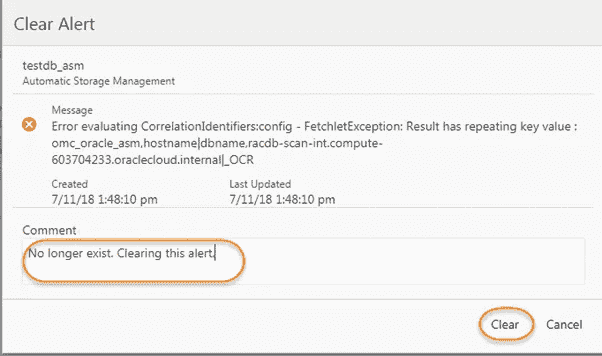

# 评估和清除来自 Oracle 管理云的实体警报

> 原文：<https://medium.com/oracledevs/evaluating-and-clearing-entity-alerts-from-oracle-management-cloud-2e49d60860dd?source=collection_archive---------2----------------------->

## 作者:[mono war Mukul](https://medium.com/u/3757393c69bd?source=post_page-----2e49d60860dd--------------------------------)(OCM)[NASS yam Basha](https://medium.com/u/ba3f0a72ff81?source=post_page-----2e49d60860dd--------------------------------)(甲骨文王牌总监，OCM)

## 介绍

在本文中，我们将了解如何查看未处理的警告/严重/致命警报，并通过逐步导航和说明来清除未处于活动状态的警报。

## 评估和清除警报

将目标添加到 OMC 后，最初，非常希望收到来自目标的警告/严重/致命警报。这些警报可能是从诊断文件中扫描的旧警报。因此，我们将检查并清除目标的警报。目标可以是数据库、主机级别或 ASM 等。同时，不经审查就清除它们也不是一个好的做法。我们需要调查每一个警报，并需要确保警告不是活动的或最近的。确定警报后，如果它们不是活动的，我们将了解如何安全地清除它们。

连接到 OMC 控制台(管理云→监控)

OMC Dashboard, Navigation to Monitoring

在下面的屏幕中，我们可以看到致命、严重和警告警报，它们非常突出。悬而未决的原因可能是一个持续的问题或其历史问题。在我们的示例中，我们有两个严重警报，并单击它们。

Enterprise Summary of Entity

在**的第一个严重警报**中，信息非常明确——Oracle 数据库被关闭(关闭/中止),我们还可以看到该警报的最后更新时间以及持续时间或生命周期。如果这些目标没有添加到封锁中，那么我们将直接收到此类警报，因此如果出现任何停机，我们需要将这些目标置于封锁中。

Warnings to be cleared

**第二个警报**更多地与 ASM 和扫描相关—我们还可以在消息中看到另一个“内部”提示—在这种情况下，最好在服务器级别正确查看 DIAG 日志后交叉检查是否有任何已知的错误。此警报主要指出了一个错误，此问题已在代理 1.33 中修复。

> **Oracle 管理云:FetchletException:结果有重复键值(文档 ID 2478679.1)**

接下来，我们可以添加一些评论，并单击“清除”按钮，因为这是根据错误号确定的已知问题。

Put the comment and then clear

清除消息后，我们可以看到警报清除时的状态。

Status of the cleared alert

在我们的案例中，这两个警报都是已知案例。如果有未知情况，我们必须努力找出根本原因。

同样，我们也可以从“OMC →管理云→警报”中直接查看此类警报，此页面将通过下图概述显示这些非常有意义的警报。

Alerts of All the Entities

## **总结**

在本文中，我们通过两个示例了解了如何查看实体的警报以及如何对警报进行故障排除，最后，我们清除了已知问题的警报。

## **作者简介**

***Nassyam Basha*** 是数据库管理员。他有大约十年的 Oracle 数据库管理员工作经验，目前是 eprosed KSA 公司的数据库专家。他拥有马德拉斯大学的计算机应用硕士学位。他是 Oracle 11g 认证大师和 Oracle ACE 总监。他以超级英雄的身份积极参与甲骨文相关论坛，如 OTN，甲骨文支持被授予“大师”称号，并担任 OTN 版主，与 OTN 一起撰写了大量关于 Toad World 的文章。他维护着一个与甲骨文技术相关的博客，[www.oracle-ckpt.com](http://www.oracle-ckpt.com/)，可以通过[https://www.linkedin.com/in/nassyambasha/](https://www.linkedin.com/in/nassyambasha/)找到他

***Monowar Mukul*** 目前担任首席 Oracle 数据库专家。我是 Oracle 认证大师(Oracle 12c 认证大师管理、Oracle 12c 认证大师 MAA 和 Oracle 11g 认证大师管理)。他在 Oracle MAA 空间担任了 17 年的 Oracle 数据库管理员顾问，负责数据库云服务器和非数据库云服务器系统、Oracle 云空间和 SOA 中间件。他曾在澳大利亚的多个商业领域工作，包括高等教育、能源、政府、采矿和运输。作为一名首席 Oracle 数据库专家，他展示了高度发展的批判性思维和分析技能。你可以在[https://www.linkedin.com/in/monowarmukul/](https://www.linkedin.com/in/monowarmukul/)找到关于他和他的工作成就的更多细节