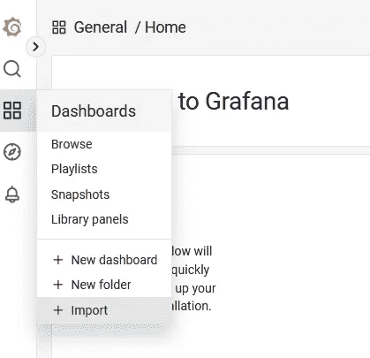
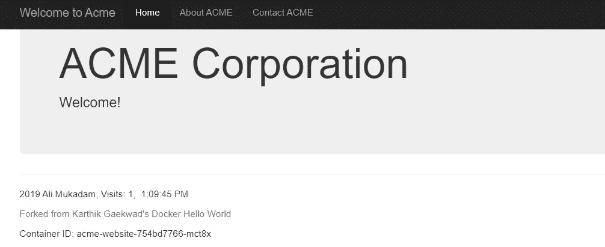
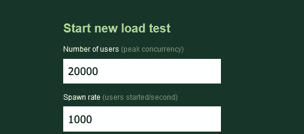
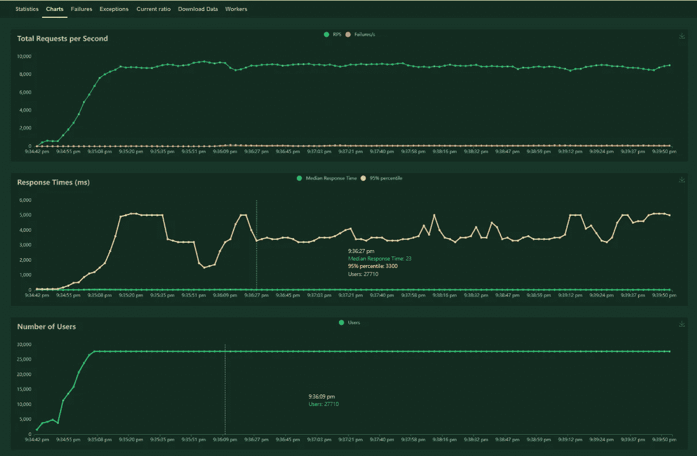
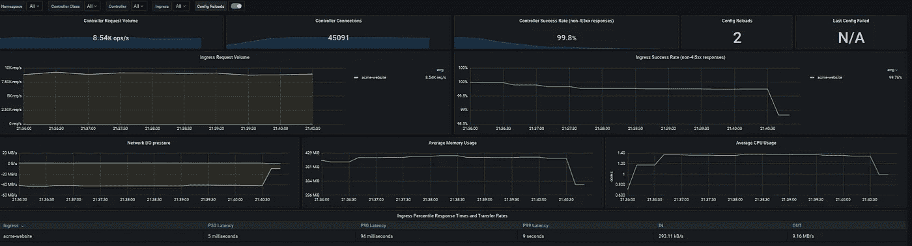
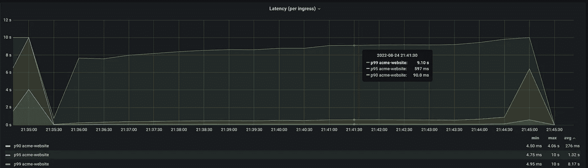
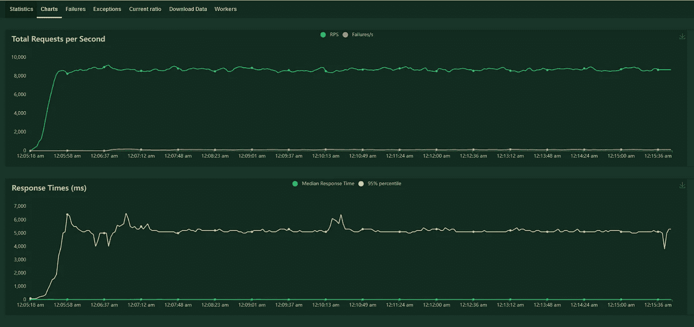
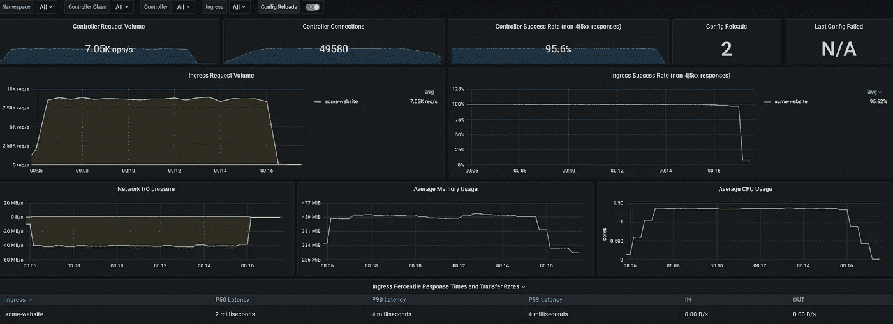
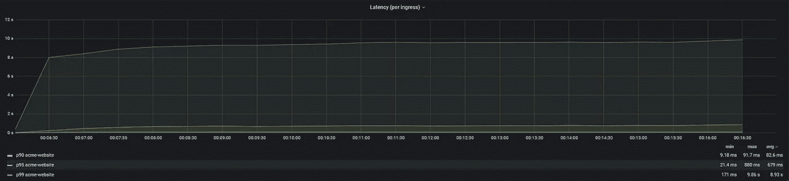

# 使用 Locust 评估和改进 Oracle Kubernetes 引擎上的 ingress 控制器的性能

> 原文：<https://medium.com/oracledevs/evaluating-and-improving-the-performance-of-your-ingress-controller-on-oracle-kubernetes-engine-86c8b44c98c9?source=collection_archive---------1----------------------->

我以前写过关于[使用不同的入口控制器](/oracledevs/experimenting-with-ingress-controllers-on-oracle-container-engine-oke-part-1-5af51e6cdb85)和 OKE。我还写过在同一个集群中同时使用多个的[。在本文中，我们将探讨如何评估和提高入口控制器的性能。](/oracledevs/experimenting-with-ingress-controllers-on-oracle-container-engine-oke-part-2-96063927d2e6)

## 建立

让我们先设置我们的集群。下面是创建集群的 Terraform 代码:

您会注意到一点:我们有四个节点池:

```
node_pools = {
  np1 = { shape = "VM.Standard.E4.Flex", ocpus = 2, memory = 32, node_pool_size = 1, label = { app = "nginx"} }
  np2 = { shape = "VM.Standard.E4.Flex", ocpus = 2, memory = 32, node_pool_size = 1, label = { app = "monitoring"} }
  np3 = { shape = "VM.Standard.E4.Flex", ocpus = 2, memory = 32, node_pool_size = 3, label = { app = "acme"} }
  np4 = { shape = "VM.Standard.E4.Flex", ocpus = 2, memory = 32, node_pool_size = 5, label = { app = "roadrunner"} }
}
```

节点池 **np1** 将是我们运行入口控制器的地方， **np2** 将运行我们的监控基础设施，如 Grafana 和 Prometheus， **np3** 将运行我们的服务，在这种情况下，是 Acme Corp 的一个简单网站，最后， **np4** 将运行 [Locust](https://locust.io/) 并生成负载。

## *为什么要使用四个节点池？*

入口控制器也作为 pod 运行，也就是说，它们将在某个工作节点上运行。如果我们想研究性能并随后改进它，我们需要确保我们将它和它的流量与我们在这个测试中运行的其他东西隔离开来，比如监控堆栈和负载生成器。这意味着确保只有入口控制器单元位于我们选择的工作节点(以及节点池)上，同时将 Prometheus、Grafana 和 Locust 等其他单元排除在外。为了实现这一点，我们将使用 OKE 的功能让您在每个节点池上配置初始节点标签。我的同事 [Tim Graves](https://www.linkedin.com/in/a-tim-graves/) 是 Road Runner 的粉丝，因为我们将访问 ACME Corp .的网站作为我们的示例应用程序，他非常有帮助地建议我使用 *roadrunner* 作为标签，而不是 locust。那就这样吧。

## 安装监控堆栈

为 kube-prometheus-stack 添加舵手报告并生成舵手清单:

```
helm repo add prometheus-community https://prometheus-community.github.io/helm-charts
helm show values prometheus-community/kube-prometheus-stack > kps.yaml
```

使用生成的清单定位节点选择器，并添加以下内容:

```
app: monitoring
```

并将以下内容更改为 false:

```
serviceMonitorSelectorNilUsesHelmValues: false
```

您现在可以安装 kube-prometheus-stack:

```
helm install kps --namespace monitoring prometheus-community/kube-prometheus-stack -f kps.yaml --create-namespace
```

为了了解入口控制器的情况，让我们连接到 Grafana:

```
kubectl --namespace monitoring port-forward svc/kps-grafana 3000:80
```

并导入几个具有以下 id 的仪表板: [9614](https://grafana.com/grafana/dashboards/9614-nginx-ingress-controller/) 和 [14314](https://grafana.com/grafana/dashboards/14314-kubernetes-nginx-ingress-controller-nextgen-devops-nirvana/) 。



## 安装入口控制器

出于这个练习的目的，我们将使用社区 [NGINX 入口控制器](https://kubernetes.github.io/ingress-nginx/)，但是您可以使用您选择的任何其他控制器。添加舵 repo 并生成舵清单:

```
helm repo add ingress-nginx https://kubernetes.github.io/ingress-nginx
helm show values ingress-nginx/ingress-nginx > nginx.yaml
```

配置以下参数:

```
controller:
  nodeSelector:
    app: nginx
  admissionWebhooks:
    patch:
      nodeSelector:
        app: nginx
  metrics:
    enabled: true
    serviceMonitor:
      enabled: true
defaultBackend:
  nodeSelector:
    app: monitoring
```

设置[节点选择器](https://kubernetes.io/docs/tasks/configure-pod-container/assign-pods-nodes/)将确保您的 nginx pod 会以匹配的标签落在 worker 节点上，在本例中是 *nginx* 。您现在可以安装入口控制器:

```
helm install nginx ingress-nginx/ingress-nginx --namespace nginx -f nginx.yaml --create-namespace
```

并通过首先用正确的标签标识节点来验证入口控制器盒是否已到达您选择的工作节点:

```
kubectl get nodes --show-labels | grep nginx
10.0.109.8    Ready    node    23h   v1.24.1   app=nginx,beta.kubernetes.io/arch=amd64,beta.kubernetes.io/instance-type=VM.Standard.E4.Flex
```

那么，如果我们描述吊舱:

```
kubectl --namespace nginx get pod nginx-ingress-nginx-controller-b8d7d4dd9-86pn4 -o json | jq '.status.hostIP'
"10.0.109.8"
```

## 安装 Acme 应用程序

接下来，我们将安装示例 Acme 公司的网站:

```
wget https://raw.githubusercontent.com/hyder/okesamples/master/ingresscontrollers/acme/acme-website.yaml
wget https://raw.githubusercontent.com/hyder/okesamples/master/ingresscontrollers/nginx/acme-website-ingress.yaml
```

修改部署以添加节点选择器:

```
apiVersion: apps/v1
kind: Deployment
metadata:
  name: acme-website
spec:
  selector:
    matchLabels:
      app: acme-website
  replicas: 3
  template:
    metadata:
      labels:
        app: acme-website
    spec:
      nodeSelector:
        app: acme
      containers:
      - name: acme-website
        image: lmukadam/acmewebsite:latest
        ports:
        - containerPort: 80
        resources:
          limits:
            memory: "128Mi"
            cpu: "500m"
```

更改入口清单中的主机参数，以放置您可以控制的 FQDN。如果你没有，你可以随时使用 [nip.io](https://nip.io/) 。例如，我的负载平衡器的公共 IP 地址是 192.9.171.147。为了使用 nip.io，您可以使用“192.9.171.147.nip.io”作为入口中的主机参数。创建部署和入口:

```
kubectl --namespace nginx apply -f acme-website.yaml
kubectl --namespace nginx apply -f acme-website-ingress.yaml
```

验证您现在可以使用 FQDN 访问 Acme Corp .的网站:



## 安装蝗虫

最后，让我们安装蝗虫。首先，创建一个 locustfile:

```
import time
from locust import FastHttpUser, task, between
class AcmeUser(FastHttpUser):
    wait_time = between(1, 3)
    host = "replace.me"
@task
    def hello_world(self):
        self.client.get("/")
```

注意，我们使用的是 FastHttpUser，而不是缺省值。这应该会给我们 [5 到 6 倍的请求](https://docs.locust.io/en/stable/increase-performance.html#)。接下来，为 locustfile 创建一个配置映射:

```
kubectl create namespace locust
kubectl --namespace locust create configmap acme-locust --from-file ./locustfile.py
```

并获得蝗虫的 yaml 清单:

```
helm repo add deliveryhero https://charts.deliveryhero.io/
helm show values deliveryhero/locust > locust.yaml
```

编辑蝗虫. yaml:

```
locust_locustfile_configmap: "acme-locust"
# worker
worker:
  replicas: 200
nodeSelector:
  app: roadrunner
```

您现在可以安装 locust:

```
helm --namespace locust install locust deliveryhero/locust -f locust.yaml
```

如果您在 locust 名称空间中列出 pod，您应该能够看到其中的 101 个(100 个 workers +1 个 master)。下面是蒂姆·格雷夫斯和朱利安·西尔维斯顿提供的计算蝗虫豆荚数量的有用命令:

```
expr `k -n locust get pods --no-headers | wc -l` - 1
```

从终端端口转发到 locust 服务:

```
kubectl -n locust port-forward svc/locust 8089:8089
```

开始新的测试:



点击“开始蜂拥”，点击“图表”。您应该会看到负载测试的进度。让测试运行大约五分钟，然后点击“停止”。



在 Grafana NGINX 入口控制器仪表板上，您应该能够看到入口音量、延迟、内存和 CPU 使用率的变化。让我们试着了解发生了什么，看看是否有改进的余地。



同样，在 Ingress NextGen 控制面板上，我们可以检查延迟面板，我们看到第 90 个百分点的平均延迟为 276 毫秒。我们能改善这一点吗？



让我们尝试启用 TCP-BBR。好消息是这已经在 Linux 内核中了！

> **TCP-BBR** 是一项功能，可用于为互联网流量实现更高的带宽和更低的延迟，并可为基于互联网的应用程序提供显著的性能提升。BBR(瓶颈带宽和往返时间)是一种调度算法，有助于控制 TCP 协议的传输速率，通过监控带宽瓶颈的往返时间来减少缓冲，从而减少 TCP 拥塞。

编辑/etc/sysctl.conf 并添加以下内容:

```
net.core.default_qdisc=fq
net.ipv4.tcp_congestion_control=bbr
```

然后重新加载它:

```
sysctl -p
```

并检查它是否有效:

```
sysctl net.ipv4.tcp_congestion_control
```

这应该会给我们:

```
sysctl net.ipv4.tcp_congestion_control
```

让我们用相同的参数再次运行 locust，看看对延迟的影响。与第一次尝试相比，我们立即看到了更稳定的响应时间图:



同样，在 Grafana 上，我们看到所有百分位数的延迟都要慢得多:



对于第 90 个百分点，平均延迟现在是 82.6 毫秒，也就是说，提高了 3.3 倍。同样，在第 95 百分位，延迟的改善几乎是两倍。只有在第 99 百分位时，改善才可以忽略不计。这是一个相对简单的变化，但使用这种方法，我们可以测试系统，收集指标，并使用它们通过数据驱动的方法定位设置、架构或技术选择中可能存在的问题。当然，您所做的更改取决于您的用例以及许多其他变量。

## 结论

在本文中，我们将 nginx-ingress 部署为入口控制器，使用 locust 生成负载并捕获生成的指标。然后，我们使用 Grafana 对它们进行了分析，发现了一个潜在的延迟问题，我们使用 TCP-BBR 解决了这个问题。最后，我们再次测试，看看这是否带来了更好的性能，或者我们是否需要重新审视我们的技术堆栈。

显然，还有很多东西需要探索，您可以从许多不同的方向着手，例如测试您的应用程序、存储、集群大小等等。如果你想入门演奏技巧，我强烈建议你阅读[这篇论文](https://is.muni.cz/th/jfpm7/dp.pdf)。它提供了不同演奏技巧的简明概述，在你进行更复杂的练习之前对你有很大帮助。

我希望你喜欢这篇文章。

## 参考

[痛苦(少？)NGINX 入口](https://danielfm.me/post/painless-nginx-ingress/)

[针对性能调整 NGINX】](https://www.nginx.com/blog/tuning-nginx/)

[优化网络服务器以实现高吞吐量和低延迟](https://dropbox.tech/infrastructure/optimizing-web-servers-for-high-throughput-and-low-latency)

[使用 BBR 和 tcp_notsent_lowat 优化 HTTP/2 优先级](https://blog.cloudflare.com/http-2-prioritization-with-nginx/)

BBR，街区里的新成员

在[开发者懈怠](https://bit.ly/devrel_slack)上聊一聊吧！