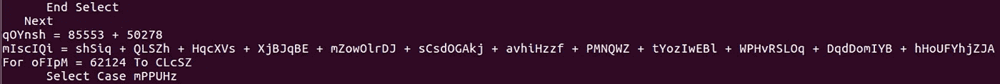
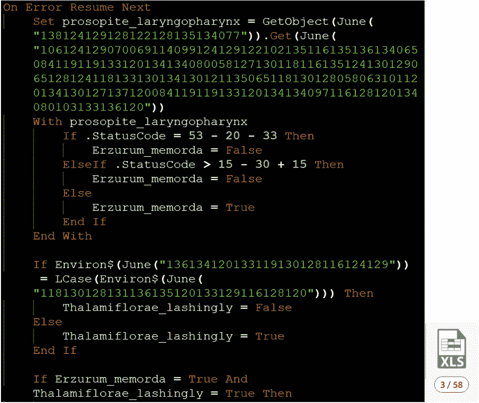

# 规避 VBA——先进的 Maldoc 技术

> 原文：<https://medium.com/walmartglobaltech/evasive-vba-advanced-maldoc-techniques-1365e9373f80?source=collection_archive---------1----------------------->

作者:柯克·塞尔( [@bigmacjpg](https://twitter.com/bigmacjpg) )、哈罗德·奥格登([@哈罗德·奥格登](https://twitter.com/haroldogden))和卡莉·罗伯特([@奥伦内夸尔松](https://twitter.com/OrOneEqualsOne))

**执行**

在 VBA 创建流程的不同方法各有利弊。 **Shell$** 、 **Shell** 或 **CreateObject("WScript。壳”)。运行**将导致 office 应用程序被列为已创建进程的父进程。这在目标环境中可能不常见，可能会引起怀疑。

创建 WMI 进程具有由 wmiprvse.exe 创建的进程(WMI 服务进程)的好处，除非 WMI 活动被监视，否则将进程创建与 maldoc 解除关联。

**壳牌$**

业务流程通常使用 **Shell$** 、 **Shell** 或 **CreateObject("WScript。壳”)。运行**来运行 reg.exe、ping.exe、cmd.exe 和其他实用程序，从 stdout 中读取信息或进行更改以使进程能够运行。这可能会给维护者造成歧义，因为他们不能自动将 office 产品的流程创建视为恶意或完全阻止它。

不管您从上面的过程创建方法中选择什么，创建 powershell.exe 过程的办公室过程是维护者正在寻找的一个关键指标。即使只有一层的分离也会减少行为被标记的机会。一种方法是直接调用**cmd.exe/c powershell.exe**而不是**powershell.exe**。

**WMI**

壳牌依靠合法性的不确定性，而 WMI 却没有这样的好处。WMI 流程创建在业务流程中并不常见，这给了辩护者进一步调查的强烈信号。WMI 进程创建带来了三个不可变 VBA 元素的缺点，这三个元素可用于嵌入式 OLE 文件的签名: **GetObject()** ， **Get()** 和**。创建**。

**以帝国为基线**

下面是默认的 PowerShell Empire VBA 生成器中用于 WMI 进程创建的 VBA。帝国是一个后利用框架，包括恶意 VBA 宏生成器，以及各种其他功能。帝国代码中的变量名和字符串都将出现在文档的嵌入式 OLE ( [对象链接和嵌入](https://msdn.microsoft.com/en-us/library/19z074ky.aspx))文件的 P-Code(编译的伪代码)部分，并再次出现在压缩的 VBA 源代码中。用于以 Office 2007+文件格式存储 VBA 宏的默认嵌入式 OLE 文件是 vbaProject.bin。其中许多文件在不同版本之间是静态的，从而减少了签名创建和检测的工作量。

*Detection rate of document with default Empire builder VBA.*

*EC 4159 c 93 ECE 699 a4e 381505321880 CD 329492 CD 1792 ed 8 aaeeb 6d 23 bfbe 5 DAA*

虽然创建帝国 WMI 进程的冗长有其缺点，但这种方法的优点是创建的 WMI 进程对目标是隐藏的(通过 **objConfig 实现)。ShowWindow = 0** )。如果没有设置这个属性，目标可能会注意到创建的进程在任务栏上的短暂出现。

在 VBA 中选择更少的代码，同时冒着目标可能会注意到进程短暂地出现在他们的任务栏上的风险，WMI 进程的创建可以在一行中完成，如下所示。

在本例中，以相同的方式创建了两个流程。在第二个进程创建时，VBA 的每一个可能的部分都被剔除和混淆了。 **StrReverse()** 用于演示字符串不需要以 **GetObject()** 要求的形式存储在 VBA 的任何地方。注意 **GetObject()** ，**。Get()** 和**。Create** 仍然存在，并且仍然是签名的可能目标。

在这种情况下，未定义的变量可以作为 Null，减少了所提供的关于正在运行哪种方法的提示数量。

即使是这种简单的混淆的结果也是减少了 4 个 AV 检测，然后当我们颠倒字符串时减少到 7 个:

*e 3987 c7a 322 c 52 ba 095 bdad 9 feced 318 e 9098 b 380717 df 8595 cc 046034 c 3922 b*

*e 9d 02 B2 ed 484 CD 1c 1944 DC 553 a 342 e 3166 ce 080205 beb 19d 8132352 bee de 8524 c*

**有效载荷混淆和重组**

StrReverse() 是一个很好的例子，但它是一种众所周知的混淆技术，可以关闭以进行检测。一些混淆技术会引起更多的怀疑，而其他的则不会。你需要混淆和重组你的负载的程度很大程度上取决于它的大小。

目标是引入尽可能少的代码，并防止有效负载的任何表示以可以在签名中被切断的格式出现。

**有效载荷大小至关重要**

较小的有效载荷不需要重新组装。VBA 在一个变量定义中的最大字符串长度是 1024，所以如果你的混淆有效载荷比这个长，你很可能会用字符串连接来重组。

字符串串联可以提高反病毒检测率，因为它是 Emotet 等大型 maldoc 活动中常见的技术。

*Emotet reassembling the payload prior to process creation*

用建造者支持更大的有效载荷的好处是能够带来更坚固的第二级。

无论有效载荷大小如何，通过将有效载荷混淆为非标准编码或加密，并使用最少数量的字符串操作函数，可以降低静态检测的可能性和 AV 检测率。

要避免大量使用的函数有 **Left()** ， **Right()** ， **Mid()** ， **Chr()** ， **ChrW()** 等等——任何与字符串操作或字符解码有关的函数。由于在各种 maldoc 活动中使用了这种技术，可以很容易地为简单的去混淆编写签名，如'**Chr(115)+Chr(116)+Chr(117)**'。

这里，我们使用了一个足够小的有效载荷，可以放在一条线上，不需要重新组装。

每个 ASCII 码的解码都是通过一组函数来完成的，我们用一年中的月份和一周中的日子来命名这些函数，这样就很难对它们进行指纹识别。

为了检查存储的有效载荷并对其进行解码，我们使用了利用上述函数的函数 June。

我们拥有的所有字符串都被编码，尽可能隐藏我们的意图，June 用来解码它们。未初始化的变量用于空值和 0 值，这些值通常会被传递以创建进程，因此查找 WMI 进程创建参数的签名会不太有效。

最初上传时，结果仍然是 7 次检测，但现在更有弹性——此时可以添加任意数量的有效载荷，而增加检测率的风险很小。

在这个例子中，字符串是用 Rot9 混淆的。这只需要对 VBA 进行名义上的扩建。我们的字符串现在是任意的，没有仿真或沙箱，特定的有效载荷字符串不能再用签名来查找。VBA 的结构仍然可以用于签名，但我们使用的大部分内容存在于真实世界的业务流程 VBA 中，这使得该构建更具弹性。

Rot9 进入 VBA 的 ASCII 代码，在本例中使用一个简短的 PowerShell 脚本。ASCII 码总是被填充为 3 位数，以使解码更容易，并允许我们不将有效载荷存储在数组中，这可能会触发在 VBA 中寻找大数组的签名。

**反沙盒(离线)和反 FakeNet**

在沙盒中检测和避免执行可以在 VBA 中完成，而不会显著增加被反病毒检测到的机会。

https://github.com/joesecurity/pafishmacro 是灵感的伟大源泉，但我不建议照原样实现这些。由于我们使用 WMI 来避免行为被绑定到我们的 WINWORD.EXE 进程，这里有一个使用 WMI 方法 Win32_PingStatus 的沙箱和 fakenet 旁路的示例。这将导致 wmiprvse.exe 成为与 DNS 和 ICMP 流量相关联的进程，而不是在 WINWORD.EXE 生成流量的情况下可能引起怀疑。

第一个考验是 location.microsoft.com 问题能否得到解决。如果它可以被解决，或者我们可以 ping 主机，我们知道我们在一个假的网络中——location.microsoft.com 是一个不存在的域。

第二项检查是 userdomain 和 computername 环境变量是否相同。如果是，则系统未加入域。

只有当两者都返回 **True** 时，我们才会继续运行我们的有效载荷。这种绕过已经被证明可以绕过自动化沙盒系统，并且在使用沙盒解决方案来提供行为报告时将 ICMP 和 DNS 流量与样本分离。

使用我们上一节的方法来混淆字符串，检测率下降到 3。

*bad BF 30 a 710 a 65 e 12 bb 0 dad 3 b 92 d6a 1938466 cc 6 ECA 6110d 63 e 909 f 305 a 824 f 1*

总之，如果您希望您的 VBA 不被检测到:

避免使用直接来自攻击模拟框架的代码(安全公司喜欢为这些代码编写签名)

对静态分析期间可见的有效负载使用非标准加密或编码

剔除那些你需要但又不想让人觉得可疑的函数( **Chr()** 等等。)

制作高质量的 VBA 固然重要，但我们还可以做得更多。在下一个标题为 **VBA 跺脚**的章节中，我们将介绍额外的混淆技术以及支持这些技术的 Office 内部机制，从而最大限度地降低反病毒产品的检测率。