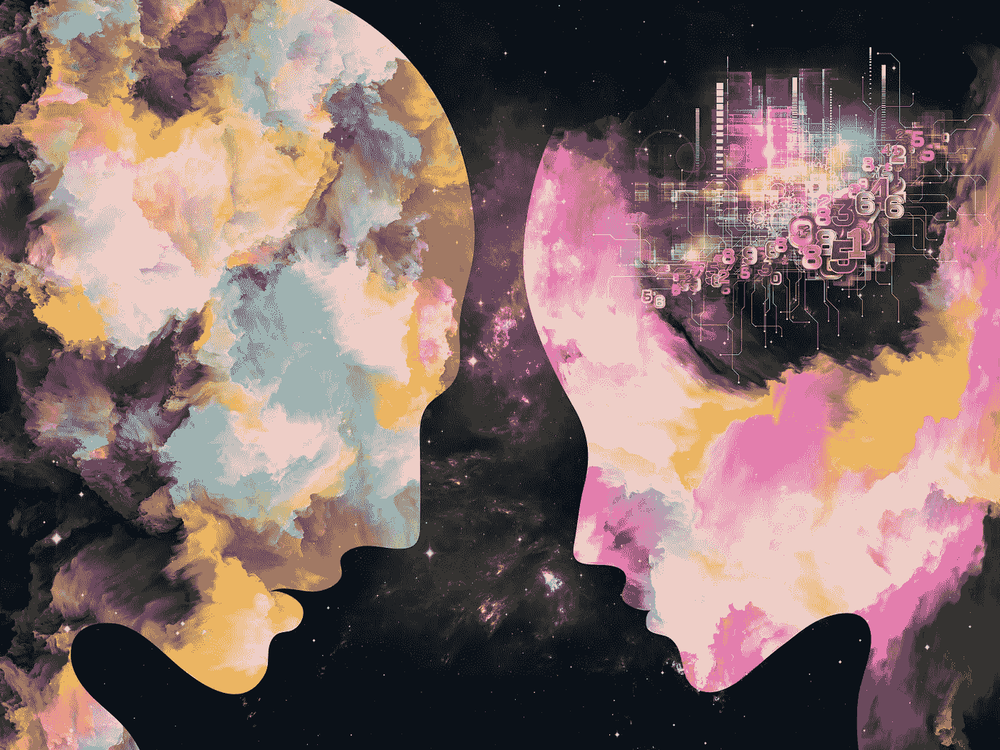
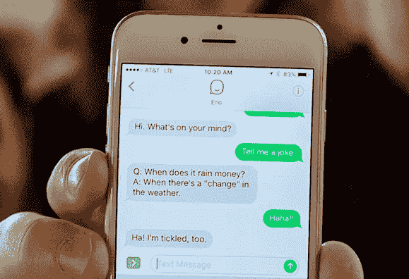

# 即使是机器人也需要塑造性格

> 原文：<https://medium.com/capital-one-tech/even-bots-need-to-build-character-9fbba63055b2?source=collection_archive---------9----------------------->

第一资本公司副总裁 Steph Hay&对话设计主管

对话设计师 Mindy Gold 曾经设计了一个没有名字和性别的健身机器人原型。它的功能是通过日常提示让女性锻炼者保持动力。

在与一位潜在客户进行测试时，Mindy 意识到这位女士将机器人称为“他”

> “他只是告诉我，我必须燃烧 50 多卡路里，”这位女士告诉明迪。
> 
> “你怎么知道是公的？”明迪问。
> 
> “因为现在我对它很生气。”

这种现象——将我们周围的物体拟人化——并不新鲜。我们给汽车和电脑这样的东西命名，给本来没有性别的东西赋予性别。从自动取款机到我们的电脑，我们有意识地和下意识地赋予我们与无生命物体的互动以特征、意图和热情(或缺乏热情)。

我们这样做是因为这是我们知道如何建立联系的方式，从而产生信任。我们喜欢给我们 14 年的车命名，因为当它被命名为像富兰克林这样的名字时，我们相信它不会因为在高速公路上抛锚而背叛我们。*“来吧，福兰克林，别让我失望”*很自然，而*“来吧，2001 福特金牛座”*却不太能传达同样的联系。

在健身的例子中，顾客认为是一个男人，因为她很生气，当她累了的时候，他会告诉她继续。正是与此相关的情感导致了她对它的描述。今天，我们在纯文本的黑白本质中使用表情符号、表情符号和 gif 来传达语气。

正是这种人类学现象激起了人工智能领域设计师的兴趣，以及研究人员、产品经理和技术人员构建包容性机器学习系统的兴趣。因为这提出了一个问题:我们如何才能在我们的人工智能和客户之间实现真正的联系——信任？

建立信任的最有效方法之一是在每次交往中始终如一地展示你的正直品质。现实生活如此，AI 也是如此。

这一点现在尤其重要，因为我们正在看到越来越多的人工智能物体收集数据，并在我们日常生活的几乎每个方面对我们做出回应——从我们的厨房柜台到我们上下班的路上等等。值得注意的是，这并不是所有人都满意的。人工智能的某些方面会让人们感到恐惧，但我们可以通过这种建立信任的想法来建立更好的关系。

因此，我们这些负责将人工智能体验带入生活的人面临着一个非常现实的挑战:为了实现信任，我们需要决定哪些性格特征要明确展示给我们的客户，哪些要留给解释和想象。

这就是为什么设计我们的人工智能的角色是如此的优先。当我们 3 月份在 SXSW 推出 Eno 时，我们成为第一家推出理解自然语言的中性短信聊天机器人的美国银行。

*(参见？我甚至只写了“谁”而不是“那个”，这是一个信号，我认为 Eno 更像人类，尽管当被问及时，Eno 直截了当地说，“我是一个机器人，并感到自豪。”)*

设计我们的人工智能的角色使我们有一个建立信任的基础。我们没有必要在这里重新发明轮子。想想角色驱动的行业是如何通过他们的工作达到这种品牌忠诚度的。视频游戏，好莱坞，甚至流媒体服务都在创作原创作品。这一切都始于一个故事。

有背景故事的角色讲述这些故事。这些角色都有事先严格定义的个性，他们唯一的工作就是与观众建立信任，并通过永不“破坏个性”来保持这种信任直到最后

人工智能团队可以通过有目的地定义我们如何在每次互动中一致地向我们的客户展示来承诺相同的结果，因此我们能够保持角色和品牌的完整性——这是随着时间的推移和人工智能渠道的持续激增，实现信任的关键基础。

**这样做需要你集思广益，考虑角色发展的几个方面:**

*   你的机器人叫什么名字，为什么？
*   它有性别吗？你的选择是基于什么原则？
*   机器人从哪里来，又想去哪里？
*   它的功能限制是什么，当你看到它们时它会如何反应？
*   它的情感边界是什么，包括它的幽默感和不安全感？

要想全面了解性格的这些方面(以及更多)，准备找一个智囊团，成员都有不同的想法，来自不同的背景，并愿意作为一个团队参与一些重大的哲学和伦理辩论。这对于创造一个包容性的人工智能至关重要——如果这是你的目标，就像是我们的目标一样——就像构建它的基础能力一样。

关于你想(或需要)设计什么样的角色来建立客户信任的争论是一个不可思议的机会。所以，不要因为独自一人或者周围都是志同道合的人而亏待自己。利用这一点，有意识地了解你在和谁一起设计，以及你在设计什么和为什么设计。

毕竟，如果人们要自然地——作为人类——赋予物体以特性，我们就有责任为此而设计。有意识地与我们的决定保持一致将使那些人能够信任我们在机器中表现出来的性格。

**了解更多 Eno，在这里** **报名** [**。**](https://www.capitalone.com/applications/eno/)

*本文原载于*[*VentureBeat*](https://venturebeat.com/2017/09/22/even-bots-need-to-build-character/)

*以上观点为作者个人观点。除非本帖中另有说明，否则 Capital One 不属于所提及的任何公司，也不被其认可。使用或展示的所有商标和其他知识产权均为其各自所有者所有。本文为 2017 首都一。*