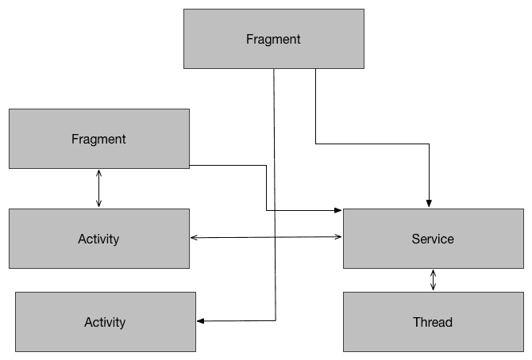
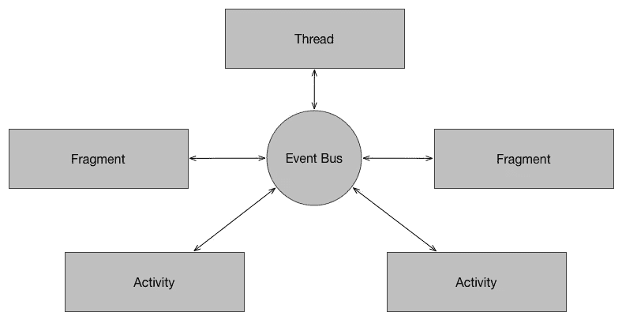
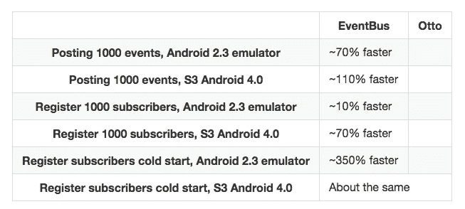
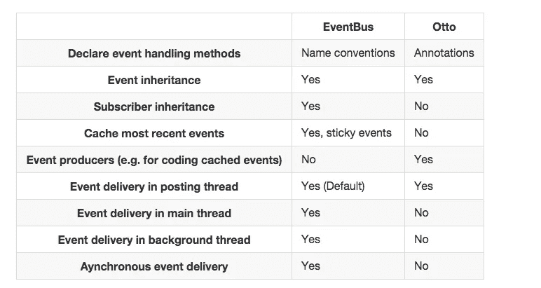

# Android 的事件驱动编程(上)

> 原文：<https://medium.com/google-developer-experts/event-driven-programming-for-android-part-i-f5ea4a3c4eab?source=collection_archive---------0----------------------->

(这是由三部分组成的系列文章的第一部分)

虽然 Android 在其开发中包含了一些事件驱动的特性，但它远远不是一个纯事件驱动的架构。这是好事还是坏事？正如在软件开发的每一个问题中一样，答案并不容易:视情况而定。

首先，让我们为事件驱动开发建立一个定义。这是一个编程范例，其中执行流由动作触发的事件决定(如用户交互、来自其他线程的消息等)。从这个意义上说，Android 是部分事件驱动的:我们都可以想到 onClick 监听器或活动生命周期，它们是能够在应用程序中触发动作的事件。为什么我说它不是一个纯事件驱动的系统？默认情况下，每个事件都绑定到一个特定的控制器，除此之外很难操作(例如，onClick 事件是为一个视图定义的，具有有限的范围)。

等等，你说的是一种新的编程模式。采用框架或方法总是有成本的，这会带来优势吗？我说是的，为了证明这一点，我想提出一些传统 Android 开发的局限性。

在许多情况下，很容易得到如下图所示的结构:

*活动*可以与*片段*通信，*片段*可以向另一个*片段*和*服务发送消息。*组件之间存在紧密耦合，应用更改可能会非常昂贵(*)。这经常导致样板代码，实现需要回调和通过不同层传播的功能的接口…你可能知道我想去哪里。随着代码量的增加，可维护性和良好的软件工程实践正在减少。

事件驱动编程在这里如何应用？让我们代表另一个系统提案:

从概念上讲，所表示的系统有一个事件总线。有不同的实体订阅事件总线，发布事件或监听事件——分别是生产者或消费者。任何订户都可以在不知道逻辑的情况下执行操作。想想吧。考虑一下特殊的可能性:一个片段可以再次呈现并更新它的屏幕，而不需要知道任何操作背后的逻辑，只需要知道发生了一个事件。考虑代码解耦和拥有一个干净的、划分好的架构的可能性。

Android 支持这种范式吗？嗯，部分是。如前所述，SDK 本身提供了一套精简的事件处理技术，但我们希望更进一步。这里我想提几个名字:

*   [EventBus](https://github.com/greenrobot/EventBus/) ，来自[绿色机器人](http://greenrobot.de/)。这个库已经针对 Android 进行了优化，并具有一些高级功能，如交付线程和订阅者优先级。
*   [奥托](http://square.github.io/otto/)，来自[方](https://squareup.com/global/en/register)。最初是来自[番石榴](https://code.google.com/p/guava-libraries/)的一个分支，它已经进化并完善到 Android 平台。

尝试过两者之后，我更喜欢 EventBus 而不是 Otto。Greenrobot [声称](https://github.com/greenrobot/EventBus/blob/master/COMPARISON.md)EventBus 在性能上明显优于其配对产品，并提供了额外的功能。

下一篇文章将探讨如何在 EventBus 中实现基本功能

(*)提到“很多时间”，我故意喜欢用“贵”这个词。从经济角度思考通常更有效。