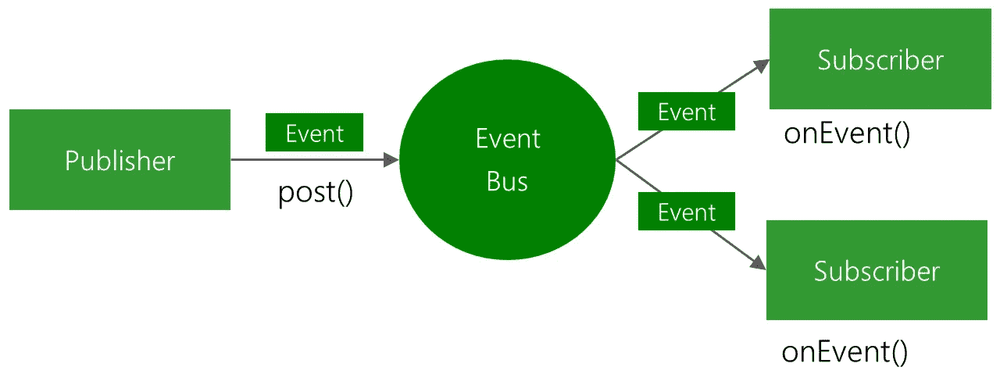

# Android 的事件驱动编程(第二部分)

> 原文：<https://medium.com/google-developer-experts/event-driven-programming-for-android-part-ii-b1e05698e440?source=collection_archive---------1----------------------->

(这是由三部分组成的系列文章的第二部分)

在上一篇文章中，我们简要介绍了事件驱动编程。现在让我们看看一些实际的代码以及如何使用 EventBus 执行基本操作。

首先，我将介绍在事件驱动编程中起核心作用的实体。请参考取自 EventBus 存储库的下图。



一条**事件总线**这是连接所有其他实体的中央通信通道。

一个**事件**。这是将要发生的动作，实际上可以是任何事情(应用程序启动、接收一些数据、用户交互……)

一个**用户**。**用户**正在**事件总线**处监听。如果他们看到一个事件在传播，他们就会被触发。

一个**发布器**，它将**事件**发送到**事件总线**。

从实用的角度来看，一切都很清楚，所以让我们看看这是如何符合一个基本示例的:

*   加载两个片段的应用程序。
*   第二个片段包含一个 **TextView** ，当一个按钮被点击时它将被更新。
*   当一个新的片段进入场景时，**动作条**标题会改变。

## 托管活动

宿主活动需要在它的方法 onCreate event bus 中注册。

```
EventBus.getDefault().register(this);
```

主机活动现在将准备好从总线读取数据。我们还需要在 onDestroy 方法中取消注册总线

```
EventBus.getDefault().unregister(this);
```

该活动将捕获两个不同的事件:一个更新 ActionBar 标题，另一个加载第一个片段。我们将在 Event 上编写两个方法来处理事件:

```
public void onEvent(ShowFragmentEvent event) {
    getFragmentManager().beginTransaction().replace(R.id.container, event.getFragment()).addToBackStack(null).commit();
 }public void onEvent(UpdateActionBarTitleEvent e) {
    getActionBar().setTitle(e.getTitle()); 
}
```

## 这些事件

每个事件都需要在其类中声明。事件中可以包含变量。

```
public final class ShowFragmentEvent {
 private Fragment fragment; public ShowFragmentEvent(Fragment fragment) {
    this.fragment = fragment;
  } public Fragment getFragment() {
    return fragment;
  }
}
```

## 这些碎片

我们现在需要创建碎片。第一个片段将包含一个打开第二个片段的按钮，最新的片段将包含一个按钮，当按下时，更新一个 TextView。这些片段还需要注册和注销 EventBus，因此为了实现更清晰的结构，所有内容都将封装在 BaseFragment 中。

现在让我们创建更多的动作。第一个片段将使用以下函数打开第二个片段:

```
[@OnClick](http://twitter.com/OnClick)(R.id.first_button)
 public void firstButtonClick() {
    EventBus.getDefault().post(new ShowFragmentEvent(new SecondFragment()));
 }
```

请注意，这里我使用了来自 [ButterKnife](https://github.com/JakeWharton/butterknife) 的注释。它产生了更加干净整洁的代码。如果你还没用过，现在就应该开始用了。

第二个片段的按钮将向 EventBus 发送一个事件来更改 TextView。

```
EventBus.getDefault().post(new UpdateTextEvent(getString(R.string.text_updated)));
```

第二个片段也需要监听这个事件，所以当它被接收时，它可以相应地改变文本。

```
public void onEvent(UpdateTextEvent event) {
    textView.setText(event.getTitle()); 
}
```

我们有一个基本的应用程序，其中有两个片段通过事件进行通信，还有一个片段通过事件进行更新。我已经把代码上传到 [GitHub](https://github.com/kikoso/eventbus-sample) 了，大家可以去看看。

一个关键问题是如何升级事件驱动的架构。在下一篇文章中，我将提出一个清晰易懂的架构来支持 Android 中的事件驱动编程。