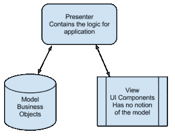
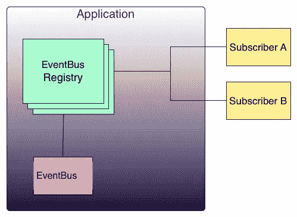
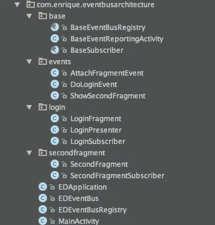

# Android 的事件驱动编程(第三部分)

> 原文：<https://medium.com/google-developer-experts/event-driven-programming-for-android-part-iii-3a2e68c3faa4?source=collection_archive---------0----------------------->

(这是由三部分组成的系列文章的第三部分)

之前，我已经介绍了 Android 的事件驱动编程，并展示了一些代码来创建一个 *HelloWorld 事件驱动的*应用程序。

现在，我们可能面临另一个问题:如何使用事件驱动开发轻松扩展应用程序，而不陷入混乱无序的代码中？在本文中，我将提供一个提议体系结构，它用于基于事件驱动的开发来扩展应用程序，但也可以用于创建更通用类型的应用程序。

我使用这个架构已经有一段时间了，它已经做出了改变。使用事件和 MVP 模式确保了我可以轻松地向应用程序添加特性。我还缩短了重构和重写之间的时间，所以我写的软件实际上可以活得更长，质量更好。

# 第一个任期:MVP

MVP 代表 Model View Presenter，是一种编程模式，它定义了要在软件系统中实现的三个基本实体:

**模型**:渲染什么

**视图**:如何渲染

**展示者**:处理模型和视图之间的通信。演示者用来自模型的内容更新视图，抽象出视图下面的任何复杂性。

Courtesy of WikiMedia

MVP(以及其他编程模式)是一个概念，而不是一个概念坚固的框架，所以没有严格的规则。Android 并没有实现纯粹的 MVP 模式，而是包含了一些元素:

*   用户界面(视图)在 XML 文件中定义。
*   我们扩展扩展视图的类(Activity，Fragment ),并更新它们。

从 MVP 模式的所有组件来看，*呈现者*在 Android 中没有直接的表示。然而，这是一个重要的组成部分:想象一下，明天我们需要从 web 服务而不是数据库中检索数据。如果我们遵循了 MVP 方法，那么这种改变实现起来会很简单。

# 事件驱动的支持架构

以下架构旨在简化基于事件驱动的应用程序的实现。它还具有其他一些优点，如高度模块化和易于测试。

我们将创建我们自己的*应用程序*的实例。该实例将托管一个 EventBus 注册表，该注册表是一个包含所有总线订户的完整列表的类(稍后将详细介绍)。我们的*应用程序*将注册所有订户，并在终止时取消注册。

## 事件总线注册表

这个类基本上是一个包含所有总线用户的寄存器。我最终将我的订户命名为 PluginControllers，因为您可以插入和拔出它们，应用程序将继续工作(当然，如果它们没有插入，它们将不会监听事件)。我知道这种命名会使读者困惑，所以在本文中我将把它命名为订户。

EventBus 注册中心保存了对 EventBus(这是一个静态类)的引用，因此它可以注册订户。

Conceptually: the Application will contain a EventBus Registry with references to the different subscribers, so they can be registered or unregistered. The EventBus is a static instance in the application.

## 订户

订户将是唯一能够监听事件的类。这个类将总是包含一个或多个 *OnEvent()* 方法。订阅者将在收到事件后执行操作。一个基本的例子:当收到“PerformCallEvent”时，您可以拥有一个执行调用的订户。

订阅者还可以将事件发布到 EventBus 中，作为对传入事件的响应。

## 节目主持人

主持人采取行动。这些观点给了他们命令，他们因此而行动。他们还可以将事件发布到 EventBus 中。

这种架构使用单个活动。对此有支持和反对的观点，但是因为我们将使用不同的片段来表示屏幕，使用单个活动使事情变得更容易(记住，作为开发人员，您的主要目标应该是编写更少的程序)。

我已经向 [GitHub](https://github.com/kikoso/Event-Bus-Architecture) 上传了一个包含登录屏幕的示例项目，它触发事件来执行登录，并在登录后加载一个不同的片段。看一下项目结构:

有用于 EventBus 注册表、活动和订户的基类(您可能希望根据您的项目需求添加一个基本片段类)。应用程序、EventBus 和 EventBus 注册表都是为项目定制的(因此使用了 ed 前缀)。

将此应用程序扩展到新功能中基本上需要新的事件、订阅者和演示者，以及每个功能的视图。遵循这种模式可以确保应用程序是可伸缩的，代码是分离的，因此易于测试和理解。