# 通过 PubSub 和 Golang 实现事件驱动

> 原文：<https://medium.easyread.co/event-driven-with-pubsub-and-golang-3924a4bba8a9?source=collection_archive---------0----------------------->


Photo by [pexels](https://www.pexels.com/photo/information-sign-on-paper-317356/)

# 介绍

大家好！还是跟我分享一些与软件工程领域技术相关的经验、想法或者看法吧。在这篇文章中，我想分享如何用 Pubsub 和 Golang 创建一个**事件驱动的！**

但是…事件驱动的定义是什么？

基本上，与 API 驱动的请求同步实时运行不同，事件驱动将基于事件异步运行，并且在请求中会有延迟。还在迷茫？让我们在**用例**部分举个例子。

> 对于细节，也许[维基百科](https://en.wikipedia.org/wiki/Event-driven_architecture)的事件驱动架构定义可以给出更多的上下文。

# 用例

在第一种情况下，我们来谈谈 API 驱动的架构。例如，我们有一个应用程序，它需要调用一个 API。API 需要在多个服务上发送一个请求。该数据流将同步运行，这意味着响应时间将根据每个服务的响应时间累计。

优点是我们可以轻松地进行跟踪，数据流清晰，响应会实时返回。但是，使用这种体系结构，响应时间可能不会很快(取决于每个服务)。此外，还存在难以扩展的可能性，例如添加新服务，并且可能会影响服务之间的当前关系。

下面的数据流将有助于理解 API 驱动的工作原理:

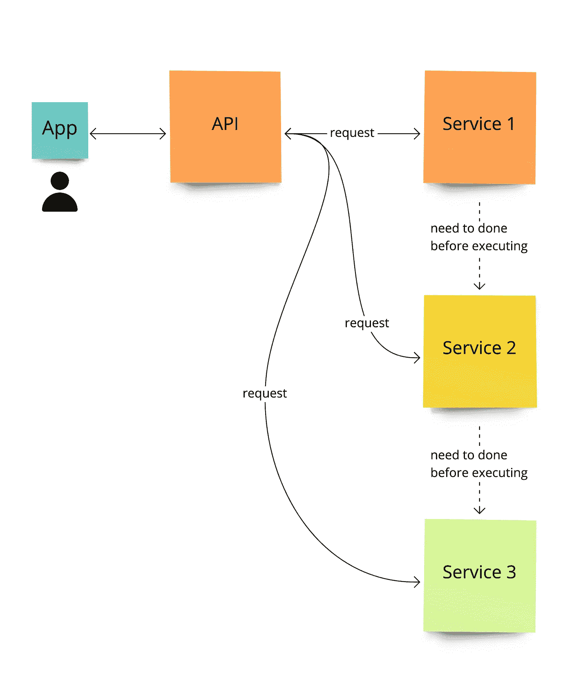

API-Driven Architecture Data-Flow

接下来，用事件驱动架构，API 和服务之间会有一个事件的区别。API 将发布一个事件，每个服务将从事件中获取数据，这可以异步运行。

优点将与 API 驱动架构的缺点相反，例如响应时间可以更快、更容易地添加新服务，而不会破坏其他服务。然而，使用这种体系结构，数据流可能不清楚，并且请求可能会有延迟。

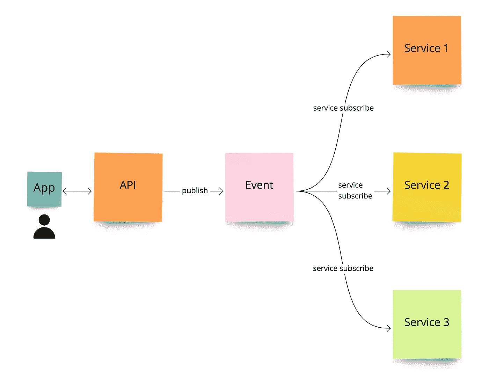

Event-Driven Architecture Data-Flow

# PubSub 模型

因为我们将在这个例子中使用 PubSub，所以最好看一下 PubSub 架构设计。从[官方文档](https://cloud.google.com/solutions/event-driven-architecture-pubsub)关于事件驱动架构的发布/订阅，这里是架构图，也描述了消息队列模型和发布/订阅模型之间的区别:

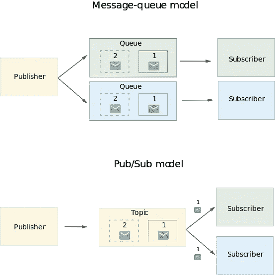

Event-driven architecture with Pub/Sub by Official Documentation

> 在上图中，消息队列模型与发布/订阅事件流模型进行了比较。在消息队列模型中，发布者将消息推送到一个队列中，每个订阅者都可以在该队列中监听特定的队列。在使用发布/订阅的事件流模型中，发布者将消息推送到多个订阅者可以收听的主题。这些模型之间的差异将在以下章节中介绍。

# 配置服务帐户

在实现代码之前，我们需要做一些配置，比如生成服务帐户，在 GCP 控制台中创建 PubSub 主题+订阅者。

1.  从 IAM & Admin 菜单转到服务帐户。

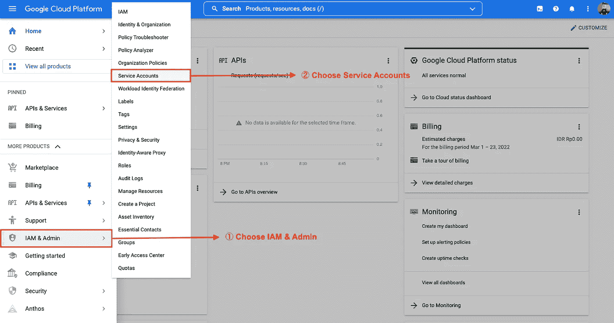

Go to the Service Accounts submenu

2.创建新的服务帐户。

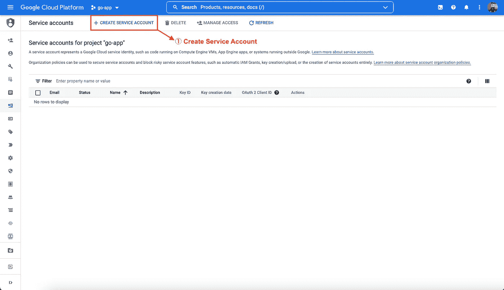

Create a new Service Account

3.填写服务帐户名称，修改服务帐户 ID(如果需要)，然后继续下一步。

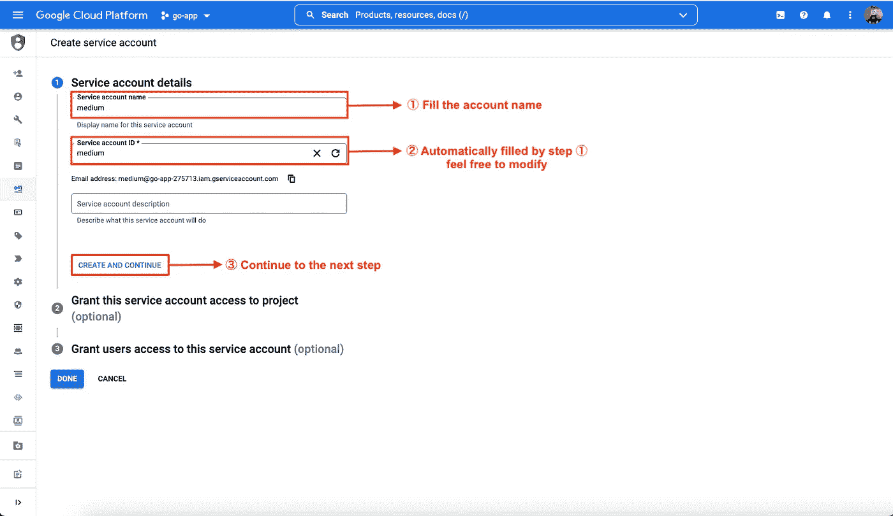

Service Account Name & ID

4.因为我们将只使用 PubSub 服务，所以该角色也只用于访问 PubSub。然后点击继续进入下一步，完成设置。

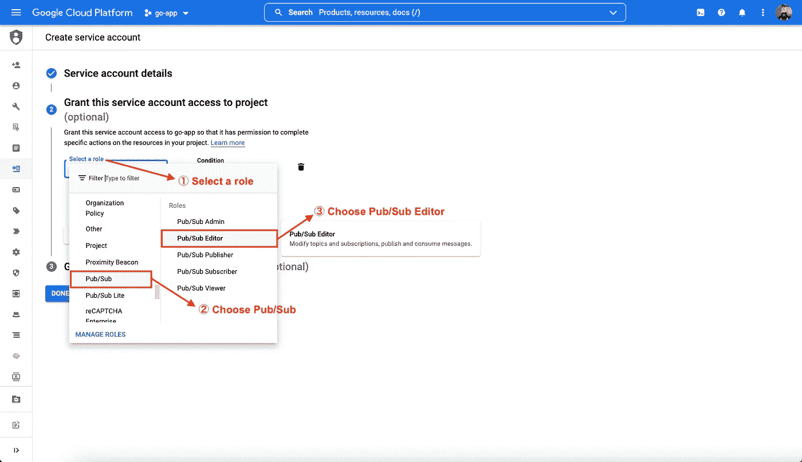

Grant Roles to Service Account

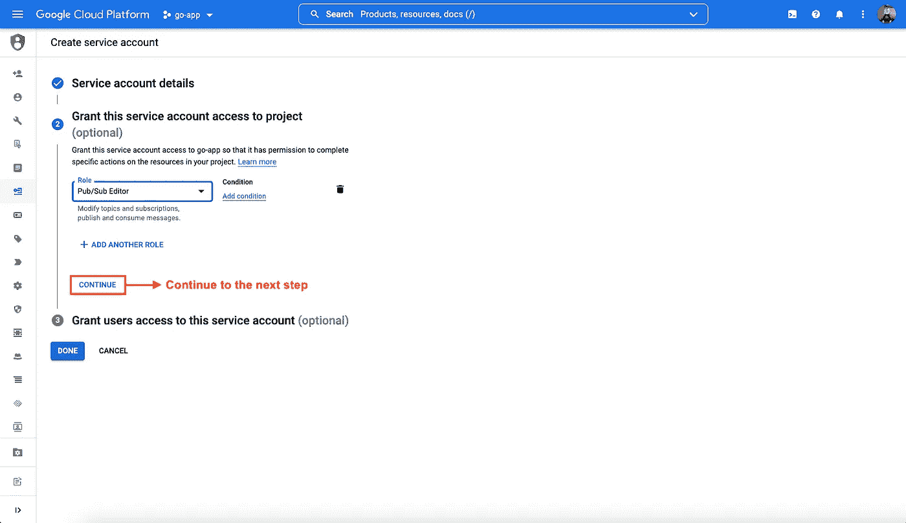

Go to the next step

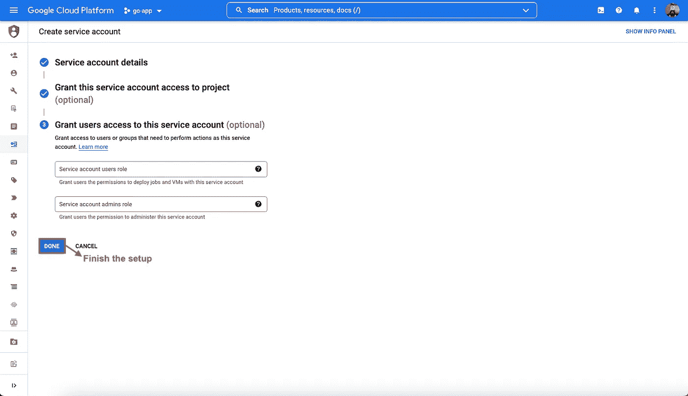

Finish the setup

5.下一步是导出私钥。从操作(省略号)菜单转到管理密钥。

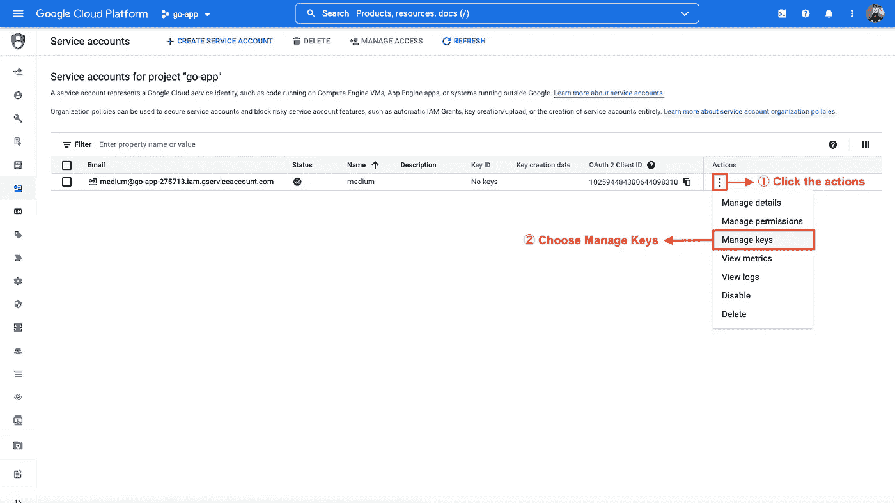

Manage Keys

6.创建一个 JSON 类型的新键，下载它。将密钥保存在安全的地方。

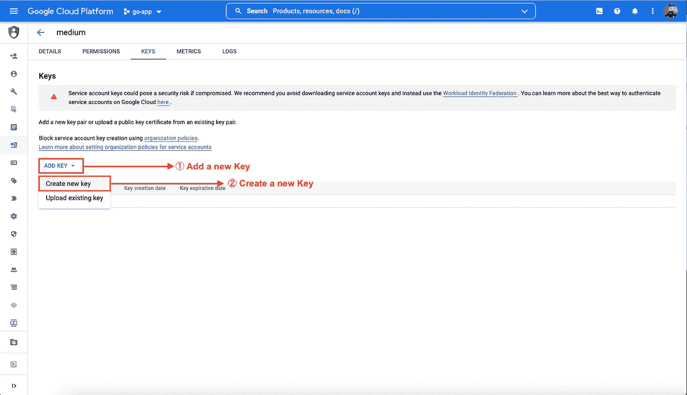

Create a new Private Key

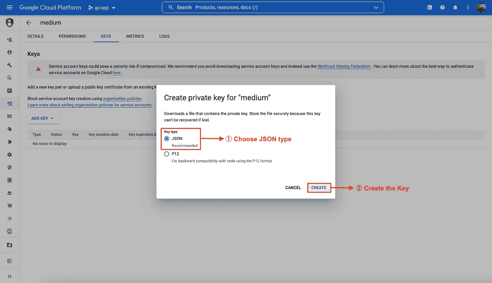

Create Private Key JSON

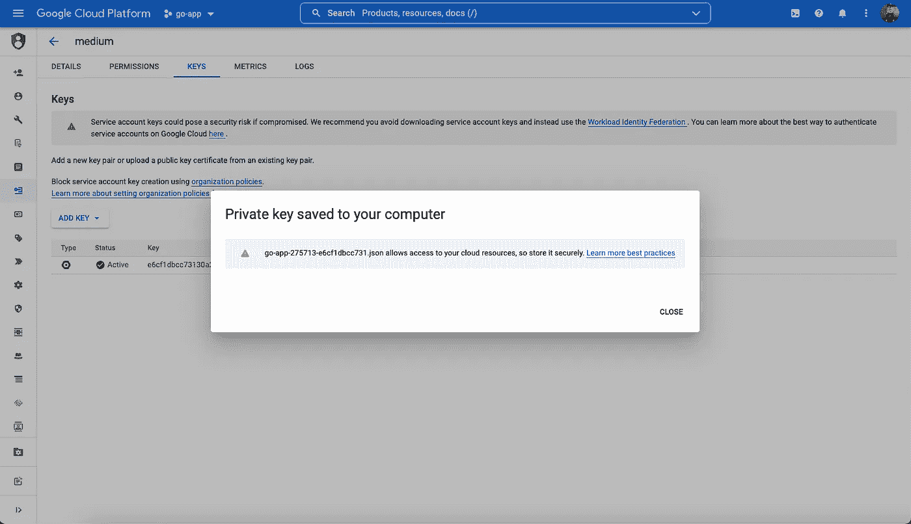

Private Key Downloaded

# 配置发布订阅

完成服务操作后，下一个配置是 PubSub 配置。

1.  转到发布/订阅菜单下的主题子菜单。

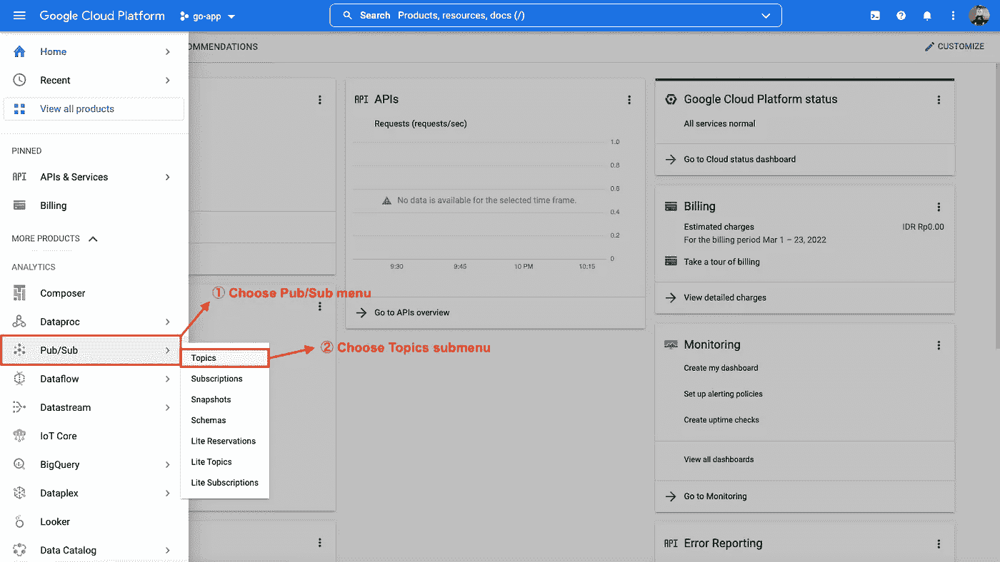

Go to Topics submenu

2.创建一个新的主题 ID，我们给它一个简单的名字，比如`medium`。创建主题 ID 后，将自动创建名为`medium-sub`的订阅 ID。

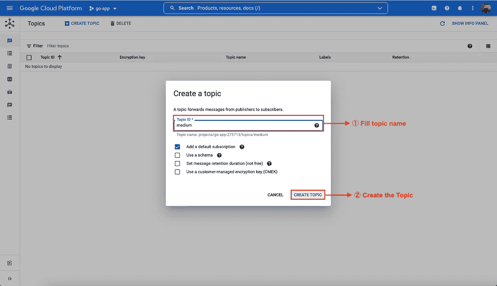

Create a new Topic ID

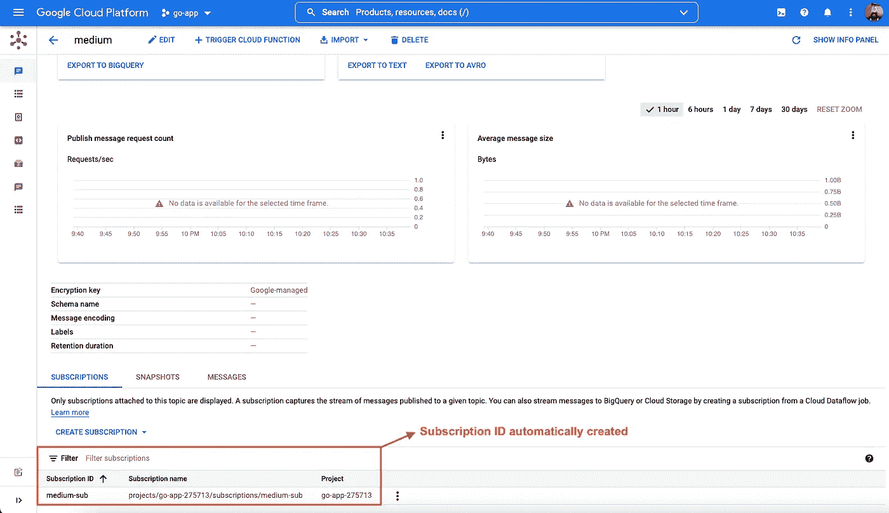

Subscription ID automatically created

# 代码实现

配置完服务帐户和 Pubsub topic+subscriber 之后，就该编码了！

完整的代码可以在我的知识库中找到:

[](https://github.com/moemoe89/go-pubsub) [## GitHub - moemoe89/go-pubsub:我的媒体文章的存储库

### 这个存储库是为我写的关于 PubSub 和 Golang 消息传递的文章准备的。替换(service_account.json)[…

github.com](https://github.com/moemoe89/go-pubsub) 

基本上，publisher 的代码是从官方文档中复制过来的[https://cloud.google.com/pubsub/docs/publisher#go_1](https://cloud.google.com/pubsub/docs/publisher#go_1)

在对 HTTP 服务器做了一些修改后，发布者的最终代码将如下所示:

发布者代码的重要部分是

```
pubsub.NewClient(ctx, projectID)
```

和

```
t.Publish(ctx, &pubsub.Message{
...})
```

这两个代码都将打开到 PubSub 的客户端连接并发布消息。

发布者的代码也从官方文档中复制了这个链接[https://cloud.google.com/pubsub/docs/pull#go](https://cloud.google.com/pubsub/docs/pull#go)

实时订阅的最终代码如下:

对于订阅者来说，重要的代码是相同的，首先是获取到 PubSub 的客户端连接:

```
pubsub.NewClient(ctx, projectID)
```

并且用于接收消息和进行 Ack 动作。Act action 表示对于该订户，消息将被确认，而不会重新传递。

```
sub.Receive(ctx, **func**(_ context.Context, msg *pubsub.Message) {
...msg.Ack()
})
```

# 测试

接下来是测试部分，我们将运行发布者和订阅者，然后发布一条新消息，以检查消息是否被成功接收。

参考我的资源库，复制并粘贴服务账户的私钥到项目的根目录，重命名为`service_account.json`

然后配置存储密钥路径的环境变量:

```
export GOOGLE_APPLICATION_CREDENTIALS=/path/service_account.json
```

使用以下命令运行发布者和使用者:

```
go run ./cmd/publisher/main.go
2022/03/24 11:50:09 server is starting at :8080...go run ./cmd/subscriber/main.go
2022/03/24 11:50:35 subscriber is starting...
```

通过在 web 浏览器上或通过 curl 打开端点[http://localhost:8080/publish](http://localhost:8080/publish)来触发发布消息端点:

```
curl --location --request GET 'http://localhost:8080/publish'
```

成功发布消息后，应该会得到响应:

```
{
 "message": "published message with custom attributes; msg id: 3923499137405184"
}
```

并且应该接收订户:

```
2022/03/24 11:52:47 got data: "Hello world!"
2022/03/24 11:52:47 got attribute: map["origin":"golang" "username":"gcp"]
```

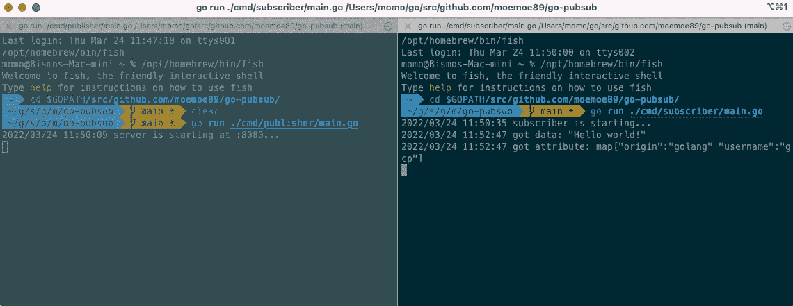

Publisher and Subscriber running and received a message

耶！！PubSub 可以工作，如果我们想添加更多的订阅者，只需通过 Pub/Sub GCP 控制台向主题添加一个新的订阅 id，并使用不同的`subID`运行另一个订阅者服务

# 关闭

通过这个实验，用发布/订阅实现事件驱动架构并不困难。发布/订阅已经提供了系统，我们只需要配置主题、订阅和我们需要的其他配置。

如果我们不想自己管理事件系统；部署、维护、扩展等，选择发布/订阅是一个不错的选择。

谢谢大家！希望这篇文章对你有用！