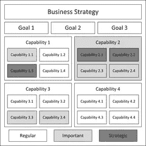
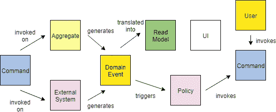
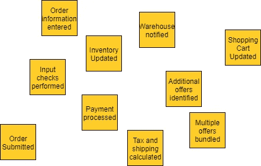
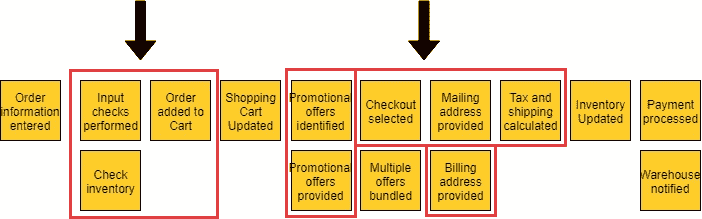
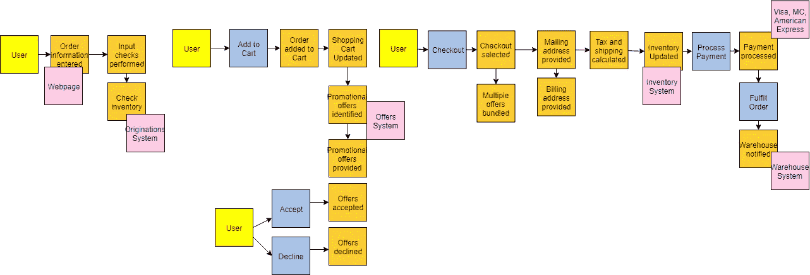
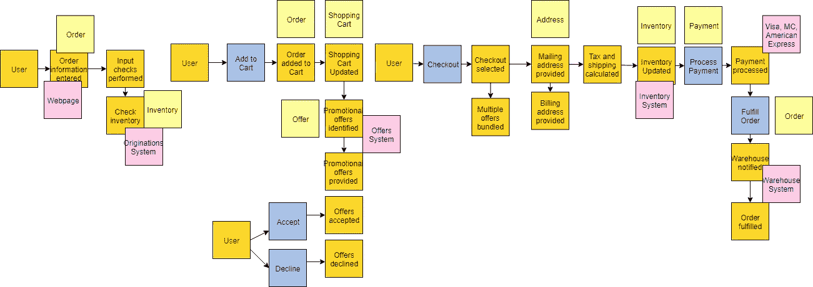
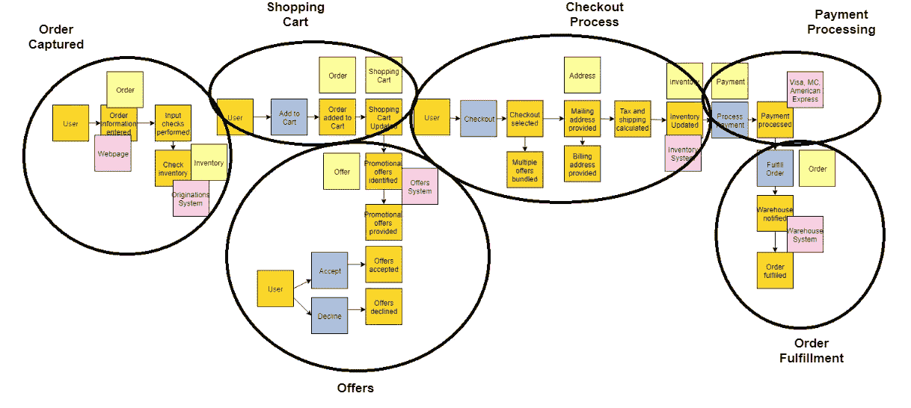
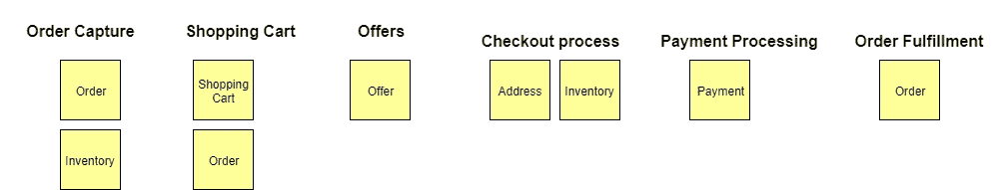
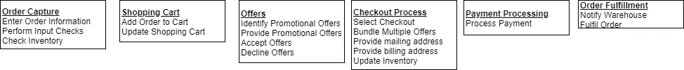

# 用事件风暴分解巨石

> 原文：<https://medium.com/capital-one-tech/event-storming-decomposing-the-monolith-to-kick-start-your-microservice-architecture-acb8695a6e61?source=collection_archive---------0----------------------->

## 启动您的微服务架构

作为软件工程师和架构师，我们经常面临为遗留系统创建目标微服务架构的挑战。这些系统通常是已经存在多年的大型单片应用程序，通常有许多依赖项，并且通常在您的公司中没有一个人了解所有这些。在这些情况下，领域专家的集合是理解围绕业务环境和所需功能的“为什么”的关键，这种环境对于创建成功的架构是至关重要的。

通常，您首先创建一个[业务能力模型](https://en.wikipedia.org/wiki/Business_capability_model)或[分类法](https://en.wikipedia.org/wiki/Taxonomy)来绘制业务能力，并在特定的级别分组下将它们对齐。整个模型/分类法代表了应用程序所需的一组功能。

Business capability model, from [https://en.wikipedia.org/wiki/Enterprise_architecture_artifacts](https://en.wikipedia.org/wiki/Enterprise_architecture_artifacts)

虽然这很有帮助，但也有一些不足之处。分类法本身没有提供用例的更广泛的上下文，也没有提供如何将功能分解为微服务的洞察力。这就是[事件风暴](https://en.wikipedia.org/wiki/Event_storming)可以帮忙的地方。

由 [Alberto Brandolini](https://twitter.com/ziobrando?ref_src=twsrc%5Egoogle%7Ctwcamp%5Eserp%7Ctwgr%5Eauthor) 创建的 event storming 是一种进行[领域驱动设计](https://en.wikipedia.org/wiki/Domain-driven_design) (DDD)的交互方式，它将跨业务和技术部门的领域专家聚集在一起。在本文中，我将提供一个深入的事件风暴迭代示例，一些使用它的经验教训，以及如何将它应用到您的架构工作中。

# 什么是事件风暴

我首先想澄清一些关于事件风暴的常见误解。

## 误解 1——它和 DDD 一样

虽然事件风暴基于许多 DDD 概念，包括有界上下文和集合，但正式的 DDD 可能会很复杂，需要大量的培训。事件风暴侧重于所有领域专家参与的交互式协作白板练习。它更简单，不像正规的 DDD 那样需要大量的训练。

## 误解 2——这和设计思维是一样的

事件风暴和[设计思维](https://en.wikipedia.org/wiki/Design_thinking)都利用了交互式业务流程映射练习和白板。它们的不同之处在于，事件风暴侧重于定义微服务架构的分解和分类。它还关注业务流程中当前正在发生的事情，称为事件。设计思维涉及一个分阶段的过程，包括问题定义、需求发现和基准、构思、原型和测试。也更侧重于换位思考和痛点。

## 事件风暴过程是如何工作的

现在让我们深入事件风暴的细节。首先要理解的一件事是关于领域捕获的不同类型的细节。这些不同类型的详细信息通常由不同颜色的便笺表示。

让我们详细地看一下每一个。

*   **事件(橙色):**这些是事件风暴中最重要和最广泛使用的组件，代表领域事件和与领域专家相关的任何事情。它们是以过去式编写的，提供了为后面的分类步骤提供信息的基础细节。
*   **命令(蓝色):**这些是做某事的请求。它们可能来自用户、系统或其他事件。
*   **系统(粉色):**这些代表域中涉及的系统。它们可以发出命令或接收命令以及触发事件。
*   **用户(黄色):**这些是流程中涉及的人类用户。他们可能是一个人，也可能是一个部门/团队。黄色便笺有助于显示业务流程的工作流有多复杂，这取决于涉及的部门数量和来回的工作量。
*   **Aggregate (tan):** 这是范畴化的第一级，可以认为是一组事件操作的“物”。通常它们是一个名词，当有一系列相互依赖的事件时可以被识别出来。
*   **读取模型(绿色):**这代表对用户或系统做出决策至关重要的数据。我没有经常看到这种用法，但是当需要强调用户看到的数据时，它会很有帮助。
*   **策略(灰色):**这些表示可能需要执行的标准或规则，例如合规性策略的规则。

Legend for Event Storming details

既然我们已经理解了我们想要在领域中发现的不同类型的东西，那么让我们通过一个例子来遍历事件风暴的每个迭代步骤。对于我们的示例，我们将对一个通用电子商务站点的域进行建模。

# 将流程付诸行动

## 第 1 步—事件发现

事件风暴的第一阶段是**事件发现**阶段。基本上，房间里的每个人都在写事件并把它们贴在墙上。像头脑风暴一样对待这个阶段，所以避免在这个阶段应用任何分析或过滤，因为这只会让事情变慢。不要担心，在这个过程中有后面的步骤将清理事情。

这一步通常需要最长的时间，重要的是要留出足够的时间来捕捉事件的基础。以电子商务网站为例，一些可能的事件可能是订单提交、付款处理或库存更新。此阶段的输出示例如下所示:

Example output from step 1 of discovering domain events

## 第 2 步——按顺序排列事件

接下来的一系列步骤通过**将事件按顺序**(通常是从左到右)排列来帮助识别任何遗漏的事件。一旦建立了顺序，您就可以后退来帮助识别其他事件。在我们的电子商务示例中，首先输入订单信息，然后检查库存。在对它们进行排序时，我们发现我们遗漏了一个正在执行的输入检查事件。提示-当多个事件同时发生时，您可以垂直堆叠它们，如下所示:

Example output after identifying missing events (outlined in red) after putting them in sequence

## 第三步——构建更广阔的生态系统

在将事件按顺序排列后，下一步是**通过提出诸如*“是什么触发了事件？”之类的问题，为围绕事件的更广泛的生态系统***建模。是系统吗？一个用户？另一个事件？涉及哪些命令？”这个额外的上下文对于理解领域的当前状态非常有价值。在我们的例子中，用户触发订单信息输入事件，他们通过网页(系统)来完成。

Example output after identifying what triggers the events, the users and systems involved

## 第 4 步—事件的简单分类

在这一点上，所有的详细事件及其相关部分都应该被建模，当你准备进入**分类**时。

第一种分类称为*聚合*。这些是名词，或者是事物，事件对它们起作用。DDD 还有一个*实体*的概念，你可以把它看作是聚合的下一级。根据我的经验，将集合和实体视为同一事物有助于简化事情，使人们更容易理解。在我们的示例中，库存、订单、报价都是*聚合的示例。它们是事件正在操作的事物。*

Example output with aggregates added in

## 步骤#5 —事件的有界上下文分类

现在我们已经为分类的**有界上下文**级别做好了准备。所有相关事件都将落入一个单一的有界上下文中。例如，所有与购物车相关的事件都属于购物车限定的上下文。这里要记住的一个重要微服务概念是*,如果一起改变，就应该一起去。*我们希望尽可能地消除有界上下文之间的依赖性。如果事件之间的语言发生了变化，那么这是一个标志，表明你已经进入了一个不同的有界环境。

例如，当从查看促销优惠转移到结账时，语言会发生变化。这最好在白板上完成，您可以简单地围绕相关事件画一个轮廓，并适当地标记有界上下文。

Example output with bounded context applied

## 第六步——把所有的东西放在一起

现在我们已经完成了事件强攻步骤！现在，您可以使用有界上下文和聚合来理解所需的微服务。通常，有界上下文中的聚合表示一个或多个微服务。

在我们的示例中，订单捕获有界上下文将拥有与订单和库存都相关的微服务。您会注意到订单也存在于购物车绑定上下文和订单执行绑定上下文中。这没关系，因为这表明它们是不同的微服务，因为它们处于不同的有界上下文中。他们可能都在做与订单相关的事情，但他们所做的是不同的。在单片应用程序中，这些将被捆绑在一起产生耦合，但在微服务架构中，我们将它们分开以实现独立。

Example output of what groupings of microservices are needed for the domain

## 附加步骤#7:创建能力

现在，您有了大量的信息来帮助启动您的目标体系结构。根据我的经验，我发现增加一个步骤**从事件**中创造能力是很有帮助的。典型地，能力是现在时态的事件。然后，这些能力可以被映射到各种目标能力架构视图中的有界上下文和集合。这些不同的视图为架构师和工程师提供了构建目标状态的经过深思熟虑的蓝图。

Example output of mapping to capabilities

# 结论

我希望这篇博客对你有所帮助。我已经多次使用这个练习，这是启动微服务现代化工作的一个很好的方式。它有助于将整个公司的各种领域专家聚集在一起，并就所涉及的完整的端到端业务流程对每个人进行培训。借助事件风暴，您可以将领域分解成小块，然后重新组装成您想要定义的目标微服务架构。

所以向前去分解那块巨石吧！

*披露声明:2019 首创一。观点是作者个人的观点。除非本帖中另有说明，否则 Capital One 不隶属于所提及的任何公司，也不被这些公司认可。使用或展示的所有商标和其他知识产权是其各自所有者的财产。*