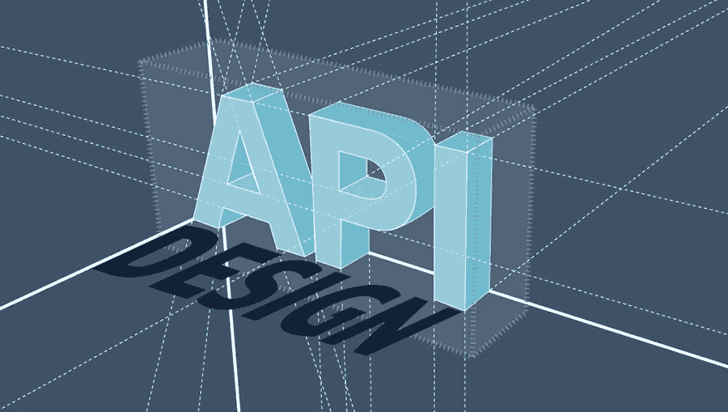
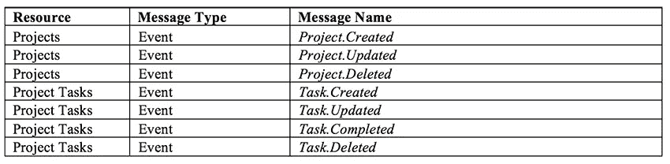

# 事件流:补充 API 设计的另一种架构风格

> 原文：<https://medium.com/capital-one-tech/event-streaming-an-additional-architectural-style-to-supplement-api-design-703c4f801722?source=collection_archive---------0----------------------->

基于 web 的 API 的增长和采用是任何企业转型技术之旅的关键。这些 API，无论是否是 RESTful 的，都保持同步。像 web 一样，它们利用 HTTP 模式来实现请求-响应交互方法。

举例来说，假设我们有一个具有以下交互的项目管理 API:

1.  创建项目(例如文章/项目)
2.  创建新任务(例如 POST/projects/{ projectId }/tasks)
3.  将任务分配给我们团队中的某个人(例如，POST/tasks/{ taskId }/assignee)
4.  工作负责人将任务标记为完成(例如，PUT /tasks/{taskId})

如果用户界面的设计很好地反映了这些端点，那么遵循这种设计的 API 就可以工作。但是假设一个额外的应用程序需求是在另一个用户标记完成时“自动”更新任务的状态。对于请求/响应 web-API，一种选择是不间断地轮询状态 API，以防状态发生变化。这既麻烦又容易出错。

代替轮询，我们可以引入一个**事件驱动的架构**。

## 事件驱动架构简介

在事件驱动架构(EDA)中，应用程序由独立的组件组成，这些组件对其他组件发布的事件做出反应。EDA 在分布式应用中很受欢迎，因为可以在解决方案中引入新组件来解决新出现的问题，而无需了解以前开发的组件。消息代理被用作通信的中介，通过防止组件之间直接通信来产生松散耦合的设计。

如果你熟悉面向服务的架构(SOA)，你就经历过 EDA。大多数面向服务的架构使用企业服务总线(ESB)进行服务通信，而不是消息代理。事件被发布到 ESB，然后被路由到其他服务以集成两个或更多的软件系统。然而，ESB 被证明是有问题的，因为它们被用作“集成粘合剂”，导致集成代码分散在服务、应用程序和 ESB 中；脆弱的系统被创造出来。这种脆弱性产生了团队之间更大的协作需求，减缓了软件交付。

## 微服务和事件驱动架构的出现

为了克服这种增加的协调，引入了微服务架构作为传统 SOA 的替代。这种基于 API 和微服务的新型分布式架构鼓励“哑管道、智能端点”集成逻辑被推给消费者和生产者。消息代理，而不是 ESB，用于消息路由，而不是集成逻辑。服务和 API 相互对话，同时隐藏实现细节。随着新需求的出现，这种松散耦合使得软件更能适应演化。

随着企业转向由微服务架构支持的 API，发布的事件数量大幅增长。消息代理本质上通常是事务性的，确保一次且仅一次的消息传递。虽然对于传统的软件开发很有用，但是消息代理的事务性质限制了服务通信的可伸缩性。

分布式流数据平台，如 [Apache Kafka](https://kafka.apache.org/) ，现在为企业提供了比传统消息代理更高的吞吐量。Kafka 不再需要消息代理中的事务性消息传递，而是选择将事件转化为消息流。这些流可由任何授权用户访问，并且可以从预定位置或在流的开始处被实时访问或顺序处理。

## 使用事件流的 API 设计

事件流帮助软件扩展到 REST、GraphQL 和 gRPC 等 web API 风格常见的请求-响应方法之外。软件可以双向通信，消除了 API 消费者不断轮询状态变化的需要。相反，API 将事件发布到事件流中，以便将数据更改或重要的业务事件通知给任意数量的订阅服务进行进一步处理。

让我们重温一下我们之前的例子。我们需要解决两个独立的需求:

1.  任务标记为完成时的通知。如果没有消息驱动的架构，我们唯一的选择就是要求相关方不断地调用 API 来查看任务是否已经完成(也就是轮询)
2.  当任务被修改或标记为已完成时提醒项目所有者。我们唯一的选择是，通过让 API 发送电子邮件，将我们的用户界面问题与我们的 API 混合起来。API 不再负责管理项目和任务，它现在负责电子邮件提醒的内容和外观

如果我们将消息驱动的架构引入到我们的解决方案中，我们可以开发一个 API 来交付提供必要功能(创建、读取、更新、删除和标记为完成)的项目和任务资源。我们的 API 不需要知道如何使用任务完成事件通知，包括发送电子邮件。它需要做的只是在事件发生时发布事件消息，并允许其他服务采取适当的行动。此 API 可能发布的事件包括:

感兴趣的团体可以订阅他们感兴趣的事件，并安全地忽略其他事件。在我们的例子中，我们可能最终有三个组件

1.  **项目 API** —通过基于 REST 的 API 管理项目和项目任务资源。API 可能由一个或多个微服务组成，这些微服务实现 REST API 提供的功能。当上表中的任何事件发生时，API 会将事件发布到适当的消息流中，供事件订阅者使用
2.  **任务完成邮件微服务** —订阅*任务。完成*事件，当任何任务被标记为完成时，通过电子邮件通知项目经理
3.  **任务修改邮件微服务** —订阅*任务。更新了*事件，当任何任务被编辑时，通过电子邮件通知所有团队成员

API 不知道订阅特定事件的两个微服务；它只是将事件发布到适当的消息流中。该解决方案被认为是松散耦合的，因此能够随着新需求的出现而不断发展，可能会出现新类型的通知(例如 SMS、web dashboard alerts)或集成(例如同步到 JIRA)。

## 结论

对更健壮的软件通信方法的需求正在推动当今接口解决方案的极限。基于请求/响应的 API 至关重要。然而，今天的技术问题现在需要事件驱动的支持——除了请求/响应之外——来改进 API 的功能提供。

作为 API 设计者，我们必须努力使用所有可用的工具来提供更好的开发者体验。随着现有 API 的增强和新 API 的出现，问问自己:

1.  我的解决方案架构如何通过超越标准 REST APIs 并进入松耦合的事件驱动架构来改进？
2.  我的 API 应该发布哪些对 API 消费者有益的事件？
3.  我的 API 消费者将如何从这些事件的添加中受益，他们如何利用这些事件？

让我们将我们的方法从严格的请求-响应转变为思考我们的 API 如何不仅可以为请求提供端点，还可以为使 API 能够推送到其他服务的事件提供端点。结果将是在我们的业务线内部和之间增加创新和更具变革性的 API。

# 有关系的

*   [在 Web APIs 和消息流之间选择](/capital-one-developers/choosing-between-rest-web-apis-and-message-streaming-8e2f4813a058)
*   [设计演化事件流的 5 个原则](/capital-one-developers/5-principles-for-designing-evolvable-event-streams-f32e90dcbb79)
*   [API 产品所有权是 API 采用的关键](/capital-one-developers/api-product-ownership-is-key-for-api-adoption-6a12c64b2c83)

k

*披露声明:这些观点是作者的观点。除非本帖中另有说明，否则 Capital One 不属于所提及的任何公司，也不被其认可。使用或展示的所有商标和其他知识产权均为其各自所有者所有。本文为 2018 资本一*。