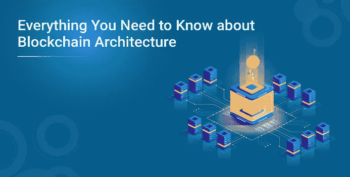
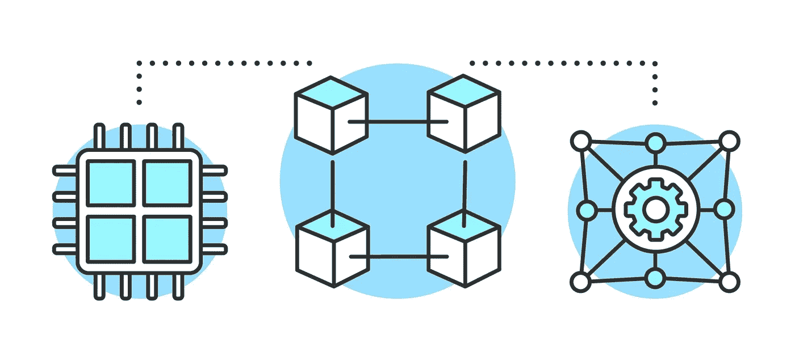
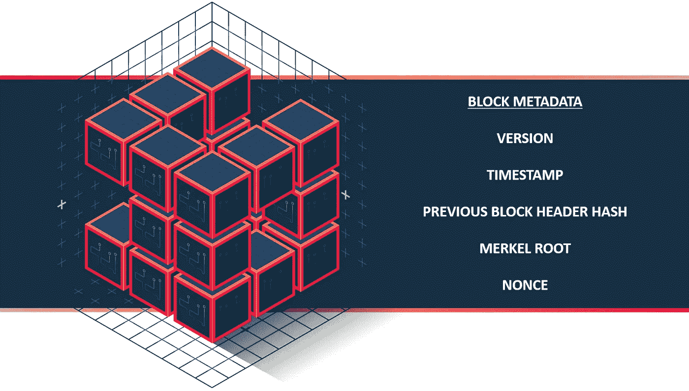
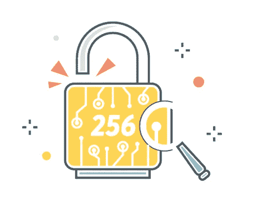
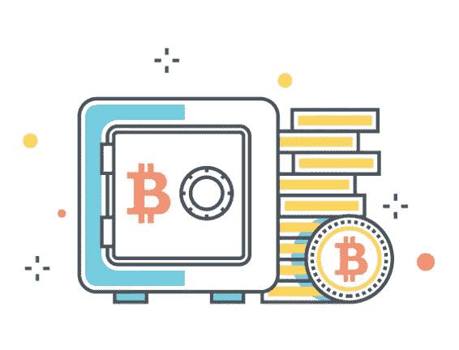

# 关于区块链架构你需要知道的一切

> 原文：<https://medium.com/edureka/everything-you-need-to-know-about-blockchain-architecture-9164a6f0ab85?source=collection_archive---------4----------------------->

*为什么叫* [*区块链*](https://www.edureka.co/blog/how-blockchain-works/) *？* —这是因为它将交易数据存储在块中，这些块链接在一起形成一个链。随着交易数量的增长，区块链的规模也在增长。为了更清楚地了解这个辉煌的发明，让我们来讨论它的架构。不同的公司对架构组件进行了归纳和修改，从而产生了不同的区块链项目，如比特币、以太坊、超级账本等。在这篇博客中，为了简单起见，我们将讨论比特币区块链架构。

下面是体系结构组件的列表:

*   交易
*   街区
*   P2P 网络
*   一致性算法

在讨论架构之前，让我们先弄清楚一些事情:

*   区块链不是比特币；区块链是比特币背后的技术。
*   比特币是数字代币或加密货币，而区块链是记录这些数字代币交易的总账。
*   没有区块链的比特币是不可能的，但是你可以拥有没有比特币的区块链。

# 交易

交易是区块链系统的最小组成部分。它们通常由收件人地址、发件人地址和值组成。它类似于标准的信用卡对账单。所有者通过对哈希进行数字签名来传输值，哈希是通过添加以前的事务和接收者的公钥而产生的。

然后向网络公开宣布该事务，并且所有节点独立地持有它们自己的区块链副本，并且当前已知的“状态”是通过按区块链中出现的顺序处理每个事务来计算的。事务以块的形式捆绑并交付给每个节点。随着新事务在整个网络中分发，它们由每个节点独立验证和“处理”。每个事务都有时间戳，并收集在一个块中。

# 街区

块包含作为块标题和事务的信息。块是数据结构，其目的是捆绑事务集，并被复制到网络中的所有节点。区块链的砖块是由矿工创造的。挖掘是创建将被网络的其余部分接受的有效块的过程。节点接受挂起的事务，验证它们在密码上是准确的，并将它们打包成块存储在区块链上。块头是帮助验证块有效性的元数据。块元数据的内容如下图所示

块的其余部分包含事务。它可以是捆绑在一个块中的任意数量的事务，这取决于矿工的选择。

# 块的类型

1.  大多数块只是扩展了当前的主区块链，这也是网络中最长的链。这些块被称为**“主分支块”**。
2.  一些块参考不在最长区块链的父块。这些块被称为**、【侧支块】、**。
3.  一些块引用处理该块的节点不知道的父块。这些被称为**【孤块】**。

分支分支块目前可能不是主分支的一部分，但是如果挖掘出更多将它们作为父分支的分支分支块，则有可能将特定的分支分支重新构造为主分支。这就带来了分叉的概念。

# P2P 网络

区块链是一个基于 IP 协议的对等(P2P)网络。P2P 网络是没有集中节点的平面拓扑。所有节点在通过一致算法协作的同时平等地提供和消费服务。对等体贡献了维护网络所需的计算能力和存储。P2P 网络通常更安全，因为它们不像集中式网络那样具有单点攻击或故障。区块链网络可以是基于许可的网络，也可以是无许可的网络。无许可网络也被称为公共区块链，因为任何人都可以加入网络，而基于许可的区块链被称为区块链联盟。基于许可的区块链或私有区块链需要对网络内的参与者进行预先验证，并且这些参与者通常彼此都知道。在典型的区块链体系结构中，网络中的每个节点都维护区块链的本地副本。区块链架构的去中心化是它所基于的 P2P 网络的唯一优点。

# 一致性算法

单个分类账的所有这些副本同步的方式是由于一致的算法。共识机制确保无论每个个体方具有什么本地副本，它们都是彼此一致的并且是最新的副本。每个单独节点具有的拷贝彼此相同或相似。可以说共识算法构成了每一个区块链架构的核心。下面讨论一些共识算法:

# 工作证明

它包括解决一个具有计算挑战性的难题，以便在区块链网络中创建新的块。它基本上包括猜测产生 256 位散列的字符串，该散列由流行的散列算法 SHA256 产生。散列算法是不可逆的这一事实是这种达成共识的方法的基本支柱。因为有人必须通过一百万次猜测来验证散列，所以这个过程被称为“工作证明”。

# 股权证明

在这种情况下，节点被称为验证器。他们验证交易以赚取交易费。随机选择节点来验证块，并且这种随机选择的概率取决于特定节点拥有的赌注的数量。

# 简化的拜占庭容错(SBFT)

这里的基本思想涉及一个单一的验证器，它捆绑提议的事务并形成一个新的块。这里的验证者是已知的一方，因为分类帐具有基于许可的性质。作为网络中最小数量的其他节点校正新块的结果，达成了共识。

*这就把我们带到了这篇“区块链架构”博客的结尾。如果您希望学习区块链并在区块链技术方面建立职业生涯，请查看我们的* ***区块链认证培训*** *和* ***以太坊开发者课程*** *，该课程带有讲师指导的现场培训和真实项目体验。该培训将帮助您深入了解区块链，并帮助您掌握该主题。*

如果你想查看更多关于人工智能、DevOps、道德黑客等市场最热门技术的文章，那么你可以参考 [Edureka 的官方网站。](https://www.edureka.co/blog/?utm_source=medium&utm_medium=content-link&utm_campaign=blockchain-architecture)

请留意本系列中解释区块链其他各方面的其他文章。

> *1。* [*以太坊教程*](/edureka/ethereum-tutorial-with-smart-contracts-db7f80175646)
> 
> *2。* [*以太坊专用网络*](/edureka/ethereum-private-network-tutorial-22ef4119e4c3)
> 
> *3。* [*什么是智能合约？*](/edureka/smart-contracts-301d39565b76)
> 
> *4。* [*坚固性教程*](/edureka/solidity-tutorial-ca49906bdd47)
> 
> *5。* [*松露以太坊教程*](/edureka/developing-ethereum-dapps-with-truffle-7533289c8b2)
> 
> *6。* [*最好的以太坊开发工具*](/edureka/ethereum-development-tools-7175503a1ac7)
> 
> *7。* [*超帐面料*](/edureka/hyperledger-fabric-184667460-edc184667460)
> 
> *8。* [*Hyperledge vs 以太坊*](/edureka/hyperledger-vs-ethereum-bdc868e10817)

*原载于 2019 年 5 月 22 日*[*【https://www.edureka.co】*](https://www.edureka.co/blog/blockchain-architecture/)*。*