# 通过分组和自动创建规则来防止垃圾邮件

> 原文：<https://medium.com/pinterest-engineering/evita-el-spam-mediante-la-agrupaci%C3%B3n-y-la-creaci%C3%B3n-autom%C3%A1tica-de-reglas-e7ed982949ea?source=collection_archive---------1----------------------->

Cathy Yang | 软件、信任与安全工程师

这篇文章最初发表在 英语;Read the English version [here](/pinterest-engineering/fighting-spam-using-clustering-and-automated-rule-creation-1c01d8c11a05)

在 Pinterest,我们的首要任务之一是确保用户的安全,包括保护他们免受垃圾邮件的侵害。信任和安全团队的目标不仅仅是检测垃圾邮件,而是尽快将其删除,以尽量减少对用户的影响。

垃圾邮件发送者的目标是赚钱,最好的方法是大规模发送垃圾邮件。这是一场数字游戏:一百万封垃圾邮件比一封更有效。为了快速消除垃圾邮件,我们分析了垃圾邮件攻击的常见趋势,以识别可疑行为。

为了达到有效的规模,垃圾邮件发送者必须自动化他们的行动,这些“攻击”中的每一个都可以被视为一个群体。攻击组内的每个事件可能有一些共同特征,但不同的攻击组将有一组不同的共同特征。

例如,在创建大量引脚的攻击期间,垃圾邮件发送者可以将所有引脚指向同一域。虽然域名可能会在攻击之间发生变化,但垃圾邮件发送者仍会尝试将流量定向到同一个垃圾邮件站点。

我们的垃圾邮件缓解策略之一是我们的规则引擎[Guardian](https://www.google.com/url?q=https://medium.com/pinterest-engineering/fighting-spam-with-guardian-a-real-time-analytics-and-rules-engine-938e7e61fa27&sa=D&source=editors&ust=1627498623933000&usg=AOvVaw3tryvs-vf738pXm6hIUaNy),它有助于识别垃圾邮件攻击中的常见特征。

# 动机

以前,当发生垃圾邮件攻击时:

*   我们系统的统计仪表板将触发警报,可用的分析师将对其进行调查
*   分析师将确定攻击的共同趋势
*   分析师将创建一个“补丁规则”(用于处理攻击的特定和临时规则),然后追溯应用它来捕获旧的和未来的垃圾邮件发送者。

这个过程有许多问题,原因有很多:分析师需要大量的手动工作,垃圾邮件攻击和我们的响应之间存在延迟,并且对用户造成潜在的负面影响。

但是,如果我们能够自动检测大量垃圾邮件发送者的行为,找到每个组中的共同特征,创建这些补丁规则并检测这些类型的垃圾邮件攻击,会发生什么?

# patch 规则

补丁规则被设计为具有较短的持续时间,并且对攻击非常具体。以下是修补程序规则的示例,旨在禁用垃圾邮件用户:

1.  成为新账户
2.  使用 Android 设备创建 Pines
3.  以“Check out our website”开头的引脚描述

此规则对于检测垃圾邮件攻击非常有效,并且不太可能影响实际用户。在我们的自定义 SQL 变体 GSQL 中,规则如下所示:

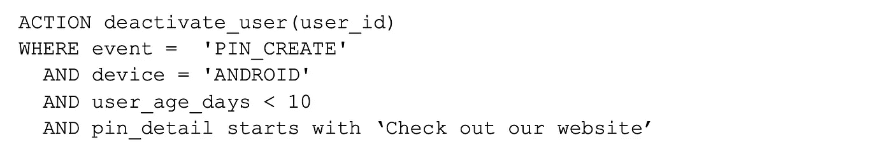

Guardian 使创建类似 SQL 的规则变得更加容易。只需使用*where*子句,我们就可以禁用具有这些条件的用户。要自动创建此类规则,我们只需要关注 [ *where* 子句或禁用用户的条件。

如上所述,大多数简单的攻击都有一些共同的特征,即使它们使用不同的帐户。因此,我们的目标是获得一组用户的共同特征。

# 异常检测和分组

检测垃圾邮件攻击活动爆发的策略之一是检测时间序列异常。异常检测对于检测极有可能成为垃圾邮件的点活动(如图 1 所示)非常有用。

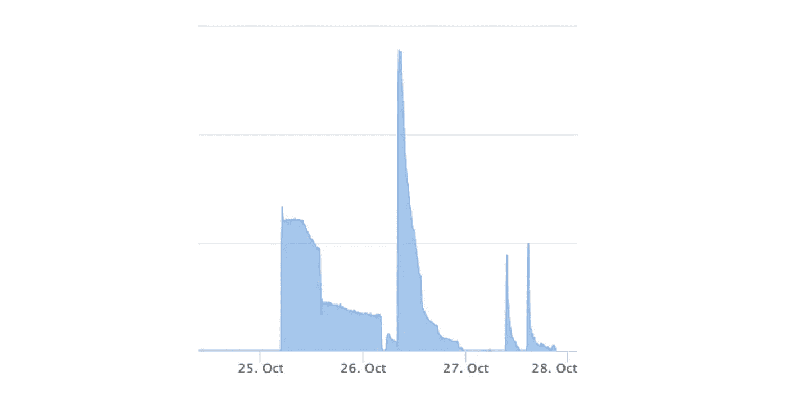

Figura 1: Actividades pico

在 Pinterest,我们有一个内部实时异常检测系统。我们将为模型提供一系列可以从中学习的临时事件。如果模型的预期值与给定门槛上的实际值不同,则存在异常。

但是,如果我们对具有所有特征的所有事件的时间序列进行异常检测,则正常用户活动会产生过多的噪音,并且异常检测算法可能会忽略爆发。

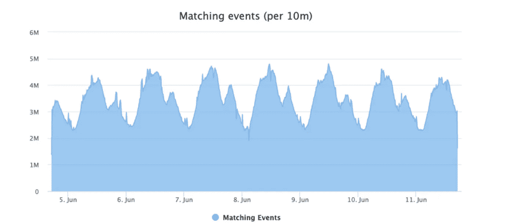

Figura 2: Mucho ruido en toda la actividad de los usuarios

相反,我们警告某些类型的事件具有某些特征。例如,我们可能会对 IP 地址、引脚详细信息、地理位置或其他特征进行异常检测,以提醒您有关引脚创建事件的信息。目标是限制我们想要分组的事件,而不会从正常的用户活动中引入太多噪音。

以按城市划分的 Pines 创建时间序列为例:

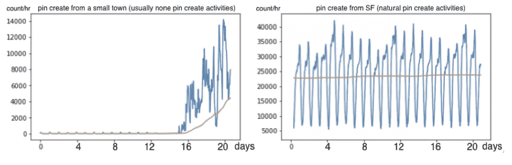

Figura 3: Eventos anormales de creación de Pines en una pequeña ciudad que no suele tener este tipo de actividades frente a los eventos normales de creación de Pines en San Francisco
Línea amarilla: modelo de recuento esperado por hora. Línea azul: recuento real de eventos de creación de Pines por hora.

左侧的图表显示,Pines 创建事件的数量在突然增加之前已经接近零了相当长的一段时间。由于计数与平均值相比增加太多,我们的异常检测算法告诉我们,在此期间,该城市的引脚创建事件非常可疑。这减少了我们在这段时间内对事件的关注。接下来,我们收集相关数据并将其存储在 S3 中,以便进一步分组。

## **组合(T5)**

分析我们存储在 S3 中的数据的目的是查找共享特定模式的用户,因为这些用户很可能来自垃圾邮件活动。这个想法是:

*   按感兴趣的特征分组:如果我们按域分组,我们将有一个 *google.com*组,一个 *instagram.com*组,一个 *somethink.gr*组,等等。
*   对于每个组,我们观察所有其他感兴趣特征的值分布。
*   我们知道,如果有具有主导值的特征(例如,该组中 95%的 IP 是 1.1.1.1)就会有一个组。

我们看到许多垃圾邮件发送者试图通过创建链接到他们自己的域的多个引脚来引导用户访问他们的网站。在下面的例子中,假设我们感兴趣的特征是 Pin 域:

1.  异常检测告诉我们,从今天下午 1 点开始,城市 A 有一个异常。
2.  我们查询并获取该时间段内的所有数据,然后按域对其进行分组

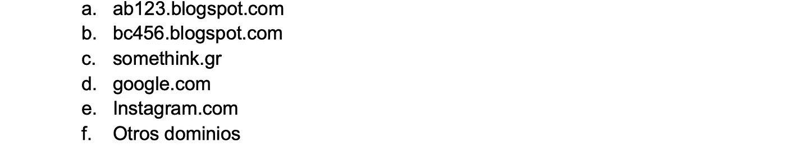

3.对于每个域,我们计算各种其他特征的数据分布,如 IP,帐户年龄和 Pin 详细信息。然后,我们将知道具有该特征的每个值发生的频率。

a.对于 *ab123.blogspot.com 对于* :

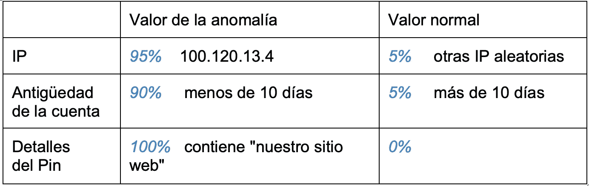

b.将上述结果与已知的受信任域进行比较,例如 *google.com* :

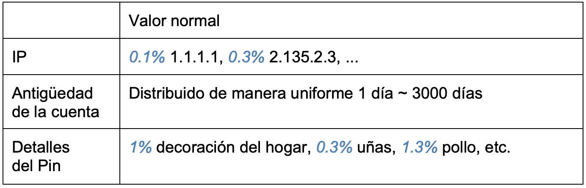

4. *Google.com* 是一个受信任的域名。所有感兴趣的特征都有良好的随机分布。但是,域名*ab123.blogspot.com*有三个主要特征:

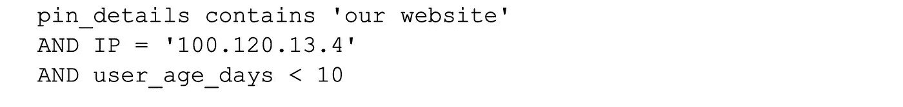

5.现在,我们可以使用 GSQL 创建一个规则,其中包含我们在 Guardian 中编写规则的所有条件:

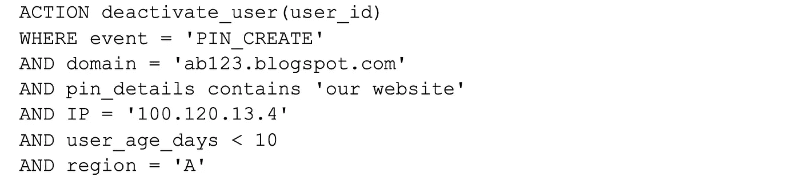

6.其他一些条件也可能有助于减少误报,例如仅当超过 10 个用户符合条件时才创建规则,或者仅当他们创建了 100 个以上的引脚时才创建规则。我们还可以使条件组成为正则表达式的模式,例如*“^[a-zA-Z]+[0-9]+[。[博客]。]com$”* ,而不是精确的域名。

# 评价结果

## **代理人审查**

正常用户在特定时间段内有类似的模式是很少见的。如果集群的大小不是很大,那么用户仍然有可能很好。为了减少误报的影响,我们将分组给我们内部内容审查工具[PinQueue](/pinterest-engineering/introducing-pinqueue3-0-pinterests-next-gen-content-moderation-platform-fcfa972bf39c)的*示例用户发送给*,以便代理可以在触发规则之前评估规则的准确性,并允许其独立地对用户采取行动。

## **在 Guardian 中创建规则**

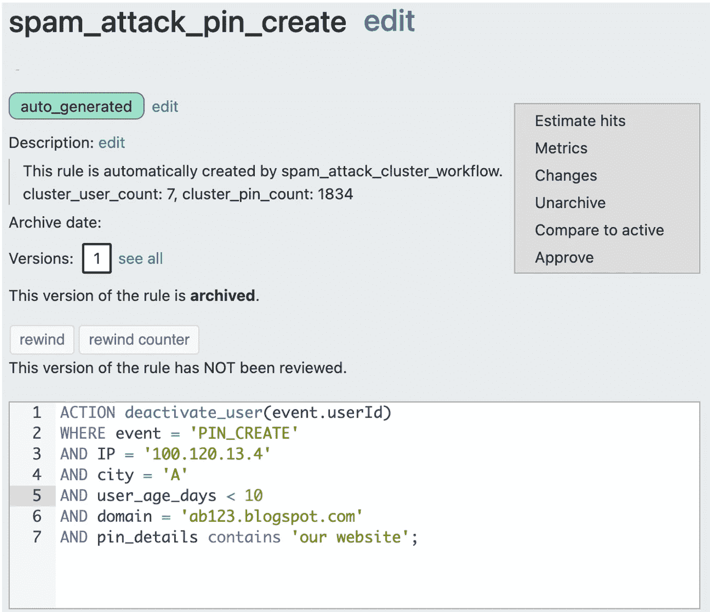

Figura 4: Regla creada automáticamente

一旦我们确定规则的准确性符合我们的标准,我们就会将其添加到 Guardian 中。

## **在特定时间后存档**

由于这些规则旨在暂时缓解特定的垃圾邮件攻击,因此我们会在一段时间后存档补丁规则;通常当我们看到攻击停止时。这不仅涉及良好的管理,而且还限制了任何误报的曝光。如果我们不存档补丁规则,将来可能会有一个好的用户满足所有这些条件并意外关闭。

## **垃圾邮件发送者会变异,但我们可以自动创建新的补丁规则。(T9 )**

当垃圾邮件发送者发现使用此 IP 不再有效时,他们可能会通过购买其他 IP 或其他域名来重试。但是,只要有一些模式,我们可以自动创建新的补丁规则。

# 摘要

借助异常检测、分组和自动规则创建,我们现在可以快速响应并检测大多数垃圾邮件攻击并采取措施。图 4 显示了该过程的概述:

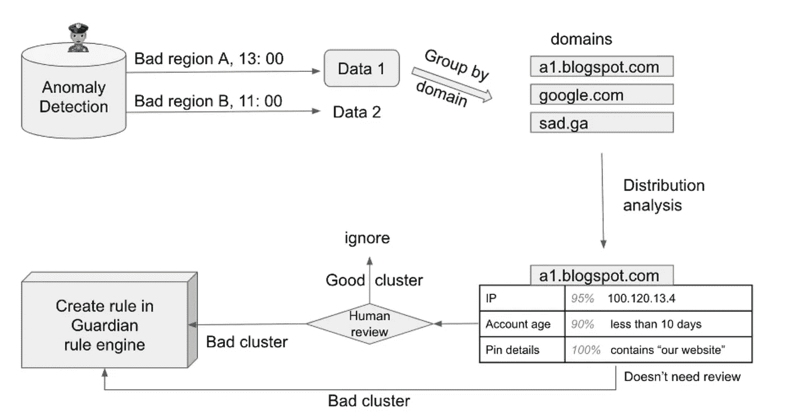

Figura 4: Diagrama de creación de reglas automatizadas con detección de anomalías

# 致谢

这个博客条目是在 Harry Shamansky 和 Kate Flaming 的帮助下实现的。感谢嘉其顾开发异常检测系统。还要感谢 Preston Guillory、Hongkai Pan、Rundong Liu、Alok Singhal、Dennis Horte、Carmen Dekmezian、Weiqi An、Yuanfang Song 以及我们信任和安全团队的其他成员提供帮助和建议。

*有关 Pinterest 工程的更多信息,请查看我们的* [*工程博客 [*](https://medium.com/pinterest-engineering) *并访问我们的* [*Pinterest Labs*](https://www.pinterestlabs.com?utm_source=medium&utm_medium=blog-article&utm_campaign=yang-october-7-2021&utm_content=content) *网站。如需查看和申请职位,请访问我们的* [*工作*](https://www.pinterestcareers.com?utm_source=medium&utm_medium=blog-article&utm_campaign=yang-october-7-2021&utm_content=content) *页面。(T19)*