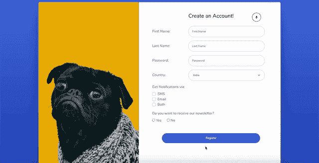

# 形态的进化——语音化的方式！

> 原文：<https://medium.com/globant/evolution-of-forms-voice-enabled-way-78f6ca2d0561?source=collection_archive---------0----------------------->

Smart Form

> 如果我们可以通过对着我们的机器说话，或者在享用我们的小吃，或者做一些家务(例如免提)来访问网络，那将是多么酷和方便啊！！听起来确实很神奇，不是吗？想象一下，对于不同能力的人来说，像这样不间断地访问网络会有多大帮助。

> 组件是 UI 的构造块，如果组件具有更好的可访问性规定，则整个 UI 的可访问性会得到提高

> 这个世界已经通过 Alexa、Google Home、Siri 等产品体验到了这种便利。

面对这一挑战，我们提出了一个语音识别 API 的**样本，这个 API 建立在**speecher recognition**web 语音 API 的基础上，它是浏览器自带的，易于使用。**

这个语音识别 API 的目标是 HTML 的本地元素，并使其支持语音，如单选按钮、输入框、下拉框、按钮等。

因此，在这个 API 的帮助下，我们开发了一个**语音注册表单的基本用例**，用户可以在不触摸键盘或鼠标的情况下填写整个表单，这将我们带到了 UI 访问的下一个级别。

# 在观看演示之前，让我们先了解一下支持语音的组件的一些基本概念

> **speech recognition 是如何在浏览器上实现语音识别的？**

*Web Speech API 已包含在选定的浏览器中。这个 API 公开了“SpeechRecognition”接口，对于 chrome 这样的浏览器，该接口借助基于服务器的识别引擎将语音转换为文本。结果在写的时候，* ***离线就不行了。***

您还可以查看[浏览器兼容性表](https://developer.mozilla.org/en-US/docs/Web/API/SpeechRecognition#Browser_compatibility)以了解对该本地 API 的支持

> **语音识别 API 的样本是什么？**

**语音识别 API 样本**是一个自定义库，由 **Globant India** 的 smart UI initiative 团队开发，在 **UINxt** 2020 事件中演示。

该 API 构建在 Vanilla js 中，位于 [Web Speech API](https://developer.mozilla.org/en-US/docs/Web/API/Web_Speech_API) 之上，并利用了 **SpeechRecognition** 接口的各种方法，例如

[**speech recognition . start()**](https://developer.mozilla.org/en-US/docs/Web/API/SpeechRecognition/start)**:**启动语音识别服务，侦听输入的音频，以识别与当前 speecher recognition 相关联的语法。

[**speecher recognition . stop()**](https://developer.mozilla.org/en-US/docs/Web/API/SpeechRecognition/stop)**:**停止语音识别服务侦听传入的音频，并尝试使用目前捕获的音频返回一个[speecher recognition 结果](https://developer.mozilla.org/en-US/docs/Web/API/SpeechRecognitionResult)。

[**speechrecognition . abort()**](https://developer.mozilla.org/en-US/docs/Web/API/SpeechRecognition/abort)**:**停止语音识别服务侦听传入的音频，并且不尝试返回[speechrecognition result](https://developer.mozilla.org/en-US/docs/Web/API/SpeechRecognitionResult)。

以及诸如以下事件，

[**错误**](https://developer.mozilla.org/en-US/docs/Web/API/SpeechRecognition/onresult) :发生语音识别错误时触发，也可通过 on error 属性获得

[**speechend**](https://developer.mozilla.org/en-US/docs/Web/API/SpeechRecognition/onresult) :当语音识别服务识别的语音停止被检测时触发，也可通过 onspeechend 属性获得

> 借助于 **SpeechRecognition** API 方法和事件，语音识别 API 的**示例可以针对 HTML 的原生 UI 元素，并继承其属性，使其支持语音**

# 好了，理论到此为止，让我们动手吧！我们开发人员喜欢的方式！

在这里，您可以在您的浏览器代码中找到语音识别的基本设置，在此设置的帮助下，您可以实现几个支持语音的用例。

首先设置 speechRecognition 对象

然后检查浏览器中的演讲识别功能是否可用？

创建 SpeechRecognition 实例

一旦识别实例可用，您就可以通过简单的调用来启动语音识别

现在您可以实现它的基本方法来执行基于语音的操作

为 HTML 的原生元素启用语音的所有过程都在这里进行，比如说，在这个方法的帮助下，可以为你的应用程序创建一个启用语音的表单

如果你想让识别继续其功能，那么你可以简单地通过转动一个标志。

这样，您可以自动重新开始识别，而无需任何手动过程。

因此，让我们把这些放在一起，在您的应用程序中形成一个基本的语音识别设置

# 现在，来点真的！终极试玩！看看这个

Voice-enabled Registration Form

> 我们能够使用浏览器的语音识别 API，并以非常基本的方式实现它，用于演示目的。当然，我们可以在更多的事情中使用它，让事情完全不用手。我们的梦想之路！