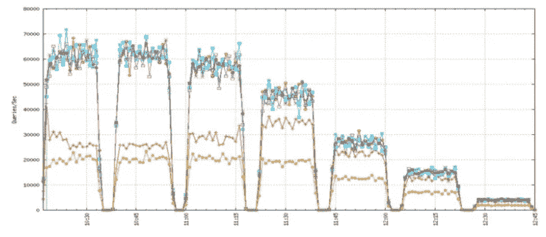

# 发展 MySQL 压缩—第 1 部分

> 原文：<https://medium.com/pinterest-engineering/evolving-mysql-compression-part-1-7f8b09666589?source=collection_archive---------0----------------------->

Robert Wultsch | Pinterest 工程师

Pinterest 基础设施工程师管理着超过 750 亿个 Pins 不断增长的人们兴趣、想法和意图数据库中的动态对象。Pin 作为一个 1.2 KB 的 JSON blob 存储在[分片的 MySQL 数据库](https://engineering.pinterest.com/blog/sharding-pinterest-how-we-scaled-our-mysql-fleet/)中。几年前，随着我们的快速发展，我们的分片 MySQL 数据库空间不足，必须做出改变。一种选择是扩大硬件规模(以及我们的支出)。我们选择的另一个选项是使用 MySQL InnoDB 页面压缩。这花费了一点延迟，但是节省了磁盘空间。然而，我们认为我们可以做得更好。因此，我们创建了一种新形式的 MySQL 压缩，现在可供 Percona MySQL Server 5.6 的用户使用。


## JSON 对开发者是高效的，对机器不是

作为一家小型初创公司，Pinterest 在没有一名专门负责维护和维护 MySQL 的工程师的情况下，构建了自己的 MySQL 环境，并将其扩展到数千万个 Pinners。这证明了 MySQL 的易用性，但这也意味着重要的改变是不切实际的。特别是，如果没有专门工具的知识，向 MySQL 表添加列是不可能的，比如来自 [Percona](https://www.percona.com/doc/percona-toolkit/2.2/pt-online-schema-change.html) 、 [GitHub](http://githubengineering.com/gh-ost-github-s-online-migration-tool-for-mysql/) 或(我最喜欢的，因为我帮助构建了它)[脸书](https://www.facebook.com/notes/mysql-at-facebook/online-schema-change-for-mysql/430801045932/)的在线模式更改脚本。

将几乎所有 Pin 数据存储在 JSON blob 中解决了无法向 MySQL 表添加列的问题。这种灵活性是以存储效率为代价的。例如，我们将名为“uploaded_to_s3”的字段存储为布尔值。如果我们在 MySQL 中将它存储为一个布尔值，这个字段将只使用 1 个字节。使用下面的 JSON 表示，我们将 24 个字节写入磁盘，主要是因为字段名存储在 JSON blob 中。大约 20%的插针大小来自字段名。

boolean uploaded_to_s3 如何存储在 JSON 中

```
, ‘"uploaded_to_s3": true
```

## InnoDB 页面压缩

按照正常配置，InnoDB 以 16KB 的页面“思考”,并试图压缩用户定义数量的页面，并将它们推到单个页面的空间中。(要深入了解 InnoDB 页面压缩是如何工作的，我建议阅读这些[好文档](https://dev.mysql.com/doc/refman/5.6/en/innodb-compression-internals.html)。)

然而，我们发现 InnoDB 页面压缩有几个明显的缺点:

*   InnoDB 的缓冲池(它的内存缓存)存储压缩和未压缩的页面。如果一个页面中的数据被相对快速地反复读取，这是很有帮助的，因为数据不需要多次解压缩，但是这并不节省内存。在我们的例子中，我们在 MySQL 前面有一个重要的缓存层(由 [Mcrouter](http://www.slideshare.net/InfoQ/building-highlyresilient-systems-at-pinterest) 管理),所以重复读取的情况很少发生。
*   基本的工作单元仍然是一个 16KB 的页面。这意味着，如果要压缩的一组页面不适合 16KB 或更少，压缩将失败，并且不会实现任何节省。这还意味着，如果表的压缩率配置为 2:1，但页面恰好压缩得非常好(出于我们的思想实验的目的，甚至可能一直压缩到一个字节)，磁盘上的大小仍然是 16KB。换句话说，压缩比实际上仍然只有 2:1。
*   一般来说，使用 InnoDB 压缩的表的延迟更高，尤其是在高并发工作负载下。针对我们的生产工作负载进行的压力测试显示，超过 32 个活动并发连接时，延迟显著增加，吞吐量相应下降。因为我们有很多过剩的产能，所以这不是一个主要问题。

## 可供选择的事物

我们考虑使用其他公司已经尝试过的方法[，客户端在发送数据到 MySQL 之前压缩 JSON。虽然这通过将负载转移到客户端来减少数据库上的负载，但是改造中间件的成本，特别是以牺牲新特性为代价，在我们的情况下太高了。我们需要一种不需要对数据库客户端进行任何更改的解决方案。](https://eng.uber.com/schemaless-part-two/)

我们详细讨论了修改 MySQL 以允许列级压缩。这种方法有不同的好处和一些权衡:

*   我们将认识到压缩带来的最大磁盘空间节省。
*   对于包含压缩数据的页面，我们只在内存中存储一个副本，因此 RAM 的使用效率比使用未压缩和页面压缩的 InnoDB 更高。
*   对于每次读取，我们都需要解压缩数据，而每次写入都需要压缩操作。如果我们需要用许多解压缩操作进行大型顺序扫描，这将是特别有害的。

幸运的是，阿里巴巴的翟发布了一个包含在 Percona 服务器中的补丁。我们使用生产工作负载修补、编译和测试了 MySQL。结果是与 InnoDB 页面压缩类似的压缩节省(约 50%)，但对于我们的工作负载来说，性能更好。这很有帮助，但我们还想到了另一个改进。

## 改善列压缩

Zlib 是 InnoDB 页面压缩和阿里巴巴的列压缩补丁使用的压缩库。Zlib 实现节省的部分原因是实现了 LZ77，并通过引用更早出现的字符串来替换重复出现的字符串。回顾以前出现的字符串的能力对于页面压缩非常有用，但是对于列压缩就不那么有用了，因为字段名(以及其他字符串)不太可能在给定行的同一列中重复出现。

Zlib 版本 1.2.7.1 于 2013 年初发布，增加了使用预定义“字典”来预填充 LZ77 回顾窗口的能力。这似乎很有希望，因为我们可以用字段名和其他常见的字符串“预热”回看窗口。我们使用 [Python Zlib 库](https://docs.python.org/3.4/library/zlib.html)和一个由任意 Pin JSON blob 组成的简单预定义字典进行了一些测试。压缩节省从大约 50%增加到大约 66%，成本似乎相对较低。

我们与 Percona 合作创建了一个带有可选预定义字典的列压缩规范，然后与 Percona 签订了构建该特性的合同。

## 初步测试和前进道路

一旦列压缩的 alpha 版本准备就绪，我们对这一变化进行了基准测试，发现它产生了预期的空间节省，并在高并发性下将吞吐量提高了一倍。唯一的缺点是大型扫描(mysqldump、ETL 等)。)的性能受到了一点影响。今年早些时候，我们在[佩尔科纳直播](http://www.slideshare.net/denshikarasu/less-is-more-novel-approaches-to-mysql-compression-for-modern-data-sets)上展示了我们的发现。下面是我们演示中的一个图表，显示了我们在 256、128、32、16、8、4 和 1 个客户端并发时的生产工作负载的只读版本。TokuDB 是黄色的，InnoDB 页面压缩是红色的，其他行是带有各种字典的列压缩。总体而言，在高度并发的工作负载上，列压缩的峰值大约是吞吐量的两倍。



在我们的下一篇文章中，我们将讨论如何使用一个更简单的压缩字典来增加压缩节省。

*鸣谢:感谢建议使用 Zlib 的预定义词典，感谢 Ernie Souhrada 进行基准测试，感谢 Zhai 编写原始补丁并将其发布到 Percona 邮件列表，感谢 Percona 添加预定义词典功能并愿意将其包含在他们的发布中。*