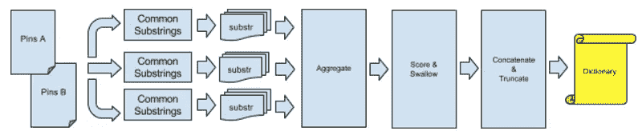
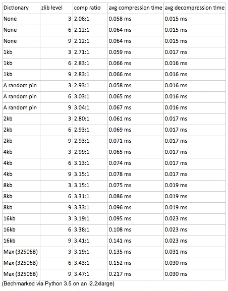

# 发展 MySQL 压缩—第 2 部分

> 原文：<https://medium.com/pinterest-engineering/evolving-mysql-compression-part-2-2c3eb0101205?source=collection_archive---------1----------------------->

*本帖接续上一篇，* [*进化 MySQL 压缩*](https://engineering.pinterest.com/blog/evolving-mysql-compression-part-1) *。*

威廉·汤姆| Pinterest 工程师

Pinterest 的主要数据源——Pin 数据——在我们的 MySQL 集群中存储为中等大小(~1.2kb)的 JSON blobs。这些 blobs 是非常可压缩的，但是 MySQL 中现有的压缩系统并不是最佳的，只能实现 2:1 的压缩。在[之前的文章](https://engineering.pinterest.com/blog/evolving-mysql-compression-part-1)中，我们讨论了为什么列压缩是更理想的压缩系统。为了使用列压缩并获得显著的节省，我们需要使用一个压缩和可选的预定义压缩字典(即回看窗口)。在这里，我们将介绍如何将 Pin 数据的压缩率从大约 3:1 提高到 3.47:1。

## 背景

首先，让我们看看 InnoDB 使用的底层压缩库， [Zlib](http://zlib.net/) ，一个最初用于 PNG 文件格式的压缩库。Zlib 的压缩遵循由两个主要阶段组成的 [DEFLATE](http://www.zlib.net/feldspar.html) 压缩算法。首先，LZ77 用指向该字符串的前一个实例的指针以及要重复的字符串的长度来替换重复出现的字符串。然后对结果数据进行霍夫曼编码。我们通过使用预定义的字典来优化 LZ77 阶段，该字典预加载具有公共子串的回看窗口。由于每个压缩的数据对象都比滑动窗口小得多，这种方法特别有效，允许每个 Pin 对象的整体回顾预定义窗口的大部分。我们受到了由 [Cloudflare](https://blog.cloudflare.com/improving-compression-with-preset-deflate-dictionary/) 完成的类似工作的启发。

## 初始测试

在开始这个项目之前，预定义的字典由一个单一的 Pin 对象填充。压缩比大约是 3:1，这是很好的，因为所有 Pin 对象共享大致相同的方案，允许重用密钥。然而，我们知道我们可以做得更好。

pin 共享某些 JSON 字段或这些字段的子字符串是很常见的。通过只使用一个 Pin，我们没有利用那些 JSON 值带来的额外节省。这类字段的例子有通常以“http://”开头的链接，或者需要布尔值的字段。我进行了几次快速按压，以确保有节余。我取了大约 10，000 个 pin，将它们连接起来，并使用最大的窗口大小(32kb)和最高的压缩级别(Z_BEST_COMPRESSION，9)对它们进行压缩。这允许每个管脚回顾以前的 25 个左右的管脚来寻找公共串，同时尽可能地压缩数据。然后，我做了同样的事情，但是，在连接之前打乱了每个引脚的字节。因为每个字节的相对频率仍然相同(忽略用 LZ77 回看元组替换的字符串)，DEFLATE 的霍夫曼编码部分产生了大致相同的节省。压缩率的差异将提供预期节省的近似值。另一种选择是使用 [deflateSetDictionary](https://refspecs.linuxbase.org/LSB_3.0.0/LSB-PDA/LSB-PDA/zlib-deflatesetdictionary-1.html) 用一些引脚填充预定义的字典，但是第一种方法允许大致相同的结果，而不必编写代码。不管怎样，结果显示有节省，所以我继续这个项目。

## 该过程

最初，我试图修改 Zlib 源代码，以确定 LZ77 部分压缩了哪些公共字符串，以便在预定义的字典中使用。用 C 语言编程并不是我最快的编码语言，所以大约一周后，我决定写自己的实用程序来为 Pin 对象生成一个像样的预定义字典，这比花我的实习时间来精通高度优化的 K&R 风格的 C 语言要痛苦得多

我从两个不同的碎片数据库和两个不同的生成时代取了大量的 pin(~ 200k)。我们基于 userID 进行分片，所以早期的分片数据库包含许多旧的 pin，与最近添加的 pin 相比，它们的模式有些不同。

为了为所有 pin 生成一个更通用的预定义字典，我以三种不同的方式混合输入数据:

1.  旧碎片上的随机密码对。
2.  新碎片上的随机密码对。
3.  来自旧碎片的随机 pin 与来自新碎片的随机 pin 配对。

然后，我分批处理这些管脚对，同时在批中的每个管脚对之间寻找公共子串(在回看窗口和前瞻缓冲区中，都大于 3 个字节)。

因为这是一个*长*的运行过程，所以我在每个完成的批处理结束时维护了持久状态，这允许脚本在失败时从最后一个完成的批处理开始。然后，来自每一批的子串频率被聚集并传递到下一步，即字典生成。

## 字典生成

批处理后，根据子串的长度和出现频率对子串进行评分。为了避免在输出字典中出现重复的子字符串，我们将完全包含的子字符串进行吞咽，并将分数合并到吞咽子字符串的分数中。符合定义的字典大小的最高 *n* 得分字符串被连接在一起，这样得分较高的字符串位于字典的末尾(根据 [zlib 手册](http://www.zlib.net/manual.html))。然后，任何突出部分被截断，结果作为预定义的字典交给用户。

尽管实现速度很慢，但我们发现 100，000 对管脚之间的公共子串的频率只需要 400 多 CPU 天。我们没有花时间来提高性能，因为生成字典本身并不是一项经常运行的任务。此外，尽管我很想提出一个有效的最短公共超序列解决方案，以便在预定义的字典中更合适，但它是 [NP-complete](http://www.sciencedirect.com/science/article/pii/030439758190075X) 。

这些工具已经被添加到我们的开源工具库中，希望对其他人有用。

## 基准

使用这个预定义字典的基准看起来很有前途。就空间节省而言，计算字典比使用单个 Pin 作为预定义字典节省了 10%以上，此外还比现有的 InnoDB 页面压缩节省了 40%。我们考虑使用 8kb 或 16KB 的字典，而不是 32KB (32506B)的字典，作为提高性能的折衷，但是因为这不是必需的，所以我们没有提高 zlib 压缩级别来最大化压缩节省。

## 后续步骤

当撰写关于列压缩的第一篇博文[时，我们还没有将这种变化部署到生产中。从那以后，我们已经顺利地推出了列压缩。](https://engineering.pinterest.com/blog/evolving-mysql-compression-part-1)

在未来，我们计划测试一个 Pin 管理的静态 Huffman 树，作为额外节省的潜在途径。目前，zlib 不支持这种功能，将根据大小使用一般的静态代码或动态代码。

*鸣谢:感谢 Rob Wultsch 的指导和教导。感谢 Pinterest 让我的实习成为一次难忘的经历。*