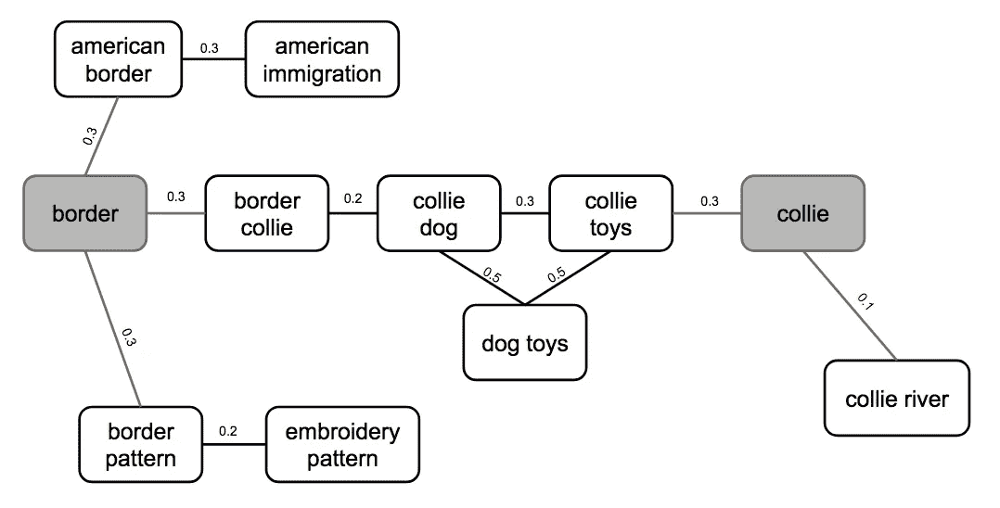
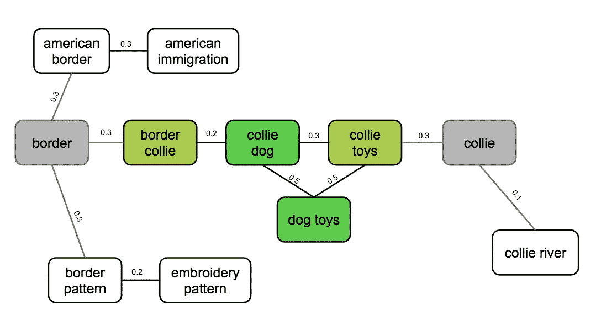
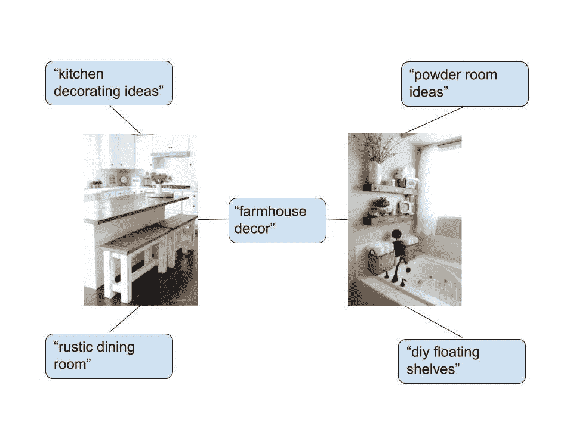
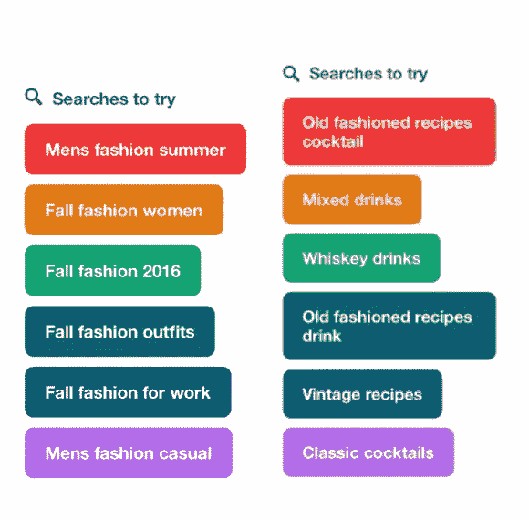
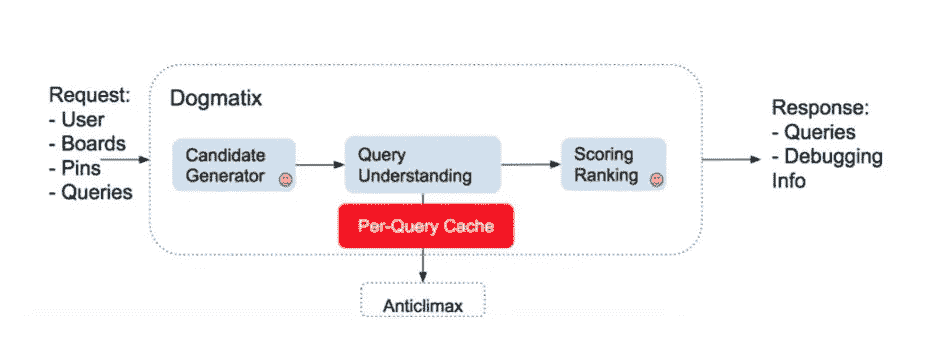

# Pinterest 上不断发展的搜索推荐

> 原文：<https://medium.com/pinterest-engineering/evolving-search-recommendations-on-pinterest-136e26e0468a?source=collection_archive---------0----------------------->

梅森·丘吉尔|软件工程师，搜索

Pinterest 致力于帮助人们发现可以在现实生活中尝试的想法，无论是烹饪的食谱，购买的产品还是旅行。搜索是发现的关键部分，我们每个月都要处理数十亿次查询。在 Pinterest 上，我们发现人们更希望探索各种可能性，而不仅仅是得到一个结果。事实上，近 75%的查询只有 1-3 个单词，人们平均每个查询查看 60 个 pin。这种开放的心态是 Pinterest 搜索与传统搜索引擎如此不同的原因。

在过去的一年中，我们引入了推荐查询来帮助 Pinners 在他们的搜索中探索相关的想法。我们根据 Pinner 创建的电路板和他们保存的引脚提出建议。这篇文章将探讨搜索推荐的发展，特别是 Pinterest 搜索中基于查询的搜索推荐。

Search recommendations on Pins (left) and boards (middle) and Pinterest Search (right).

# 推荐的候选查询生成

## 术语查询图

[术语查询(TQ)图](http://zola.di.unipi.it/rossano/wp-content/papercite-data/pdf/sigir12.pdf)最初是我们推荐搜索的唯一数据源。TQ 图是使用以下规则构建的术语和查询图:

1.  术语(单字)连接到它们出现的查询，TQ 边由术语出现的查询数量的倒数加权。
2.  查询-根据查询的“相关”程度对查询边进行加权。低权重的查询边缘被剔除。

我们训练了一个逻辑回归模型来确定查询相关性。训练集标签是通过我们的人类评估平台 Sofia 生成的。

An example TQ graph.

一旦构建了 TQ 图，我们就使用下面的过程来为给定的查询生成推荐的搜索:

1.  将查询分解成术语，
2.  从图中的每个术语节点开始，然后
3.  从原始查询中的每个词进行随机行走(重新开始)，以与查询-查询边权重成比例的概率从一个查询节点移动到另一个查询节点。直觉上，我们希望找到术语节点的“中心”查询。

A random walk along the TQ graph for “border collie”. Green represents queries visited on random walks from “border” and “collie” nodes. Darker green nodes are visited most often.

对于每个起始术语，我们得到一个描述从该术语到达各种查询的概率的稳定分布。然后我们找到每个平稳分布的哈达玛积(“点积”)。如果一个查询出现在一个术语的稳定分布中，而不是另一个，我们有逻辑将它以低概率添加到稳定分布中。这样，我们不需要推荐出现在所有术语的平稳分布中的查询。然而，我们确实惩罚了这样的术语，因为如果不是原始查询中的所有术语都被用于生成推荐，那么推荐质量会下降。换句话说，我们推荐随机遍历中最常访问的查询，前提是从各个开始节点访问的查询有足够的重叠。

TQ 图为我们提供了出色的推荐覆盖率，但它没有使用大量关于 Pinners 如何在 Pinterest 上使用搜索的信息。

## Pixie 查询引脚图

我们使用的下一个候选来源是 [Pixie](/@Pinterest_Engineering/introducing-pixie-an-advanced-graph-based-recommendation-system-e7b4229b664b) ，我们基于图表的推荐平台，根据历史参与度生成搜索建议。我们生成了一个二分图，这次是从查询到 pin。如果用户在搜索给定的查询后使用给定的 Pin，则我们连接节点。为了获得查询的搜索建议，我们从相应的查询节点开始随机遍历图，然后推荐最常访问的查询节点。

An example query-Pin graph.

因为它考虑到了人们保存、搜索和更多的 Pin，所以查询 Pin 图以一种 TQ 图没有的方式捕捉概念相似性。当您将一个查询分解成多个术语，并在 TQ 图上随机游走时，您会丢失语义信息。例如，查询“老式”从 TQ 图中产生诸如“秋季工作时尚”和“男士时尚休闲”的建议。术语“时尚”被规范化为“时尚”，这个术语的查询的固定分布与鸡尾酒无关。但是，查询引脚图将提供更多相关建议:

Suggestions for “old fashioned” from TQ graph (left) and Pixie (right).

如果可能的话，我们会优先考虑小精灵候选人。然而，如果查询具有足够的历史参与度，我们只有搜索建议。TQ 图确保我们对不太常见的甚至是一些从未见过的查询有建议。

# 推荐的查询服务

基于查询的搜索推荐最初作为搜索请求的一部分。候选人生成、重复数据删除、敏感词过滤和候选人排名的逻辑分布在我们的[查询理解后端(Anticlimax)和搜索后端(Asterix)](/the-graph/search-serving-and-ranking-at-pinterest-224707599c92) 之间。这种服务系统有两个主要缺点:

1.  准备推荐的查询增加了执行搜索请求的延迟，尽管大部分工作可以与 Pin 结果检索和排序并行进行。
2.  候选人重复数据删除、过滤和排名的逻辑应在所有搜索推荐故事中共享:搜索结果页面推荐、Pin 特写推荐、公告板推荐等。当逻辑被锁定在搜索请求的主体中时，这是不可能的。

鉴于这些缺点，我们从搜索后端移除了搜索推荐逻辑，并为查询推荐创建了一个新的服务，名为 dorux。

每个对 dado XIX 的请求都提供查询、引脚 ID、板 ID 和/或用户 ID，以及关于发出请求的用户的信息。每个请求有三个阶段:

1.  候选生成:对于每种类型的请求(基于查询的、基于 Pin 的等等),这个阶段是不同的。).对于基于查询的请求，我们获取上面描述的 TQ 和 Pixie 候选者。
2.  查询理解:在这个阶段，我们称查询理解后端(Anticlimax)来获取候选人的信息。我们用检测到的语言、流行度和敏感查询检测信息等信息来标记候选人。
3.  评分/排名:在这一阶段，我们筛选敏感候选人，对结果进行重复数据删除，并对候选人进行排名。

The Dogmatix (query recommendation service) architecture.

从 API 层调用 Dogmatix。在搜索结果页面上基于查询的推荐的情况下，我们在调用 Asterix(搜索后端)的同时调用 dodgex。

# 未来的工作

我们未来的工作将侧重于增加推荐查询的覆盖范围，以便我们能够向美国以外的 Pinners 推出该功能。我们目前正在开发一个查询嵌入模型，以用作新的数据源。最终，我们希望能够为一个任意的(也许是从未见过的)查询生成嵌入，并找到具有相似嵌入的查询。

我们计划通过考虑不仅仅是原始查询中呈现的数据来改进建议。例如，如果搜索者[使用“素食”过滤器来细化他们的食物查询](https://blog.pinterest.com/en/what%E2%80%99s-dinner-we-got-you-covered-new-food-features)，或者如果搜索者在一个家居装饰查询中特别点击了极简设计大头针，我们将能够使用这个额外的上下文来定制我们的建议，使其更加具体。

我们还计划尝试推荐搜索的定位。现在，搜索推荐被放置在网格中的固定位置。我们希望根据我们对推荐的信心，动态地上下移动建议。

我们一直在努力改进我们的系统，继续为 Pinners 提供优秀的推荐，让他们保持灵感，并回到 Pinterest 寻找他们的下一个想法。如果你喜欢解决搜索和推荐问题，[加入我们的团队](https://careers.pinterest.com/careers/engineering)！

感谢、杰克·许、杰里·刘、朱莉安娜·库克、拉克什·巴辛、刘志峰、马特·方、穆斯塔法·莫蒂瓦拉、瓦莱丽·哈迪克、黄盈和孙岩