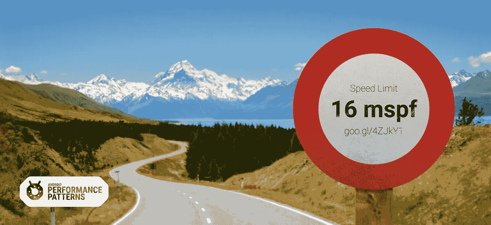
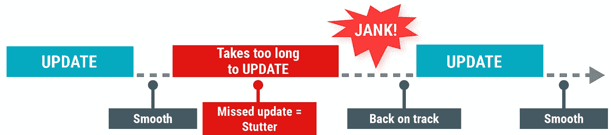
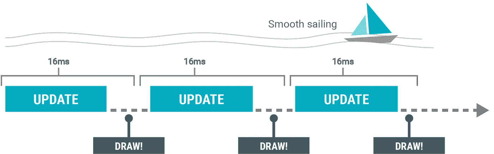
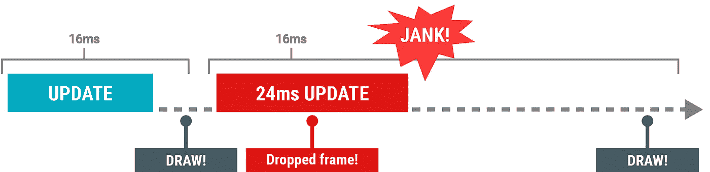

# 超过安卓限速！

> 原文：<https://medium.com/androiddevelopers/exceed-the-android-speed-limit-b73a0692abc1?source=collection_archive---------2----------------------->

当谈到应用程序性能的目标或基准时，真的只有一个。你的应用程序是否持续快速地绘制屏幕，让你的用户看到平滑流畅的动作、过渡和响应？事实证明，对于这种用户体验，**您的应用程序必须在 16 毫秒或更短的时间内完成所有工作，每次屏幕刷新**。

我们是如何得到这个数字的？

# 人眼和每次刷新 16 毫秒

人脑不断接收和处理视觉信息。这给了我们一些很酷的技巧。例如，当静止图像以足够快的速度相互跟随显示时，我们会将它们视为运动。一本翻页书就是一个很好的例子，它正处于感知的边缘。

Flip books are just at the edge of what humans perceive as motion.

*   在大约**每秒 10-12 页**的时候，有**清晰地移动**，但是你也保留了对个别页面的意识。
*   **每秒 24 页**使人眼能够看到**流畅的运动，**这要归功于运动模糊等技术，这些技术可以帮助你在应该只看到动画的每一帧时感知运动。每秒 24 幅图像对电影业来说是一个甜蜜点，因为它足够快来显示运动，但也足够便宜来制作电影。
*   **每秒 30 页就够了**，但不够逼真。这对于电影来说已经足够了，但是如果没有花哨的电影效果，它就没有说服力。
*   **每秒 60 页是理想的速度**，因为大多数人认为这是高质量、流畅的动作。

在计算世界中，这种“每秒页面数”的度量被称为“帧速率”或“每秒帧数”。虽然理解帧速率如何导致平滑运动很重要，但这不是全部。**当涉及到运动不一致时，人类的眼睛是非常敏锐的。**例如，如果你的应用以平均每秒 60 帧的速度运行，仅仅一帧的显示时间就比前几帧长得多，用户会注意到平滑度的中断，这通常被称为“挂接”、“滞后”、“口吃”或“抖动”

# 计算机硬件和每帧 16 毫秒

大多数现代移动设备以每秒 60 帧的速度刷新显示。这个数字是由设备的硬件决定的，它定义了屏幕每秒可以更新的次数。(当然，硬件是为了成功地与人眼进行虚拟游戏而构建的。)

为了匹配硬件屏幕每秒 60 次的更新，系统软件会尝试每 16 毫秒
重绘一次您当前的应用活动(1000 毫秒/ 60 帧= 16.666 毫秒/帧)。因此，你的应用程序有 16 毫秒的时间来更新每一帧。

总共是 16 毫秒。系统还必须花时间来绘制、响应意图、处理输入事件，这只是其中的几个例子。总的来说，你的应用程序正在与 Android 上的许多其他子系统共享这 16 毫秒，所以不要计划拥有全部。

如果你的应用程序花费的时间太长，并且没有在 16 毫秒内完成计算，你会得到所谓的“丢帧”，是的，你已经知道了。詹克。！

# 你，你的应用，每帧 16 毫秒

作为一名应用程序开发人员，你必须在整个用户体验过程中始终保持你的应用程序每秒 60 帧，每帧 16 毫秒，以避免 jank。

要获得关于应用渲染性能的冷、硬数据，请使用设备上的 Profile GPU 渲染工具来发现应用何时以及如何丢帧——我们将在未来的文章中深入探讨这一点。但是如果你急着让你的用户满意，你可以现在查看一下 [Android 性能分析工具](http://developer.android.com/tools/performance/index.html)文档。

为了获得这一部分更有趣的版本，观看[为什么 60 fps](https://www.youtube.com/watch?v=CaMTIgxCSqU) ，这是 YouTube 上 [Android 性能模式的一部分。如果你想往前跳，可以去看看 Udacity](https://www.youtube.com/playlist?list=PLOU2XLYxmsIKEOXh5TwZEv89aofHzNCiu) 上的[安卓性能课程。但最重要的是，加入我们的](https://www.udacity.com/course/android-performance--ud825) [Android Performance G+社区](https://plus.sandbox.google.com/communities/116342551728637785407)，获得关于构建高性能 Android 应用的伟大技巧，你猜对了。