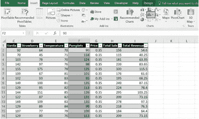
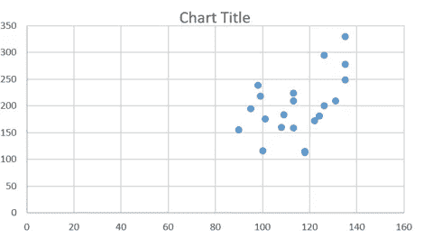

# 使用 MS Excel 图表的高级数据可视化

> 原文：<https://medium.com/edureka/excel-charts-advanced-data-visualization-edb3f380c8bd?source=collection_archive---------3----------------------->

MS Excel Charts — Edureka

在[我的 ***上一篇文章***](/edureka/data-visualization-using-excel-724b96a8f85e)***中对使用 MS Excel*** 进行数据可视化的技巧进行了探讨。这些局限于单一属性中数据的可视化。在本系列的这一期中，我们将更多地讨论数据可视化的高级方面— ***Excel 图表*** 。

假设一家冰淇淋公司想要分析其各种冰淇淋的销售收入。如此详细的分析，你将不得不分析各种参数对冰淇淋销售的影响。例如，温度如何影响销售？有些地方比其他地方更适合卖冰淇淋吗？通过分发更多的小册子，销售会增加吗？

所以为了回答这样的问题，你得分析多个属性之间的关系。在本文中，我们将讨论这一点。

下面是我们将在本文中讨论的 Excel 图表。

*   ***折线图***
*   ***柱形图***
*   ***直方图***
*   ***散点图***

# 折线图

折线图非常有助于在均匀刻度轴上描绘连续数据。这些 Excel 图表是以相等的时间间隔(如几天、几个月或几年)显示数据趋势的好选择。

让我们从分析收入如何随时间变化开始。

*   选择两列的值(例如选项。 ***日期*** 和 ***总收入*** )，绘制成折线图。选择数值后，点击 ***插入*** 菜单然后点击**图表中的第二个图标**

**

*   *单击图标时，会出现折线图的各种选项。对于这个例子，点击 2 D 线部分下的第一个选项，下面的图表就会出现。*

**

*   *这张图表显示了收入如何随着时间的推移而增加或减少。然而，这个图表并不容易阅读。因此，让我们试着让它看起来更直观，信息量更大。*
*   *在上面的截图中，在 ***设计*** 部分下，选择想要的设计风格。*

**

*   *双击显示 ***图表标题*** 的文本框，将其重命名为 ***收益 vs 时间。****

**

*   *再次单击图表，然后单击图表右上角的加号(+)。它将打开多个选项。点击 ***选项的轴标题*** 和 ***图例*** *。**

**

*   *为了更好地说明，请将图表拖到页面中间。现在，注意图表上有两个文本框，一个在 X 轴上，一个在 Y 轴上。两者具有相同的内容 ***轴标题*** 。*
*   *单击每个文本框，并根据数据重命名每个轴。选择一个合适的字体，然后图表看起来如下。*

**

*   *现在，这个传说需要被修正。在上面的快照中，图例被标记为系列 1，这显然是不正确的。*
*   *右键点击图表，点击 ***选择数据*** *。*它将打开一个新窗口，如下图所示。*

**

*   *在上面的快照中，你可以看到文本 ***系列 1*** 。这才是需要纠正的。点击 ***编辑*** ，在 ***系列名称*** 中输入 ***收入*** ，按 ***确定*** 。*

**

*   *从上面的快照可以看出，总收入随着时间的推移在波动。为了更好地理解这一点，您必须分析影响收入的其他参数。*

*我们来试着了解一下，营收和温度有没有相关性。为了分析这个，我们在同一个图表里再加一个属性:**温度**。*

*   *点击菜单栏上的 ***【设计】*** 图标然后点击 ***选择数据*** 选项(在菜单栏的右侧)。将会打开以下窗口。*

**

*   *点击添加按钮。一个名为****编辑系列****的新窗口将被打开。***

******

*   ***在 ***系列名称*** 中，输入“ ***温度*** ，并在 ***系列数值*** 中，选择温度列中的所有数值。按下 ***OK*** 后，现在收益和温度都出现在图表上。***

****

# **柱形图**

**柱形图用于直观地比较多个类别的值。**

*   **让我们试着比较一下各种口味冰淇淋的销售情况，以了解哪种更受欢迎。**
*   **选择要绘制在柱形图中的列的值(例如 ***日期、香草、草莓*** )。选择数值后，点击 ***插入*** 菜单，然后点击 ***图表中的第一个图标*** 选项。**

****

*   **点击图标后，柱形图将出现各种选项。对于这个例子，点击第一个选项，下面的图表就会出现。**

****

*   **使用与折线图相同的步骤选择所需的设计，重命名图表并重命名图例。**

****

*   **如上图所示，香草冰淇淋的销售额几乎总是高于草莓冰淇淋的销售额。**

**让我们来探索这个图表的另一个有用的变体， ***堆积柱形图*** 。**

*   **点击菜单栏上的 ***设计*** 图标然后点击 ***改变图表类型*** *。***

****

*   **选择**的选项*堆叠*列**列。**
*   **按下 ***OK*** 后，图表看起来像下面的快照。**

****

*   **此图表有多种变体。例如，在第一步中，如果没有选择 2D 图表，而是选择了三维图表，那么图表将看起来像下面的快照。**

****

# **柱状图**

**直方图是显示数据分布中频率的 Excel 图表。数据的分布被分组到频率仓中，频率仓可以被改变以更好地分析数据。**

*   **我们来试着分析一下小册子的分布。**
*   **选择要绘制在直方图中的列的值(例如， ***小册子*** )。选择数值后，点击 ***插入*** 菜单然后点击中间图标中的 ***图表*** 选项。**

****

*   **点击 ***直方图*** 下的第一个图表，按 ***确定。*** 会出现下图。**

****

*   **此图表将小册子列的值分为 3 类(箱):90–108、108–126 和 126–144。从直方图可以明显看出，第三个箱子中的小册子数量比前两个箱子中的小册子数量少。**
*   **应用前面步骤中讨论的相同技术来选择所需的设计并重命名图表。**

****

*   **为了更仔细地查看这些数据，让我们尝试增加容器的数量。右击 X 轴，点击 ***格式化轴*** 选项。**

****

*   **右边会打开一个新窗口，命名为**格式轴。*在此窗口中，将 ***箱数*** 选项改为 10。***

****

*   **选择箱数为 10 后，关闭窗口。直方图现在将发生变化，如下图所示。**

****

*   **这个柱状图显示了小册子更详细的分类。例如，可以得出 126–130.5 范围内的小册子从未发行的结论。**

# **散点图**

**散点图有两个数值轴:水平(X)轴和垂直(Y)轴。它将 x 和 y 值组合成单个数据点，并以不规则的间隔或聚类显示它们。**

**让我们试着分析一下总销售额和散发的小册子的数量是否有关系。**

*   **选择要绘制在散点图中的列值(例如 ***小册子、总销售额*** )。选择数值后，点击 ***插入*** 菜单然后点击 ***散点图*** 图标中的 ***图表*** 选项。**

****

*   **点击 ***散点*** 下的第一张图表，按 ***OK*** 。将出现下图。**

****

*   **应用前面步骤中讨论的相同技术来选择所需的设计并重命名图表。**

****

*   **正如你从下面的快照中看到的，随着小册子分发数量的增加，冰淇淋的销量也在增加。**

**正如在这篇博客中所展示的，MS Excel 有各种强大且易于使用的可视化工具，如我们上面讨论的各种 Excel 图表。这些工具有助于发现各种数据元素之间的相关性，并在数据中导出有用的模式。**

**每个可视化工具都有多种变体和大量选项，我想鼓励您探索所有选项，以便下次当您获得要分析的数据集时，您将有足够的弹药来攻击数据。如果你想查看更多关于人工智能、DevOps、道德黑客等市场最热门技术的文章，那么你可以参考 [Edureka 的官方网站。](https://www.edureka.co/blog/?utm_source=medium&utm_medium=content-link&utm_campaign=excel-charts-advanced-data-visualization)**

**请留意本系列中的其他文章，它们将解释 Excel 的各个方面。**

> **1.[使用 Excel 进行数据可视化](/edureka/data-visualization-using-excel-724b96a8f85e)**

***原载于 2019 年 6 月 27 日*[*【https://www.edureka.co】*](https://www.edureka.co/blog/excel-charts-advanced-data-visualization/)*。***