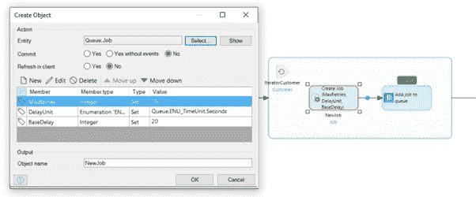
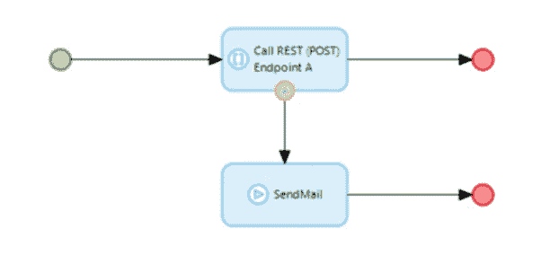
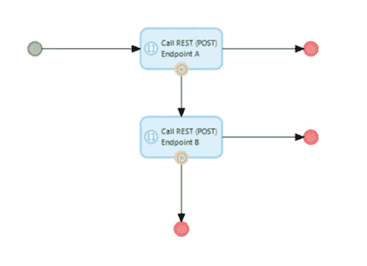

# 分布式系统中的异常处理

> 原文：<https://medium.com/mendix/exception-handling-in-distributed-systems-5a54efaeeea1?source=collection_archive---------3----------------------->

# 作为(Mendix)开发者，我们都经历过；与系统集成以处理数据或触发动作。通过使用 Mendix 平台，这变得比以往任何时候都容易。然而，在复杂的系统中，另一方可能变得不可用或不可预测，这可能很难处理。分布式系统很奇怪，因为问题可能以多种方式出现。

现在，假设有三种主要类型的分布式系统。

*   离线—主要用于批处理和数据分析。较少的用例，但最健壮的选项。高度可扩展和自我持续。更少的复杂和关键故障场景。
*   软实时—通常比离线更重要，并且在持续过程中进一步连接。有更多的时间执行任务。考虑更新搜索索引。如果更新过程失败，先前的索引仍然存在，并且结果将在下一个时间间隔更新。
*   硬实时—难以管理的架构类型。想想请求/回复和事务系统。由于等待的客户或正在运行的流程，速度通常很重要。

# 方案

假设您正在使用一个 Mendix 应用程序作为订单管理系统。在某一时刻，一名员工试图更新订单的状态。无中生有，系统变得非常慢，停止响应。与此同时，一个预定事件导致应用程序耗尽内存；应用程序日志显示应用程序将重新启动。虽然员工没有引起问题，但两个过程共享同一个系统，因此他们有共同的信念。

当外部请求导致内存不足时，这种单一的应用程序设置会迅速变得更加复杂。假设有一个外部网站正在向同一个应用程序发送新订单。由于网站的一个漏洞，订单管理系统的更新已经不堪重负。网站仍将可用，但随机的东西会开始失败。员工可能会报告这个问题，您的监控解决方案会报告一个警报，但是如何处理面向消费者的 web 应用程序中的流程呢？消费者应用程序应该能够处理几种场景。“创建订单”请求是否已成功提交？如果是，订单管理系统是否处理了该请求？可能订单已经处理，但是向消费者应用程序发送响应失败。如果到目前为止一切顺利，但是消费者应用程序在收到响应时无法更新订单状态，该怎么办？

总之，您可以看到复杂性在快速增加。你需要一个接一个地处理所有潜在的错误。测试架构将同样困难。甚至在消费者应用程序本身中，您可能会提出大量的测试场景。在分布式设置中测试时，由于可能出现的各种网络和处理问题，案例数量将呈指数级增长。以及发生未知错误时该怎么办？订单管理系统处理过订单吗？如果你有一个总体的图景，执行这些测试仍然是困难的。大多数情况下，迫使一个系统的系统进入某种错误状态并不容易。

分布式错误可能会隐藏数年，但它们会对您的生产环境产生巨大影响。最常见的是，非常具体的组合(阅读；完美风暴)可能会在一个很难查明问题发生的确切原因的环境中触发几个故障。

# 分布式异常处理

当考虑在分布式系统中处理故障时，首先会想到四个类别。在这篇博客中，我们将讨论为什么其中一个不是首选，以及如何以不同的方式处理这个问题。

简而言之，类别包括重试、并行尝试、故障转移和回退。前三个选项在正确实施时可以使您的环境更加健壮，而回退在没有充分考虑的情况下会导致比它试图解决的问题更多的问题。

By using the Queue module from the Mendix Marketplace, it is easier to implement a retry policy. In Mendix 9 you can also use the internal Task Queue, but it is currently a bit more cumbersome to set up a retry mechanism here.

# 方案

为了让这个故事更形象，我们从一个场景开始。您构建了一个解决方案，其中您需要将文件文档从系统 A 发送到系统 B。您是系统 A 的开发人员，并且提供了一个解决方案，其中您使用系统 B 的 web 服务在流程需要时发送文件文档。不幸的是，系统 B 并不总是可用的。除此之外，系统 B 不能不定期地处理较大的文件。由于企业报告说关键文档现在丢失了，所以您实施了一个后备方案。每当系统 B 抛出任何类型的错误时，您通过邮件将文档发送到相关的业务单元。现在他们可以直接使用文档，自己上传到 B 系统。

A possible fallback scenario in which we send or queue an email in case the REST call fails.

# 为什么这不是首选

虽然这看起来是一个不错的解决方案，可以被企业接受，但是有几个理由不采用这个选项。除了可能的合规性异议(谁可以访问邮箱)，还有一些技术上的考虑。

# 交易

潜在的风险是，回退不值得冒这个险。最终，你试图通过权衡来达到同样的最终目标。这种权衡值得吗？应用程序可以决定这是否值得吗？以后还会是这种情况吗？考虑到这个场景，您将引入一个包含更多手动操作的替代流程。想象一下，随着公司的不断发展，几年后系统 B 的一次重大故障导致业务部门的邮箱被淹没，并且有太多的手动步骤来处理额外的工作。

上面的情况告诉我们，很多时候，不值得去冒险。与最初的失败相比，回退场景(需要从邮箱中手动上传数百个文档)的影响可能更大。

# 可预测性

回退场景很可能很少触发或者根本不触发。因此，回退逻辑的影响常常被低估。再次考虑我们的邮件回退场景。由于已实现的解决方案，您可能希望文档总是在那里。但是如果回退机制也失败了呢？您的电子邮件服务器也可能不可用。此外，回退机制会给系统带来不可预知的负载。想象一下，大停电导致回退机制通过邮件发送所有文档。因为以前从未发生过这种情况，所以您没有考虑到邮箱会因大量附件而被填满。

While this isn’t a clean example, it shows the idea behind a failover scenario. In a solid architecture, this role is fulfilled by a load balancer.

# 测试

测试回退场景很难。您需要强制系统处于一种状态，在这种状态下，您可以预测回退机制将被触发。回退场景不太可能被触发，因此它可能被视为应用程序中一个无害的逻辑。这种解决方案的性质增加了潜在错误的可能性，这些潜在错误可能隐藏多年，当它们出现时很难解决。

对于分布式的多个回退场景，测试会更加困难。将会出现几个压力点和潜在的瓶颈。这些组件中的一个(或它们的组合)的潜在过载可能很难模拟，并且因为可能性低而经常被丢弃。

> “在亚马逊，我们发现花费工程资源使主要(非后备)代码更可靠通常比投资于不常用的后备策略更能提高我们的成功几率。”-AWS 高级首席工程师 Jacob Gabrielson

# 可供选择的事物

在通读了潜在的陷阱之后，您可能会寻找处理此类情况的替代方案。光这一点就可以花很多博文。希望这一节能给你一个好的开始。

*   设计并**建立一个更具弹性和持久性的非回退场景**。例如，您可以决定只使用高可用性的服务。
*   让源应用程序负责处理错误。保持事情可控。
*   我个人最喜欢的:**如果可能的话创建一个重试机制**。最常见的情况是，在系统之间交互时，一些小事情会出错。具有指数补偿的重试机制可以使您的架构更有弹性。
*   **创建故障转移而不是回退**。确保故障转移过程的输出同样可靠，并且该过程的输出是相同的，没有任何让步。通过在生产中定期使用两条路径来测试故障切换。
*   **一旦数据可用，主动将数据推送给监听方**。当数据已经可用时，您就变得不那么依赖彼此的可用性了。这可以与适当的重试逻辑相结合。

关注你的逻辑中经常出现而不是很少出现的逻辑路径。努力使您的主要系统更加健壮和可预测。尽可能用推代替拉。如果回退逻辑是必要的；确保它是可测试的，并保证替代方案和常规流程一样稳定可靠。

# 进一步阅读

如果你问我，有一个好的导师在旁边可以提高你的建筑思维方式很多。除此之外，许多非 Mendix 的博客也非常有益。关于这个关于分布式系统的话题，我想对 Amazon Builders' Library 说一声。

## 阅读更多

 [## 亚马逊建筑者图书馆

### 点击此处返回亚马逊网络服务主页

aws.amazon.com](https://aws.amazon.com/builders-library/)  [## 设置错误处理- Studio Pro 9 操作指南| Mendix 文档

### 当使用微流时，重要的是要认识到总会有事务。这些交易有助于…

docs.mendix.com](https://docs.mendix.com/howto/logic-business-rules/set-up-error-handling)