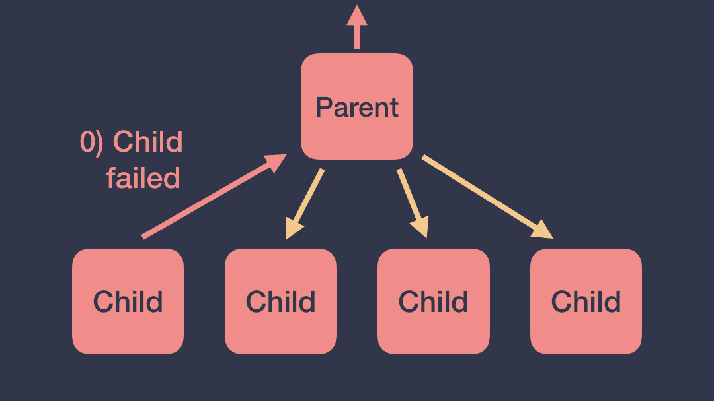
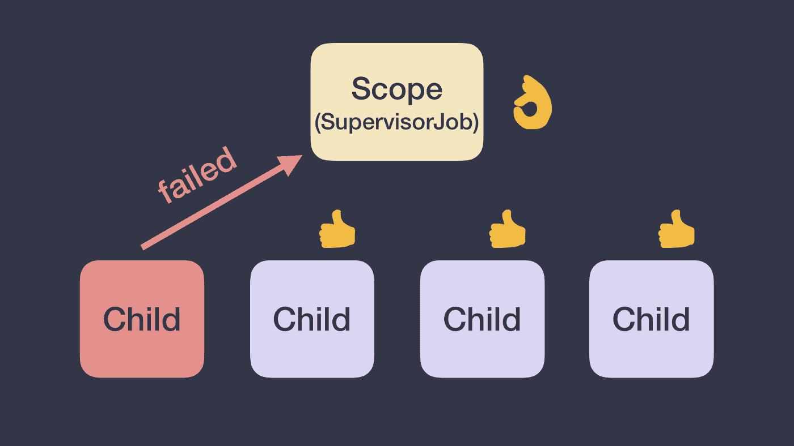
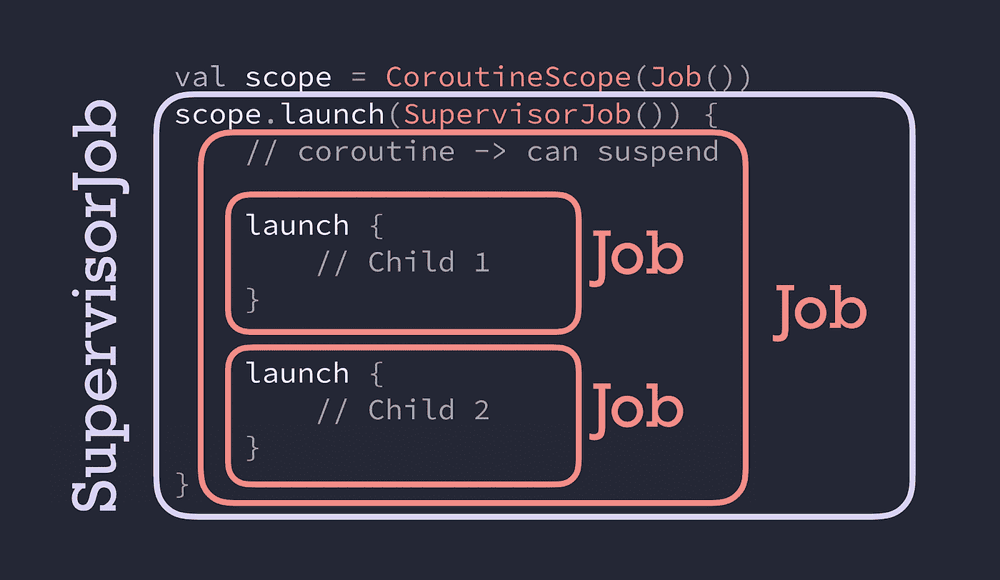

# 协程中的异常

> 原文：<https://medium.com/androiddevelopers/exceptions-in-coroutines-ce8da1ec060c?source=collection_archive---------1----------------------->


Illustration by [Virginia Poltrack](https://twitter.com/VPoltrack)

## 协程中的取消和异常(第 3 部分)——必须全部捕获！

我们这些开发者，通常会花很多时间打磨我们 app 的快乐路径。然而，同样重要的是，当事情不尽如人意时，提供适当的用户体验。一方面，看到应用程序崩溃对用户来说是糟糕的体验；另一方面，当一个动作没有成功时，向用户显示正确的信息是必不可少的。

正确处理异常对用户如何看待您的应用程序有着巨大的影响。在本文中，我们将解释异常是如何在协程中传播的，以及如何始终处于控制之中，包括处理它们的不同方式。

如果你喜欢视频，可以看看我和弗洛里纳·芒特内斯库在 2019 年科特林康夫的演讲:

> ⚠️为了毫无问题地理解文章的其余部分，需要阅读和理解系列文章的第 1 部分。

[](/androiddevelopers/coroutines-first-things-first-e6187bf3bb21) [## 协程:先做最重要的事情

### 协同程序中的取消和异常(第一部分)

medium.com](/androiddevelopers/coroutines-first-things-first-e6187bf3bb21) 

# 一个协程突然失效！现在怎么办？😱

当一个协程因异常而失败时，它会将所述异常向上传播到它的父进程！然后，父节点将 1)取消其余的子节点，2)取消自身，3)将异常向上传播到其父节点。

异常将到达层级的根，并且所有由`CoroutineScope`启动的协程也将被取消。



*An exception in a coroutine will be propagated throughout the coroutines hierarchy*

虽然在某些情况下传播异常是有意义的，但在其他情况下这是不可取的。想象一个处理用户交互的 UI 相关的`CoroutineScope`。如果子协程抛出异常，UI 范围将被取消，整个 UI 组件将变得无响应，因为被取消的范围不能启动更多的协程。

如果你不想要那种行为呢？或者，您可以在创建这些协程的`CoroutineScope`的`CoroutineContext`中使用`Job`的不同实现，即`SupervisorJob`。

## 拯救者的监督工作

有了`[**SupervisorJob**](https://kotlin.github.io/kotlinx.coroutines/kotlinx-coroutines-core/kotlinx.coroutines/-supervisor-job.html)`，一个孩子的失败不影响其他孩子。一个`SupervisorJob`不会取消自己或者它的其余子节点。而且，`SupervisorJob`也不会传播异常，会让子协程来处理。

您可以创建一个类似于`val uiScope = CoroutineScope(SupervisorJob())`的`CoroutineScope`,以便在协程失败时不传播取消，如下图所示:



*A SupervisorJob won’t cancel itself or the rest of its children*

如果异常没有被处理并且`CoroutineContext`没有`[CoroutineExceptionHandler](https://kotlin.github.io/kotlinx.coroutines/kotlinx-coroutines-core/kotlinx.coroutines/-coroutine-exception-handler/index.html)`(我们将在后面看到)，它将到达默认线程的`ExceptionHandler`。在 JVM 中，异常将被记录到控制台；在安卓系统中，不管发生在哪个调度程序上，它都会让你的应用崩溃。

> 💥不管使用哪种作业，总是会抛出未捕获的异常

同样的行为也适用于范围构建器`[**coroutineScope**](https://kotlin.github.io/kotlinx.coroutines/kotlinx-coroutines-core/kotlinx.coroutines/coroutine-scope.html)`和`[**supervisorScope**](https://kotlin.github.io/kotlinx.coroutines/kotlinx-coroutines-core/kotlinx.coroutines/supervisor-scope.html)`。这将创建一个子作用域(相应地以一个`Job`或一个`SupervisorJob`作为父作用域),您可以用它对协程进行逻辑分组(例如，如果您想进行并行计算，或者您想让它们相互影响或不相互影响)。

***警告*** :一个`SupervisorJob` **只有**作为作用域的一部分时才起作用:使用`[supervisorScope](https://kotlin.github.io/kotlinx.coroutines/kotlinx-coroutines-core/kotlinx.coroutines/supervisor-scope.html)`或`CoroutineScope(SupervisorJob())`创建。

## 工作还是主管工作？🤔

什么时候应该使用`Job`或`SupervisorJob`？当您不想取消父级和同级时，使用`SupervisorJob`或`supervisorScope`。

一些例子:

```
// Scope handling coroutines for a particular layer of my app
val scope = CoroutineScope(**SupervisorJob()**)scope.launch {
    // Child 1
}scope.launch {
    // Child 2
}
```

在这种情况下，如果`child#1`失败，*范围和`child#2`都不会被取消。*

*另一个例子:*

```
*// Scope handling coroutines for a particular layer of my app
val scope = CoroutineScope(**Job()**)scope.launch {
    **supervisorScope** {
        launch {
            // Child 1
        }
        launch {
            // Child 2
        }
    }
}*
```

*在这种情况下，由于`supervisorScope`创建了一个带有`SupervisorJob`的子作用域，如果`child#1`失败，`child#2`将被取消*而不是*。相反，如果在实现中使用了`coroutineScope`，失败将会传播开来，最终也会取消作用域。*

## *小心测验！谁是我的父母？🎯*

*给出下面的代码片段，你能识别出`Job` `child#1`是哪种类型的父节点吗？*

```
*val scope = CoroutineScope(**Job()**)scope.launch(**SupervisorJob()**) {
    // new coroutine -> can suspend
   launch {
        // Child 1
    }
    launch {
        // Child 2
    }
}*
```

*`child#1`的父作业类型为`Job`！希望你没弄错！即使在第一印象中，您可能认为它可以是一个`SupervisorJob`，但这并不是因为一个新的协程总是被赋予一个新的`Job()`，在这种情况下它会覆盖`SupervisorJob`。`SupervisorJob`是用`scope.launch`创建的协程的父级；所以从字面上看，`SupervisorJob`在这段代码中什么也不做！*

**

**The parent of child#1 and child#2 is of type Job, not SupervisorJob**

*因此，如果`child#1`或`child#2`失败，该失败将达到范围，该范围开始的所有工作将被取消。*

*请记住，当`SupervisorJob` **是作用域的一部分时，只有**才能像描述的那样工作:要么使用`[supervisorScope](https://kotlin.github.io/kotlinx.coroutines/kotlinx-coroutines-core/kotlinx.coroutines/supervisor-scope.html)`创建，要么使用`CoroutineScope(SupervisorJob())`创建。将一个`SupervisorJob`作为协程构建器的参数传递将不会达到您想要的取消效果。*

*关于异常，如果任何孩子抛出异常，那么`SupervisorJob`不会在层次结构中向上传播异常，而是让它的协程处理它。*

## *在后台*

*如果你想知道`Job`是如何工作的，看看`JobSupport.kt`文件中函数`[childCancelled](https://github.com/Kotlin/kotlinx.coroutines/blob/master/kotlinx-coroutines-core/common/src/JobSupport.kt#L645)`和[notif](https://github.com/Kotlin/kotlinx.coroutines/blob/master/kotlinx-coroutines-core/common/src/JobSupport.kt#L326)`[y](https://github.com/Kotlin/kotlinx.coroutines/blob/master/kotlinx-coroutines-core/common/src/JobSupport.kt#L326)`[canceling](https://github.com/Kotlin/kotlinx.coroutines/blob/master/kotlinx-coroutines-core/common/src/JobSupport.kt#L326)的实现。*

*在`SupervisorJob`实现中，`[childCancelled](https://github.com/Kotlin/kotlinx.coroutines/blob/master/kotlinx-coroutines-core/common/src/Supervisor.kt#L64)`方法只返回`false`，这意味着它不传播取消，但也不处理异常。*

# *处理异常👩‍🚒*

*协程使用常规的 Kotlin 语法来处理异常:`try/catch`或内置的助手函数，如`[runCatching](https://kotlinlang.org/api/latest/jvm/stdlib/kotlin/run-catching.html)`(在内部使用`try/catch`)。*

*我们之前说过**未被捕获的异常总是会被抛出**。然而，不同的协程构建器以不同的方式处理异常。*

## *发动*

*有了 launch，**异常一发生就会被抛出**。因此，您可以将能够抛出异常的代码包装在一个`try/catch`中，如下例所示:*

```
*scope.**launch** {
    try {
        codeThatCanThrowExceptions()
    } catch(e: Exception) {
        // Handle exception
    }
}*
```

> *有了 launch，异常一发生就会被抛出*

## *异步ˌ非同步(asynchronous)*

*当`async`被用作根协程(作为`CoroutineScope`实例或`supervisorScope`的直接子代的协程)时，**异常不会自动抛出，而是在调用** `**.await()**`时抛出。*

*为了在`async`是根协程时处理抛出的异常，可以将`.await()`调用包装在`try/catch`中:*

```
***supervisorScope** {
    val deferred = **async** {
        codeThatCanThrowExceptions()
    } **try** {
        deferred.await()
    } **catch**(e: Exception) {
        // Handle exception thrown in async
    }
}*
```

*在这种情况下，注意调用`async`将*永远不会*抛出异常，这就是为什么没有必要包装它。`await`将抛出发生在`async`协程内部的异常。*

> *当`async`被用作根协程时，当你调用时会抛出异常。等待*

*另外，请注意，我们使用了一个`supervisorScope`来调用`async`和`await`。正如我们之前所说，a `SupervisorJob`让协程处理异常；与`Job`相反，它会自动在层次结构中向上传播，因此不会调用`catch`块:*

```
***coroutineScope** {
    try {
        val deferred = **async** {
            codeThatCanThrowExceptions()
        }
        deferred.await()
    } catch(e: Exception) {
        // **Exception thrown in async WILL NOT be caught here** // **but propagated up to the scope** }
}*
```

*此外，不管协程生成器如何，由其他协程创建的协程中发生的异常将总是被传播。例如:*

```
*val scope = CoroutineScope(Job())scope.**launch** {
    **async** {
        // If async throws, launch throws without calling .await()
    }
}*
```

*在这种情况下，如果`async`抛出一个异常，它会在发生时立即抛出，因为作为该作用域的直接子代的协程是`launch`。原因是`async`(在其`CoroutineContext`中有一个`Job`)会自动将异常向上传播到其父级(`launch`)，父级将抛出异常。*

> *在协同作用域构建器或其他协同程序创建的协同程序中抛出的⚠️异常不会在 try/catch 中被捕获！*

*在`SupervisorJob`部分，我们提到了`CoroutineExceptionHandler`的存在。让我们开始吧！*

## *CoroutineExceptionHandler*

*`CoroutineExceptionHandler`是`CoroutineContext`的可选元素，允许你**处理未捕获的异常**。*

*下面是如何定义一个`CoroutineExceptionHandler`，无论何时捕获到一个异常，您都有关于发生异常的`CoroutineContext`和异常本身的信息:*

```
*val **handler** = CoroutineExceptionHandler {
    context, exception -> println("Caught $exception")
}*
```

*如果满足以下要求，将会捕获异常:*

*   ***当**⏰:异常由一个协程抛出，该协程使*自动抛出异常*(适用于`launch`，不适用于`async`)。*
*   ***哪里**🌍:如果它在`CoroutineScope`或根协程的`CoroutineContext`(`CoroutineScope`或`supervisorScope`的直接子进程)中。*

*让我们看一些使用上面定义的`CoroutineExceptionHandler`的例子。在下面的例子中，异常*将被处理程序*捕获:*

```
*val scope = CoroutineScope(Job())
scope.launch(**handler**) {
    launch {
        throw Exception("Failed coroutine")
    }
}*
```

*在另一种情况下，处理程序安装在内部协程中，它*不会被*捕获:*

```
*val scope = CoroutineScope(Job())
scope.launch {
    launch(**handler**) {
        throw Exception("Failed coroutine")
    }
}*
```

*该异常没有被捕获，因为处理程序没有安装在正确的`CoroutineContext`中。一旦发生异常，内部启动会将异常向上传播到父进程，因为父进程不知道任何关于处理程序的信息，异常将被抛出。*

*在应用程序中优雅地处理异常对于获得良好的用户体验非常重要，即使事情并不像预期的那样发展。*

*当您希望避免在异常发生时传播取消时，请记住使用`SupervisorJob`，否则请使用`Job`。*

*未捕获的异常将被传播，捕获它们以提供一个伟大的 UX！*