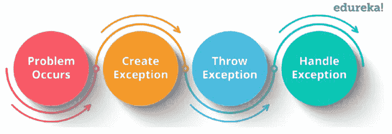

# 知道如何处理 Selenium 中的异常

> 原文：<https://medium.com/edureka/exceptions-in-selenium-369c38155e7d?source=collection_archive---------0----------------------->


Exceptions In Selenium — Edureka

随着世界朝着软件开发的方向发展，测试在使过程无缺陷中扮演着至关重要的角色。使用 Selenium 的自动化测试就是这样一个工具，它有助于发现错误并解决它们。Selenium 中的异常是一个重要的概念，它有助于我们处理错误和避免软件故障。通过这篇关于 Selenium 中异常的文章，我将让您全面了解处理异常的基础和各种方法。

在这篇文章中，我将涉及以下主题。

*   异常处理简介
*   已检查与未检查异常
*   例外的基本示例
*   例外的类型
*   处理异常的方法

# 异常简介

异常是程序执行过程中出现的事件或问题。当一个异常发生时，正常的程序流程停止，并创建一个异常对象。然后，程序试图找到能够处理这个异常的人。异常对象包含很多调试信息，比如方法层次结构、异常发生的行号、异常的类型等。

当你开始使用 [Selenium webdriver](https://www.edureka.co/blog/selenium-webdriver-tutorial?utm_source=medium&utm_medium=content-link&utm_campaign=exceptions-in-selenium) 时，你会根据你写的代码遇到不同的异常。相同的代码有时能正常工作，有时却不能。无论何时开发任何脚本，您都试图给出工作良好的最佳质量的代码。但不幸的是，有时异常是我们开发的脚本的副作用，往往会失败。这就是处理异常非常重要的原因。



异常处理机制遵循上图所示的流程。但是如果不处理异常，可能会导致系统故障。这就是处理异常非常重要的原因。现在让我们进一步了解异常的各种类别。

# 已检查与未检查异常

基本上，在 Selenium 中有两种类型的例外，它们如下:

*   检查异常
*   未检查的异常

让我们深入了解这两个例外。

*   **检查异常**
    它是发生在编译时的异常，也叫编译时异常。如果一个方法中的一些代码抛出了一个检查过的异常，那么这个方法要么必须处理这个异常，要么必须使用 *throws* 关键字指定这个异常。
*   **未检查异常**
    它是在执行时发生的异常，称为*运行时异常。*在 C++中，所有的异常都是不检查的，但是在 Java 中，异常既可以检查也可以不检查。因此，编译器不会强制处理或指定异常。由程序员来指定或捕捉异常。

## 例外的基本示例

```
class Exception{
public static void main(String args[]){
try{
//code that may raise an exception</span>
}
catch(Exception e){
// rest of the program
}
}
}
```

上面代码代表了一个异常，其中在 try 块中，我们将编写一个可能引发异常的代码，然后在 catch 块中处理该异常。理解了这一点之后，让我们进一步看看不同类型的异常，这些异常导致程序正常执行流程的中断。

# 例外的类型

## **WebDriverException**

当我们试图对不存在的驱动程序执行任何操作时，就会出现 WebDriver 异常。

```
WebDriver driver = new InternetExplorerDriver();
driver.get("[http://google.com](http://google.com)");
driver.close();
driver.quit();
```

## **NoAlertPresentException**

当我们试图执行一个动作时，例如，在一个要求的地方不需要的 accept()或 dissolve()；给了我们这个例外。

```
try{
driver.switchTo().alert().accept();
}
catch (NoAlertPresentException E){
E.printStackTrace();
}
```

## **NoSuchWindowException**

当我们试图切换到一个不存在的窗口时，就会出现这个异常:

```
WebDriver driver = new InternetExplorerDriver();
driver.get("[http://google.com](http://google.com)");
driver.switchTo().window("Yup_Fail");
driver.close();
```

在上面的代码片段中，第 3 行抛出了一个异常，因为我们试图切换到一个不存在的窗口。

## **NoSuchFrameException**

与窗口异常类似，帧异常主要发生在帧之间的切换过程中。

```
WebDriver driver = new InternetExplorerDriver();
driver.get("[http://google.com](http://google.com)");
driver.switchTo().frame("F_fail");
driver.close();
```

在上面的代码片段中，第 3 行抛出了一个异常，因为我们试图切换到一个不存在的帧。

## **NoSuchElementException**

当我们的 WebDriver 在 DOM 中找不到 web 元素时，就会抛出这个异常。

```
WebDriver driver = new InternetExplorerDriver();
driver.get("[http://google.com](http://google.com)");
driver.findElement(By.name("fake")).click();
```

现在，请参阅 [Selenium](https://www.edureka.co/blog/10-reasons-to-learn-selenium?utm_source=medium&utm_medium=content-link&utm_campaign=exceptions-in-selenium) 文章中的异常部分，了解用于处理异常的各种方法。

# 处理异常的方法

1.  **Try:** try 块用于封装可能抛出异常的代码。
2.  **Catch:** catch 块用于处理异常。它只能在 try 块之后使用
3.  **Finally:** finally 块是用于*执行重要代码*如关闭连接、流等的块。无论异常是否被处理，它总是被执行。
4.  **Throw:** throw”关键字用于抛出异常。
5.  Throws:“Throws”关键字用于声明异常。它不会抛出异常。它指定方法中可能会出现异常。它总是与方法签名一起使用。

让我们看一个小例子来理解如何使用异常方法处理抛出的异常。让我们看一下代码。

```
package Edureka;
import java.util.concurrent.TimeUnit;
import java.util.concurrent.TimeoutException;
import org.openqa.selenium.By;
import org.openqa.selenium.NoAlertPresentException;
import org.openqa.selenium.NoSuchElementException;
import org.openqa.selenium.WebDriver;
import org.openqa.selenium.chrome.ChromeDriver;
import org.openqa.selenium.firefox.FirefoxDriver;
import org.openqa.selenium.support.ui.ExpectedConditions;
import org.openqa.selenium.support.ui.Wait;
import org.openqa.selenium.support.ui.WebDriverWait;
public class Exceptionhandling {
public static void main(String[] args) throws InterruptedException, TimeoutException{
System.setProperty("webdriver.firefox.driver", "C:\\Selenium-java-edureka\\chromedriver_win32\\chromedriver.exe");
WebDriver driver = new FirefoxDriver();
WebDriverWait wait = new WebDriverWait(driver, 10);
driver.get("[https://www.google.com](https://www.google.com)");
try{
driver.findElement(By.xpath("//*[[@id](http://twitter.com/id)='register']")).click();
}catch (Exception e) {
System.out.println("Register element is not found.");
throw(e);
}
System.out.println("Hello");
}
}
```

让我们深入了解每种方法的功能。

## 尝试法

在上面的代码中，我使用了一个 try 块来输入抛出异常的语句。这里，这个语句 driver . find element(by . XPath("//*[@ id = ' register ']")。单击()；抛出异常，因为 Selenium 在 Google 搜索页面中找不到特定的元素。所以，一旦抛出异常，程序的正常执行就会被中断。现在，让我们看看它在 catch 块中是如何处理的。

## 捕捉方法

这里的任务是处理这个异常并继续执行程序。为此，我编写了一个 catch 块来处理抛出的异常。它应该总是写在 try 块之后。所以当你执行程序时，它会打印出剩下的语句。

## 投掷方法

众所周知 *throw* 是一个用来传递异常的关键字。但是，有趣的是，不管 catch 块是否处理了异常，仍然会引发异常。这导致中断程序的正常执行流程。在上面的代码中，在 catch 块处理了异常之后，我编写了一个语句来抛出一个异常。

## Throws 方法

Throws 声明用于声明异常。例如，它可以声明中断异常、超时异常等。这就是如何使用各种方法来处理程序中出现的异常。

至此，我们结束了这篇关于 Selenium 中异常的文章。我希望你理解了这些概念，并有助于增加你知识的价值。

如果你想查看更多关于人工智能、DevOps、道德黑客等市场最热门技术的文章，那么你可以参考 [Edureka 的官方网站。](https://www.edureka.co/blog/?utm_source=medium&utm_medium=content-link&utm_campaign=exceptions-in-selenium)

请留意本系列中的其他文章，它们将解释硒的各个方面。

> 1.[硒教程](/edureka/selenium-tutorial-77879a1d9af1)
> 
> 2.[Selenium web driver:TestNG For Test Case Management&报告生成](/edureka/selenium-webdriver-tutorial-e3e6219f21ad)
> 
> 3.[构建数据驱动、关键字驱动的&混合 Selenium 框架](/edureka/selenium-framework-data-keyword-hybrid-frameworks-ea8d4f4ce99f)
> 
> 4.[硒中的定位器](/edureka/locators-in-selenium-f6e6b282aed8)
> 
> 5. [XPath 教程](/edureka/xpath-in-selenium-cd659373e01a)
> 
> 6.[等待硒](/edureka/waits-in-selenium-5b57b56f5e5a)
> 
> 7.[为分布式硒测试设置硒网格](/edureka/selenium-grid-tutorial-ef342799c484)
> 
> 8.[硒使用 Python](/edureka/selenium-using-python-edc22a44f819)
> 
> 9.[使用 LambdaTest 的跨浏览器测试](/edureka/cross-browser-testing-9299b04ce277)
> 
> 10.[使用 Selenium 进行跨浏览器测试](/edureka/cross-browser-testing-using-selenium-90b1911c6d60)
> 
> 11.[在 Selenium 中处理多个窗口](/edureka/handle-multiple-windows-in-selenium-727ba5f8f6a7)
> 
> 12.[Selenium 中的页面对象模型](/edureka/page-object-model-in-selenium-bc4d7c8c4203)
> 
> 13.[硒项目](/edureka/selenium-projects-b2df15d35fe2)
> 
> 14. [QTP vs 硒](/edureka/qtp-vs-selenium-338f3d3bbfa7)
> 
> 15.[硒 vs RPA](/edureka/selenium-vs-rpa-84159dbcd0f2)
> 
> 16. [Selenium WebDriver 架构](/edureka/selenium-webdriver-architecture-565e2db26dd5)
> 
> 17.[使用黄瓜&硒](/edureka/cucumber-selenium-tutorial-aefec05f4733)进行网站测试

*原载于 2019 年 4 月 25 日 https://www.edureka.co**的* [*。*](https://www.edureka.co/blog/exceptions-in-selenium/)