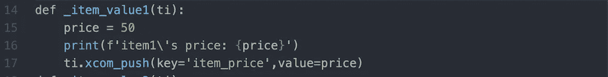

# 在 Airflow(XCOM)中的任务之间交换数据

> 原文：<https://medium.com/walmartglobaltech/exchange-data-between-tasks-in-airflow-xcom-d32a02da21a3?source=collection_archive---------0----------------------->

Source: [https://afiahealth.com/challenges-sharing-data-separate-ehrs/](https://afiahealth.com/challenges-sharing-data-separate-ehrs/)

## 介绍

Airflow 是一个调度工具，就像 Control-M、Oozie 和 Automic 一样。在 Automic 中，我们设置了参数来更新数据库中的变量，我们可以在工作流中的下一个即将到来的任务中使用该变量。在气流中实现相同的场景，如 1。)列出给定路径 2 中的文件名的第一个任务。)第二个任务下载列出的文件。

为了实现这个场景，我们有两种方法在气流中实现

## 不同的方法备选方案 1/备选方案 2:

1.)使用数据库等外部工具从第一个任务推送数据，并在第二个任务中从数据库中提取这些数据。在这里，我们必须设置到外部工具的连接，并且外部工具应该可用，以便在任务之间共享数据。

2.)在没有任何外部工具的情况下，我们可以在称为 XCOM 的两个任务之间共享数据。XCOM(交叉通信)允许在 Airflow 中的任务之间交换少量数据。XCOM 将这些中间数据存储在 Airflow 的元数据中，我们将在下面讨论这个选项。

**气流中的 XCOM:**

在 dag 文件夹路径中添加 XCOM_PUSH_PULL.py 代码后，它将出现在 UI 中，如下所示。

Figure 1: Shows the DAG view in UI

在处理任务时，item_price_a、Item_price_b 和 Item_price_c 将使用 XCOM_PUSH，并使用以下代码设置这些变量的值。

Figure 2: Shows the code to push data to database

上述作业中的 Task4 将使用 XCOM_PULL 从数据库中提取数据，并使用以下代码打印数据。

Figure 3: Shows the code to pull data from database

# 【XCOM _ PUSH 如何在气流中工作:

**XCOM _ PUSH 所需的输入:**它需要键和值，这些值必须被推送到气流元数据库，如下所示。

Figure 4: Shows the input required by xcom push

使用上面的代码，如果我们触发 DAG，记录将被插入到气流元使用关键字为“项目价格”和价值为“50”。它将在“管理-> XCOMS”选项卡下的气流 UI 中可见，如下所示。

Figure 5: Shows the inserted value in UI

# XCOM_PULL 在气流中的工作原理:

将数据推送到气流元之后，我们必须使用任务实例方法 XCOM_PULL 来拉取相同的数据。与 XCOM_PUSH 相同，XCOM_PULL 需要两个输入参数:

1.  )task_id →只从匹配 id 的任务中提取 XComs
2.  )键→仅返回具有匹配键的 XComs

我们必须像下面这样传递这个变量

Figure 6: Shows the input required by xcom pull

我们可以指定多个任务 id，因此我们可以一次从多个任务中提取 xcom，并且我们必须给出一个键来提取正确的 xcom。

我们使用从任务 item_price_a 创建的关键字 *item_price* 提取 XComs。触发 DAG 后，我们可以在日志中看到如下值

Figure 7: Shows the log with inserted data

# XCom 的局限性:

Airflow 不是一个数据处理框架，所以避免在任务之间发送巨大的数据帧。

如果我们试图在任务之间传输更多数据，我们可能会以内存问题告终，因为 Airflow 不是一个处理框架，而是一个编排器。XCom 在气流中的限制大小基于我们用于气流元数据的数据库。

对于 SQLite → 2GB、Postgres →1GB 和 MySQL → 64KB

# ***参考文献:***

[https://air flow . Apache . org/docs/Apache-air flow/stable/concepts/xcoms . html](https://airflow.apache.org/docs/apache-airflow/stable/concepts/xcoms.html)

# 结论:

今天，您已经学习了如何使用 Airflow 中的 XCOM 在 Airflow 中的任务之间共享数据。现在，您已经拥有了在 Dag 中的任务之间进行有效通信所需的一切。请记住，Airflow 不是一个数据处理框架，而是一个数据编排器。不要使用 XComs 来交换庞大的数据集，这样就可以了。