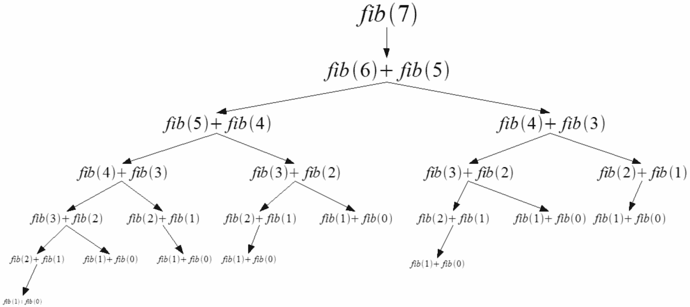
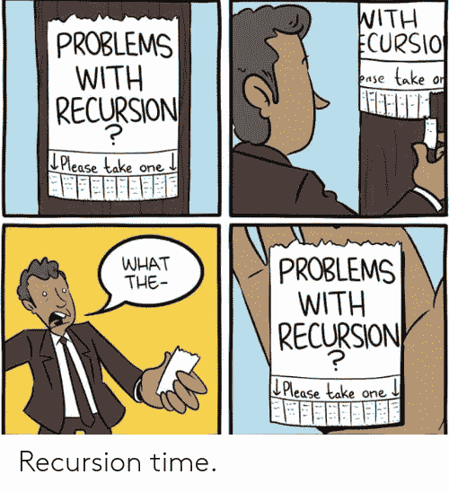
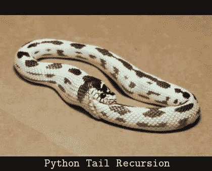
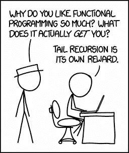

# 排除项:使用尾部递归实现高效递归

> 原文：<https://blog.kotlin-academy.com/excluded-item-use-tail-recursion-to-achieve-efficient-recurrence-364593eed969?source=collection_archive---------0----------------------->

> 这本来是有效的 Kotlin(没有迷因)中的一个项目，尽管我决定不把它包括在最终的书中，因为有限的`tailrec`能力，以及有限的这个修饰符的效用。这本书现在已经出版并且稳定，可以作为电子书[和纸质书](https://leanpub.com/effectivekotlin/)[找到。](https://effectivekotlin.eu/)

递归是一种有用的技术，可以帮助我们简化一些算法。例如，考虑一个函数来计算斐波那契数列中第 n 个位置的元素。斐波纳契数列被定义为一个数字序列，我们从两个常数开始，然后通过将前两个常数相加来计算下一个元素。举个例子，假设我们从 0 和 1 开始。这就是我们的序列的样子:

```
Position  0   1   2   3   4   5   6   7   8   9  10  11
Value     0   1   1   2   3   5   8  13  21  34  55  89
```

我们是这样计算的:

```
0 + 1 = 1
1 + 1 = 2
1 + 2 = 3
2 + 3 = 5
3 + 5 = 8
...
```

该序列在数学上定义为:

```
 { f if n == 0
fib(n, f, s) = { s if n == 1
               { fib(n-1, f, s) + fib(n-2, f, s) otherwise
```

使用这个定义，我们可以用以下方式定义我们的函数:

```
**fun** fib(
   n: Int,
   first: BigInteger,
   second: BigInteger
): BigInteger = **when** (n) {
   0 -> first
   1 -> second
   **else** -> *fib*(n - 1, first, second) + *fib*(n - 2, first, second)
}
```


Simpsons episode created using recurrence

这种解决方案是可行的，但是扩展性不好。我们通过计算一个值需要多少种操作来估计可伸缩性。在这种情况下，我们可以计算出我们需要多少补充。这个数字疯狂增长！试想一下，你需要计算`fib(7)`。你可以在下面的图片中看到它是如何计算的。为了计算`fib(7)`的答案，你需要使用加法 20 次。一般来说，使用上面的实现，计算`fib(n)`我们需要`fib(n)-1`加法。

[](https://www.kt.academy/workshop/refactoringToCleanCode)

不应该是那样的。如果你在纸上做同样的事情，你可以通过将前两个数相加来计算下一个数。你只需要做 5 次手术。这可以通过使用经典的迭代方法来实现:

```
**fun** fib(
   n: Int,
   first: BigInteger,
   second: BigInteger
): BigInteger {
   **var** l = first
   **var** lm1 = second
   **for** (i **in** 2..n) {
      **val** tmp = l
      l += lm1
      lm1 = tmp
   }
   **return** l
}
```

它不漂亮，但是很好用。它的复杂度最终是线性的。这个函数优化得很好。大概对于一些开发者来说，这也将是可读性最强的解决方案。对我来说不是，对许多其他开发者来说也不是。它很长，突变点很少。这也要求我们在中间定义一个临时变量。尽管我们仍然可以使用递归并模拟迭代过程。我们只需要修改参数:

```
**fun** fib(
   n: Long,
   first: BigInteger,
   second: BigInteger
): BigInteger = **when** (n) {
   0L -> first
   1L -> second
   **else** -> *fib*(n - 1, second, first + second)
}
```


When you talk to functional programming passionate, do not ever say things like “Recursion doesn’t make sense” or “Why using recursion if we have perfectly working loops”. Unless you are well insured.

这样的解决方案更简单，并且最有可能被熟悉递归的人所理解。这样的风格在函数式编程社区中也非常流行。

与基于循环的迭代方法相比，这种解决方案有一个重要的缺点。当我们使用递归时，就像在每一步中我们打开一个新函数，直到最后一个函数被计算出来，我们才能关闭它。这对性能来说并不是问题，但是我们搞乱了函数栈。问题是，如果我们打开了太多的功能，我们可能会面临一个`StackOverflowError`:

```
*fib*(Long.**MAX_VALUE**, 0, 1)Exception in thread "main" java.lang.StackOverflowError
   at TestKt.fib(Test.kt:6)
   at TestKt.fib(Test.kt:6)
   at TestKt.fib(Test.kt:6)
   at TestKt.fib(Test.kt:6)
```



Two biggest problems with recursion are the possibility of infinite recursion and StackOverflowError.

这一直是递归函数的一个问题。虽然 Kotlin 引入了一个特殊的修饰符，它可以让我们保持递归符号，并具有类似于使用循环实现的效率和行为。这个修饰符是`tailrec`，代表尾部递归。所以如果我们在函数中使用它:

```
**tailrec fun** fib(
   n: Long,
   first: BigInteger,
   second: BigInteger
): BigInteger = **when** (n) {
   0L -> first
   1L -> second
   **else** -> *fib*(n - 1, second, first + second)
}
```

你不会看到`StackOverflowError`。这是因为在幕后，我们的函数将被编译成一个没有实际递归的函数，而是一个循环。所以我们的函数被编译成类似这样的东西:

```
**tailrec fun** fib(
   n: Long,
   first: BigInteger,
   second: BigInteger
): BigInteger {
   **var** n = n
   **var** first = first
   **var** second = second
   **while** (**true**) {
      **when** (n) {
         0L -> **return** first
         1L -> **return** second
         **else** -> {
            n--
            **val** prevFirst = first
            first = second
            second += prevFirst
         }
      }
   }
}
```

要使用`tailrec`修改器，我们需要匹配一些标准。函数必须调用自己作为它执行的最后一个操作。当递归调用后有更多代码时，不能使用尾部递归，也不能在 try/catch/finally 块中使用它。另外，目前只有 JVM 支持尾部递归。



I wanted to use Kotlin, but islands are not so good at eating itself.

[](https://leanpub.com/effectivekotlin/c/3YYtCtqCC6a4)

# 使函数尾递归

使递归函数尾递归并不总是容易的。要做到这一点，我们需要在一个论点中积累结果。假设我们需要一个函数，它给出一个集合的所有子集。这样一个函数在数学上叫做 powerset，这就是我们如何给函数命名的。怎么才能算出来呢？让我们从一点观察开始。让我们计算几个集合的 powerset:

```
powerset(setOf(1)) == setOf(
   setOf(), setOf(1)
)powerset(setOf(1, 2)) == setOf(
   setOf(), setOf(1), setOf(2), setOf(1, 2)
)powerset(setOf(1, 2, 3)) == setOf(
   setOf(), setOf(1), setOf(2), setOf(1, 2),
   setOf(3), setOf(1, 3), setOf(2, 3), setOf(1, 2, 3)
)
```

看着这个，你可能会注意到一些相似之处。可以看到`setOf(1, 2)`的动力集包含了`setOf(1)`的动力集。其余为`setOf(setOf(2), setOf(1, 2))`，与`setOf(1)`的 powerset 相同，每组加 2。

想想`setOf(1, 2, 3)`的 powerset 也是如此。包含`setOf(1, 2)`的 powerset，其余同`setOf(1, 2)`的 powerset，每组加 3。这个问题可以这样定义:

```
**fun** <T> Collection<T>.powerset(): Set<Set<T>> = **when** {
   isEmpty() -> *setOf*(*setOf*())
   **else** -> {
      **val** last = *last*()
      **val** subpowerset = *dropLast*(1).*powerset*()
      subpowerset + subpowerset.*map* **{ it** + last **}** }
}
```

这个函数工作正常:

```
*println*(*setOf*(1).*powerset*()) *// [[], [1]]**println*(*setOf*(1, 2).*powerset*()) *// [[], [1], [2], [1, 2]]**println*(*setOf*(1, 2, 3).*powerset*())*// [[], [1], [2], [1, 2], [3], [1, 3], [2, 3], [1, 2, 3]]*
```

但是它不是尾递归的，并且更难实现，因为我们在递归调用后累加结果。我们可以改进它，但这需要我们在争论中积累结果。

如果你想试一试，现在就停止阅读，自己修改这个函数，让它尾递归。要查看解决方案，请继续阅读。

以下是这个问题的解决方案:

```
**fun** <T> Collection<T>.powerset(): Set<Set<T>> =
   *powerset*(**this**, *setOf*(*setOf*()))**private tailrec fun** <T> powerset(
   left: Collection<T>,
   acc: Set<Set<T>>
): Set<Set<T>> = **when** {
   left.isEmpty() -> acc
   **else** -> {
      *powerset*(
         left = left.*drop*(1),
         acc = acc + acc.*map* **{ it** + left.*first*() **}** )
   }
}
```

请注意，我们在一个论点中积累的结果。具体在`acc`参数中。由于这一点，尾部递归成为可能。在迭代过程中，我们获取第一个元素，并用这个元素添加到`acc`变量中。这些是`powerset(setOf(1,2))`的下一个`powerset`调用:

```
powerset({1,2,3}, {{}})
powerset({2,3}, {{}, {1}})
powerset({3}, {{}, {1}, {2}, {1,2}})
powerset({}, {{}, {1}, {2}, {1,2}, {3}, {1,3}, {2,3}, {1,2,3}})
```

请注意，我们使用 head(列表的第一个元素)和 tail(除第一个元素之外的所有元素)，而不是 last 和 init(除 last 之外的所有元素)，但是末尾元素的顺序是相同的。就是因为操作顺序不一样。累加会立即发生，不会等待剩余计算的幂集。

如你所见，尾递归是我们用来优化递归函数的一种技术。它让我们免受`StackOverflowError`的困扰，并提高了性能。尽管由于它的要求，引入它并不总是容易的。要使用它，我们需要在论点中积累结果。遗憾的是，这排除了许多我们可能需要使用递归的情况。

请记住，递归不是灵丹妙药。了解它是有价值的，因为它是您工具箱中的一个有用的工具，使这样的函数尾递归可能会使它们更有效，尽管它可以应用的情况有限。



We need to get something out of life.

# 单击👏说“谢谢！”并帮助他人找到这篇文章。

了解卡帕头最新的重大新闻。学院，[订阅时事通讯](https://kotlin-academy.us17.list-manage.com/subscribe?u=5d3a48e1893758cb5be5c2919&id=d2ba84960a)，[观察 Twitter](https://twitter.com/ktdotacademy) 并在 medium 上关注我们。

如果您需要 Kotlin 工作室，请查看我们如何帮助您: [kt.academy](https://www.kt.academy/) 。

[](https://kotlin-academy.us17.list-manage.com/subscribe?u=5d3a48e1893758cb5be5c2919&id=d2ba84960a)