# 通过结合 API 和 WEB 测试执行端到端测试

> 原文：<https://medium.easyread.co/execute-end-to-end-testing-by-combining-api-and-web-tests-d0660b67fac8?source=collection_archive---------0----------------------->

Photo by [Romson Preechawit](https://unsplash.com/@woodies11?utm_source=unsplash&utm_medium=referral&utm_content=creditCopyText) on [Unsplash](https://unsplash.com/?utm_source=unsplash&utm_medium=referral&utm_content=creditCopyText)

公司的试用期已经结束，气氛比平时平静。因此，这是创造一个故事的正确时刻。作为质量保证工程师，我最接近的工作是软件测试。

一些人可能仍然不知道什么是软件测试。定义可能因来源而异，但总的来说，重点是相同的，即确保实际结果与预期结果相同。

# **软件测试**

> [**软件测试**](https://www.guru99.com/types-of-software-testing.html) 定义为检查实际结果是否与预期结果相匹配并确保软件系统无缺陷的活动。

有超过 [150 种测试类型](https://www.guru99.com/types-of-software-testing.html)并且还在增加。此时，我们将只根据本文的标题来讨论 API 和 WEB 测试。

## **API 测试**

> [**API 测试**](https://en.wikipedia.org/wiki/API_testing) 是[软件测试](https://en.wikipedia.org/wiki/Software_testing)的一种，涉及直接测试[应用编程接口](https://en.wikipedia.org/wiki/Application_programming_interface)(API)并作为[集成测试](https://en.wikipedia.org/wiki/Integration_testing)的一部分，以确定它们是否满足功能、可靠性、性能和安全性的预期。

与 WEB 测试不同，API 测试是在消息层执行的，没有 GUI。在结合上述两种类型的测试之前，首先确定将在 API 上执行什么类型的测试。

[常见的 API 测试包括](https://cloudqa.io/api-testing-and-automation-101-the-essential-guide/):单元测试、负载测试、安全测试、互操作性测试、WS 符合性测试、渗透测试和功能测试。

在本次讨论中，我们将执行功能测试，此类测试主要关注 API 的功能。这将包括验证 HTTP 响应代码的测试用例、响应的验证、API 返回任何错误时的错误代码等等。

## **网页测试**

> [**Web 测试**](https://www.softwaretestinghelp.com/web-application-testing/) 是一种测试网站或 Web 应用程序潜在 bug 的软件测试实践。在上线之前，这是对基于网络的应用程序的全面测试。

在网络测试中，我们也将执行功能测试**。**

常见的网站测试包括:功能测试、可用性测试、界面测试、数据库测试、兼容性测试、性能测试、安全性测试和人群测试**。**

[在 Web 测试中，功能测试](https://www.guru99.com/web-application-testing.html)用于检查您的产品是否符合您的预期规格，以及您在开发文档中为其制定的功能要求。

从上面的标题和解释中，我们想到了几个问题，我把它们总结如下

## **问题**:

*   Web 和 API 测试自动化可以用一个网站的单一框架来完成吗？
*   [有没有结合 Web 和 API 测试的方法？](https://forum.katalon.com/t/is-there-a-way-to-combine-web-and-api-tests/18160)
*   如何从 API 响应中获取价值，并在 Web 测试上使用它来完成端到端的测试？

希望以上三个问题也能代表读者心中产生的所有疑问。

## **回答:**

*   Web 和 API 测试自动化可以用一个网站的单一框架来完成吗？

市场上有大量的软件测试工具，其中一个可以使用单一框架来完成 Web 和 API 测试自动化的工具是[**Katalon Studio**](https://www.katalon.com/)。

Katalon 是一款强大的解决方案，可帮助您实现 Web、API、移动和桌面自动化。

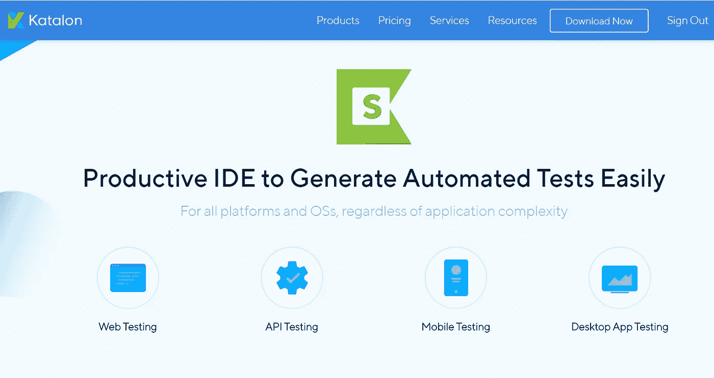

Source: [https://www.katalon.com/katalon-studio/](https://www.katalon.com/katalon-studio/)

*   [**有没有结合 Web 和 API 测试的方法？**](https://forum.katalon.com/t/is-there-a-way-to-combine-web-and-api-tests/18160)

在 [Katalon](https://www.katalon.com/) 的官网上，提到 Katalon 跨 - **平台**快速生成自动化测试**。这句话解释了 Katalon 可以用来结合 WEB 和 API 测试。证明这一点的简单方法是，为 WEB 和 API 制作彼此相关的测试用例，然后使用一个测试套件运行。下图是一个测试套件，其中有几个来自 API 和 WEB 的测试用例:**

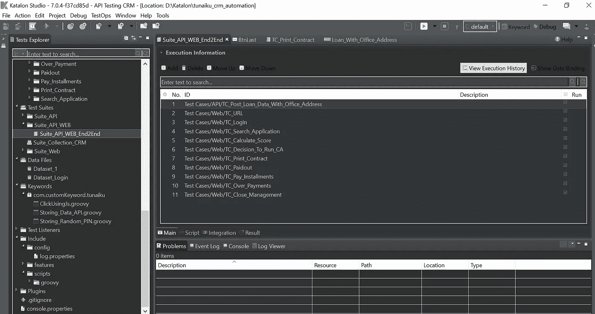

Test Suite API and WEB

*   **如何从 API 响应中获取值，并在 WEB 测试上使用，完成端到端测试？**

在回答上面的问题之前，我最好解释一下什么是端到端测试。

> [**端到端测试**](https://www.softwaretestinghelp.com/what-is-end-to-end-testing/) 是一种从头到尾测试一个应用流程的软件测试方法论。端到端测试的目的是模拟真实的用户场景，并验证被测系统及其组件的集成和数据完整性。

基于上面的解释，我们在端到端测试中想要做的是从头到尾测试应用程序的流程。所选择的流程是从 [**图耐库**](https://tunaiku.com/) 申请上的贷款申请流程开始到贷款偿还。贷款流程将不会使用 WEB/Mobile 应用程序来执行，而是使用 API 来执行，从而缩短了时间。

**步骤如下:**

**1。为 API 贷后数据创建对象存储库**

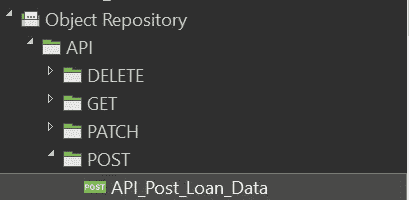

Object Repository API Post Loan Data

创建对象存储库与在 postman 中发出请求是一样的，比如填充主体、头、身份验证和端点。这是为了在制作测试用例时更容易，只需要在测试用例中调用这个存储库对象。对于正文请求，标题、身份验证和端点将不会显示，因为它们是机密的。

**2。为 API 贷后数据创建一个测试用例**

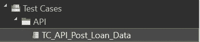

Test Case API Post Loan Data

在测试用例中调用对象存储库如下面的代码所示:

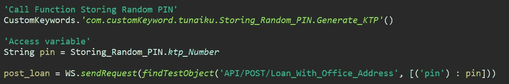

Call Object Repository in Test Case

实际上，执行 post loan data API 只需要一行代码，
,但是因为在主体请求中我将 PIN 设置为 parameterize，所以我添加了上面的两行代码来调用一个关键字并生成一个随机 PIN。创建关键字是为了生成一个随机字符串，字符串的长度是 16 位，因为在这个 API 中有一个验证，即所使用的 PIN 必须是唯一的，这样已经使用的 PIN 就不能被重复使用。

以下是当使用的 PIN 被参数化时正文请求的显示方式:

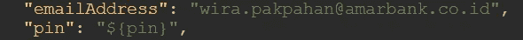

PIN is set parameterize

**3。将 API 响应转换成对象**

在执行 API Post Loan 数据之后，它将返回一个响应。在 Katalon 中，使用 **getResponseText()** 获取 API 响应的函数如下所示:

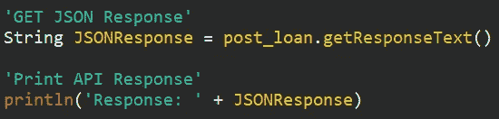

Get and Print API Response

打印时，API 响应如下所示:

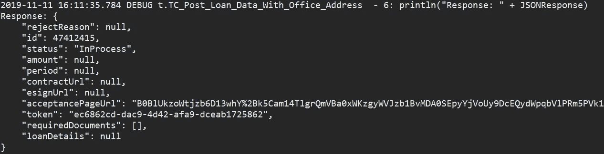

JSON text before convert to Object

在上面的响应显示中，我们可以处理一些值，因为它们具有 id、状态和令牌等值。API 响应以 JSON 文本的形式返回，因此需要使用 JsonSlurper 将其转换为对象。

[***JsonSlurper***](http://groovy-lang.org/json.html)**是一个将 JSON 文本或阅读器内容解析成常规数据结构(对象)的类，例如映射、列表和原始类型，如整数、双精度、布尔和字符串。**

**在此之前，我们必须将 JsonSlurper 命名为 something，在本例中，我们将 JsonSlurper 对象命名为 SlurperLoan。然后使用 SlurperLoan 调用 parseText 函数，该函数将它转换成一个对象，在本例中命名为 result。**

**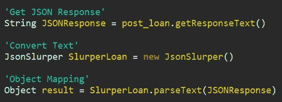**

**Processing JSON Response**

**从上面显示的 API 响应来看，要在 Web 测试中检索和使用的值是 id。为了找出 id 的值，我们需要用下面的代码在控制台中打印并显示它:**

**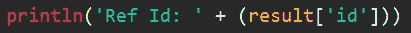**

**Print value id**

**代码解释了我们正在打印 JSONResponse 的 id 值，该值已经转换为结果中的对象形式。但这个值只能在类内取，如何使其全局化？**

****4。Create Keyword**
需要关键字，所以每次我们想要值的时候只需要调用关键字加上我们想要使用的对象的值。**

**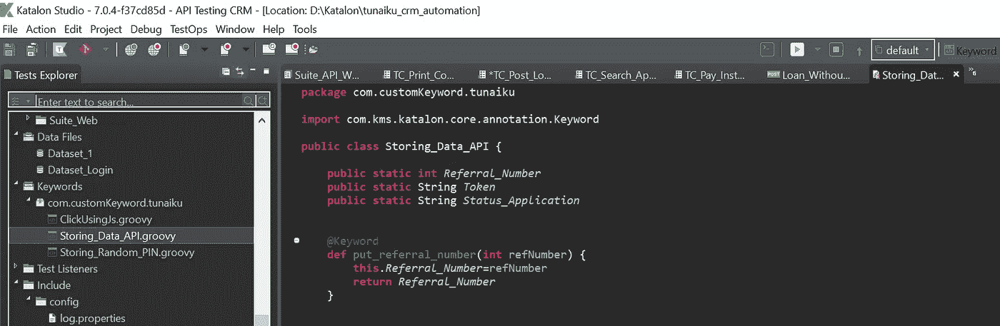**

**Keyword Storing Data API**

**该关键字用于存储被调用对象的值。
其工作方式如下:**

*   **将 id 值存储在 Referral_Number 变量中**

**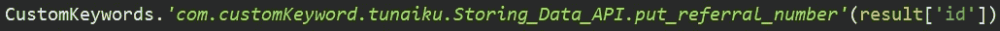**

**Store id value from API Response**

**这个关键字会在第一个测试用例中被调用:**TC _ Post _ Loan _ Data _ With _ Office _ Address****

**源代码可以在这里看到:**

****TC_Post_Loan_Data_With_Office_Address.groovy****

*   **键入保存在文本字段中的 API 响应的值**

**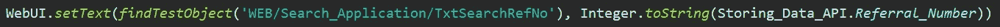**

**Set text id to text field**

**这个关键字将在第四个测试用例中被调用:
**TC _ Search _ Application****

**源代码可以在这里看到:**

****TC_Search_Application.groovy****

****5。在测试套件中运行端到端测试****

**在端到端测试中，测试套件中有几个已排序的测试用例，顺序如下:**

**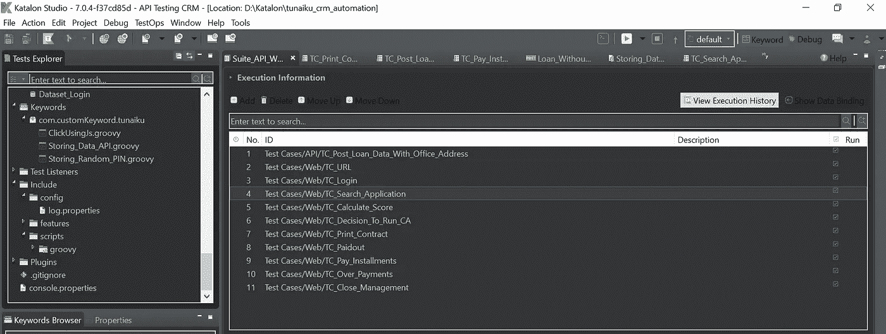**

**Test Suite API_WEB End to End**

**这是我的第一个故事。希望对你有用😃。感谢您的阅读😎**

## ****行情****

**如果你没试过，就不要说我不行。无论你做什么，都要全心全意去做！**

# ****参考文献****

1.  **[世界顶级软件测试专家](https://www.aditiconsulting.com/worlds-top-software-testing-professionals)**
2.  **[软件测试的类型:100 个不同测试类型的例子](https://www.guru99.com/types-of-software-testing.html)**
3.  **[API 测试](https://en.wikipedia.org/wiki/API_testing)**
4.  **[API 测试工具和自动化 101:基本指南](https://cloudqa.io/api-testing-and-automation-101-the-essential-guide/)**
5.  **[Web 应用测试完全指南(如何测试一个网站)](https://www.softwaretestinghelp.com/web-application-testing/)**
6.  **[Web 应用测试:网站测试八步指南](https://www.guru99.com/web-application-testing.html)**
7.  **[卡塔隆工作室](https://www.katalon.com/katalon-studio/)**
8.  **[什么是端到端测试:E2E 测试框架及示例](https://www.softwaretestinghelp.com/what-is-end-to-end-testing/)**
9.  **[解析并生成 JSON](http://groovy-lang.org/json.html)**
10.  **[https://gist . github . com/23d 1a 7 ade 2 DAE 619d 642 D1 f 30 BCA 8977 . git](https://gist.github.com/23d1a7ade2dae619d642d1f30bca8977.git)**
11.  **[https://gist . github . com/18a 77323 C4 f 57205271 CCB 3c 74082 e7d . git](https://gist.github.com/18a77323c4f57205271ccb3c74082e7d.git)**