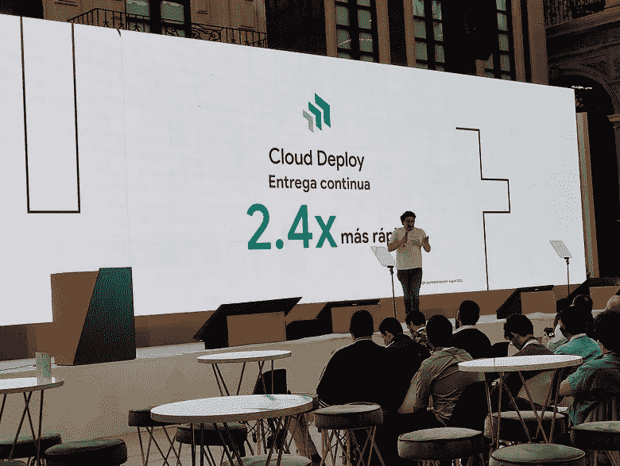

# Google Cloud Next Innovators Hive 体验 - 墨西哥城

> 原文：<https://medium.com/google-developer-experts/experiencia-en-el-innovators-hive-en-google-cloud-next-ciudad-de-m%C3%A9xico-e430d0022d0?source=collection_archive---------6----------------------->

Google Cloud Next 的 Innovators Hive 是聆听 Google Cloud 高阶主管和工程师意见的独特机会,也是向全世界宣布我们最新创新成果的机会。

作为 Google 开发专家,我很高兴作为“演讲者”参加了此次活动,我受到了 Google Cloud 营销团队的邀请,讨论了在多个集群中部署 GitOps 的好处,以及如何在尝试中避免死亡。接下来是此次活动的亮点。

该活动于 2022 年 10 月 27 日在墨西哥城举行,特别是在 Auditorium Espacio R,顺便说一句,这是美丽的,良好的空间,令人震惊的建筑和经典,品尝这个地方。

活动的后勤,动画和组织是一流的,没有空间与活动分开;从灯光游戏到相机的使用,一切都完美和谐。

活动中提到了几个主题,即演讲者大多是谷歌员工,只有这台服务器是 GDE,因此,要解释的每个功能或产品的知识对于它可能对希望实施它的公司/项目产生的影响有非常坚实的基础。

涵盖了诸如:

*   利用 BigQuery 和 Vertex AI 从原始数据转变为更快的机器学习。
*   在多集群中连续部署而不会在尝试中死亡:GKE + Fleet(我的谈话)。
*   通过优化性能和成本来加速机器学习开发。
*   使您的容器化应用程序更简单、更快、更具可扩展性。

就个人而言,我认为这些主题与使用云的公司的当前需求非常相关,但主要是激励那些不愿使用上述工具的公司,并且至少决定在不久的将来考虑可能的集成。

我不能忽视墨西哥城是美丽的,尽管交通繁忙,我是一个新的球迷玉米饼,chilaquiles,最后所有的墨西哥食物(我知道,你已经和我一样饿了)。

显然,学习和经验是惊人的,但最突出的是在生活中出现的机会,并准备这样做。我从未想过要成为 Google Cloud Next 活动的演讲者,我总是在 YouTube 上观看这些活动,并将其作为观众的一部分;但是由于 GDE 计划,显然还有为社区做梦和努力工作的能力,祝福/奖励迟早会到来。

让我们继续社区,继续创造空间,让其他人成长;我在家乡萨拉皮基(Sarapiqui)开始了我的第一次演讲,6 年后,我很高兴在像 Google Cloud Next 这样的高级活动中向数百人展示:梦想成真,在社区播种,成为你自己,你会得到很好的“成果”。

我分享一个关于事件的主要时刻的视频,希望你喜欢, **谢谢总数** 。

[https://youtu.be/mcbJ7drFYqw](https://youtu.be/mcbJ7drFYqw)