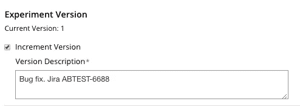
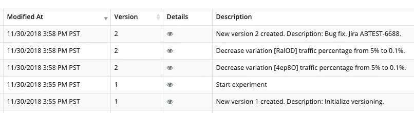
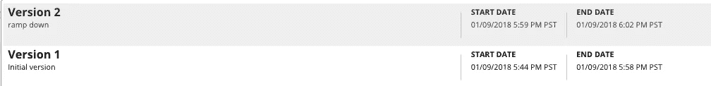

# 实验版本

> 原文：<https://medium.com/walmartglobaltech/experiment-versioning-9dc3d10955cd?source=collection_archive---------5----------------------->

Photo Credit: Dylan Ren

在关于开发博览会的[中，我们讨论了沃尔玛和我们平台的 A/B 测试流程。本文是深入探讨我们构建了什么、为什么构建、如何构建以及如何使用的系列文章之一。](/walmartlabs/on-developing-expo-6aa3330ad652)

实验版本化允许实验者标记测试中的变更，以便定义影响结果的不同变更，并分别捕获每个版本的结果。

# **动机**

作为一名实验者，你可能经常会发现自己处于以下情况:你设置了一个实验，给每个变体一个百分比的流量，然后开始实验。在它运行了一段时间后，你发现你需要对你的实验做些改变。例如，您需要修复一个 bug 或更改流量分配。但是实验已经开始了！虽然我们的平台允许在实验已经开始之后改变流量分配、添加和移除变化、或者改变变化中的处理，但是这样的改变通常会使得在该时间段内分析结果无效。您如何能够容易地确定变更的确切时间，或者孤立地查看变更的结果？

# **老办法**

用户使用下面的黑客来达到上面提到的结果。每当实验者想要对实验做出重大改变并在实验结果中轻松识别这种改变时，他们必须:

1.  将现有实验克隆为新实验
2.  停止现有的实验
3.  在新实验的幕后进行一些手动和痛苦的更改，以确保用户分配与旧实验保持一致。

在回顾结果时，实验者只能通过在实验之间来回翻动来与旧版本的结果进行比较。正如您所看到的，这个“黑客”包含许多容易出错的手动步骤，最终结果并不明显。这也是一个极其痛苦的过程。

# **新的解决方案**

有了实验版本，这个过程就简化了。我们是这样做的。

1.  默认情况下，所有实验都从版本 1 开始。
2.  一个正在运行的实验可以用一个新的版本重新开始，包括对变化的描述。

Increment Version during restart

3.实验者可以很容易地在实验的修订历史中看到版本变化及其细节。

Revision History

4.结果报告的数据管道知道版本控制。这允许按版本查看实验结果，这是该特性的一个重要方面。

正如您所看到的，实验版本化允许我们消除手动的痛苦的“入侵”，相反，它为我们提供了以更加简化和有组织的方式来做这件事的能力。

# **结论**

简而言之，“实验版本化”意味着

*   一个实验可以被分解成多个版本，每个版本都有开始日期和结束日期以及各自独立的数据。
*   保留分配、治疗注射和其他实验数据。
*   实验版本化允许实验结果被分割以隔离变化。

通过引入实验版本控制，分析员可以很容易地对正在运行的实验进行更改，而不会中断分配和治疗注射。针对每个版本分别捕获实验结果，使实验人员能够轻松识别这些变化及其对结果的影响，从而帮助做出更智能的数据驱动型业务决策。