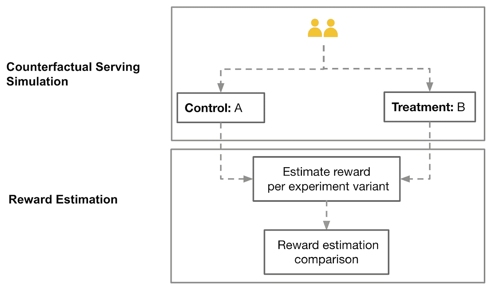

# 无需等待的实验:通过离线重放实验加速迭代周期

> 原文：<https://medium.com/pinterest-engineering/experiment-without-the-wait-speeding-up-the-iteration-cycle-with-offline-replay-experimentation-7a4a95fa674b?source=collection_archive---------0----------------------->

Maxine Qian |数据科学家，实验和计量科学

创意推动创新。创新推动我们的产品朝着我们的使命前进，为每个人带来创造他们热爱的生活的灵感。创新的速度取决于我们能多快获得一个想法的信号或反馈，这样我们就能知道是追求还是转向。在线实验经常被用来评估产品创意，但它既昂贵又耗时。我们能在不进行实验的情况下预测实验结果吗？能在几小时而不是几周内完成吗？我们能迅速挑选出最好的想法来进行在线实验吗？这篇文章将描述 Pinterest 如何使用离线重放实验来提前预测实验结果。

# **在线实验的局限性**

数据支持的决策塑造了我们 Pinterest 产品的发展。所有产品团队都有权通过在线实验(A/B 测试)来测试他们的产品变化，这是一个衡量对 Pinterest 用户(又名 Pinners)影响的过程。然而，在线实验有几个局限性:

*   **缓慢的数据收集**:至少需要 7 天甚至更长时间来提供充足的电力并捕捉任何周模式。
*   **有限同步臂**:只能有有限数量的变化同时运行，以便为每个变化提供足够的样本量。
*   规避风险的处理方法:为了最小化潜在的负面影响，有一种激励去部署更安全、更保守的想法，而不是风险更高但潜在影响更大的想法。
*   **高工程成本**:工程师需要编写生产质量的代码，因为它将在线部署给用户。

由于这些限制，在进行昂贵的在线实验之前对想法进行分类是至关重要的。

# **离线回放实验**

我们如何解决在线实验的这些局限性？通过离线评估评估指标，例如[平均精度](https://en.wikipedia.org/wiki/Evaluation_measures_(information_retrieval)#Mean_average_precision)或 [AUC](https://en.wikipedia.org/wiki/Receiver_operating_characteristic#Area_under_the_curve) ，可以获得概念的初步方向性分析。不幸的是，根据我们的经验观察，这些往往是在线实验表现的糟糕预测。

我们创建了一个叫做离线重放实验的框架，在这个框架中，新想法的表现可以基于历史数据完全离线模拟。在这个框架中，正在讨论的新想法可以是影响所提供内容顺序的任何东西，比如对排名或混合功能的更改。

虽然模拟方法不如在线实验精确，但它通过消除数据收集的等待时间、允许大量同步 arm、避免负面用户影响和节省工程成本来补充在线实验。

离线重放实验可以用来缩小想法漏斗，从一大组可能的候选人到几个值得通过在线实验追求的人。这个框架允许产品团队在几个小时内评估和迭代想法，而不是几周，极大地加快了迭代周期。它由两部分组成:

*   **反事实服务模拟**:它模拟了如果我们在过去部署了变更，我们会为用户提供什么内容。
*   **报酬估算**:估算我们想要比较的每个实验变量的反事实服务结果的报酬(不同类型参与度的价值，如点击)。然后比较两个变量的估计值(例如，对照与处理)来计算升力。

已经有一些关于如何生成反事实服务结果的博客和论文(例如，网飞的[分布式时间旅行用于特征生成](https://netflixtechblog.com/distributed-time-travel-for-feature-generation-389cccdd3907#:~:text=We%20want%20to%20make%20it,past%20posts%20and%20other%20publications.)和[搜索引擎点击度量的反事实估计和优化:案例研究](https://dl.acm.org/doi/10.1145/2740908.2742562))。在这里，我们将重点放在我们的奖励估计方法。

**Figure 1:** Two components of offline replay experiment framework

# **奖励评估方法**

我们将使用图 2 中的一个玩具数据集来说明奖励估计是如何工作的。表 1 显示了反事实的服务日志，即给定一个新的排名或混合函数，我们会为用户提供的项目。表 2 举例说明了生产日志、我们提供给用户的项目及其抽样概率，以及用户操作。每条记录代表一个在页面上排列的 Pin，包含以下信息:

*   **请求**是在请求的结果页面上对所有插入的项目(即，pin)进行分组的关键。
*   **位置**是请求项目的显示位置。
*   **奖励**是目标变量，通常对应点击、点赞等用户动作。
*   **采样概率**是一个项目出现在请求位置的概率。

**Figure 2:** Toy dataset as an illustrative example

为了估计回报，我们在两个数据集之间找到共享相同请求、位置和项目的匹配记录，并将匹配记录的回报相加作为总回报。为了消除选择偏差，我们对每个奖励应用一个权重，它是抽样概率的倒数。直觉上，具有较高采样概率的记录是过度表示的，因此我们希望对其奖励值应用较小的权重。

如图 3 所示，对于反事实服务和生产日志，我们能找到的唯一两个匹配记录是{request=r1，position=1，item=a}和{request=r2，position=3，item=f}，因此估计的回报是 1/0.4 + 0/0.5 = 2.5。

**Figure 3:** Illustrative example of how Top K Match estimator works

我们称这种奖励估计量为**顶 K 匹配**。k 表示估算中包含的槽的深度。在我们的玩具例子中，K 等于 3。报酬估计量有多种变体，在偏差和方差之间进行权衡:

*   **Top K 无偏匹配** : Top K 假设一个物品的奖励与其周围的物品无关。我们可以通过为每个请求匹配整个排序的 top-K 列表来获得无偏的 top-K 重放估计器。如果根据新模型的排名前 K 列表与生产数据集中的请求的前 K 列表相同，则仅计算奖励。在图 2 中，两个日志都没有匹配的记录，因此估计的回报是 0。
*   **前 K 个未排序匹配**:前 K 个匹配和前 K 个无偏匹配的匹配率可能较低，导致方差较大。我们可以通过放宽匹配标准来解决这个问题，只要求 request_id 和 item_id 匹配。如果根据新模型的前 K 个列表中的任何 item_id 与生产数据集中请求的任何位置中的 item_id 相同，则它计算奖励。如图 4 中的玩具示例所示，我们可以为两个日志找到的匹配记录是{request=r1，item=a}、{request=r2，item=d}和{request=r2，item=f}，因此估计的奖励是 1/0.4 + 1/0.4 + 0/0.5= 5。

**Figure 4:** Illustrative example of how Top K Unsorted Match estimator works

值得一提的是，在实现过程中，采样概率通常是不可用的，并且需要对系统进行相当大的更改才能对其进行检测。为了简化问题，我们设置了一个小的总流量集的随机桶，其中我们随机化前 N 个结果的顺序，然后 p 等于 1/N。

# **真实例子**

我们在 [Home feed](https://help.pinterest.com/en/guide/all-about-pinterest) 排名和混合模型上应用了离线重放实验，观察到了令人信服的结果。

我们首先计算了三个报酬估计量的[统计功效](https://en.wikipedia.org/wiki/Power_of_a_test)，发现前 K 个匹配和前 K 个未排序匹配可以有足够的功效来检测我们期望的[效应大小](https://en.wikipedia.org/wiki/Effect_size)，而前 K 个无偏匹配的功效则大大不足。然后，我们使用这两个足够强大的估计器运行离线重放实验，并在 26 个实验比较变量对上运行在线实验。

以指标*点击*为例，我们发现在线和离线提升之间有很强的相关性，如图 5 所示。一般来说，离线提升与较小的在线提升相关，但是基于它们的变体的等级顺序是相似的。

比较在线和离线决策结果也发现了类似的强相关性(即，显著正面、不显著、显著负面)。这些结果表明前 K 个未排序的匹配(K=8)表现最好(即在线结果和离线重放之间具有最高的相关性)。如果我们运行离线重放实验，它将允许我们识别超过 90%的在在线实验中显示出统计上显著和积极提升的候选者，同时过滤掉超过 75%的在在线实验中显示出不显著或消极提升的候选者。

**Figure 5:** Online experiment Lift vs. Offline Experiment Lift

我们还将离线重放结果与平均精度(MAP)进行了比较，MAP 先前用于选择图 6 中的在线实验的候选者。离线回放实验明显优于 MAP。事实上，使用 MAP，我们只能识别出 25%的想法，这些想法最终会在在线实验中显示出统计上显著的积极提升。

**Figure 6:** Online experiment lift vs. Predicted lift based on MAP (left) and Online experiment lift vs. Predicted lift based on Offline replay experiment (right)

为了了解离线重放实验如何帮助缩小我们想要测试的候选变量集，我们研究了离线重放实验与在线重放实验相比如何对变量进行排序。在验证数据中，有五个实验使用了一个以上的治疗方案。图 7 显示了一个示例实验的数据。我们分别计算了基于离线重放实验提升和在线实验提升的变量排序。使用来自在线实验的排序作为基础事实，我们发现离线重放实验可以识别样本中所有实验中提升最高的变体。它表明，我们可以从离线回放中获得有价值的早期见解，并且只挑选最佳想法在在线实验中进行验证。

**Figure 7:** Data of one example experiment

离线回放实验是对我们想法评估工具箱的一个有价值的补充，并在许多方面补充了在线实验。结合线下和线上实验，我们可以在准确性和速度之间取得平衡，更快更有效地推动产品创新。

# **致谢**

感谢陈必忠、、、江、的贡献。特别感谢艾丹·克鲁克、奥拉维尔·古德蒙德松、亚龙·格雷夫和刘铮的反馈和支持。

*要在 Pinterest 了解更多关于工程的知识，请查看我们的* [*工程博客*](https://medium.com/pinterest-engineering) *，并访问我们的*[*Pinterest Labs*](https://www.pinterestlabs.com/?utm_source=medium&utm_medium=blog-article-link&utm_campaign=qian-january-18-2022)*网站。要查看和申请空缺职位，请访问我们的* [*职业*](https://www.pinterestcareers.com/?utm_source=medium&utm_medium=blog-article-link&utm_campaign=qian-january-18-2022) *页面。*