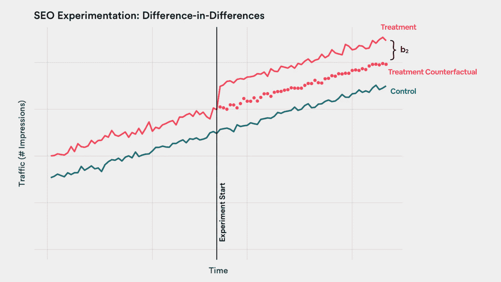

# 搜索引擎优化的实验与测量

> 原文：<https://medium.com/airbnb-engineering/experimentation-measurement-for-search-engine-optimization-b64136629760?source=collection_archive---------0----------------------->

## 利用市场水平的方法来衡量 Airbnb 登陆页面的有效性。

Our San Francisco headquarters has it all, from comfy nooks to sunlit views. It’s the perfect place for a data scientist to brainstorm about experimentation!

对于我们的许多潜在客人来说，计划旅行是从搜索引擎开始的。在 Airbnb，我们希望我们的产品能让老顾客毫不费力地找到，也让新顾客容易发现。搜索引擎优化(SEO)是改进我们网站的过程，更具体地说是我们的登录页面，以确保当旅行者为他们的下一次旅行寻找住宿时，Airbnb 是他们最喜欢的搜索引擎上的顶级结果之一。

Our SEO team focuses on making Airbnb the top result on search engines like Google.

谷歌、雅虎、Naver 和百度等搜索引擎在互联网上部署了自己的“机器人”舰队，以构建网络地图，并从它们点击的页面中抓取信息或“索引”。当针对特定搜索查询对页面进行索引和排序时，搜索引擎会考虑各种因素，包括相关性、网站性能和权威性。为了提高我们的排名，我们可以对页面进行修改，例如澄清我们内容的目的(相关性)，改善页面加载时间(性能)，或者增加指向它的优质链接的数量(权威性)。这样的例子只是触及了我们如何优化网页以提高排名的表面。

例如，在 2017 年底，我们创建了新的登录页面，内部称为“魔毯”，以取代我们正常的搜索结果登录页面。该页面有一个带有图像和搜索框的大标题，以及额外的内容，如下面的评论和列表。

Old Search Results Page (left) vs. the New “Magic Carpet” Landing Page (right)

我们假设这个登录页面会以其更清晰的内容增加相关性，并以其更轻的代码结构减少页面加载时间，以及许多其他改进。这将因此导致我们的网页在搜索引擎结果中的更高排名。

但是由于我们无法知道我们页面的确切排名，我们依赖于*流量*作为排名上升的代理。也就是说，当我们在旧金山搜索页面的排名上升时，我们希望看到搜索引擎对该页面的访问量增加。但是我们如何衡量这种影响呢？

# A/B 测试的局限性

我们的成长团队在几乎每一个产品变化上都非常依赖迭代实验，以确保我们可以测量有效性，并在构建过程中学习。大多数数据科学家能够在设备或用户级别利用传统的 A/B 测试来满足他们所有的实验需求。在这个设置中，参与实验的用户被随机分组到治疗组，我们可以直接比较治疗组和对照组的结果。

A/B 测试具有非常好的[功效](https://en.wikipedia.org/wiki/Power_(statistics))，并且允许完全随机化。在 Airbnb，它们有助于衡量待遇对参与度和转化率指标的影响。这些是我们在 Airbnb 网站上记录的事件，我们可以通过均值差异假设检验，如 [t 检验](https://en.wikipedia.org/wiki/Student%27s_t-test)，轻松测量这些指标的增量提升。

**然而，在我们新的“魔毯”页面的情况下，A/B 测试将*而不是*允许我们测量由外部搜索引擎排名变化引起的流量增加。给定的页面在不同的搜索引擎机器人上看起来会有所不同，因此我们不能孤立魔毯对我们排名的影响。**

因此，量化这种产品变化的影响需要更复杂的方法。

# 利用市场层面的方法

一个关键的认识是，我们的搜索结果页面不仅仅是一个页面；事实上，不同的城市、城镇和地区有许多不同的版本。其中的每一个都有一个独特的“规范网址”，我们实际上有超过 100，000 个这样的网址出现在搜索引擎上！因此，**我们可以将实验的随机化单元设置为一个特定的规范 URL，而不是将单个访问者分配到治疗组或对照组。然后，我们将使用市场级或集群级实验中常用的方法来衡量效果。**

例如，旧金山搜索结果页面可能正在处理中，我们会用我们的魔毯设计来更新它。同时，控制组中的巴黎页面将保持不变。这种随机分配将继续应用于我们的大约 100，000 个网址。这样，当搜索引擎机器人抓取我们的网站时，它将始终看到每个页面的相同处理，该页面的排名也会相应更新。

然而，在这种情况下，需要采用一种更细致的统计方法，因为我们不能简单地对治疗和控制 URL 的流量进行直接比较。**这是因为不同 URL 之间的基线流量可能相差很大，很多时候这种差异大于我们希望检测的处理效果*。*** 旧金山页面的流量可能与巴黎页面的流量相似，但它的流量可能比较小城市(如新奥尔良)的页面多 100%左右。这使得测量交通中 2%的提升变得非常困难！

出于这个原因，我们需要一种机制，在更改生效之前，通过利用实验前数据来说明这些 URL 之间存在的内在差异。

# 开发模型:差异中的差异

*差异中的差异*框架是一种在没有任何干预的情况下，利用实验前数据来控制这些基线差异的技术。我们可以使用这种方法，通过使用来自线性模型的估计量来测量治疗效果及其统计显著性，其中对于每页 *i* 和天 *t* :

我们的主要变量包括:

*   *traffic_it* =第 *t* 天页面 *i* 的登陆页面浏览量。我们将一个对数应用于这个结果变量，以说明其右偏，并调整通常出现在流量数据中的[异方差](https://en.wikipedia.org/wiki/Heteroscedasticity)。
*   *treatmentᵢ* =治疗组指标(如果在治疗组等于 1，否则等于 0)
*   *post_t* =前/后周期指示器(后周期等于 1，否则等于 0)

然而，在我们的交通数据中，仍然存在许多随时间和市场变化的因素，这可能会妨碍我们检测治疗效果。差异中的差异方法为这个问题提供了一个优雅的解决方案；我们可以简单地将协变量添加到我们的模型中，以控制各种影响:

*   *aᵢ* =页面的固定效果(或均值)，允许灵活拦截每个 URL
*   t =时间指数，用于说明整体时间趋势
*   *dowⱼ* =工作日指标，说明每周的季节性

由于我们想知道治疗组在后期的效果， *b₂* 系数反映了“差异中的差异”，因此也反映了我们希望估计的治疗效果。

更简单地说，我们正在寻找实验开始后对治疗组的*增量*效果。

然而，在差异中的差异框架中分析时间序列数据时，夸大统计显著性是一个常见的陷阱。这是因为在没有对我们的标准误差进行任何修正的情况下，我们基本上假设给定页面的每一天的流量数据都独立于我们已经收集的先前的流量信息。然而，这种假设是错误的，因为我们预计随着时间的推移，特定市场内的流量具有高度的序列相关性。

因此，为了降低 I 型误差，在我们的模型中，我们在 URL 级别对标准误差进行聚类，以校正这种序列相关性，其中模型系数的方差-协方差矩阵计算如下:

其中 *nᵤ* 是 URL 的数量，而 *eᵢ* 是 iᵗʰ观测的原始残差。当几天内规范 URL 中的流量存在相关性时，这会导致我们的系数的标准误差增加。因此，我们实际上变得更加严格地使用我们的标准来宣布一个实验是有意义的。因此，我们可以更有信心，具有统计显著估计值的实验更有可能是真阳性。

# 测量功率

在我们开始实验之前，了解我们的统计能力是很重要的。因为我们主要只关心 *b₂* 估计量，我们本质上是在进行假设检验

我们的力量被定义为:

换句话说，我们想知道在确实存在治疗效果的情况下，能够检测到治疗效果的概率。如果我们实验的能量非常低，那么如果我们不能测量任何东西，它就可能是无用的。

估算功率有多种方法，其中最常见的一种是基于仿真的估算。

使用历史流量数据，我们可以运行一组模拟，其中我们将规范的 URL 随机分配给治疗和控制，并在预定义的时间段内对治疗组应用不同级别的流量提升。然后，我们可以在这些数据上运行我们的模型，看看我们可以检测多少次达到特定程度的统计显著性的影响。

使用这些模拟结果，我们可以绘制出模型在不同治疗效果之间测量到多少次具有统计显著性的差异:

假设我们理想情况下至少有 80%的能量，我们的实验可能在治疗效果约为 2%或更高的情况下有足够的能量。这是一个相当细微的可检测的差异，鉴于我们预计魔毯的效果在多个百分点的数量级，我们得出结论，这个模型有足够的能力让我们运行一个成熟的 URL 级别的实验。

# 启动实验

一旦我们用适当的假设建立了我们的模型，并断言我们有足够的能力来运行测试，我们就启动魔毯实验，并随机发布新设计到我们一半的登录页面。测试持续了三周，在此期间，我们看到了交通状况的明显改善:

当我们运行差异中的差异模型时，我们发现实际上有一个统计学上显著的正面结果:

因为我们对结果流量变量应用了对数变换，这允许我们用百分比来解释我们的系数:0.0346 的 *b₂* 系数意味着魔毯导致了(1-e^(.0346)=**3.52%的流量增长**。乍一看，这似乎不是很大，但是考虑到这相当于每天增加数千万的访问者！测试期结束后，我们决定对 100%的搜索结果登录页面使用魔毯，去年我们一直在使用相同的实验框架不断迭代设计。

# 最后的想法

通过一个市场层面的框架来接近我们的 SEO 登陆页面实验，已经被证明对于衡量我们的产品在搜索引擎排名方面的变化的有效性是非常有用的。事实上，我们能够使用我们的开源[气流](/airbnb-engineering/airflow-a-workflow-management-platform-46318b977fd8)调度程序来自动分析超过 20 个实验，范围从大范围的设计变更到小的 HTML 调整。

然而，总有改进的余地。投资跟踪我们的精确搜索引擎排名将允许我们的模型中有一个更细粒度的结果变量，而不是使用流量作为代理。此外，在市场水平的实验中，还有许多其他的模型被利用，例如[合成控制](https://en.wikipedia.org/wiki/Synthetic_control_method)，它们可以被认为超出了我们的差异中的差异方法。

然而，无论使用哪种确切的模型，相同的经验教训和关键知识都适用。当对给定的治疗效果进行推断时，我们必须始终确保(1)我们的实验模型包含正确的假设，特别是当不这样做可能导致 II 型错误时，以及(2)测试有足够的能力来检测治疗效果，以便我们可以确保我们的 I 型错误率不会太高。当这样的框架被正确使用时，它们可以被用作令人印象深刻的测量工具。

*对构建更有影响力的&有趣的实验框架感兴趣？我们一直在寻找* [*有才华的数据科学家加入我们的团队！*](https://www.airbnb.com/careers/departments/data-science-analytics)

*特别感谢徐，他开发了这个原始框架&帮助评审，并感谢 Robert Chang 在整个评审过程中提供了大量反馈和指导。*