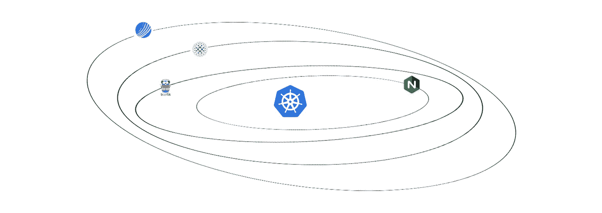
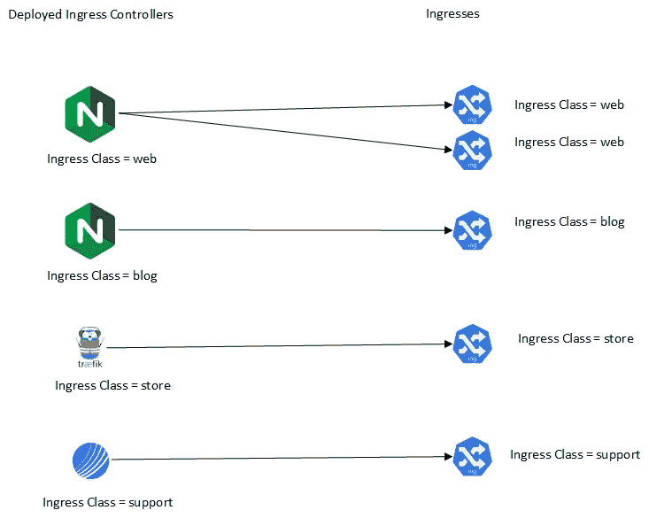
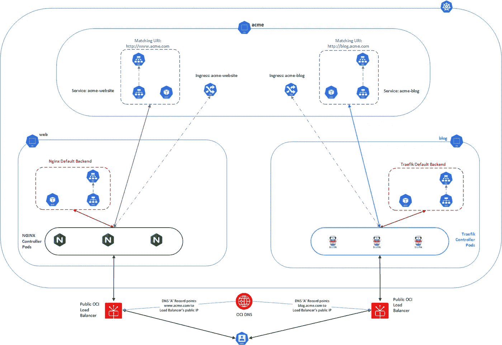
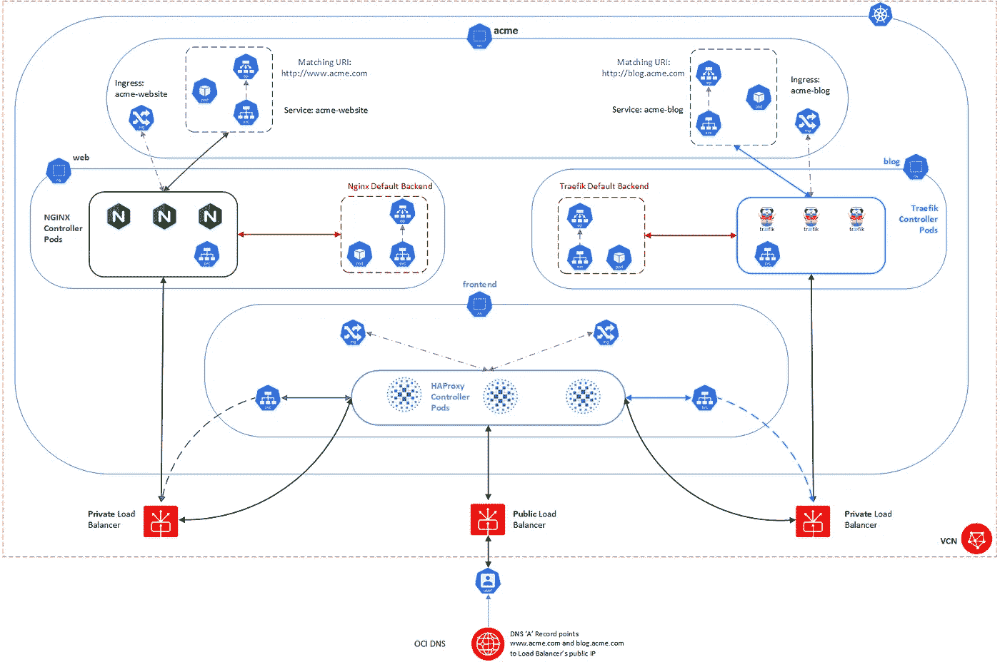
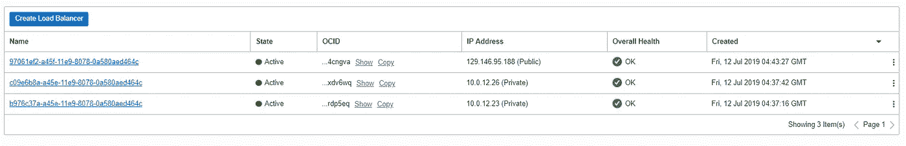

# 在 Oracle 容器引擎(OKE)上试验入口控制器—第 2 部分

> 原文：<https://medium.com/oracledevs/experimenting-with-ingress-controllers-on-oracle-container-engine-oke-part-2-96063927d2e6?source=collection_archive---------2----------------------->

## 通过 OKE 使用多个控制器和负载平衡器



在[第一部分](/@lmukadam/experimenting-with-ingress-controllers-on-oracle-container-engine-oke-part-1-5af51e6cdb85?source=friends_link&sk=ec2339dfb787af382b38d7edd12877f5)中，我简单描述了什么是[入口](https://kubernetes.io/docs/concepts/services-networking/ingress/)和[入口控制器](https://kubernetes.io/docs/concepts/services-networking/ingress-controllers/)。我们还对 Kubernetes 的一些最受欢迎的入口控制器进行了分析，即:

*   [nginx-ingress](https://kubernetes.github.io/ingress-nginx/)
*   [haproxy-ingress](https://github.com/jcmoraisjr/haproxy-ingress)
*   [Traefik](https://traefik.io/)
*   [轮廓](https://projectcontour.io/)

在本帖中，我们将看看 Ingress 类，以及如何使用它们来同时部署多个 Ingress 控制器实例。我们还将简要介绍一种不同类型的 Kubernetes 服务( [ExternalName](https://kubernetes.io/docs/concepts/services-networking/service/#externalname) )以及使用它的一种方式。最后，我们看看它们如何与公共和内部负载平衡器一起使用。

下面练习中的所有 yamls 都可以在 [github](https://github.com/hyder/okesamples/tree/master/ingresscontrollers) 上找到。

## 使用多个入口控制器

使用哪个入口控制器是一个很难回答的问题。通常，这取决于您的需求、您的团队技能组合(例如，您的团队可能比 Traefik 或 Contour 更熟悉 NGINX 或 HAProxy)、您正在部署的应用程序类型、您需要的技术和操作功能、支持的协议、控制器或 helm 包的成熟度(如果您正在部署的话)、您对试验和风险的偏好、内部批准等等。这本优秀的 Kubedex 指南及其功能概述可以帮助你缩小评估范围。

无论如何，在一个 Kubernetes 集群中部署多个控制器是可能的。也可以通过指定不同的入口类，在同一个集群中部署同一个控制器的多个实例*。那么，我们来看看 Ingress 类是如何工作的。*

回想一下，入口控制器监听变化并更新其路由规则。然而，当您部署多个入口控制器和入口时，必须有一种方法来确保特定的入口被正确的控制器拾取。这就是 Ingress 类的目的。将入口类视为所有已部署入口控制器的指令:

*   你负责执行我的路由规则
*   你不负责执行我的路由规则

下图说明了这一点。当入口类值与*控制器实例*的值匹配时，该控制器实例将为您的入口处理路由规则。如果您有其他控制器实例，无论是相同还是不同类型的*，但与您的入口具有不同的入口类值*，它们将忽略该入口。



Ingress classes and Ingress mapping

## 通过注释指定入口类

入口 API 有一个注释，允许您指定这个入口类:

```
apiVersion: extensions/v1beta1
kind: Ingress
metadata:
  name: acme-blog-ingress
  annotations:
    **kubernetes.io/ingress.class**: "ingressclass"
```

除了 traefik(见下文)，每个控制器都有一个默认的入口类值，但也允许您指定自己的自定义类。这很有用，尤其是当您必须在单个集群中部署它们的多个实例时。当你使用各自的舵表时，下面是每个的默认进入等级值:

*   nginx: nginx
*   哈普洛克西:哈普洛克西
*   traefik:
*   轮廓:轮廓

如果按照[第 1 部分](/oracledevs/experimenting-with-ingress-controllers-on-oracle-container-engine-oke-part-1-5af51e6cdb85)、**、*中所述使用 traefik 的舵图，则默认设置没有*、**入口类别。您需要在部署期间明确指定它，如下所示:

```
helm install stable/traefik --name traefikcontroller **--set kubernertes.ingressClass=traefik**
```

最后，注意如果你使用轮廓，你需要**而不是**在[进刀路线](https://github.com/heptio/contour/blob/master/docs/ingressroute.md)上设置注释 kubernetes.io/ingress.class。稍后将详细介绍 Contour 及其入口类。

## 在 Ingress 中使用默认的 Ingress 类注释

以下示例显示了您需要为四个控制器中的每一个提供的默认注释。

NGINX 入口控制器:

```
apiVersion: extensions/v1beta1
kind: Ingress
metadata:
  name: acme-website
  annotations:
    **kubernetes.io/ingress.class: "nginx"**
...
```

HAProxy:

```
apiVersion: extensions/v1beta1
kind: Ingress
metadata:
  name: acme-website
  annotations:
    **kubernetes.io/ingress.class: "haproxy"**
...
```

Traefik:

```
apiVersion: extensions/v1beta1
kind: Ingress
metadata:
  name: acme-website
  annotations:
    **kubernetes.io/ingress.class: "traefik"**
...
```

轮廓:

```
apiVersion: extensions/v1beta1
kind: Ingress
metadata:
  name: acme-website
  annotations:
    **kubernetes.io/ingress.class: "contour"**
...
```

## 自定义入口类

现在，让我们看看如何在安装过程中使用舵图为每个控制器定制入口类。

*NGINX* :

```
helm install --name acmecontroller stable/nginx-ingress **--set controller.ingressClass=mycustomnginx**
```

您可以为 NGINX 入口类设置任何值。

HAProxy :

```
helm install --name acmecontroller incubator/haproxy-ingress **--set controller.ingressClass=mycustomhaproxy**
```

同样，您可以为 HAProxy 的 Ingress 类设置任何值。

Traefik:

```
helm install stable/traefik --name traefikcontroller **--set kubernertes.ingressClass=traefikcustom**
```

对于 Traefik，入口类值**必须以‘trae fik’开始**。我不确定是头盔包的问题还是 Traefik 本身的问题。这是基于 Traefik 的舵图文档。

*轮廓*:

```
kubectl apply -f examples/deployment-grpc-v2/ **--ingress-class-name=newcontour**
```

与 NGINX 和 HAProxy 类似，可以为 Contour 的 Ingress 类设置任何值。但是，请注意，根据 Contour 的文件，以下内容适用:

> `*contour.heptio.com/ingress.class*`:应该解释和服务 IngressRoute 的入口类。如果未设置，则所有轮廓实例都服务于 IngressRoute。如果指定为`*contour.heptio.com/ingress.class: contour*`，则等高线服务于进入路线。如果为任何其他值，Contour 将忽略 IngressRoute 定义。您可以在运行时用`*--ingress-class-name*`标志覆盖默认的类`*contour*`

因此，如果你打算使用 Contour 的 IngressRoute API，你必须*将这个值*设置为‘Contour ’,或者*根本不要*设置它。

## 使用多个控制器

我说过可以在一个集群上同时部署多个入口控制器。让我们看看如何同时使用它们。

挑选 2 个你喜欢的控制器并部署它们。在本例中，我们将使用 NGINX 和 Traefik 进行说明，但是您可以使用任何组合，只要您指定正确的入口类，例如，如果您愿意，您也可以有 2 个 NGINX 控制器，只要您为第二个控制器设置不同的类名。

这就是我们想要如何部署我们的工件:

*   acme 名称空间中的 acme 服务(网站、博客)
*   web 命名空间中的 nginx 控制器和网站入口
*   博客命名空间中的 traefik 控制器和博客入口

下图说明了我们的部署。



Using multiple controllers and public load balancers

让我们首先创建名称空间:

```
kubectl create ns acme
kubectl create ns web
kubectl create ns blog
```

我们现在可以部署网站和博客。

```
kubectl create -f ingresscontrollers/multiplecontrollers/acme-website.yaml
kubectl create -f ingresscontrollers/multiplecontrollers/acme-blog.yaml
```

现在让我们部署我们的 2 个入口控制器(NGINX 和 Traefik)。

NGINX:

```
helm install --name webcontroller stable/nginx-ingress \
--namespace web \
--set defaultBackend.enabled=true \
--set defaultBackend.name=acmedefaultbackend \
--set rbac.create=true
```

验证 NGINX 控制器已正确部署:

```
kubectl -n web get pods                                                                                                                                    
NAME                                                              READY   STATUS    RESTARTS   AGE
webcontroller-nginx-ingress-acmedefaultbackend-86689bd54b-dzpcg   1/1     Running   0          5m45s                                                                                          
webcontroller-nginx-ingress-controller-8bdc8c665-f6xqm            1/1     Running   0          5m45s
```

并检索负载平衡器的公共 IP 地址:

```
kubectl -n web get svc -o wideNAME                                             TYPE           CLUSTER-IP      EXTERNAL-IP       PORT(S)                      AGE   SELECTOR                                                 
webcontroller-nginx-ingress-acmedefaultbackend   ClusterIP      10.96.122.109               80/TCP                       46s   app=nginx-ingress,component=acmedefaultbackend,release=we
bcontroller                                                                                                                                                                                   
webcontroller-nginx-ingress-controller           LoadBalancer   10.96.45.231    **129.146.208.247**   80:30698/TCP,443:32651/TCP   46s   app=nginx-ingress,component=controller,release=webcontrol
ler
```

Traefik:

```
helm install --name blogcontroller stable/traefik \
--namespace blog \
--set rbac.enabled=true \
--set kubernetes.ingressClass=traefik
```

验证 Traefik 控制器已正确部署:

```
kubectl -n blog get pods                                                                                                                                   
NAME                                      READY   STATUS    RESTARTS   AGE                                                                                                                    
blogcontroller-traefik-65579ddcb4-7hqdz   1/1     Running   0          6m30s
```

并检索负载平衡器的公共 IP 地址:

```
kubectl -n blog get svc -o wide                                                                                                                            
NAME                     TYPE           CLUSTER-IP      EXTERNAL-IP      PORT(S)                      AGE   SELECTOR                                                                          
blogcontroller-traefik   LoadBalancer   10.96.127.166   **129.146.89.209**   80:30293/TCP,443:30455/TCP   69s   app=traefik,release=blogcontroller
```

更新您的 DNS“A”记录，使它们与以下内容匹配:

*   129.146.208.247(由 NGINX 入口控制器创建的负载平衡器使用)映射到 www.acme.com
*   129.146.89.209(由 Traefik 的入口控制器创建的负载平衡器使用)映射到 blog.acme.com

注意:

*   您的负载平衡器公共 IP 地址会有所不同，请记住使用您自己的地址
*   用你的域名替换 acme.com

现在让我们创建入口，从网站入口开始，使用与第 1 部分中的示例相同的入口代码。

打开一个新的终端来查看 NGINX 控制器日志(替换为您的控制器盒的名称):

```
kubectl -n web log webcontroller-nginx-ingress-controller-8bdc8c665-f6xqm -f...I0712 00:36:36.398883       8 status.go:86] new leader elected: webcontroller-nginx-ingress-controller-8bdc8c665-f6xqm
```

我们现在将创建以下入口(用您的域的入口替换[acme.com](http://www.acme.com)):

```
apiVersion: extensions/v1beta1
kind: Ingress
metadata:
  name: acme-website
  **namespace: web**
  annotations:
    kubernetes.io/ingress.class: "nginx"
spec:
  rules:
  - host: www.acme.com
    http:
      paths:
      - path: /
      backend:
        serviceName: acme-website
        servicePort: 80
```

在您的第一个终端上，创建入口:

```
kubectl create -f multiplecontrollers/acme-website-ingress.yaml
```

在手表终端中，您会注意到以下内容:

```
I0712 00:50:13.540522       8 controller.go:133] Configuration changes detected, backend reload required.                                                                                     
I0712 00:50:13.540695       8 event.go:258] Event(v1.ObjectReference{Kind:"Ingress", Namespace:"acme", Name:"acme-website", UID:"02051a8b-a43f-11e9-a88d-0a580aed1b23", APIVersion:"extensions
/v1beta1", ResourceVersion:"192541", FieldPath:""}): type: 'Normal' reason: **'CREATE' Ingress acme/acme-website **                                                                               
I0712 00:50:13.624379       8 controller.go:149] Backend successfully reloaded.                                                                                                               
[12/Jul/2019:00:50:13 +0000]TCP200000.000                                                                                                                                                     
I0712 00:50:36.427547       8 status.go:309] updating Ingress acme/acme-website status from [] to [{ }]                                                                                       
I0712 00:50:36.434886       8 event.go:258] Event(v1.ObjectReference{Kind:"Ingress", Namespace:"acme", Name:"acme-website", UID:"02051a8b-a43f-11e9-a88d-0a580aed1b23", APIVersion:"extensions
/v1beta1", ResourceVersion:"192593", FieldPath:""}): type: 'Normal' **reason: 'UPDATE' Ingress acme/acme-website**
```

现在，如果您访问网站的 URL，您将能够访问网站页面。如果您仍在查看控制器盒日志，您还会注意到传入的流量:

```
10.244.0.0 - [10.244.0.0] - - [12/Jul/2019:00:51:26 +0000] "GET / HTTP/1.1" 200 1855 "-" "Mozilla/5.0 (Windows NT 10.0; Win64; x64; rv:68.0) Gecko/20100101 Firefox/68.0" 388 0.002 [acme-acme
-website-80] [] 10.244.2.13:80 4446 0.002 200 0bed30fdf9d16bde887ed8e488b80735                                                                                                                
10.244.0.0 - [10.244.0.0] - - [12/Jul/2019:00:51:27 +0000] "GET /favicon.ico HTTP/1.1" 404 178 "-" "Mozilla/5.0 (Windows NT 10.0; Win64; x64; rv:68.0) Gecko/20100101 Firefox/68.0" 320 0.001 
[acme-acme-website-80] [] 10.244.2.13:80 178 0.001 404 d91af2a400fd4230ec3dec8b0eaf713f
```

这里需要注意的一件重要事情是，*入口是在与服务*相同的名称空间中定义的。如果您在不同于目标服务的名称空间中创建入口，入口控制器仍将能够检测到入口更改。但是，它将无法获得端点，因此无法更新其配置。

为了说明这一点，我们将特意在博客名称空间(即 traefik 的名称空间)中创建博客入口。

```
apiVersion: extensions/v1beta1                                                                                                                                                                
kind: Ingress                                                                                                                                                                                 
metadata:                                                                                                                                                                                     
  name: acme-blog-ingress                                                                                                                                                                     
  **namespace: blog **                                                                                                                                                                            
  annotations:                                                                                                                                                                                
    kubernetes.io/ingress.class: "traefik"                                                                                                                                                    
spec:                                                                                                                                                                                         
  rules:                                                                                                                                                                                      
  - host: blog.acme.com                                                                                                                                                                 
    http:                                                                                                                                                                                     
      paths:                                                                                                                                                                                  
      - path: /                                                                                                                                                                               
        backend:                                                                                                                                                                              
          serviceName: acme-blog                                                                                                                                                              
          servicePort: 80
```

在您的第二个终端上，停止观察 NGINX 控制器，开始观察 traefik 控制器(替换为您的控制器盒的名称):

```
kubectl -n blog log blogcontroller-traefik-65579ddcb4-7hqdz -f
```

现在让我们创建博客入口(记得在入口规则中更改主机名):

```
kubectl create -f acme-blog-ingress.yaml
```

您将在 traefikcontroller 日志中看到以下内容:

```
{"level":"error","msg":"Service not found for blog/acme-blog","time":"2019-07-12T01:02:20Z"}
```

删除博客入口:

```
kubectl delete -f acme-blog-ingress.yaml
```

将其名称空间编辑为 acme:

```
apiVersion: extensions/v1beta1                                                                                                                                                                
kind: Ingress                                                                                                                                                                                 
metadata:                                                                                                                                                                                     
  name: acme-blog-ingress                                                                                                                                                                     
  **namespace: acme **                                                                                                                                                                            
  annotations:                                                                                                                                                                                
    kubernetes.io/ingress.class: "traefik"                                                                                                                                                    
spec:                                                                                                                                                                                         
  rules:                                                                                                                                                                                      
  - host: blog.acme.com                                                                                                                                                                 
    http:                                                                                                                                                                                     
      paths:                                                                                                                                                                                  
      - path: /                                                                                                                                                                               
        backend:                                                                                                                                                                              
          serviceName: acme-blog                                                                                                                                                              
          servicePort: 80
```

重建入口:

```
kubectl create -f acme-blog-ingress.yaml
```

再次检查控制器日志:

```
kubectl -n blog log blogcontroller-traefik-65579ddcb4-7hqdz -f{"level":"info","msg":"Server configuration reloaded on :8880","time":"2019-07-12T02:01:36Z"}
```

现在，如果我们访问博客网址，我们也可以访问博客。

让我们在最后的实验前清理一下:

```
kubectl delete -f acme-blog-ingress.yaml
kubectl delete -f acme-website-ingress.yaml
helm delete --purge blogcontroller
helm delete --purge webcontroller
```

## 使用单个公共负载平衡器、带有多个控制器的私有负载平衡器

正如您在前面的实验中可能已经注意到的，无论何时部署入口控制器，默认情况下都会创建一个公共负载平衡器*。部署多个控制器意味着您将拥有多个公共负载平衡器。这可能会对成本产生明显的影响，尽管 OCI 在数据收费方面非常慷慨，但作为超级管理员，您应该密切关注这一点。*

*现在，假设你有两个团队(团队网络和团队博客)，每个团队都有他们最喜欢的入口控制器(分别是 NGINX 和 Traefik ),不管出于什么技术原因，他们都坚持使用他们最喜欢的。不管辣妹唱什么，2 不可能变成 1。*

*事实证明，你可以通过设置正确的[注释](https://github.com/oracle/oci-cloud-controller-manager/blob/master/docs/load-balancer-annotations.md)来使用内部负载平衡器。我们在之前的[中使用了负载平衡器注释，但是是为了改变负载平衡器的形状。但是如何用入口控制器做到这一点，然后公开应用程序呢？](/oracledevs/changing-load-balancer-shape-in-oracle-container-engine-oke-and-updating-dns-with-external-dns-7064f15cf600)*

*下面是对以前的部署架构的一点修改:*

**

*Using a public load balancer and multiple private load balancers*

*在上图中，当用户访问网站或博客 URL 时，他们将使用公共负载平衡器。我们还希望网络和博客流量通过内部负载平衡器。*

*这次我们将使用以下 3 个控制器:*

*   *nginx-ingress:私有，网站*
*   *traefik:私人，博客*
*   *haproxy:前端负载平衡器*

*让我们首先在内部模式下部署 nginx-ingress 和 traefik:*

```
*helm install --name webcontroller stable/nginx-ingress \
--namespace web \
--set controller.name=web \
--set rbac.create=true \
--set controller.ingressClass=nginx \
**--set controller.service.annotations."service\.beta\.kubernetes\.io/oci-load-balancer-internal"=true***
```

*通过添加上面的注释，NGINX 入口控制器创建的负载平衡器将只使用私有 IP 地址进行部署。只有来自 VCN 内部的请求才能到达它。*

*让我们为 Traefik 做同样的事情:*

```
*helm install --name blogcontroller stable/traefik \
--namespace blog \
--set rbac.enabled=true \
--set kubernetes.ingressClass=traefik \
--set service.annotations."service\.beta\.kubernetes\.io/oci-load-balancer-internal=true"*
```

*最后，让我们创建一个前端名称空间并部署 HAProxy:*

```
*kubectl create ns frontendhelm install --name frontendcontroller incubator/haproxy-ingress \
--namespace frontend \
--set defaultBackend.enabled=true \
--set defaultBackend.name=defaultbackend \
--set rbac.create=true \
--set controller.ingressClass=haproxy*
```

*对于 HAProxy，我们没有设置*OCI-load-balancer-internal = true*注释，因为我们希望它可以公开访问。当您登录到 OCI 控制台时，您可以验证这一点:*

**

*Public and Private Load Balancers*

*现在，我们需要部署服务和入口。回想一下，我们希望流量通过专用负载平衡器进行路由。我之前也提到过，您的入口应该与您的服务在同一个名称空间中。由于我们希望强制流量通过特定路径，即内部负载平衡器，我们将使用上述方法的替代方法。在这种情况下，我们将使用[外部名称](https://kubernetes.io/docs/concepts/services-networking/service/#externalname)。正如文档所解释的，ExternalName 类型的服务将服务映射到 DNS 名称。*

*以下是文档中的解释:*

> *当查找主机`***my-service.prod.svc.cluster.local***`时，集群 DNS 服务返回一个值为`***my.database.example.com***`的`***CNAME***`记录。访问`***my-service***`的工作方式与其他服务相同，但关键区别在于重定向发生在 DNS 级别，而不是通过代理或转发。*

```
***apiVersion: v1
kind: Service
metadata:
  name: my-service
  namespace: prod
spec:
  type: ExternalName
  externalName: my.database.example.com***
```

*然而，在 Kubernetes 文档[中还有一个小注释](https://kubernetes.io/docs/concepts/services-networking/service/#externalname):*

> *ExternalName 接受 IPv4 地址字符串，但作为由数字组成的 DNS 名称，而不是作为 IP 地址。CoreDNS 或 ingress-nginx 不会解析类似 IPv4 地址的 ExternalName，因为 external name 旨在指定规范的 DNS 名称。*

*由于类似 IPv4 地址的外部名称*不会*解析，我们可以使用 IPv4 地址来强制流量通过内部负载平衡器。*

*acme 名称空间中的网站和博客服务仍然存在，因此我们只需要创建以下内容:*

1.  *类别为“nginx”的网站入口。这将允许内部 nginx 控制器对网站服务进行必要的路由。*
2.  *类别为“traefik”的博客入口。这将允许内部 traefik 控制器对博客服务进行必要的路由。*

*当使用 2 个公共负载平衡器时，上述 2 个入口与上一个练习中的入口相同。我们可以让 2 个入口保持原样，在清理过程中不删除它们，但我想在这里更清楚地说明当前场景中发生了什么。*

*我们还将创建:*

1.  *ExternalName 类型的 acme 网站服务，其 externalName 值是由 NGINX 控制器创建的内部负载平衡器的专用 IP 地址*
2.  *ExternalName 类型的 acme-blog 服务，其 externalName 值是由 Traefik 控制器创建的内部负载平衡器的专用 IP 地址。*
3.  *最后是类“haproxy”的 2 个入口，其目标服务是网站和博客的 2 个外部名称服务。*

*所有的 yaml 文件都可以在 Ingres controllers/private 目录下找到。*

*首先，编辑**所有**入口，并像以前一样将“acme.com”更改为您的域。*

*接下来获取负载平衡器的私有 IP 地址:*

*一旦 nginx-ingress 和 traefik 控制器部署完毕，获取它们的私有 IP 地址。*

*Nginx:*

```
*kubectl -n web get svc -o wide                                                                                                                                               
NAME                                          TYPE           CLUSTER-IP     EXTERNAL-IP   PORT(S)                      AGE   SELECTOR                                                         
webcontroller-nginx-ingress-default-backend   ClusterIP      10.96.44.162           80/TCP                       29s   app=nginx-ingress,component=default-backend,release=webcontroller
webcontroller-nginx-ingress-web               LoadBalancer   10.96.54.89    **10.0.12.23**    80:30626/TCP,443:30352/TCP   29s   app=nginx-ingress,component=web,release=webcontroller*
```

*Traefik:*

```
*kubectl -n blog get svc -o wide                                                                                                                                              
NAME                     TYPE           CLUSTER-IP     EXTERNAL-IP   PORT(S)                      AGE   SELECTOR                                                                              
blogcontroller-traefik   LoadBalancer   10.96.236.78   **10.0.12.26**    80:30668/TCP,443:32269/TCP   86s   app=traefik,release=blogcontroller*
```

*编辑 frontend-website-ingress.yaml 并更改 externalName 值:*

```
*kind: Service                       
apiVersion: v1
metadata:
  name: acme-website
  namespace: frontend
spec:
  type: ExternalName
  externalName: **10.0.12.23**
  ports:
  - port: 80
---
apiVersion: extensions/v1beta1
kind: Ingress
metadata:
  name: acme-website
  namespace: frontend
  annotations:                        
    kubernetes.io/ingress.class: "haproxy"                       
spec:
  rules:
  - host: www.acme.com
    http:
      paths:
      - path: /
        backend:
          serviceName: acme-website                                  
          servicePort: 80*
```

*对 frontend-website-ingress.yaml 重复上述操作，并更改 externalName 值。*

```
*kind: Service                       
apiVersion: v1
metadata:
  name: acme-blog
  namespace: public
spec:
  type: ExternalName
  externalName: **10.0.12.26**
  ports:
  - port: 80
---
apiVersion: extensions/v1beta1
kind: Ingress
metadata:
  name: acme-blog
  namespace: public
  annotations:                        
    kubernetes.io/ingress.class: "haproxy"                       
spec:
  rules:
  - host: blog.acme.com
    http:
      paths:
      - path: /
        backend:
          serviceName: acme-website                                  
          servicePort: 80*
```

*应用清单:*

```
*kubectl create -f ingresscontrollers/private/ingress.extensions/acme-blog-ingress created                                                                                                                                                  
deployment.apps/acme-blog created                                                                                                                                                             
service/acme-blog created                                                                                                                                                                     
ingress.extensions/acme-website created                                                                                                                                                       
deployment.apps/acme-website created                                                                                                                                                          
service/acme-website created                                                                                                                                                                  
service/acme-blog created                                                                                                                                                                     
ingress.extensions/acme-blog created                                                                                                                                                          
service/acme-website created                                                                                                                                                                  
ingress.extensions/acme-website created*
```

*最后，从 OCI 控制台或使用 kubectl 获取负载平衡器的公共 IP 地址:*

```
*kubectl -n frontend get svc -o wide                                                                                                                                        
NAME                                                TYPE           CLUSTER-IP     EXTERNAL-IP      PORT(S)                      AGE   SELECTOR                                                
frontendcontroller-haproxy-ingress-controller       LoadBalancer   10.96.41.118   **129.146.95.188**   80:30746/TCP,443:30777/TCP   83s   app=haproxy-ingress,component=controller,release=fronten
dcontroller                                                                                                                                                                                   
frontendcontroller-haproxy-ingress-defaultbackend   ClusterIP      10.96.158.93              8080/TCP                     83s   app=haproxy-ingress,component=defaultbackend,release=fro
ntendcontroller*
```

*更新 OCI DNS 中网站和博客的 2 个条目(用您的域替换“acme.com ”),并将 IP 地址设置为公共负载平衡器的 IP 地址:*

*   *www.acme.com*
*   *blog.acme.com*

*请记住点击“发布更改”以使其生效，并测试对您的网站和博客的访问。*

## *摘要*

*我们在 OKE 上用 4 种不同的入口控制器对[进行了实验。然后，我们查看了入口类及其用途，并在一个集群上同时部署了多个控制器，使用入口类来确保相应地路由请求。最后，我们看了私有负载平衡器如何也可以与多个入口控制器一起使用，然后公开地公开服务。](/@lmukadam/experimenting-with-ingress-controllers-on-oracle-container-engine-oke-part-1-5af51e6cdb85?source=friends_link&sk=ec2339dfb787af382b38d7edd12877f5)*

*我们使用的例子和理由相当琐碎和做作，但我希望它们能够说明当您在 Kubernetes 和 Oracle 云基础设施上部署应用程序时所具有的灵活性。*

*其他参考资料:*

*[NGINX 和多个入口控制器](https://kubernetes.github.io/ingress-nginx/user-guide/multiple-ingress/)
[使用带有服务注释的 helm 部署 Traefik](https://github.com/helm/charts/issues/10275)
[OCI 文档:创建内部负载平衡器](https://docs.cloud.oracle.com/iaas/Content/ContEng/Tasks/contengcreatingloadbalancer.htm#CreatingInternalLoadBalancersinPublicandPrivateSubnets)
[入口控制器比较](https://kubedex.com/ingress/)
[Kubernetes 跨名称空间入口](https://stackoverflow.com/questions/51878195/kubernetes-cross-namespace-ingress-network)*