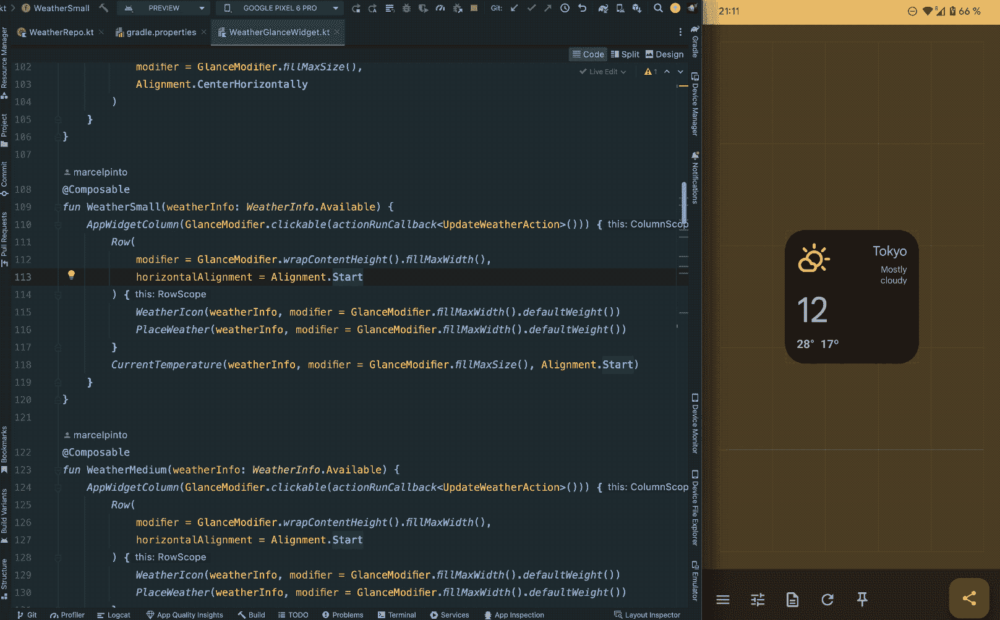
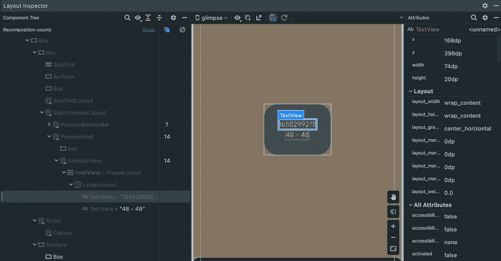
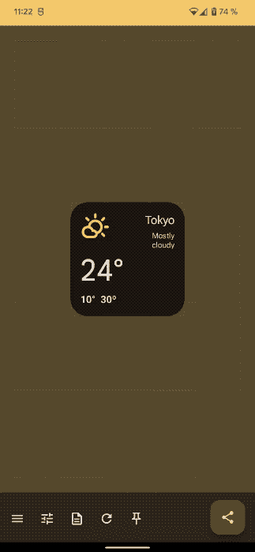
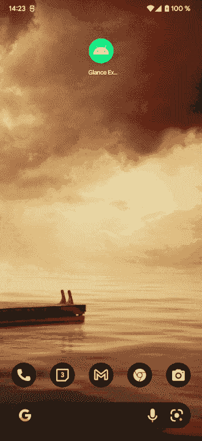

# 试用 Jetpack Glance

> 原文：<https://medium.com/androiddevelopers/experimenting-with-jetpack-glance-35fbffe520f4?source=collection_archive---------0----------------------->

[T3【https://github.com/google/glance-experimental-tools】T5](https://github.com/google/glance-experimental-tools)

我们很高兴地宣布，新的 [Jetpack Glance 框架](https://android-developers.googleblog.com/2021/12/announcing-jetpack-glance-alpha-for-app.html)已经[达到 alpha-04](https://developer.android.com/jetpack/androidx/releases/glance#1.0.0-alpha04) ，它允许您使用类似 Jetpack Compose 的代码来构建应用程序小部件和穿戴磁贴。

此版本带来了新功能、突破性变化和新 API:

我们还刚刚发布了一个独立的实验库**来为 Jetpack Glance 补充一些开发时通常需要但现在还没有的工具。**

> ****重要:**该项目独立于 [AndroidX Glance 库](https://cs.android.com/androidx/platform/frameworks/support/+/androidx-main:glance/)和开发。在将来,`[*GlanceRemoteViews*](https://developer.android.com/reference/kotlin/androidx/glance/appwidget/GlanceRemoteViews)` API 和实验库中的任何特性可能会改变或变得过时(因此可能会被废弃)。**

## **为什么这些不能在 AndroidX 里？**

**我们希望更自由地迭代、探索和试验一些新的 API 和工具，而不增加主 API 的开销并避免 API 承诺。此外，这些特性中的一些可能在 AndroidX 中不被允许。**

****注意:**这个存储库遵循[伴奏者](https://github.com/google/accompanist)模式，但是范围要窄得多(在这里[阅读更多信息](/androiddevelopers/jetpack-compose-accompanist-an-faq-b55117b02712)**

# ****扫视实验工具****

**最初的想法是使用新的**实验性的** `[GlanceRemoteViews](https://developer.android.com/reference/kotlin/androidx/glance/appwidget/GlanceRemoteViews)` API 和 Jetpack Compose 一起启用新特性。让我们探索第一个可用的模块:**

## **[app widget 主机可组合 ](https://github.com/google/glance-experimental-tools/tree/main/appwidget-host)**

**您可以使用`AppWidgetHost` composable 在您的应用程序中托管和显示 RemoteViews。这个模块和新的`GlanceRemoteViews` API 一起，为其他模块提供了一个显示 RemoteViews 对象的简单 API，与 AppWidgets 和 Glance 分离。**

**让我们来看一个例子:**

**`AppWidgetHostState`用给定的远程视图更新主机。在这里，我们可以使用新的`GlanceRemoteViews` API 从一个可组合的函数中生成它们。**

**点击阅读关于本模块[的更多信息。](https://github.com/google/glance-experimental-tools/tree/main/appwidget-host)**

> ****注意:**你可以直接使用 RemoteViews 而不用 Glance，因为这个模块不依赖于 glance-appwidget。**

## **[**glance-app widget 的查看器**](https://github.com/google/glance-experimental-tools/tree/main/appwidget-preview)**

**当谈到测试和调试 AppWidgets 时，一个主要的痛点是部署一次迭代所需的费力过程 **:****

1.  **构建您的项目。😃**
2.  **启动应用程序。🙂**
3.  **关闭应用程序。😐**
4.  **在启动器中移除和添加应用程序小部件😕(或[使用此变通办法](/androiddevelopers/demystifying-jetpack-glance-for-app-widgets-8fbc7041955c#:~:text=%E2%80%9CHow%20can%20I%20apply%20changes%20faster%3F%E2%80%9D) ☹️)**
5.  **搞定了。🥵**

**即使有变通方法，这个过程也相当耗时。由于还没有**和**Glance 的预览版，在没有立即看到结果的情况下对组件进行修改可能会很棘手。**

> **…等一下，“实时编辑”和 Glance 一起工作？**

****

**Code changes on the left, gets reflected in the device on the right**

**没错:不再需要等待应用程序构建和启动。通过为您的调试版本扩展`[GlancePreviewActivity](https://github.com/google/glance-experimental-tools/blob/main/appwidget-preview/src/main/java/com/google/android/glance/tools/preview/AppWidgetPreviewActivity.kt)`，您可以加速 UI 迭代。扩展活动在你自己的应用程序(而不是启动器)中显示你的应用程序的小部件，提供更快的预览，并支持 Android Studio 中的[应用更改](https://developer.android.com/studio/run#apply-changes)和[实时编辑](https://developer.android.com/jetpack/compose/tooling#live-edit)功能。**

**glance-appwidget 查看器不依赖于`[AppWidgetManager](https://developer.android.com/reference/android/appwidget/AppWidgetManager)`；而是直接使用`AppWidgetHostView`跳过`BroadcastReceiver`机制，在 app 的 activity 内部渲染 [RemoteViews](https://developer.android.com/reference/android/widget/RemoteViews) (有一些[限制](https://github.com/google/glance-experimental-tools/tree/main/appwidget-preview#Limitations))。**

**使用这个查看器，结合 Compose 和 [Live Edit](https://developer.android.com/jetpack/compose/tooling#live-edit) ，我们可以实现(在大多数情况下[)实时更新机制，几乎即时地在您的 Glance 组件中显示代码更改。](https://developer.android.com/studio/run#limitations)**

**不仅如此，查看器活动还支持其他可用的开发工具，如[布局检查器](https://developer.android.com/jetpack/compose/tooling#layout-inspector)。**

****

**Inspecting a GlanceAppWidget with Layout-Inspector**

**此外，查看器活动还提供以下功能:**

*   **🔀在不同的小工具之间切换**
*   **🔎调整大小并反映小工具可用空间的变化(考虑[大小模式](https://developer.android.com/reference/androidx/glance/appwidget/SizeMode)**
*   **ℹ️突出显示丢失的 [appwidget 元数据](https://developer.android.com/develop/ui/views/appwidgets#AppWidgetProviderInfo)**
*   **📌请求启动器[锁定](https://developer.android.com/guide/topics/appwidgets/configuration#pin)当前预览**
*   **当前预览的🖼️提取和分享( [android:previewImage](https://developer.android.com/develop/ui/views/appwidgets#preview)**

****

**在[附加功能部分](https://github.com/google/glance-experimental-tools/tree/main/appwidget-preview#additional-features)阅读更多信息，并检查项目的[设置部分](https://github.com/google/glance-experimental-tools/tree/main/appwidget-preview#setup)。**

## **使用撰写@预览**

**查看器活动提供了有用的功能，但它需要额外的设置和材料依赖性。如果您只想使用 Android Studio 中的[内置预览机制显示 GlanceAppWidgets 的预览，也可以使用](https://developer.android.com/jetpack/compose/tooling)[GlanceAppWidgetHostPreview](https://developer.android.com/jetpack/compose/tooling)。**

> ****注意:**虽然预览会在 Android Studio 中呈现，但 RemoteViews 不会。您必须始终在设备中运行它。稍后将对此提供更好的支持。**

## **[**GlanceAppWidget 配置可组合**](https://github.com/google/glance-experimental-tools/tree/main/appwidget-configuration)**

**这个 GlanceAppWidget 配置可组合模块提供了一个自以为是的可组合模块，可以在您的应用程序小部件的[配置](https://developer.android.com/guide/topics/appwidgets/configuration)活动中使用。简而言之，它构建在 [Material3 Scaffold](https://developer.android.com/reference/kotlin/androidx/compose/material3/package-summary#Scaffold(androidx.compose.ui.Modifier,kotlin.Function0,kotlin.Function0,kotlin.Function0,kotlin.Function0,androidx.compose.material3.FabPosition,androidx.compose.ui.graphics.Color,androidx.compose.ui.graphics.Color,kotlin.Function1)) 之上，为 Glance 显示和处理 appwidget 活动配置逻辑。**

****

**这种组合非常适合:**

*   **使启动器和配置屏幕之间的转换更加平滑和一致( [Material You！](https://material.io/blog/announcing-material-you))**
*   **显示 appwidget 的真实预览(保留大小)以帮助用户配置它**
*   **使 GlanceAppWidget 能够反映状态更改，而无需实际应用它们**

**查看本指南开始使用！**

# ****下一步是什么？****

**我们正在探索其他工具来帮助你用 Glance 构建更好的 glanceables。同时，我们期待您的反馈。请使用 GitHub[报告问题或功能请求](https://github.com/google/glance-experimental-tools/issues) (psst！非常欢迎投稿！).**

** [## GitHub-Google/Glance-Experimental-Tools:Glance Experimental Tools 旨在补充 Jetpack…

### Glance 实验工具旨在为 Jetpack Glance 补充开发人员通常需要的特性，但是…

github.com](https://github.com/google/glance-experimental-tools)**