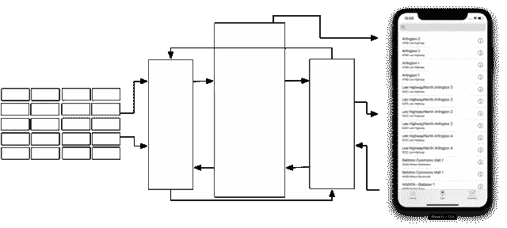

# 在 iOS 中试验 SQLite

> 原文：<https://medium.com/capital-one-tech/experimenting-with-sqlite-in-ios-ae9dec92dbaf?source=collection_archive---------3----------------------->

## 我们能从脸书的光速项目中学到什么


> 在科学界听到的最激动人心的短语，预示着新发现的短语，不是“尤里卡”，而是“真有趣……”*——*[*【艾萨克·阿西莫夫(1920–1992)*](https://www.brainyquote.com/quotes/isaac_asimov_109758)

脸书工程公司最近发表了一篇关于他们的信使重写项目光速的文章，这表明他们找到了依靠 SQLite 的好理由。他们报告说，与之前的 iOS 版本相比，重写后的代码减少了 84%，从 170 万行减少到 36 万行，导致应用程序大小减少了 75%，启动时间减少了 50%。

最有趣的是，在关于光速项目的讨论中缺席的是 [React Native](https://reactnative.dev/) 和 [GraphQL](https://graphql.org/) ，这是两个用于移动开发的大型突出的脸书项目。脸书(重新)发现了 SQLite 的什么，使他们更喜欢传统的关系数据库管理系统(RDMS ),而不是其他模式和技术？

那个问题让我疑惑地停顿了一下，*“真有意思。那不可能那么有效也不简单。可以吗？”*但是如果，原谅我的双关语，我们以*面*取这个值呢？

这里事关重大。从工程角度来看，快速、高效的开发和应用性能是脸书的关键驱动因素。因此，如果脸书工程公司说 SQLite 是这种变化的关键组成部分，那么我们应该好奇，看看。

我非常熟悉 RDMSs 和在许多环境中使用的各种对象关系管理器/映射器(ORM ),从使用 Java 的 [Hibernate](https://en.wikipedia.org/wiki/Hibernate_(framework)) 、 [NeXT 的企业对象框架](https://en.wikipedia.org/wiki/Enterprise_Objects_Framework)到[苹果的核心数据](https://developer.apple.com/library/archive/documentation/Cocoa/Conceptual/CoreData/index.html)。我也对 SQLite 做了相当多的修改。尽管它是安装最广泛的 SQL 数据库，并且可能是这个星球上第二个使用最广泛的软件，但它在我们的操作系统和应用程序中一直扮演着一个安静的、常常不被注意的角色。尽管我有经验，但我经常避开 RDBM/SQLite 解决方案，认为它是一把大锤，而我只需要一个球头。但我认为一只好的“老狗”应该在看到新把戏时就能认出来。是时候再次看看可以从 SQLite 中学到什么新东西了。

# 实验

简而言之，这是脸书文章的前后图表和评论，说明了我想要回答的基本问题。*“就复杂性和编码模式而言，移除中间控制器层意味着什么？它的性能如何？”*



Figure 1a: Before Lightspeed Configuration


Figure 1b: Lightspeed Configuration

我的(不太生动的)解释强调了脸书提出的前(图 1a)和后(图 1b)架构。

**所以我决定做一个实验**到测试 SQLite 在驱动一个简单应用的 UI 时的性能。特别感兴趣的是用户体验的视觉响应性以及对开发人员生产力的影响；是不是更快更简单？

## 应用程序

我们希望我们的测试应用程序简单，但是它应该在处理大量记录(至少几千条)方面锻炼数据库。由于典型的移动应用程序不进行大量的数据 I/O，并且表单填充是一种低带宽操作，所以一个大部分是只读的应用程序对于我们的测试来说应该绰绰有余。我们还希望我们的领域模式能够代表真实世界的应用程序。除了我们对 SQLite 库的 Swift API，我们将编写一些 SQL 以及少量的网络和绑定“胶水”,以与 iOS 的 MVC 架构集成。为了将这些部分连接在一起，我们将使用一个众所周知且广泛采用的模式，即模型-视图-视图模型( [MVVM](https://en.wikipedia.org/wiki/Model%E2%80%93view%E2%80%93viewmodel) )，并实现一个视图模型和 SQL 驱动的绑定框架，以尽可能薄的单板封装我们的数据库。更少的域类或类型，没有通知，没有主题观察者，没有键值观察。


*Figure 2: Our Design inserts a ViewModel and SQL Bindings (in green) into the traditional iOS MVC pattern with SQLite backing the Model.*

重要的是——服务 API 领域的核心是 JSON——嵌套对象和数组——它们不容易与 RDBMS 的表和行对齐，这通常会成为采用的障碍。开发人员生活在面向对象的世界中，从对象图到 RDMS 模式的映射不是一件有趣、容易或高效的任务。这就是为什么许多 noSQL、graphQL 和各种各样的 ORM@解决方案如此受欢迎。但是知名的数据库，包括 [Oracle](https://www.oracle.com/database/technologies/appdev/json.html) 、 [MySQL](https://dev.mysql.com/doc/refman/8.0/en/json.html) 、 [MSSQL](https://www.devplaybook.com/intermediate-sql-tutorials/working-with-json-in-an-rdbms-part-1-ms-sql-server/) 和 [Postgres](https://www.devplaybook.com/intermediate-sql-tutorials/working-with-json-in-an-rdbms-part-2-postgresql/) ，都包含了扩展，不仅可以存储 JSON 文档，还可以就地读取和编辑 JSON 的对象图。当然，SQLite 还包括一个健壮的实现( [JSON1](https://www.sqlite.org/json1.html) )来缓解我们的 ORM 问题。我们一会儿会看看这方面的一些细节。

为了对数据库进行压力测试，我们给它更多的记录来操作，并深入到任何嵌套结构中。在 UI 方面，这意味着我们希望以不同的方式显示大型列表。对于我们的应用程序，我们将使用 UITableViews 和 MKMapViews。此外，我们将添加搜索/过滤功能，鉴于这是数据库的核心功能，我们希望这应该是一个简单易行的功能，可以集成到我们的应用程序中。

## 假设

通过移除绝大部分的控制器中介逻辑，我们应该看到用户体验肯定不会比传统解决方案差，并且在理想情况下甚至会更具响应性和性能。我们还希望使用 SQLite，尽可能使用数据库。例如，根据需要直接从数据库获取值；避免对特定领域类型的需求。同样，在数据库之外缓存也被认为是不好的形式。

最重要的是，我们希望看到开发人员的体验在以下方面得到改善。

*   **更简单、更不复杂** —通过更少的交互组件、更少的代码、更少的文件以及组件之间更清晰的契约和更窄的 API，减少了认知过载。
*   **更高效**——“简单”且近在咫尺意味着在大量文件之间切换更少。应该更容易辨别实现的意图，在解决问题时更容易看到哪里。
*   **低“** [**变化放大**](https://en.wikiversity.org/wiki/Software_Design/Change_amplification)**”**—数据模式或布局的变化对要求较少的其他组件的影响较小，如果有任何代码变化的话。更好的设计减少了受每个设计决策影响的代码量。
*   **减少错误** —声明式表单更容易理解和验证。更简单的模块化设计应该更容易测试。

我们将在讨论过程中触及这些问题，并在结论中对其进行回顾。因此，带着这些想法，让我们跳进去，看看这是如何进行的。

## 设置

我们将要使用的数据来自 Capital One 的黑客马拉松模拟 APINessie。如果你参加过 Capital One 黑客马拉松，你可能在你的项目中使用过这个模拟 API。Nessie 提供了对一些真实的面向公众的数据的访问，如 Capital One ATM 和银行分行位置，以及一些模拟的客户帐户数据，并被设计用于类似这样的实验。这将为我们的实验提供足够多的数据选择。

作为一个参考和讨论点，应用程序是使用 [MVVM](https://en.wikipedia.org/wiki/Model%E2%80%93view%E2%80%93viewmodel) 模式实现的。选择它是因为它的简单性和与 [Cocoa 的 MVC](https://developer.apple.com/library/archive/documentation/General/Conceptual/DevPedia-CocoaCore/MVC.html) 框架的紧密结合，这也是随着 SwiftUI 的引入[向 MVVM 设计的演进。](https://insights.dice.com/2019/06/17/swiftui-swift-mvvm-mvc/)

*   **模型**——在我们的例子中，模型是我们到较低级别的 SQLite C API 的快速桥梁。重要的是，它没有覆盖任何形式的 orm 或者将数据库记录映射到和/或映射出传统对象数据结构的需求。我选择了一个 [SQift fork](https://github.com/wildthink/SQift) (一个 Nike 开源框架)，因为它占用空间小(3，754 loc)并且可以无障碍地访问 SQL。有趣的是，由于我们去掉了 ORM 和繁重的控制器调解，我们实际上不需要任何 Swift 类或结构来保存任何域数据。
*   **视图** —视图指定布局；模型中值的位置、大小和呈现。例如，我们配置了一个 UITextField，指定了它的大小、字体、颜色、边框等等，但是实际的内容(比如用户的名字)来自数据库中的某个表和列。
*   **使用 SQL 进行绑定** —大多数绑定实现都将实例化对象的值关联起来，这导致了更严格的和“固定的”组件相互依赖关系。但在它的核心，绑定只是一个数据结构或表达式，它将模型中的特定值与特定的 UI 呈现组件关联起来。在 SQL 方面，想象一下 sometextfield . text = SELECT first _ name FROM users 其中 id = 1。这是通过“名称”而不是通过“引用”的绑定。如果没有这个绑定变体，将需要一个新的 UIViewController 子类来保存对 UI 的引用以及将模型值映射到每个视图的逻辑。每个 ViewController 都依赖于模型值的类型/类和视图的组成。使用“名称”允许我们消除对每个重现的新的不同类的需要，将视图的引用作为常量，以及期望的模型数据类型和至少其模式的一部分。
*   **视图模型** —视图模型位于模型和视图之间。它执行最简单、最普通的任务:1)在数据库中查找一个值并将其提供给视图，2)将用户和系统输入事件分派给改变数据库和/或从应用程序输出数据的函数。值得注意的是，视图是状态的函数，因此在这个意义上不被认为是“输出”。

# 使用 SQL，而不是对象

移动开发人员对 SQL 的使用并不陌生，但我们在日常工作中也不会欣然接受或利用它。通常，在我们面向对象编程的世界中，SQL 或关系数据库的任何使用都是抽象的。

但是在我们的调查中，我们对数据库实际上在做什么非常感兴趣，所以我们不会回避在我们的例子中直接使用 SQL。我们可以在以后的实际实现中添加方便的方法，这些方法将抽象出文本的构造和错误处理等。

代码中特定数据结构(对象)的具体化反过来要求显式内存管理、对象引用(内存指针)的传递以及遵守基于类型和/或 Swift 协议的特殊处理(在 Java 中也称为“接口”)。

遵循领域模型及其对象的设计语义，每种类型通常携带比单个组件所需更多的信息。例如，UI 中的特定文本标签将只显示一个人的姓名。人的地址虽然是人的定义的一部分，但在代码中被实例化，但在某些视图中根本不显示。从这个意义上说，在某些情况下，一个物体可能比需要的要“重”。

相比之下，数据库记录使用主键(标识符)来代替指针，SQL 使我们能够直接、明确地访问数据结构的各个属性(例如数据库列)。为了显示人名，SQL 请求是“从 id = <id>的人中选择姓名”。在这种情况下，组件对人的结构的其余部分一无所知，因此不会受到模型中的变化的影响，除非它特别影响人的“name”属性。</id>

## 应用程序

我们的应用程序将简单明了(因为我不是 UI 设计师)。界面布局将是一个简单的选项卡式视图——一个用于表格视图，另一个用于地图。每一个都将以不同的方式处理它们的集合，从而帮助我们检查不同的数据操作和检索策略。表格视图是一个可滚动的列表，是演示大量记录交互处理的好地方(不应该影响快速滚动)。我们还将引入一个关键字搜索特性，以挑战数据库和 UI 在不断重建和重新呈现大量记录时的响应能力。


*Figure 3: Two ways to display an array of “locations” in our Demo.*

界面实际上很简单，但是首先我们需要显示数据。让我们先来看看从 Nessie mock API 获得的原始 JSON，以及它如何与其他模块(即数据库和 MapViewController)中所需的数据相关联。


*Figure 4: Illustrating the schemas as specified in each layer; RESTful, Database/Model and View.*

注意，SQLite 让我们将入站 JSON 的数组和嵌套子结构 address 和 geocode 打包到一个数据库列中。我们将需要使用 [JSON 扩展](https://www.sqlite.org/json1.html)语法来检索嵌套的值，但是这样我们就不必在离开大门之前描绘出每一个细节。这就是“数据库视图”发挥作用的地方。观察力敏锐的读者可能已经注意到了表名上的前缀“_”。这是我用来表示“原始”底层数据表的惯例。上面的数据库视图提供了 _branches 列的子集，作为“locations”中重命名的列。注意，我们利用 SQLite JSON 扩展来提取地址和地理编码的选定属性。

既然我们已经看到了数据库是如何建立的，领域模式是如何定义的，那么是时候转到 UI 了。我们的每个主视图(表和地图)都显示了一个位置集合，每个位置记录都有单独的单元格(小视图)。这是表格视图中的一行，以及地图视图中的图钉标注。每个文本标签和字段都用一个“模型键”绑定进行编程注释(按照我们的 MVVM 设计)。在我们的例子中，每个单元格都有分支的“标题”和“副标题”标签。此绑定是视图的字符串属性，指定要显示的类型/表和属性/列值。它可以通过编程方式设置，也可以在 Xcode 的界面生成器中设置。对于要显示的每个值，每个绑定都转换为一个 SQL“SELECT<property>FROMWHERE id =<id>”。</id></property> 


编写完应用程序后，我发现把东西放在一起变得出奇的容易。我敢说在某些方面“令人愉快”吗？以至于我决定尝试视频演示。从项目创建到构建和运行的时间是以小时计算的，而不是以天或周计算的。

这个视频是创建示例应用程序的一个快速(不到 2 分钟)轻松的分步指南。只有 78 行 Swift，68 行 SQL 和 1 个故事板。

[Video](https://youtu.be/FegFCJ-MKN8) Illustrating the steps in creating “Fred’s Bank”

# 结论——发现、观察和意见

看起来怎么样？我发现的大量价值在于我能够移除的，而不是我需要添加的。除了实际的应用程序性能之外，使用 SQL 快速、直观地将数据结构从 JSON 映射到 UI 的能力显著提高了设计->代码->构建周期的速度。

为了便于讨论，下图展示了应用 MVC/MVVM 模式时的典型组件配置。这将有助于突出我们的设计与更常见的实现之间的差异。


Figure 6: Typical MVVM Configuration

上面要注意的要点是每个组件都是“位置”特定的。换句话说，每一个都依赖于“位置”数据结构和模型(例如类型)的结构和任何相关联的方法。从设计上来说，位置类型的任何变化都意味着在这个相互作用的组件系统中所需的变化的潜在级联。需要额外变化的程度定义了这种“[变化放大](https://en.wikiversity.org/wiki/Software_Design/Change_amplification)的幅度。

如果我们遵循相同的模式，我们将会创建(并维护)这样的样板结构。


*Figure 7: Note the significant number of hard-wired, baked-in dependencies that would be required for our application with even a small model using the traditional MVC pattern*.

相反，我们得到了一个更简单，更数据驱动的设计，因此，更可重用的框架如下图所示。


*Figure 8: Note the direct relationship between the Database schema and the SQL Binding annotations (indicated in red) for each View in our Demo.*

*   **更简单，不太复杂** —我们的视图模型只需要很少的代码。注意，实际的应用程序代码是唯一包含领域知识的地方。唯一的依赖项是 SQift 和 SQiftViewModel 框架。两者都是通用的(并且是开源的),但是它们的代码度量被包括进来以供比较。

```
Module            Language     files      code
--------------------------------------------------------------------
Fred's Bank       Swift        3          108
                  SQL          1          68
--------------------------------------------------------------------
ViewModel         Swift        6          695
Framework
--------------------------------------------------------------------
SQift             Swift        27         2,814
```

*图 9:模块或我们的演示应用程序的文件数量和代码行数。*

应用程序中极少量的代码减少了认知负荷。不需要为 ViewModel 框架中提供的 TableViewController 和 MapViewController 创建子类。由于能够使用 SQL 来重新映射和计算列，因此不需要中间的域类。简洁而不混乱。

> 对单个绑定的更改彼此完全独立，不需要对中介控制器进行任何更改。

*   更高效的——对开发人员来说，关注点是明确分离的；模式、绑定和布局是独立指定或实现。所有模式操作(映射、提取、过滤等)都是用 SQL 处理的。在视图层次结构的叶子上使用基于 SQL 的绑定使得辨别所显示数据的来源变得很简单。中介对象只处理标识符，不处理对对象的引用；只有视图的呈现才承担验证类型和值的责任。开发人员可以更容易地定位相关文件和代码(SQL、Swift 和注释)并辨别其意图。
*   **低** [**变化放大**](https://en.wikiversity.org/wiki/Software_Design/Change_amplification) —一个好的设计减少了受每个设计决策影响的代码量。来自服务器的入站 JSON 的变化会产生重大影响(如图 8 所示)，几乎总是可以用数据库中的 SQL 直接解决(如图 9 所示)。对单个绑定的更改彼此完全独立，不需要对中介控制器进行任何更改。
*   **错误减少**—SQL 绑定的声明形式使得意图清晰且易于验证。例如，查看表格单元格中的 UILabel，绑定“location/title”是“SELECT title FROM location WHERE id =<id>”的语法糖。有了“id ”,就可以检索到准确的值。通常，开发人员必须研究(也称为“阅读和理解代码”)对象的“监管链”，并在它从一个组件传递到另一个组件时确定其值。处理对象的中间组件越多，这个过程就变得越复杂，越容易出错。SQL 表和列的这种搭配和简洁的声明形式使得理解和验证域数据结构之间的关系更加容易。

除了用户和开发人员体验的改进之外，我还想指出通过这种实现实现的一些额外优势。

*   依靠数据库作为域和应用程序状态的真实来源，使得分析和调试变得非常容易。
*   SQLite + JSON 很容易满足 UI 的需求，通过正则表达式搜索和读取 JSON 结构来处理数千条记录。
*   数据库视图是组合不同数据类型进行展示的一种非常简单有效的方式。它们在转换数据结构以履行其他模块的“契约”方面也非常有用。

我发现这个实验很有启发性。虽然更详细和全面的基准测试肯定是值得的，但我有理由相信 SQLite 是许多用例的最佳选择。当 SQLite 在您的环境中是一个给定的东西时，我鼓励读者跳出框框思考，思考许多可能性。

如果你觉得这很有趣，我很想听听你的经历。

*披露声明:2020 资本一。观点是作者个人的观点。除非本帖中另有说明，否则 Capital One 不隶属于所提及的任何公司，也不被这些公司认可。使用或展示的所有商标和其他知识产权是其各自所有者的财产。*