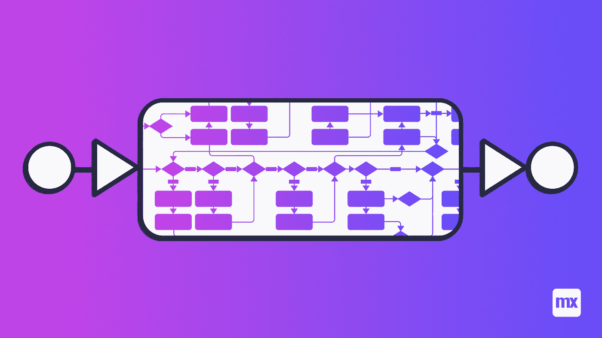
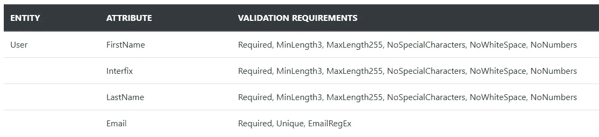
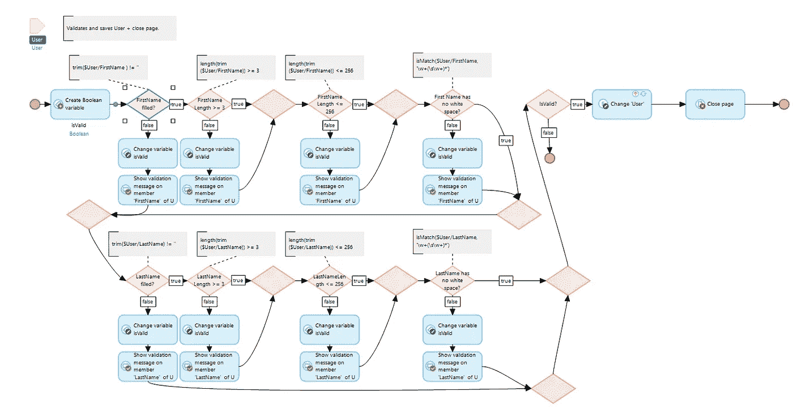
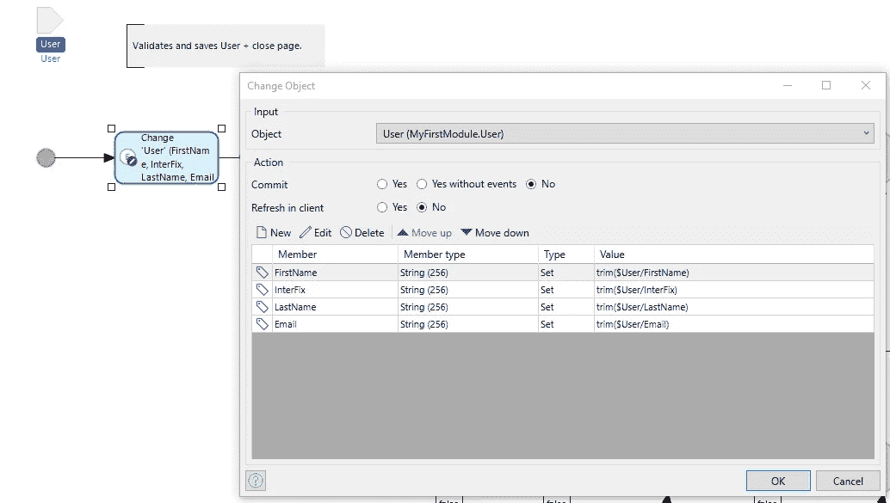
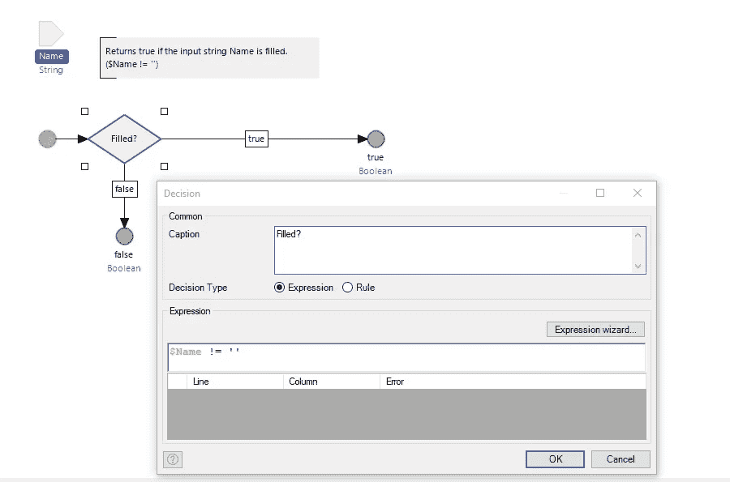
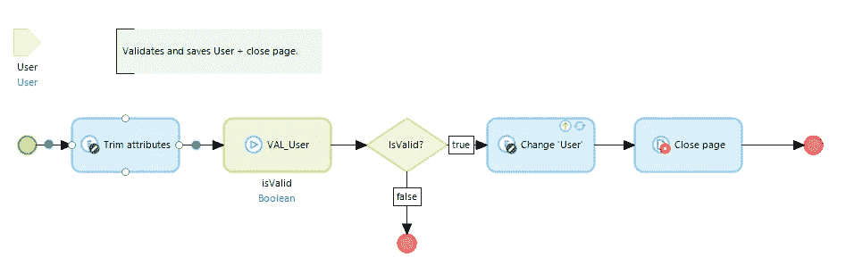
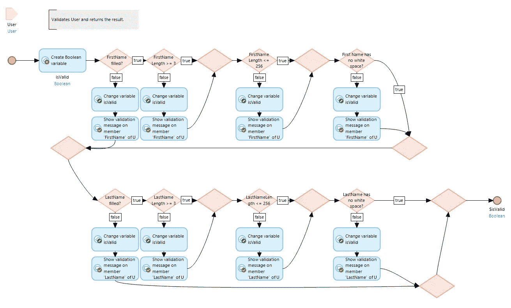
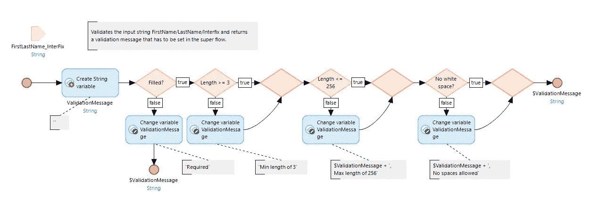
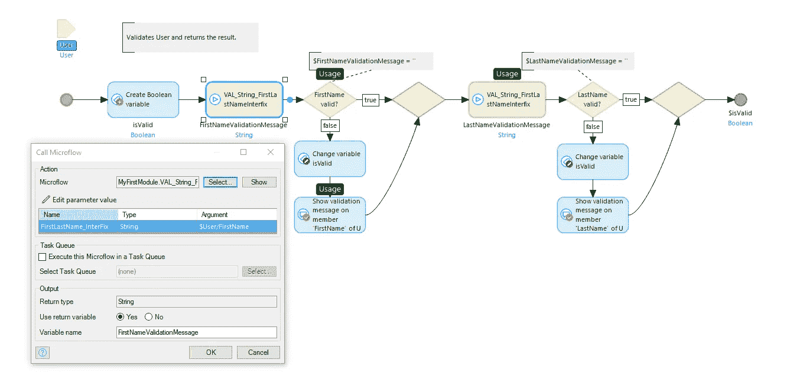

# Mendix 中的专家验证

> 原文：<https://medium.com/mendix/expert-validations-in-mendix-10e1bdfc7bc0?source=collection_archive---------2----------------------->

## 从最佳实践到专家实践

在开发 Mendix 应用程序时，在某个时间点，任何开发人员都面临这个问题:为了保持数据库的整洁，需要验证用户输入。[Mendix’Academy](https://academy.mendix.com/link/module/95/lecture/822/8.4.4-Merge-Multiple-Flows)教导我们如何以高效和高性能的方式构建这些验证。然而，当应用一个专家模式时，维护这些验证的努力可以大大减少，我想在这个博客中与你分享。

让我们从一个用例的当前 Mendix 最佳实践开始，我将逐步增强它，最终展示专家模式。用例:在一个“用户”实体中，在提交到数据库之前，需要根据下面的设计验证 4 个字符串属性。

Validation Requirements for User Entity

按照当前的最佳实践，将构建一个单一的长微流，它将包含每个验证需求的一个决策。它可能看起来像这样。

ACT_User_ValidateAndSave_Version1

在这个微流中，只有两个属性(FirstName & LastName)以四种方式进行验证:required、MinLength、MaxLength 和 NoWhiteSpace。然而，微流已经变得非常难以阅读和臃肿，尽管根据上面的需求表，我们只实现了 21 个必要决策中的 8 个。

# 修剪、嵌线和 VAL_Microflow

优化该流程的第一种方法是在流程开始时对属性使用 trim()。同样，决策表达式将变得更加清晰，因为我们不必在每个表达式中应用 trim()函数。一个额外的好处是 trim()函数只需计算一次，这提高了整个流的计算速度。

Example of using trim() once at the beginning of a validation flow

其次，我们可以为在多个决策中使用的表达式使用一个规则；同样，我们可以在一个地方保持这种状态。下面是 Rule_String_NotEmpty 的一个例子，它可以用来检查是否已经填写了 LastName、Interfix、FirstName 甚至 Email，因为所有这些都是字符串属性。

Example of a Rule_String_NotEmpty that can be used to reduce the number of (repeated) expressions

第三，我们将实体的验证转移到一个(子)VAL_Microflow 中，单独负责验证用户。VAL 流的结果用 isValid 布尔值返回给超级流。让我们也用绿色标记这个有值流。

ACT_User_ValidateAndSave in cleaned up format

显而易见的是，这个微流又变得清晰了。还要注意的是，这个微流的职责现在也更加清晰了，也就是说，提交用户。

VAL_User 流(如下)也变得更容易阅读，它只有一个职责:验证用户实体。

VAL_User SUB Microflow with the sole responsibility of validating User.

# 为什么我的流量还是一塌糊涂？！

即使这个流已经被显著地清理了，它仍然是臃肿和混乱的。此外，在要求进行的 21 项检查中，只完成了 8 项。想象一下他们都在这里！！

让我们来做一个思想实验吧！让我们假设在我们的项目中有更多具有相同属性的实体。例如，想象一个大型 Mendix 应用程序，其中一个匿名用户在一个地方使用非持久注册实体注册应用程序，而在其他情况下使用持久用户实体。两个实体包含相同的属性(名字、前缀、姓氏、电子邮件),相同的验证规则应该适用于它们。我们现在面临着一个更加复杂的冗余问题:如果一个属性的验证必须被改变，它必须在每个 VAL_Entity 子微流中被处理，这需要大量的重复工作。

在最近的一个项目中，我们有六个这样的实体，在两个应用程序中包含相似的属性。我们的团队已经根据 Mendix 的指导方针对这些验证进行了工作，但是每次业务团队添加一个需求时，我们都不得不费力地手工检查每个验证，以便实现变更。这是一个低效、易错且耗时的过程，需要紧急处理:解决方案是在(原始)属性级别进行验证。

# 验证原始属性

在上面的验证需求表中，可以看到相同的需求适用于 FirstName、LastName 和 Interfix。此外，所有这些属性都是字符串类型。创建一个 VAL _ String _ first lastnameinterfix 子微流是合理的。然而，由于输入变量现在是一个字符串而不是一个实体，我们不能再在这个流程中使用验证反馈活动。

VAL_String_FirstLastName_Interfix

开始时，创建一个值为“”的空字符串“ValidationMessage”变量。每当输入变量在决策中失败时，ValidationMessage 就会被更改或添加，如注释中所示。在流程结束时，将返回 ValidationMessage。

在超级流中，我们现在可以比较决策中返回的 ValidationMessage。如果它仍然与初始值相同(“”)，则我们有一个有效的属性。如果没有，我们可以将 ValidationMessage 设置为验证反馈活动的参数。

VAL_User which uses VAL_String_FirstLastName_Interfix twice for different attributes.

验证流程本身现在非常清晰，职责也更加明确。我们已经将整个 VAL_User 微流(包括 subs)中的决策和活动数量从 25 个减少到 18 个(减少了 30%)。此外，我们现在可以对 Interfix 使用相同的子微流，只需要 4 个额外的决策和活动，而使用旧模式会花费我们 8 个。很明显，随着验证复杂性的增加，与现有的最佳实践相比，这种模式将为开发人员节省越来越多的时间。一个额外的好处是，现在可以为用户提供每个属性的堆叠验证消息(例如，无空白、最小长度)，而在旧模式中，对于一个属性只可能有一种类型的反馈。

# 结束的

除了提高易读性和清晰描述的职责之外，现在还可以在一个地方维护单个应用程序的属性级验证，而不是在多个地方。因此，这是一个更加健壮的验证模式。

想更进一步吗？创建一个枚举 Enum_ValidationMessages 并将所有验证消息存储在一个地方。随后，用“getCaption(Module。Enum_ValidationMessage。必选)”。

您有兴趣了解更多关于验证的知识吗？请随时在[wouter.penris@capgemini.com](mailto:wouter.penris@capgemini.com)联系我们

## 阅读更多

 [## 设置数据验证- Studio Pro 9 操作指南| Mendix 文档

### 本指南解释了如何使用 Mendix 设置数据验证。在开始学习本指南之前，您需要…

docs.mendix.com](https://docs.mendix.com/howto/data-models/setting-up-data-validation)  [## 验证反馈- Studio Pro 9 指南| Mendix 文档

### 这种活性可用于微流和纳流。当微流…时，此操作被忽略并且不起作用

docs.mendix.com](https://docs.mendix.com/refguide/validation-feedback) 

*#关于:Wouter Penris
Wouter 是一名资深(首席)Mendix 软件工程师，拥有教育背景(英语&音乐)和音乐背景(爵士人声&钢琴)；多潜能者。作为一名教师，他花了数年时间完善尽可能简单易懂地指导学生的艺术，现在他非常喜欢使用同样的技能来构建具有直观和易于理解的用户体验的高科技产品。他是一个极具创造力的问题解决者，他将研究、技术和美学融入到实际的商业价值和建议中。Wouter 本质上是一个交流者，由于他的英语背景，他特别喜欢与国际客户一起工作。*

*来自发布者-*

如果你喜欢这篇文章，你可以在我们的 [*中页*](https://medium.com/mendix) *找到更多喜欢的。对于精彩的视频和直播会话，您可以前往*[*MxLive*](https://www.mendix.com/live/)*或我们的社区*[*Youtube PAG*](https://www.youtube.com/c/MendixCommunity/community)*e .*

*希望入门的创客，可以注册一个* [*免费账号*](https://signup.mendix.com/link/signup/?source=direct) *，通过我们的* [*学苑*](https://academy.mendix.com/link/home) *获得即时学习。*

有兴趣更多地参与我们的社区吗？你可以加入我们的 [*闲散社区频道*](https://join.slack.com/t/mendixcommunity/shared_invite/zt-hwhwkcxu-~59ywyjqHlUHXmrw5heqpQ) *或者想更多参与的人，看看加入我们的* [*遇见 ups*](https://developers.mendix.com/meetups/#meetupsNearYou) *。*