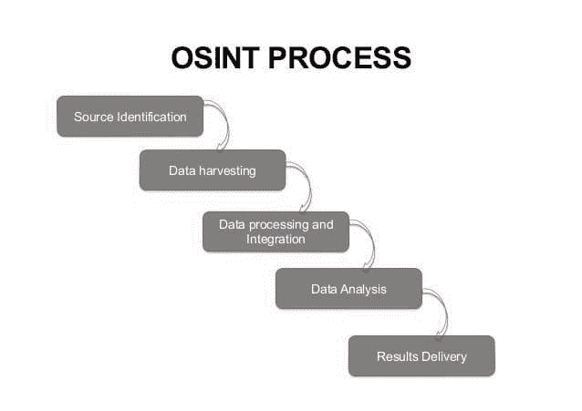
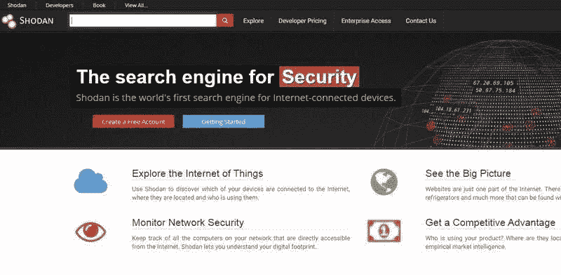
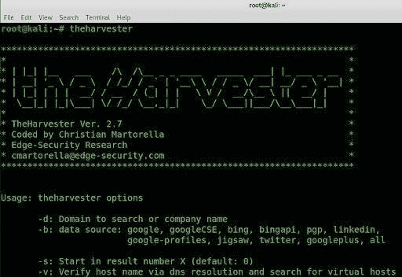

# 关于 OSINT 的解释？

> 原文：<https://medium.com/quick-code/explain-about-osint-4ac7365366b1?source=collection_archive---------0----------------------->

**什么是 OSINT？**

OSINT 的缩写是开源智能。这是一种可见的数据收集方法。一般来说，开源这个词指的是任何信息都可以很容易地被公众利用。

根据美国公法，OSINIT 的定义是:

*   它是从公开信息中产生的。
*   它被收集、分析并及时地分发给合适的受众。
*   满足特定的智能要求。

基本上，开源信息系统并不局限于你可以使用主要搜索引擎找到的内容。更多附加信息 [**道德黑客在线培训**](https://onlineitguru.com/ethical-hacking-course.html)

**新流程:**

OSINT 包括其流程中的 5 个阶段。下图显示了 OSINT 流程。

1.  **来源识别:-** 这是 OSINT 流程的初始阶段。在这个阶段，攻击者识别可能收集信息的潜在来源。
2.  **数据收集:-** 在这个阶段，攻击者从选择的来源和发现的其他来源收集信息。
3.  **数据处理和信息:-** 在这个阶段，攻击者通过搜索可能有助于枚举的信息来处理用于可操作观察的收获信息。
4.  **数据分析:-** 在这个阶段，攻击者使用 OSINT 分析工具对处理过的信息进行数据分析。
5.  **结果交付:-** 这是 OSINT 分析的最后阶段，并将结果报告给其他 red 团队成员。

**OSINT 如何使用？**

OSINT 可用于以下两种情况:

1.道德黑客和渗透测试

2.识别外部威胁。

**1。道德黑客和渗透测试:**

安全专业人员可以使用开源情报来识别友好网络中的潜在弱点。以便在被威胁者利用之前进行补救。

常见的弱点是

*   敏感信息的意外泄露。
*   开放端口和不安全的互联网连接设备。
*   未纠正的软件，如运行常见 CMS 产品旧版本的网站。

**2。识别外部威胁:**

互联网是洞察组织最紧迫威胁的绝佳来源。在大多数情况下，这种类型需要分析师识别和关联多个数据点，以便在采取行动之前验证威胁。

开源智能最重要的一点是，它经常与其他智能子类型结合使用。情报来源是内部遥测，封闭的暗网社区定期被用来过滤和验证开源情报。

**o 新工具:**

以下是一些 OSINT 工具，它们主要被渗透测试人员、社会工程师和安全研究人员用于他们的不同项目。获取关于 [**网络安全在线培训**](https://onlineitguru.com/cyber-security-training.html) 的深入知识

1.马尔特戈

2.肖丹

3 .谷歌黑

4.收割机

5.Tineye

**1。马尔特戈:**

佩特瓦发明了麦芽酒。安全专业人员和法医调查人员使用它来收集和分析开源情报。通过使用它，我们可以轻松地从各种来源收集信息，并使用各种转换来生成图形结果。Maltigi 是用 java 写的。需要用户注册。而且报名不收报名费。

shodan:

谷歌是一个面向所有用户的搜索引擎。但是，shodan 是黑客的搜索引擎。Shodan 提供了大量与网络连接的资产信息。网络设备包括电脑、笔记本电脑、网络摄像头、交通信号和各种物联网设备。Shodan 帮助安全分析师识别目标，并测试其各种默认设置或密码、可用端口、标语、服务等。

**3。Google Darks:**

在互联网上，最常用的搜索引擎是谷歌。如果我们搜索任何一个单一的东西，它会显示按相关性排序的数百个页面。搜索结果包括广告、网站、社交媒体帖子、图片等。谷歌呆子帮助用户以更好和更有效的方式搜索结果。这按如下方式完成:

**4。收割机:**

收割机是获取电子邮件和领域相关信息的重要且非常好的工具。这对于阐述信息非常有用。

> 利用黑客技术将您的职业生涯推向新的成功高度，注册参加 [**道德黑客培训**](https://onlineitguru.com/ethical-hacking-course.html) 的免费现场演示

**5。Tineye:**

Tineye 用于在网络上执行与图像相关的操作搜索。它有各种产品，如 Tineye 警报系统、颜色搜索 API、移动引擎等。通过使用 Tineye，我们可以搜索网上可用的图像以及图像拍摄的位置。Tineye 使用神经网络、机器学习和模式识别来获得结果。它利用图像匹配、水印识别、签名匹配等参数来匹配图像匹配关键字。

本文涵盖了 OSINT 的三个方面。一个是什么是 OSINT，一个是 OSINT 流程，最后一个是 OSINT 工具。我希望你对此有足够的想法。