# 面向云的可解释技术——探究基于 Azure 定制愿景的深度学习模型

> 原文：<https://medium.com/compendium/explainability-techniques-for-the-cloud-look-inside-deep-learning-models-produced-on-azures-ad4b35b9c705?source=collection_archive---------0----------------------->

# 介绍

这篇博文将涵盖一个具体的用例，我和我的同事为位于挪威奥斯陆的电力公司 [Elvia AS](https://www.elvia.no/) 工作。这需要从 Azure 的自定义视觉平台导出一个经过训练的(神经网络，CNN)模型，并使用各种可解释技术来更好地评估我们的黑盒模型的质量。

我们将关注前面提到的导出模型，以及使用不同的工具来推导对该模型预测的解释。然而，所学到的经验教训对于任何有训练过的(冻结的)张量流图的人都是相关的。pb)或 ONNX 模型，并希望进行一些可解释性实验，因为这基本上是 Custom Vision 为导出训练模型提供的格式。

对于那些有兴趣了解更多不同技术的人，请参见**参考资料**部分——关于这个有趣的话题，确实有无数的来源。

# 用例

[Computas](https://computas.com/) 受雇于 Elvia，创建机器学习软件，最终将成为一个大型数据处理系统的插件，旨在研究用额外的元数据丰富存储在他们数据库中的数据的可能性。此外，该软件被认为具有识别数据偏差的能力。显示各种损坏的旗帜图像。最初的用例侧重于根据电线杆的材料(如树木、混凝土或钢材)对其进行分类。这里我们可以看到一些这样的极点的例子:

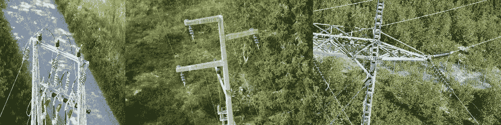

From left to right: tree, concrete, and steel poles.

为了解决这个问题，我们在微软的 [Azure](https://azure.microsoft.com/nb-no/) 平台上使用了 [Custom Vision](https://azure.microsoft.com/nb-no/services/cognitive-services/custom-vision-service/) 服务，因为它们友好的 GUI 具有拖放训练、测试和分类功能，并且相对易于使用的 SDK 具有相同的功能。

训练集包含每个极点的大约 300 幅图像，这些图像中极点的数量、背景、大小等各不相同。使用这些图像，我们实现了数据扩充，重点是水平和垂直翻转图像，调整大小，将我们的数据集扩展到 798、903 和 918 个图像，分别包含混凝土、钢和树杆，每个图像为 256x256。

上传图像并使用“快速训练”选项在定制视觉平台上训练模型后，我们得到了以下结果:

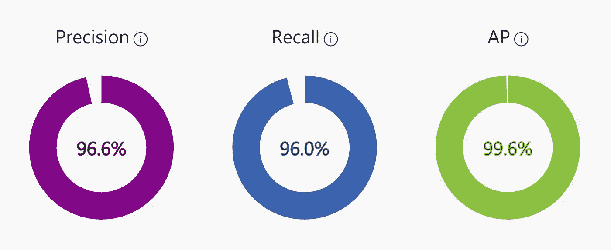

Results from training an ML model on Azure’s Custom Vision service using 800–900 images of 3 different types of utility poles.

# 问题是

上面看到的结果给人的印象是模型表现相对较好，我们甚至创建了一个单独的图像测试集，每个标签包含大约 50 张图像(也进行了放大和调整)，这支持了结果。

然而，在今天的数据科学家/机器学习社会中，我们知道，一个使用各种度量标准得分很高的模型并不一定意味着该模型是“好的”。这方面的一个例子是经典的[狼对狗实验](https://www.researchgate.net/figure/A-husky-on-the-left-is-confused-with-a-wolf-because-the-pixels-on-the-right_fig1_329277474)，其中模型在原始数据集上表现良好，但当检查模型时，很明显模型使用背景，而不是狼或狗来决定分类。更具体地说，如果背景包含雪，它将图像分类为“狼”，如果不包含雪，它将图像分类为“狗”。

由于这个实验和其他实验表明需要验证经过训练的神经网络模型，我们很想知道我们的模型基于什么进行预测——它是在寻找极点，还是在背景和标签之间找到了某种关联？或者介于两者之间？

# 解决方案

当想要“深入”黑盒模型时，主要有两种方法，每种方法都有自己的技术子集:

**内部** —这里我们依靠访问模型的内部权重，更具体地说是最后一个卷积层的权重，来计算特定图像推断过程中每个节点的重要性。据我们所知，这里使用最多的技术被称为“热图”或“[级激活图](https://arxiv.org/abs/1512.04150)”(CAM)，还有许多变体，如 [GRAD CAM](/analytics-vidhya/visualizing-activation-heatmaps-using-tensorflow-5bdba018f759) 、[制导 Grad Cam](/@ninads79shukla/gradcam-73a752d368be) 等。这里的目的是进行上述重要性计算，以创建一个像素重要性网格，该网格覆盖在分类图像上，从而生成此图像中所示的“热图”:

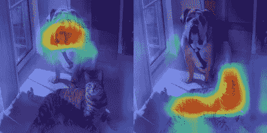

Example of heat maps or class activations maps from “[Grad-CAM implementation in Pytorch](https://github.com/jacobgil/pytorch-grad-cam)”.

**扰动** —与**内部的**只需要一次迭代相比，这种技术依赖于模型推理功能的多次迭代，通常是数百次或数千次。这里的思想是输入要多次分类的图像，并进行小的扰动，从而可以识别图像的哪些部分对于模型将图像分类到特定标签是最重要的。这里最受欢迎的技术是 LIME 和 Anchoring，它们分别由 2016 年和 2018 年的基本相同的团队开发。

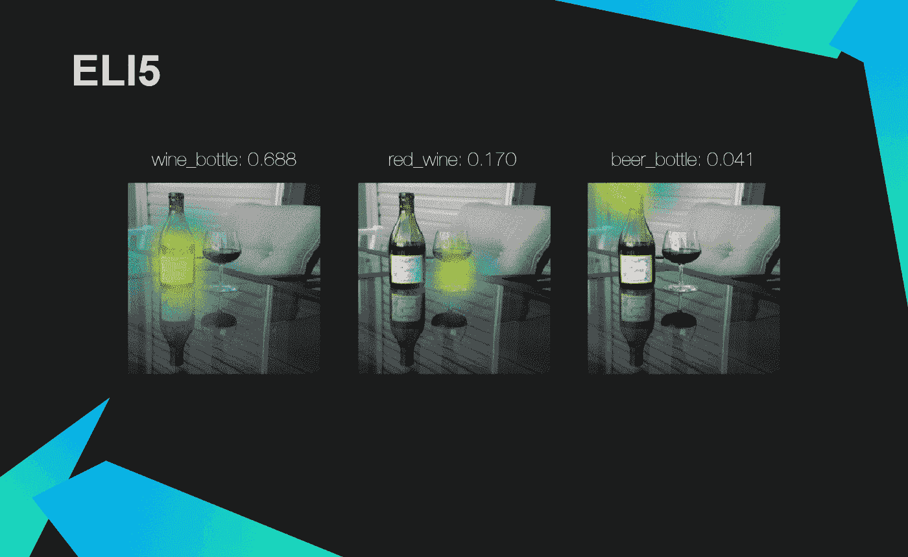

Great visualization of the LIME technique from “[Knowing What and Why? — Explaining Image Classifier Predictions](https://towardsdatascience.com/knowing-what-and-why-explaining-image-classifier-predictions-680a15043bad)”.

一般来说，在推断期间利用模型内部结构的技术将给出模型使用什么区域来预测它所做的标签的更好印象。然而，给定一个(冻结的)张量流(。pb)或 ONNX 模型，这实质上是定制视觉服务所提供的，这被证明难以实现，因为缺乏对模型内部值的访问。这就是为什么我们要谈论这两组，但重点放在最后一组，**扰动，**，因为这是我们能够与定制视觉服务产生的模型一起使用的。

# 类别激活图(/热图)

如前所述，CAM 是一种依赖于访问模型内部权重和推断过程中计算的值的技术，其中图像在模型中运行一次，从而创建热图。

这篇文章不会详细介绍这种技术背后的数学原理，但是，一个简单的解释是，推理像正常一样运行，直到最后一个卷积层，而不是所有特征映射的标准全局平均池，导致一个值乘以其相应的权重，特征映射本身通过权重运行，产生像素重要性网格，即热图，它可以“放置”在分类图像上。

# 石灰

LIME 代表“局部可解释的模型不可知解释”，这是 2016 年一篇名为“[的论文中提出的一种技术，我为什么要相信你？](https://arxiv.org/pdf/1602.04938.pdf)”。顾名思义，这种技术是“模型不可知的”,这意味着它适用于不同类型的模型，因此也适用于不同类型的数据，比如表格、文本和图像。

在这里，我们可以看到这种技术的一个例子，使用现有的 Python [库](https://lime-ml.readthedocs.io/en/latest/lime.html#module-lime.lime_image)，用于我们数据集的图像:

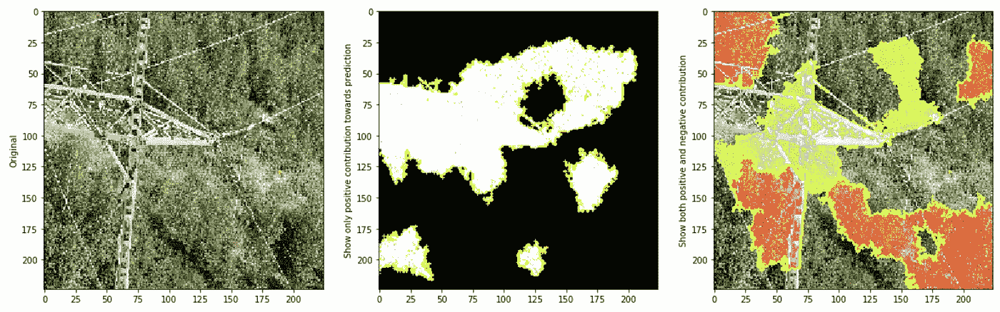

From left to right: Input image comprising a steel pole, positive pixels for predicting the label “steel pole” highlighted while the rest is turned off, positive pixels with a green overlay and negative pixels with a red overlay.

该技术的工作原理是，给定输入图像和计算像素重要性的特定标签，程序根据像素的相似程度将图像分成不同的区域，称为“超像素”，并通过多次迭代推理运行图像，每次迭代打开和关闭不同的超像素。这导致程序为一个特定的标签找到最重要的像素。这里需要注意的是，标签不一定是模型将图像分配到的标签，这与热图技术不同。

更具体地说，LIME 试图模拟不同超像素的线性模型，并查看它们的变化如何影响预测，然后优化模型预测的内容和我们希望模型预测的内容之间的距离。这些本地模型被称为“代理模型”。确定超像素的最佳分割是一个困难的问题，可能会导致解释不能很好地代表正在发生的事情。

这导致每个特定用例的超参数调整，这可能导致可解释函数过度适应问题，并且不稳定/不可重复。我们发现的一种减轻这种情况的技术是使用不同的随机种子值多次运行 LIME 技术。这方面的一个例子可以在“实验”中看到。

这并不是对技术背后错综复杂的全面解释，请参见[这里的](https://christophm.github.io/interpretable-ml-book/lime.html)。

我们还应该提到的是，LIME 技术并不能很好地抵御[对抗性攻击](https://arxiv.org/abs/1911.02508)，这只是指专门添加到图像中的噪声，以使机器学习模型行为不端，例如，给图像分配错误的标签，错误地声称某组超像素对某些标签很重要，等等。，人类是不可能注意到的。

# 锚定

像 LIME 一样， *Anchoring* 是一种与模型无关的扰动技术，这意味着它依赖于推理的多次迭代，可以用于各种类型的模型，因此也可以用于不同类型的数据。

如上所述，锚定是由开发 LIME 技术的同一批人开发的，可以被视为 LIME 的改进版本。与 LIME 相比，锚定基于图像的更大区域，并且不是在输入中有小变化的情况下运行特定次数的推理迭代，而是利用强化学习，更具体地说是“多臂土匪问题”与图搜索算法相结合来寻找最佳局部区域，因此减少了所需的迭代次数。然而，这是以比 LIME 更多的超参数调谐为代价的。

这里我们可以看到这种技术的一个例子，使用现有的 Python [库](https://docs.seldon.io/projects/alibi/en/stable/examples/anchor_image_imagenet.html)，用于与 LIME 例子中相同的图像——它显示了这些技术在哪个区域对于预测相同的标签是重要的这一点上基本上是一致的(尽管锚定使用了更大的区域)。

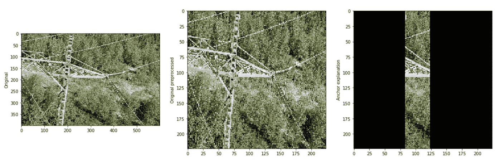

An example of the explainability technique called Anchoring applied to an image of a steel pole.

# 实验

现在我们想展示石灰技术的一些有趣的发现

**噪音**

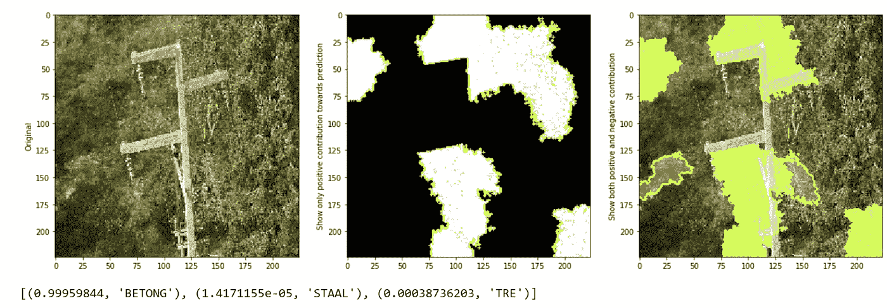

An example of the explainability technique called LIME applied to an image of a concrete pole, with the model’s confidence values for each of the labels. Please note the translation: BETONG = concrete, STAAL = steel, and TRE = tree.

在这个混凝土杆的图像中，我们可以看到模型相当确定它确实是一个混凝土杆。此外，我们可以看到杆的大部分有绿色覆盖，显示预测“混凝土杆”的阳性像素，但不是整个杆。

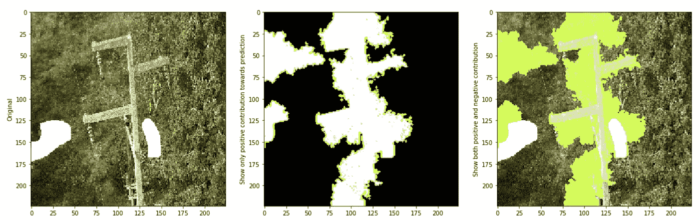

An example of the explainability technique called LIME applied to an image of a concrete pole with assumed noise removed.

如果我们去除“噪声”，即红色覆盖部分显示对预测“混凝土杆”有负面影响的像素，看起来杆的较大部分对“混凝土杆”分类有正面影响。

因此，看起来极点本身最初很重要，但图像中有一些噪声，模型无法忽略。

**增加预测确定性**

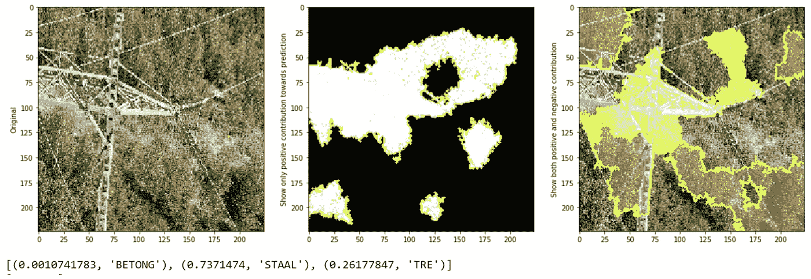

An example of the explainability technique called LIME applied to the previously seen image of a steel pole with its confidence values for the different labels.

如果我们输入一个我们之前见过的钢杆—注意置信度值:只有 73%确定它是图像中的钢杆(STAAL ), 26%确定它是树杆(TRE ),然后通过移除大部分红色像素来做类似的实验—该模型明显更确定图像中确实有一个钢杆(STAAL ),并且该杆的更大部分被认为对预测“钢杆”是肯定的。这表明，石灰解释功能的工作和它的代理模型可以模仿神经网络模型。

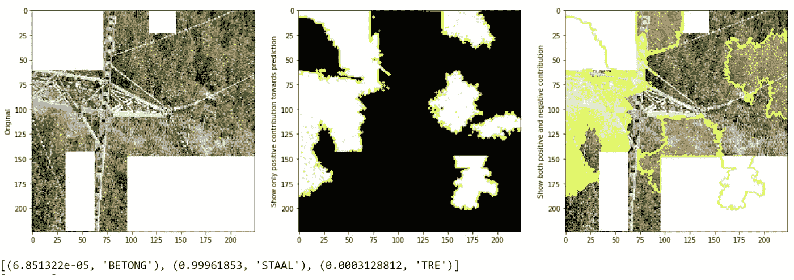

An example of the explainability technique called LIME applied to an image of a steel pole where the model’s certainty is increased after removal of assumed noise.

**稳定性**

如前所述，由于超参数的数量，这种技术的稳定性存在问题，因为 LIME 主要基于小像素区域，所以 LIME 技术在不同的随机种子值下表现如何？

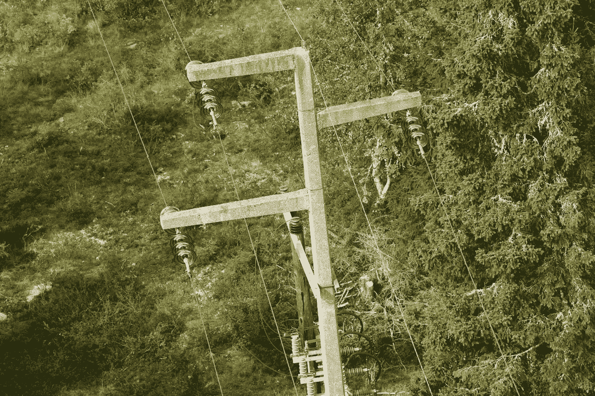

A utility pole made of concrete from the dataset.

我们用 9 个不同的随机种子将相同的图像运行了 9 次:从 1 开始，每次迭代增加 10 的值。现在，我们可以有一个更大的变化，尽管我们一致认为实验展示了模型的稳定性。

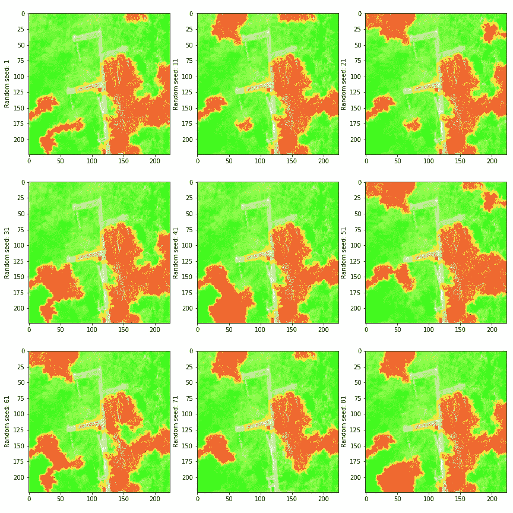

An image of a concrete pole ran through the LIME technique using different random seeds for testing the technique’s stability.

# 结论

在这篇博文的结尾，我们想重复一些最重要的观点:

*   我们展示了使用 LIME 和 Anchoring 等可解释技术来深入了解在 Azure 的自定义视觉平台上训练的(黑盒)CNN 模型的内部工作是可能的。
*   这两种技术基于对输入进行小的改变的推理的多次迭代，这不同于其他技术，例如依赖于模型内部参数的类激活映射。
*   石灰和锚定都给出了有些相似的结果，我们认为这是基于随机种子实验的稳定结果。这些结果让我们非常有信心，我们的模型不仅基于对象本身进行预测，还考虑了背景，这让我们回想起狼与狗的问题。
*   值得注意的是，这些技术并不一定能解决使用它们时发现的问题，例如过于重视背景，这意味着我们仍然依赖领域专家根据技术的输出提出可能的解决方案。

最后，我们一直在与微软联系，并在网上搜索类似的解决方案，但运气不佳。希望这篇博文可以帮助和我们处境相同的人和公司，让他们在需要解释他们的 CNN 模型是基于什么的时候能够成功。

# 参考

狼对狗:[https://www . researchgate . net/figure/A-husky-on-the-left-is-confused with-A-wolf-因为-the-pixels-on-the-right _ fig 1 _ 329277474](https://www.researchgate.net/figure/A-husky-on-the-left-is-confused-with-a-wolf-because-the-pixels-on-the-right_fig1_329277474)

职业激活地图:【https://arxiv.org/abs/1512.04150 

grad CAM:[https://medium . com/analytics-vid hya/visualizing-activation-heat maps-using-tensor flow-5 bdba 018 f 759](/analytics-vidhya/visualizing-activation-heatmaps-using-tensorflow-5bdba018f759)

制导 Grad CAM:[https://medium.com/@ninads79shukla/gradcam-73a752d368be](/@ninads79shukla/gradcam-73a752d368be)

py torch Grad CAM:[https://github.com/jacobgil/pytorch-grad-cam](https://github.com/jacobgil/pytorch-grad-cam)

深入探究解释技巧，如 LIME:[https://towards data science . com/known-what-and-why-explaining-image-classifier-predictions-680 a 15043 bad](https://towardsdatascience.com/knowing-what-and-why-explaining-image-classifier-predictions-680a15043bad)

“我为什么要相信你？”https://arxiv.org/pdf/1602.04938.pdf

Python 的 LIME 库:[https://LIME-ml . readthedocs . io/en/latest/LIME . html # module-LIME . LIME _ image](https://lime-ml.readthedocs.io/en/latest/lime.html#module-lime.lime_image)

对莱姆和 SHAP 的敌对攻击:[https://arxiv.org/abs/1911.02508](https://arxiv.org/abs/1911.02508)

Python 的锚定库:[https://lime-ml . readthedocs . io/en/latest/lime . html # module-lime . lime _ image](https://lime-ml.readthedocs.io/en/latest/lime.html#module-lime.lime_image)