# Python 中探索性数据分析的原因和方法

> 原文：<https://medium.com/edureka/exploratory-data-analysis-in-python-3ee69362a46e?source=collection_archive---------1----------------------->


Exploratory Data Analysis — Edureka

数据分析基本上是使用统计和概率来找出数据集中的趋势。它帮助你从统计噪音中整理出“**真实的**趋势。什么是“**噪音**”？一大堆看起来根本没有任何意义的数据。以下是我们将要讨论的主题，作为 Python 中探索性数据分析的一部分:

*   Python 中的探索性数据分析是什么？
*   探索性数据分析的需求
*   Python 中探索性数据分析的步骤有哪些？
*   EDA 中使用的工具

# Python 中的探索性数据分析是什么？

**Python**中的探索性数据分析(EDA)是数据分析过程的第一步，由 **John Tukey** 于 20 世纪 70 年代开发。在统计学中，探索性数据分析是一种[分析数据集](https://www.edureka.co/blog/football-world-cup-best-xi-analysis-using-python/)以总结其主要特征的方法，通常采用可视化方法。从名字本身就可以知道，这是我们需要探索数据集的一个步骤。

**例如，**你计划去“ **X** ”地点旅行。做决定前要做的事情:

*   你将在谷歌、Instagram、脸书和其他社交网站上探索该位置的所有地方、瀑布、徒步旅行、海滩和餐馆。
*   计算它是否在你的预算之内。
*   检查覆盖所有地方的时间。
*   旅行方式的类型。

同样，当你试图建立一个机器学习模型时，你需要非常确定你的数据是否有意义。探索性数据分析的主要目的是获得对数据的信心，从而准备好使用机器学习算法。

# 探索性数据分析的需求

探索性的数据分析是你跳到机器学习或数据建模之前的关键一步。通过这样做，您可以了解所选特征是否足以建模，是否所有特征都是必需的，是否存在任何相关性，我们可以基于这些相关性返回到数据预处理步骤或继续建模。

一旦**探索性数据分析**完成并得出见解，其特征可用于监督和非监督机器学习建模。

在每个机器学习工作流程中，最后一步是向利益相关者报告或提供见解，作为一名数据科学家，你可以解释每一点代码，但你需要记住受众。通过完成**探索性数据分析**，您将获得许多图表、热图、频率分布、图表、相关矩阵以及假设，任何个人都可以通过这些图表了解您的数据是关于什么的，以及您从探索您的数据集中获得了什么见解。

有句话叫“**一图胜千言**”。

我想为数据科学家修改为“**一个图抵得上一千行**

在我们的**旅行示例**中，我们对选定的地方进行了所有的探索，基于此，我们将获得计划旅行的信心，甚至与我们的朋友分享我们对该地方的见解，以便他们也能加入。

# Python 中探索性数据分析的步骤有哪些？

进行探索性数据分析有许多步骤。我想讨论使用波士顿数据集的以下几个步骤，该数据集可以从**sk learn . datasets import load _ Boston**导入

*   数据描述
*   处理缺失数据
*   处理异常值
*   通过情节理解关系和新的见解

## a)数据描述:

我们需要了解不同种类的数据和数据的其他统计数据，然后才能继续其他步骤。一个好的方法是从 python 中的 **describe()** 函数开始。在 Pandas 中，我们可以在数据帧上应用 describe()，这有助于生成描述性统计数据，这些统计数据总结了数据集分布的集中趋势、离散度和形状，不包括 NaN 值。

结果的索引将包括计数、平均值、标准差、最小值、最大值以及下限、50%和上限。默认情况下，下百分位是 25，上百分位是 75。50%与中位数相同。

正在加载数据集:

```
import pandas as pd
from sklearn.datasets import load_boston

boston = load_boston()
x = boston.data
y = boston.target
columns = boston.feature_names
# creating dataframes
boston_df = pd.DataFrame(boston.data)
boston_df.columns = columns
boston_df.describe()
```

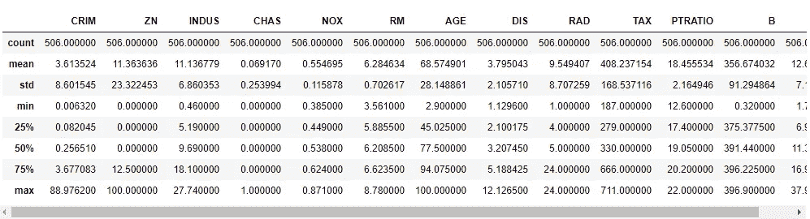

## b)处理缺失数据:

现实世界中的数据很少是干净和同质的。由于多种原因，数据可能在数据提取或收集过程中丢失。缺失值需要小心处理，因为它们会降低我们任何绩效矩阵的质量。它还会导致错误的预测或分类，并且还会对所使用的任何给定模型造成高偏差。有几种处理缺失值的方法。然而，应该做什么的选择在很大程度上取决于我们的数据和缺失值的性质。以下是一些技巧:

*   删除空值或缺失值
*   填充缺失值
*   用 ML 算法预测缺失值

## 删除空值或缺失值:

这是处理缺失值的最快和最容易的步骤。不过一般不建议。这种方法降低了我们模型的质量，因为它减少了样本量，因为它通过删除任何变量缺失的所有其他观察值来工作。

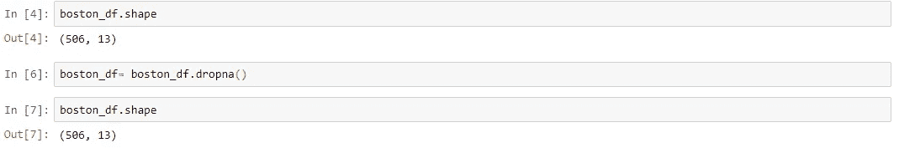

上面的代码表明我们的数据集中没有空值。

## 填充缺失值:

这是处理缺失值的最常见方法。在此过程中，缺失值将被测试统计数据(如缺失值所属的特定特征的平均值、中值或众数)替换。假设我们在波士顿数据集中缺少年龄值。然后下面的代码会用 30 来填充缺少的值。

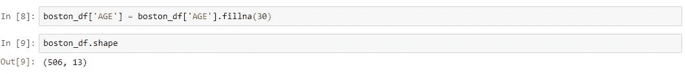

## 使用 ML 算法预测缺失值:

这是迄今为止处理缺失数据的最好和最有效的方法之一。根据缺失数据的类别，可以使用回归或分类模型来预测缺失数据。

## c)处理异常值:

离群值是与人群分离或不同的东西。异常值可能是数据收集过程中出现错误的结果，也可能只是数据中出现偏差的迹象。检测和处理异常值的一些方法:

*   箱线图
*   散点图
*   z 分数
*   IQR(四分位数间距)

## 箱线图:

箱线图是一种通过四分位数以图形方式描绘数字数据组的方法。该方框从数据的 Q1 值延伸到第三季度的四分位值，中间有一条线(Q2)。触须从框的边缘延伸出来，以显示数据的范围。离群点是那些超过胡须末端的点。箱线图显示了位置和分布的稳健度量，并提供了关于对称性和异常值的信息。

```
import seaborn as sns 
sns.boxplot(x=boston_df['DIS'])
```

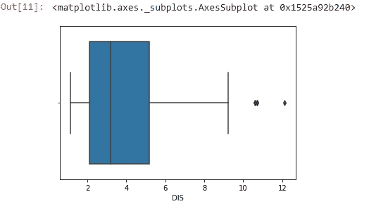

## 散点图:

散点图是一种数学图表，使用笛卡尔坐标来显示一组数据的两个变量的值。数据显示为点的集合，每个点的一个变量的值决定水平轴上的位置，另一个变量的值决定垂直轴上的位置。远离总体的点可以称为异常值。

```
import matplotlib.pyplot as plt
fig, ax = plt.subplots(figsize=(16,8))
ax.scatter(boston_df['INDUS'] , boston_df['TAX'])
ax.set_xlabel('proportion of non-retail business acre per town')
ax.set_ylabel('full-value property-tax per $10000')
plt.show()
```

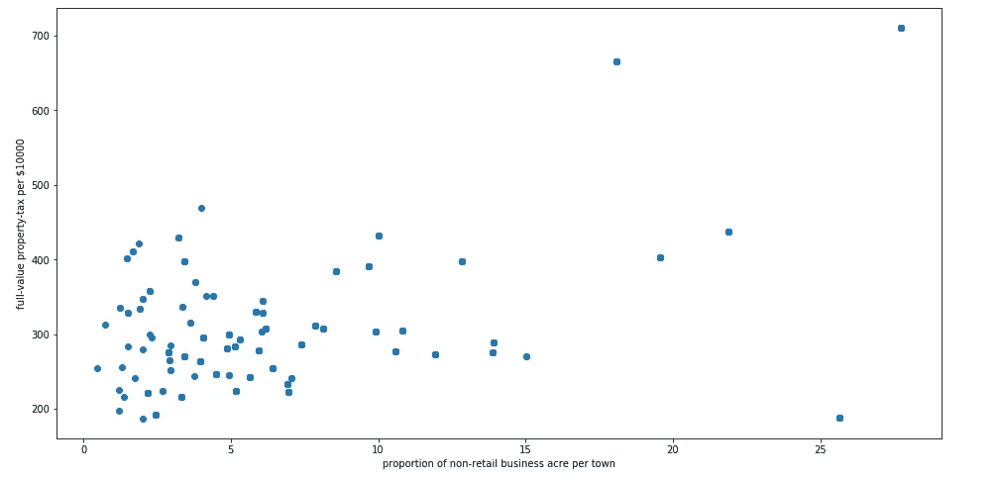

## z 分数:

Z 得分是标准偏差的有符号数，通过它，观察值或数据点的值高于正在观察或测量的平均值。在计算 Z 值时，我们会重新调整数据的比例并使其居中，同时寻找离零太远的数据点。这些离零太远的数据点将被视为异常值。在大多数情况下，使用阈值 3 或-3，即如果 Z 分值分别大于或小于 3 或-3，则该数据点将被识别为异常值。

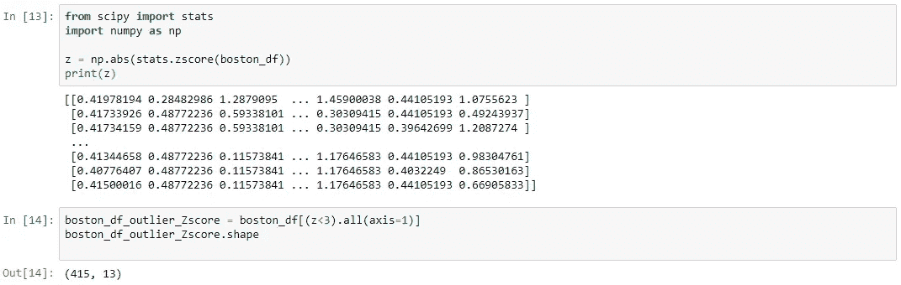

我们可以从上面的代码中看到，形状发生了变化，这表明我们的数据集有一些异常值。

## IQR:

四分位数间距(IQR)是统计离差的一种度量，等于第 75 个和第 25 个百分位数之间的差值，或者上四分位数和下四分位数之间的差值。

**IQR = Q3 Q1**

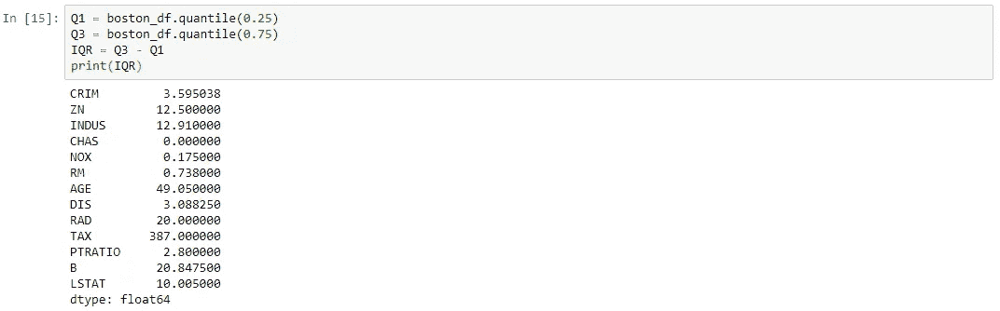

一旦我们有 IQR 分数低于代码将删除我们的数据集中所有的离群值。

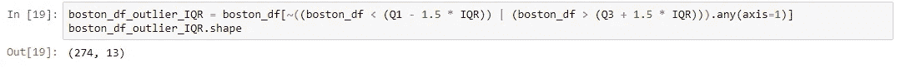

## 通过情节理解关系和新见解:

通过可视化数据集，我们可以获得数据中的许多关系。让我们来看一些技巧，以便了解其中的洞见。

*   柱状图
*   热图

## 直方图:

直方图是快速评估概率分布的一个很好的工具，几乎任何观众都可以很容易地理解它。Python 为构建和绘制直方图提供了一些不同的选项。

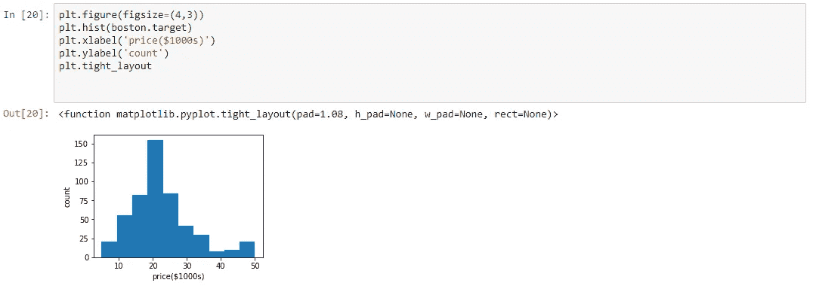

## 热图:

热图程序显示了定量变量在 2 个分类因素的所有组合中的分布。如果这两个因素中有一个代表时间，那么这个变量的演变就可以很容易地用图来观察。渐变色标用于表示定量变量的值。两个随机变量之间的相关性是一个从-1 到 0 到+1 的数字，分别表示强的反比关系、无关系和强的正关系。

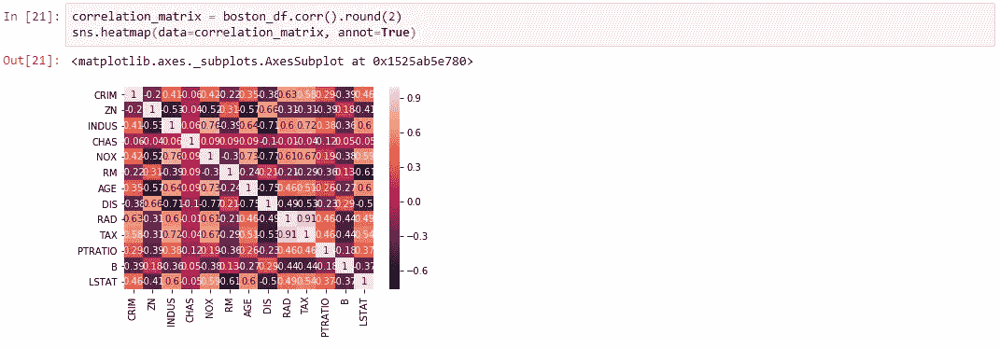

# 探索性数据分析工具

有很多开源工具可以自动执行预测建模的步骤，如数据清理、数据可视化。其中一些也很受欢迎，如 Excel，Tableau，Qlikview，Weka 和许多除了编程之外的其他软件。

在编程上，我们可以用 Python，R，SAS 来完成 EDA。Python 中的一些重要包是:

*   熊猫
*   Numpy
*   Matplotlib
*   海生的
*   散景

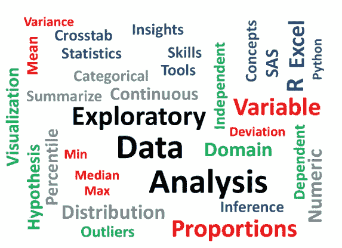

许多数据科学家将急于进入机器学习阶段，有些人要么完全跳过探索过程，要么只做很少的工作。这是一个具有多种含义的错误，包括生成不准确的模型，生成准确的模型但基于错误的数据，在数据准备中没有创建正确类型的变量，以及由于仅在生成模型后才意识到数据可能有偏差，或有异常值，或有太多缺失值，或发现某些值不一致而导致资源使用效率低下。

在我们的**旅行示例**中，如果没有事先探索这个地方，您将在旅行中面临许多问题，如方向、成本、旅行，这些都可以通过 EDA 来减少，这同样适用于机器学习问题。如果你想查看更多关于人工智能、DevOps、道德黑客等市场最热门技术的文章，那么你可以参考 [Edureka 的官方网站。](https://www.edureka.co/blog/?utm_source=medium&utm_medium=content-link&utm_campaign=exploratory-data-analysis-in-python)

请留意本系列中的其他文章，它们将解释 Python 和数据科学的各个方面。

> 1.[Python 中的机器学习分类器](/edureka/machine-learning-classifier-c02fbd8400c9)
> 
> 2.[Python Scikit-Learn Cheat Sheet](/edureka/python-scikit-learn-cheat-sheet-9786382be9f5)
> 
> 3.[机器学习工具](/edureka/python-libraries-for-data-science-and-machine-learning-1c502744f277)
> 
> 4.[用于数据科学和机器学习的 Python 库](/edureka/python-libraries-for-data-science-and-machine-learning-1c502744f277)
> 
> 5.[Python 中的聊天机器人](/edureka/how-to-make-a-chatbot-in-python-b68fd390b219)
> 
> 6. [Python 集合](/edureka/collections-in-python-d0bc0ed8d938)
> 
> 7. [Python 模块](/edureka/python-modules-abb0145a5963)
> 
> 8. [Python 开发者技能](/edureka/python-developer-skills-371583a69be1)
> 
> 9.[哎呀面试问答](/edureka/oops-interview-questions-621fc922cdf4)
> 
> 10.[Python 开发者简历](/edureka/python-developer-resume-ded7799b4389)
> 
> 11.[用 Python 进行网页抓取](/edureka/web-scraping-with-python-d9e6506007bf)
> 
> 12.[用 Python 的乌龟模块做的蛇游戏](/edureka/python-turtle-module-361816449390)
> 
> 13. [Python 开发者工资](/edureka/python-developer-salary-ba2eff6a502e)
> 
> 14.[主成分分析](/edureka/principal-component-analysis-69d7a4babc96)
> 
> 15. [Python vs C++](/edureka/python-vs-cpp-c3ffbea01eec)
> 
> 16.[刺儿头教程](/edureka/scrapy-tutorial-5584517658fb)
> 
> 17. [Python SciPy](/edureka/scipy-tutorial-38723361ba4b)
> 
> 18.[最小二乘回归法](/edureka/least-square-regression-40b59cca8ea7)
> 
> 19. [Jupyter 笔记本小抄](/edureka/jupyter-notebook-cheat-sheet-88f60d1aca7)
> 
> 20. [Python 基础知识](/edureka/python-basics-f371d7fc0054)
> 
> 21. [Python 模式程序](/edureka/python-pattern-programs-75e1e764a42f)
> 
> 22.[Python 中的生成器](/edureka/generators-in-python-258f21e3d3ff)
> 
> 23. [Python 装饰师](/edureka/python-decorator-tutorial-bf7b21278564)
> 
> 24. [Python Spyder IDE](/edureka/spyder-ide-2a91caac4e46)
> 
> 25.[Python 中使用 Kivy 的移动应用](/edureka/kivy-tutorial-9a0f02fe53f5)
> 
> 26.[十大最佳学习书籍&练习 Python](/edureka/best-books-for-python-11137561beb7)
> 
> 27.[使用 Python 的机器人框架](/edureka/robot-framework-tutorial-f8a75ab23cfd)
> 
> 28.[使用 PyGame 的 Python 中的贪吃蛇游戏](/edureka/snake-game-with-pygame-497f1683eeaa)
> 
> 29. [Django 采访问答](/edureka/django-interview-questions-a4df7bfeb7e8)
> 
> 30.[十大 Python 应用](/edureka/python-applications-18b780d64f3b)
> 
> 31.[Python 中的散列表和散列表](/edureka/hash-tables-and-hashmaps-in-python-3bd7fc1b00b4)
> 
> 32. [Python 3.8](/edureka/whats-new-python-3-8-7d52cda747b)
> 
> 33.[支持向量机](/edureka/support-vector-machine-in-python-539dca55c26a)
> 
> 34. [Python 教程](/edureka/python-tutorial-be1b3d015745)

*原载于 2019 年 7 月 29 日*[*https://www.edureka.co*](https://www.edureka.co/blog/exploratory-data-analysis-in-python/)*。*