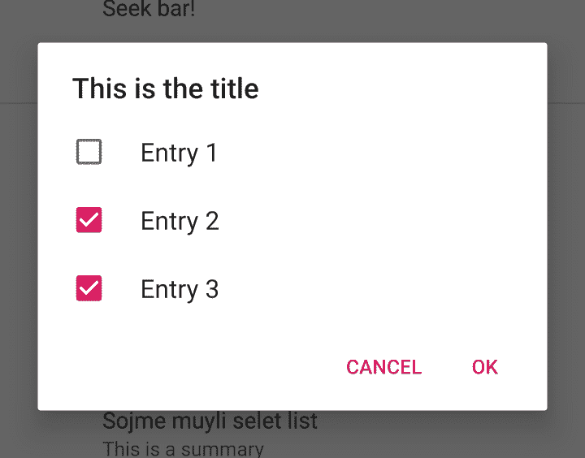

# 探索 Android Jetpack:首选项

> 原文：<https://medium.com/google-developer-experts/exploring-android-jetpack-preferences-8bcb0b7bdd14?source=collection_archive---------0----------------------->


设置屏幕为我们的用户提供了一种方式来配置我们的应用程序，以他们希望它的外观，感觉和行为。除此之外，它还是我们提供外部信息链接的好地方，比如隐私政策、开源许可等等。虽然我们可以自己构建这些屏幕，但对于看起来如此简单的需求，通常会有许多样板文件。我们不仅需要创建用户界面，还需要创建用于从应用程序首选项文件中读取和写入值的逻辑。

幸运的是，Android Jetpack 拥有所谓的[偏好库](https://developer.android.com/jetpack/androidx/releases/preference)。这为我们提供了一种方法，用开发人员最少的工作来创建我们的应用程序首选项。使用 Android jetpack 中的这一首选项功能不仅可以帮助您节省开发时间，还意味着我们的设置屏幕将具有一致的材质外观，并与我们应用程序的其余部分相结合。

让我们深入了解一下首选项，这样我们就可以看到哪些是可用的，以及如何将它实现到我们的应用程序中。

**注:**首选项库的当前版本是**androidx . preference:preference:1 . 1 . 0-rc01**。

# 设置偏好设置屏幕

为了构建一个首选项屏幕，我们有一个首选项层次结构。这个层次结构用于定义不同的首选项属性，可以为我们的应用程序设置这些属性。有两种方法可以定义这个层次结构，编程或者在 XML 中。我们将设置加载到相应组件(比如一个片段)的方式将取决于我们最初如何定义我们的层次结构。


让我们从构建这个设置层次结构开始。如果我们要通过 XML 资源创建我们的首选项，那么我们需要在我们应用程序的 **res/xml** 目录中定义一个新的 **PreferenceScreen** 资源。在此范围内，我们可以定义希望在此屏幕上显示的不同首选项。

```
<androidx.preference.PreferenceScreen
    xmlns:app="http://schemas.android.com/apk/res-auto"></androidx.preference.PreferenceScreen>
```

在本文中，我们需要定义希望在首选项屏幕中显示的不同设置。如果我们以编程方式创建首选项，那么直接进入我们将用于屏幕的组件(片段)。

现在，有许多不同类型的设置可以使用，但我们将从其中最简单的开始，它是一个简单的文本项。

```
<Preference
	android:key="preference_key"
	android:title="@string/preference_title"
	android:summary="@string/preference_summary" />
```

您会注意到，我们为首选项定义了三个属性:

*   **键**:该键用于引用保存的偏好值。该键将用于保存和检索我们的首选项值
*   **标题**:用于显示首选项的标题
*   **摘要**:用于显示在首选项上的描述

当显示在屏幕上时，我们会看到类似这样的东西:


如果我们以编程方式创建首选项，那么我们通过实例化首选项类的一个新实例来实现这一点:

```
val simplePreference = Preference(context).apply {
    key = "simple_preference"
    title = "Some title"
    summary = "Some summary"
}
```

在这里我们可以看到我们的偏好**标题**以“基本偏好”的形式显示，以及显示在其下方的相应的**摘要**，“这是一个摘要”。我们可以利用首选项上的**图标**属性来扩展上述内容，这允许我们使用一个可绘制的引用来在首选项的开头显示一个图标:

```
<Preference
    android:key="preference_key"
    android:title="@string/preference_title"
    android:summary="@string/preference_summary"
    android:icon="@drawable/ic_menu_camera" />
```


如果我们以编程方式创建首选项，那么我们通过用首选项类实例设置 icon 属性来实现这一点:

```
val iconPreference = Preference(context).apply {
    icon = ContextCompat.getDrawable(context, 
                R.drawable.ic_menu_camera)
}
```

在某些情况下，我们的偏好标题可能会扩展到不止一行。这可能是在我们的用户在一个更小的设备上的情况下，他们的文本大小已经通过系统属性被放大，甚至我们的偏好标题太长了！


在这种情况下，我们可能希望将我们的设置标题固定为一行——这可以通过使用 **singleLineTitle** 属性来完成:

```
<Preference
    android:key="single_line_title"
    android:title="@string/title_single_line_title_preference"
    android:summary="@string/summary_single_line_title_preference"
    app:singleLineTitle="true" />
```


如果我们是以编程方式创建这个首选项，那么我们可以再次为我们的首选项类的实例分配这个属性:

```
val singleLinePreference = Preference(context).apply {
    ...
    isSingleLineTitle = true
}
```

# Widget 首选项

除了简单的文本首选项，Preferences API 还为我们提供了一组基于小部件的首选项，可用于配置我们的应用程序中的不同设置项。这些通常是设置屏幕的基础，允许用户切换和选择应用程序提供的不同设置选项。


# 复选框首选项

在某些情况下，我们希望显示一个首选项，允许用户选中和取消选中某个首选项，为此我们将使用**复选框首选项**项:

```
<CheckBoxPreference
    android:key="checkbox"
    android:title="@string/title_checkbox_preference"
    android:summary="@string/summary_checkbox_preference"/>
```

正如您从上面看到的，与我们原来的首选项相比，没有额外的属性，不同之处在于首选项在布局的开始处显示了一个复选框。为该键获取的值将作为启用或禁用状态返回给我们。


如果我们以编程方式创建复选框，那么我们通过实例化 CheckBoxPreference 类的新实例来实现这一点:

```
val checkBoxPreference = CheckBoxPreference(context).*apply* **{**
 *key* = "checkbox"
 *title* = "Checkbox"
 *summary* = "This one has a checkbox"
**}**
```

# 切换偏好

类似于复选框，我们有**switchpreferencecompt**项。同样，不需要额外的属性来配置开关设置项目的显示。与 CheckBox 项类似，为这个键获取的值将作为启用或禁用状态返回给我们。

```
<SwitchPreferenceCompat
    android:key="switch"
    android:title="@string/title_switch_preference"
    android:summary="@string/summary_switch_preference"/>
```


如果我们以编程方式创建开关，那么我们通过实例化 SwitchPreferenceCompat 类的新实例来实现这一点:

```
val switchPreference = SwitchPreferenceCompat(context).*apply* **{**
 *key* = "notifications"
 *title* = "Switch"
 *summary* = "This has a switch"
**}**
```

# 下拉首选项

我们还可以访问所谓的**drop down preference**——这个首选项小部件允许我们显示可选项的下拉列表，供用户选择。

```
<DropDownPreference
    android:key="dropdown"
    android:title="@string/title_dropdown_preference"
    android:entries="@array/entries"
    app:useSimpleSummaryProvider="true"
    android:entryValues="@array/entry_values"/>
```

从上面可以看出，对于这个首选项小部件，我们需要一些额外的属性:

*   **条目**:这些是您希望显示的项目
*   **useSimpleSummaryProvider**—用于确定偏好摘要是否应该显示当前保存的项目
*   **entryValues** :这些是用于可选条目的值。


在某些情况下，您可能希望为条目和 entryValues 提供相同的一组值。然而，拥有这些独立的属性为您提供了灵活性，当您需要您的值集与下拉列表本身中显示的值不同时。例如，显示的条目“条目 1”实际上可能具有值“条目 _1”。这对用户来说是不可见的，但更多的是作为一个内部值使用。

如果我们以编程方式创建首选项，那么我们可以通过实例化 DropDownPreference 类的一个新实例来实现:

```
val dropDownPreference = DropDownPreference(context).*apply* **{**
 *key* = "drop_down"
 *title* = "Some title"
 *entries* = *arrayOf*("One", "Two", "Three")
 *entryValues* = *arrayOf*("1", "2", "3")
**}**
```

# Seekbar 首选项

我们的下一个小部件首选项是 **SeekBarPreference** ，它允许我们的用户配置一个可查找的格式的设置，比如音量。

```
<SeekBarPreference
    android:key="seekbar"
    android:title="Seek bar!"
    android:max="10"
    android:defaultValue="5" />
```


对于 seekbar，除了通常的键和标题之外，我们还可以设置一些其他属性。

*   **最大值**:表示使用滚动条可以选择的最大值
*   **defaultValue** :表示未设置时/设置前 seekbar 上显示的默认值

```
val seekBarPreference = SeekBarPreference(context).apply {
    key = "seekbar"
    title = "Some title"
    max = 10
    setDefaultValue(5)
}
```

# 对话框首选项

首选项 API 为我们提供了设置项，这些设置项显示一个对话框，供用户输入首选项的一些数据。有三种类型的 DialogPreference 类可供我们使用——这是 **EditTextPreference** 、 **ListPreference** 和**multiselectlist preference**类:


每个 DialogPreference 类都有一个属性集合，可以用来定制给定对话框显示的内容。

*   **对话框标题** —对话框显示的标题
*   **对话框消息** —对话框正文中使用的消息
*   **对话框** —对话框中显示的图标
*   **dialogLayoutResource** —用于对话框的自定义布局
*   **positiveButtonText** —用于肯定按钮文本的字符串资源
*   **negativeButtonText** —用于负按钮文本的字符串资源

# 编辑文本首选项

第一个是 **EditTextPreference** 项——这允许我们的用户输入一些文本，保存为首选项的值。

```
<EditTextPreference
    android:key="edittext"
    android:title="Some input"
    app:useSimpleSummaryProvider="true"
    android:dialogTitle="This is the title"/>
```

除了对话偏好项的公共属性之外，还有一个单独的属性可用于定制偏好项:

*   **useSimpleSummaryProvider**—用于确定偏好摘要是否应该显示当前保存的项目

当选择该首选项时，将向用户显示一个对话框，输入要保存为首选项值的值。虽然不需要设置所有的 DialogPreference 属性，但是为这些属性提供的值允许您自定义对话框的外观。


如果我们以编程方式创建我们的首选项，那么我们可以像这样创建一个 EditTextPreference 项:

```
val editTextPreference = EditTextPreference(context).apply {
    key = "edit_text"
    title = "Some title"
}
```

一旦我们在类中定义了 EditTextPreference，我们还可以使用**setonbindittextlistener**方法在其上设置一个绑定侦听器。这允许我们监听何时向用户显示编辑文本首选项的对话框(通过单击首选项)。

```
editTextPreference.setOnBindEditTextListener {
   ...
}
```

# 列表首选项

接下来是 ListPreference 项——它向用户显示一个预定义的项列表，允许用户选择一个项作为首选项值。

```
<ListPreference
    android:key="list"
    android:title="Some list"
    app:useSimpleSummaryProvider="true"
    android:entries="@array/list_preference_entries"
    android:entryValues="@array/list_preference_entry_values" />
```


对于列表首选项，有几个属性可用于配置列表:

*   **条目** —这些是您希望显示的项目
*   **useSimpleSummaryProvider**—用于确定首选项摘要是否应显示当前保存的项目
*   **entryValues** —这些是用于可选条目的值。

如果我们以编程的方式创建我们的首选项，那么我们可以像这样创建一个 ListPreference 项:

```
val listPreference = ListPreference(context).apply {
    key = "drop_down"
    title = "Some title"
    entries = arrayOf("One", "Two", "Three")
    entryValues = arrayOf("1", "2", "3")
}
```

最后，**multiselectListPreference**项的工作方式与 list preference 项类似。不同之处在于，用户可以选择多个列表值

```
<MultiSelectListPreference
    android:key="multi_select_list"
    android:title="Some multi select list"
    android:summary="This is a summary"
    android:entries="@array/list_preference_entries"
    android:entryValues="@array/list_preference_entry_values"/>
```



*   **对话框标题** —显示在对话框上的标题
*   **条目**:这些是您希望显示的项目
*   **摘要**:与设置一起显示的文本摘要
*   **输入值**:这些是用于可选输入的值。

你会注意到这里的**multiselectlist preference**没有**useSimpleSummaryProvider**选项。相反，您必须利用 **summary** 属性来提供一个与设置一起显示的摘要。

**multiselectlist preference**也可以以编程方式创建，如下所示:

```
val multiSelectListPreference = MultiSelectListPreference(context).apply {
    key = "multi_select_list"
    title = "Some multi select list"
    summary = "This is a summary"
    entries = arrayOf("One", "Two", "Three")
    entryValues = arrayOf("1", "2", "3")
}
```

# 类别首选项

更有可能的是，我们将会有偏好组——比如，偏好项目可以被分类到不同的组中。在这种情况下，将它们显示在各自的组中会有所帮助，以便为我们的用户进行分类——幸运的是，首选项 API 为我们提供了所谓的**首选项类别**，这使我们能够实现这一点。

```
<PreferenceCategory
    android:title="Dialogs"></PreferenceCategory>
```

对于**偏好类别**，我们只需要定义一个标题，它将显示在我们分类设置的顶部。一旦我们在 preferences XML 文件中定义了这个 **PreferenceCategory** ，我们只需要在其中播放相应的首选项。


PreferenceCategory 也可以通过编程方式创建，如下所示:

```
val notificationCategory = PreferenceCategory(context).*apply* **{**
 *key* = "notifications_category"
    t*itle* = "Notifications"
**}**
```

# 可扩展的首选项

在某些情况下，我们的应用程序中可能会显示一些部分设置的首选项集合，在这些情况下，我们可能希望允许我们的用户显示和隐藏这个集合。为此，我们可以利用 **PreferenceCategory** 项，定义**initialexpanddchildrencount**属性。当这个属性被定义时，类别将在我们提供的初始计数之后折叠剩余的项目。如果在一个类别中有许多设置，那么这可以用于防止用户被显示的设置数量淹没

```
<PreferenceCategory
    android:key="advanced"
    android:title="Advanced stuff"
    app:initialExpandedChildrenCount="1"></PreferenceCategory>
```


因为我们在声明 PreferenceCategory 时使用了 initialExpandedChildrenCount 属性，所以只有第一项以展开状态显示。其余项目处于折叠状态，这意味着必须选择最后一个项目才能显示这些项目:


此时，我们所有的首选项都展开了，并且对用户可见。当您可能有一组不是应用程序主要设置的首选项时，这种首选项配置非常有用——在这种情况下，可以折叠它们以避免屏幕膨胀和用户不知所措。

如果我们以编程方式创建 PreferenceCategory，那么我们仍然可以设置初始扩展计数属性:

```
val notificationCategory = PreferenceCategory(context).*apply* **{**
 *key* = "notifications_category"
 *title* = "Notifications"
 *initialExpandedChildrenCount* = 1
    addPreference(...)
    addPreference(...)
    addPreference(...)
**}**
```

# 显示我们的偏好

为了在屏幕上向用户显示我们的偏好，我们需要创建一个新的**PreferenceFragmentCompat**类的实例。如果我们要从 xml 文件中创建我们的首选项，那么这将是一个非常简单的类。

```
class SettingsFragment : PreferenceFragmentCompat() { override fun onCreatePreferences(savedInstanceState: Bundle?, rootKey: String?) {
        setPreferencesFromResource(R.xml.*preferences*, rootKey)
    }
}
```

在这个类中，您会注意到我们覆盖了一个 onCreatePreferences 方法——这是用来配置我们的首选项屏幕的。其中，我们利用 setPreferencesFromResource 方法来分配一个 xml 文件，该文件将用于配置我们的首选项。这里，我们定义的 xml 文件将被获取，它的内容将被用来构建在屏幕上显示给用户的首选项。

在这个片段中，您可能还希望以编程方式配置您的设置，而不是通过 xml 文件。在前面的部分中，我们概述了如何以编程方式创建设置项，所以让我们快速地看一下如何在我们的设置片段中应用这些设置项。我们首先利用 PreferenceManager 引用来创建一个首选项屏幕的实例。当通过 xml 创建时，所有这些配置都是为我们处理的，在编程首选项配置的情况下，我们需要自己设置这些东西。

```
override fun onCreatePreferences(savedInstanceState: Bundle?, rootKey: String?) { val context = preferenceManager.context
    val screen = preferenceManager.createPreferenceScreen(context)
    val notificationPreference = SwitchPreferenceCompat(context)
    val feedbackPreference = Preference(context) screen.addPreference(notificationPreference)
    screen.addPreference(feedbackPreference)
    preferenceScreen = screen
}
```

在这里，我们在首选项管理器实例上使用 createPreferenceScreen()方法来实现这一点——这将返回一个首选项屏幕实例，我们将使用它来显示我们的设置。在向用户展示之前，我们需要添加设置项。该屏幕有一个 addPreference()方法，它允许我们将每个设置项添加到屏幕上。在这里，我们需要为我们希望添加的任何设置项调用此方法—例如，我们在前面的部分中创建了它:

```
val notificationCategory = PreferenceCategory(context).apply **{**
    key = "notifications_category"
    title = "Notifications"
    initialExpandedChildrenCount = 1
**}**
```

这里，我们将调用 addPreference，传入我们的 notificationCategory 实例以将其添加到我们的首选项屏幕:

```
screen.addPreference(notificationPreference)
```

现在，我们已经为每个首选项完成了设置，我们可以通过将设置片段的 preferenceScreen 属性设置为我们之前创建的首选项屏幕的实例来结束设置

```
preferenceScreen = screen
```

此时，我们或者已经以编程方式添加了所有设置项，或者已经使用 xml 资源文件配置了首选项屏幕。现在我们有了我们的设置片段，我们需要将它显示给用户。为此，我们将创建一个活动来存放我们的片段，并设置我们的片段容器来显示我们的设置片段实例。

```
class SettingsActivity : AppCompatActivity() { override fun onCreate(savedInstanceState: Bundle?) {
        super.onCreate(savedInstanceState)
        setContentView(R.layout.*activity_settings*) *supportFragmentManager*
            .beginTransaction()
            .replace(R.id.*settings_container*, SettingsFragment())
            .commit()
    }
}
```

# 阅读偏好值

在读取首选项值时，我们可以利用 [PreferenceManager](https://developer.android.com/reference/androidx/preference/PreferenceManager#getDefaultSharedPreferences(android.content.Context)) 类来检索应用程序的默认共享首选项。在这里，我们可以通过使用在定义设置时分配给它的键来访问首选项值。

```
val sharedPreferences =  
    PreferenceManager.getDefaultSharedPreferences(activity_context)val name = sharedPreferences.getString("signature", "")
```

# 监听偏好更改事件

我们可以使用[OnPreferenceChangeListener](https://developer.android.com/reference/androidx/preference/Preference.OnPreferenceChangeListener.html)在用户设置一个首选项值并准备持久化时接收回调。在这个回调函数中，我们需要返回一个布尔值，表明是否应该保存首选项值。

```
override fun onPreferenceChange(
    preference: Preference, 
    newValue: Any
): Boolean {
    return true
}
```

在我们监听这些事件之前，我们需要在所需的首选项上设置监听器:

```
preference.onPreferenceChangeListener = thisorpreference.onPreferenceChangeListener = object :    
    OnPreferenceChangeListener {
...
}
```

我们可以使用首选项库设置其他侦听器集合，在文档中阅读关于它们的更多信息[。](https://developer.android.com/reference/androidx/preference/package-summary.html)

在本文中，我们学习了 Preferences API 中包含的不同组件，以及在创建我们自己的首选项屏幕时如何利用它们。虽然仍在 alpha 中，但 Preference API 的目标是在我们的应用程序中设置屏幕时，使开发过程更加简化。一旦首选项 API 处于稳定的位置，在我们的应用程序中为这种屏幕使用它似乎是显而易见的决定。

你已经玩过 Preference API 了吗，或者你认为你的应用程序和团队会从它开始开发吗？请随时回复任何想法和/或问题

[](https://twitter.com/hitherejoe) [## 乔·伯奇(@hitherejoe) |推特

### 乔伯奇的最新推文(@hitherejoe)。Android Lead @Buffer。GDE 为@Android、@actionsongoogle、@FlutterIO &…

twitter.com](https://twitter.com/hitherejoe)