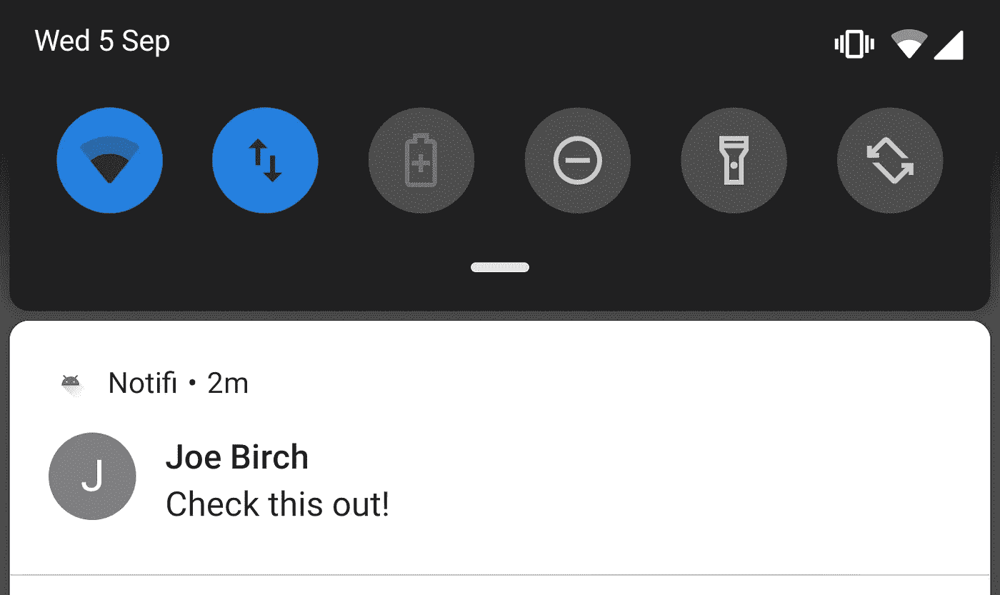
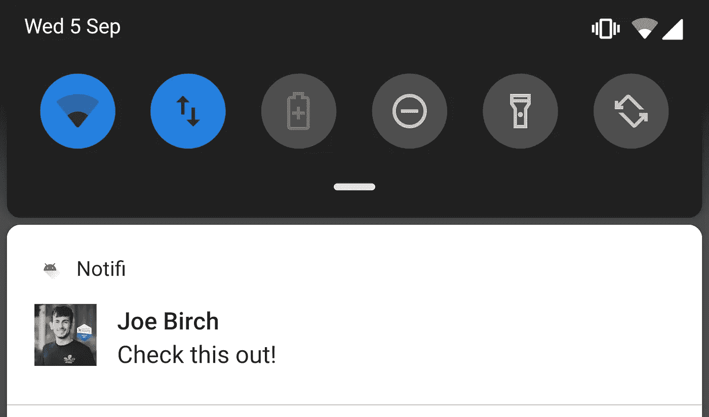
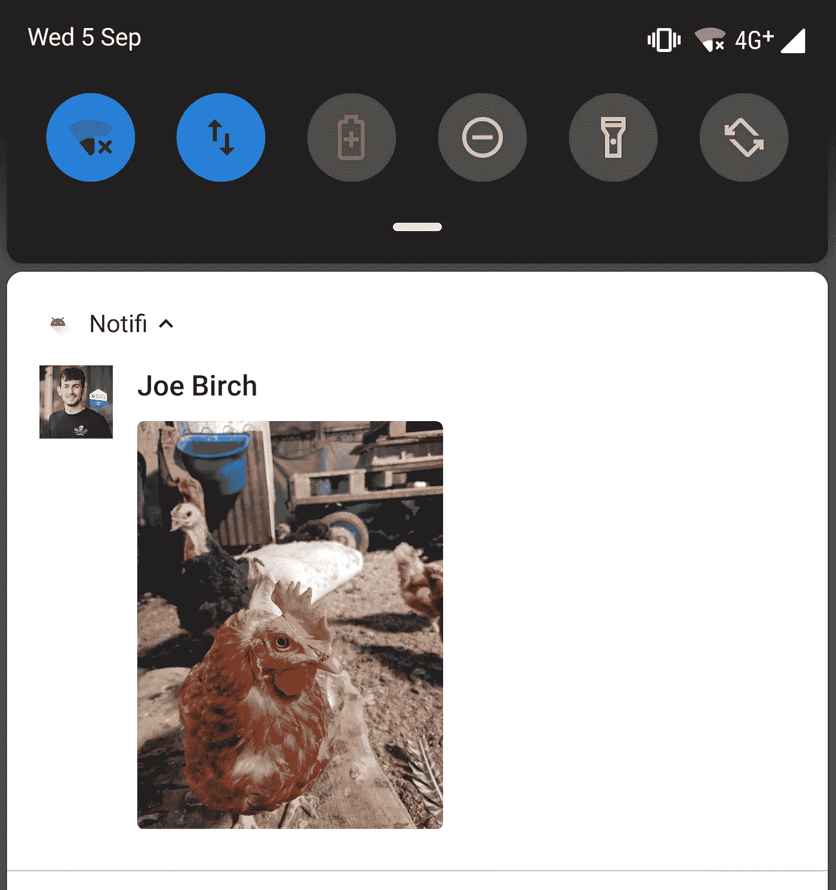
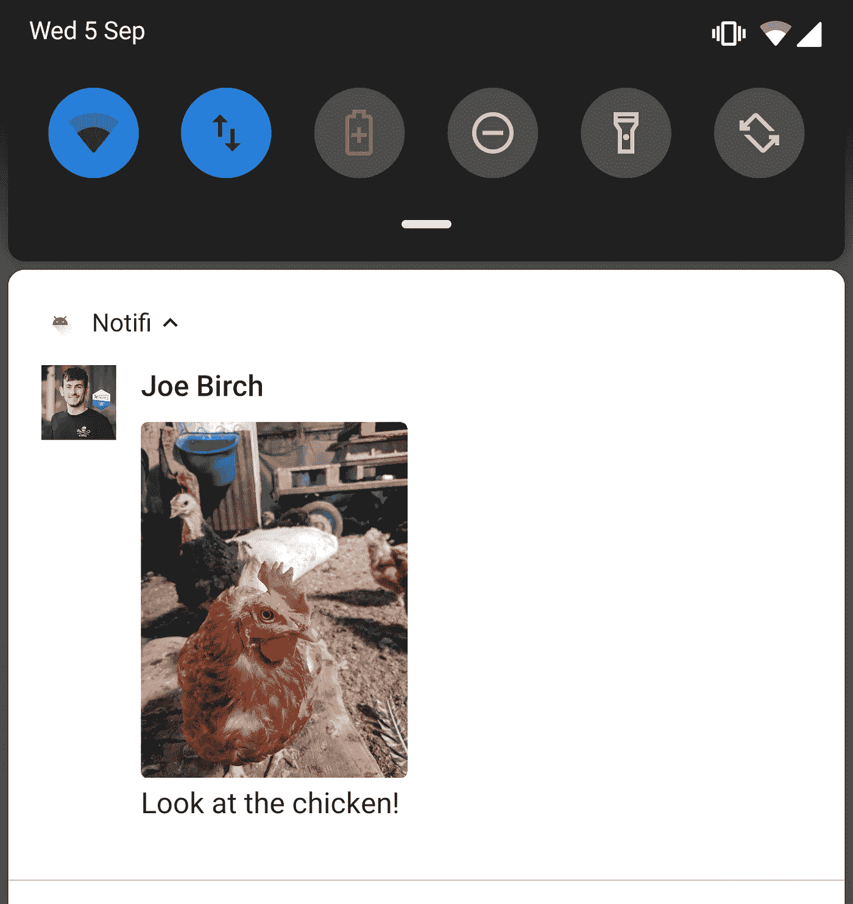
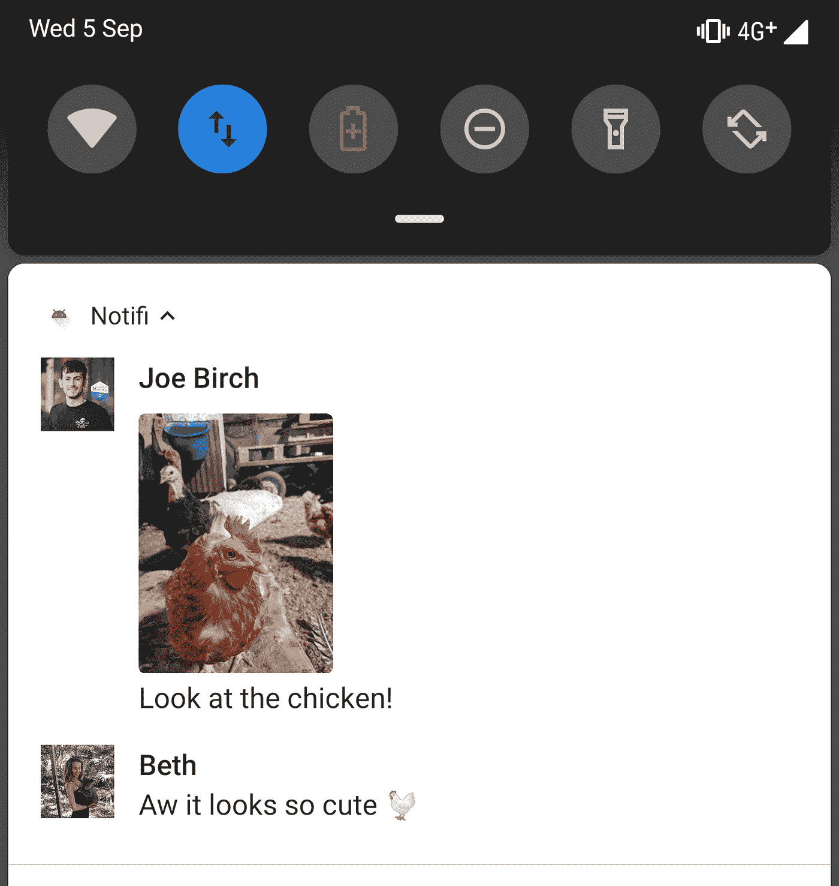
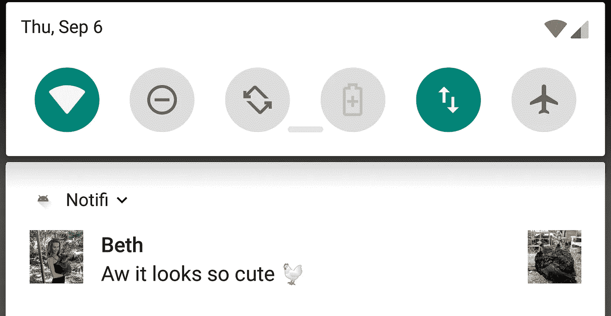

# 探索 Android P:增强的通知

> 原文：<https://medium.com/google-developer-experts/exploring-android-p-enhanced-notifications-a9adb8d78387?source=collection_archive---------0----------------------->


随着 Android P 的出现，我们可以在自己的应用程序中使用许多新的特性和 API。这些新特性中的一些属于通知 API，允许我们为应用程序创建更多上下文相关和详细的通知。在这篇文章中，我想深入探讨已经添加到通知 API 中的新的通知增强。

[](http://eepurl.com/dIKgiT)

通知的这一增强主要集中在通知内容中的消息显示。我们要看的第一部分，是某个作者对这些信息的展示。要在您的通知中显示消息，您可能以前使用过 [addMessage()](https://developer.android.com/reference/android/app/Notification.MessagingStyle.html#addMessage(java.lang.CharSequence,%20long,%20java.lang.CharSequence)) 函数—该函数允许您传入发件人姓名，显示通知中消息来自谁的文本表示。这个函数现在已被弃用，并被一个新的 [addMessage()](https://developer.android.com/reference/android/app/Notification.MessagingStyle.html#addMessage(java.lang.CharSequence,%20long,%20android.app.Person)) 函数所取代——这个替换允许我们传入一个 [Person](https://developer.android.com/reference/android/app/Person) 的实例，该实例将用于将消息与特定的人联系起来，并在通知内容中使用这些细节作为上下文表示。这可以让我们为通知提供更多有用的内容，改善用户的体验。

现在，当涉及到构建通知时，您仍将以同样的方式进行:

```
val notificationBuilder = NotificationCompat.Builder(this, ...)
        .setSmallIcon(...)
        .setContentTitle(...)
        .setContentText(...)
        .setPriority(...)
```

我们稍后将需要该引用，但是我们现在将保留它——让我们继续创建我们之前提到的 Person 类的一个实例。我们将使用这个类的构建来创建一个简单的 Person 实例，并为其分配一个名称:

```
val sender = Person.Builder()
        .setName(R.string.user_name)
        .build()
```

然后，我们可以继续使用 addMessage()函数，传递要在通知中显示的文本，以及消息绑定的时间和发送者。记住，这里需要使用 setBuilder()函数来引用我们之前定义的通知生成器:

```
NotificationCompat.MessagingStyle(sender)
        .addMessage("Check this out!", Date().*time*, sender)
        .setBuilder(notificationBuilder)
```

最后，您可以像以前一样显示您的通知:

```
NotificationManagerCompat.from(this)
        .notify(..., notificationBuilder.build())
```

当显示此通知时，您会注意到显示了我们的消息，以及发件人姓名和 Person 实例的默认图标:



虽然这是非常整洁，我们可以做得更好一点！我们可以为一个人设置的其他属性之一是要使用的图标，这是通过使用 setIcon()函数来完成的，该函数获取一个图标的实例:

```
val sender = Person.Builder()
        .setName(R.string.user_name)
        .setIcon(Icon.createWithBitmap(bitmap))
        .build()
```

如果我们继续，再次显示通知，那么您会注意到，我们现在有了一个与该通知消息关联的人的漂亮的可视化表示:



person 类还有一个其他属性的集合，我们可以使用以下函数来应用这些属性:

*   [setImportant()](https://developer.android.com/reference/android/app/Person.Builder.html#setImportant(boolean)) —使用布尔值指定此人是否重要。如果是设备所有者经常与之交互的人，则可能会出现这种情况—只有在没有为此人实例提供 URI 的情况下才需要设置。
*   [setKey()](https://developer.android.com/reference/android/app/Person.Builder.html#setKey(java.lang.String))—为该人员实例设置唯一的字符串标识符。如果人员的显示名称不是唯一的表示形式，例如简称，这将非常有用。
*   [setUri()](https://developer.android.com/reference/android/app/Person.Builder.html#setUri(java.lang.String))—[contacts contract 的字符串表示。CONTENT_LOOKUP_URI](https://developer.android.com/reference/android/provider/ContactsContract.Contacts.html#CONTENT_LOOKUP_URI) 将此人与存储在用户设备上的联系人联系起来。如果在此人员实例上设置了图标，则此 URI 中的图标将被忽略。
*   [setBot()](https://developer.android.com/reference/android/app/Person.Builder.html#setBot(boolean)) —传入一个布尔值来指定这个 person 实例是机器还是人。

既然我们的通知发送者看起来非常漂亮，那么我们可以对消息内容本身做些什么呢？这里一个很好的新功能是支持通知中的内嵌图像——为了实现这一点，我们可以简单地在消息实例中使用 setData()函数，为要使用的图像提供一个 URI:

```
val message = Notification.MessagingStyle.Message(message, 
        time, sender)
        .setData("image/", chickenUri)
```

然后像前面一样，使用 addMessage()函数传递我们的消息:

```
Notification.MessagingStyle(sender)
        .addMessage(message)
        .setBuilder(mBuilder)
```

当显示我们的通知时，您可以看到我们有一个漂亮的内嵌图像与正在显示的消息相关联:



此时，假设我要向此对话发送另一条消息，那么我们可以使用 addMessage()函数继续链接它们:

```
Notification.MessagingStyle(sender)
        .addMessage(message)
        .addMessage(messageTwo)
        .addMessage(messageThree)
        .setBuilder(mBuilder)
```

如果一条消息中的 Person 实例与前一条消息的 Person 相同，那么这条消息将简单地链接到前一条消息的内容上:



并且如果该消息的人实例与先前消息的人不同，则该消息将被视为新的实体，并且该人将在该消息旁边显示，以描述上下文的变化:



我们可以在通知上设置的另一个属性是 **isGroupNotification** 属性，这可以在构建 MessagingStyle 时使用 [setGroupConversation()](https://developer.android.com/reference/android/app/Notification.MessagingStyle#setGroupConversation(boolean)) 函数来完成:

```
Notification.MessagingStyle(sender)
        .addMessage(message)
        .setGroupConversation(true)
        .setBuilder(mBuilder)
```

设置此属性会将通知中的消息标识为群组对话的一部分。同样需要注意的是，在 Android P 上，如果您的通知希望使用通知构建器上的 setLargeIcon()函数显示一个大图标，那么这个属性必须设置为 true。设置后，大图标将在折叠时显示在通知的右侧:



在 Android P 中，我们现在也有能力为我们的通知动作分配语义，虽然这不会改变通知的外观或感觉，但它允许我们为通知动作分配一个语义值的预定义参考。在构建您的通知操作时，您可以使用 [setSemanticAction()](https://developer.android.com/reference/android/app/Notification.Action.Builder#setSemanticAction(int)) 函数来实现这一点。假设我们有一个通知操作，它会给发送最后一条消息的人打电话，那么我们将使用 **SEMANTIC_ACTION_CALL** 来表示它的语义:

```
val action = NotificationCompat.Action.Builder(...)
    .setSemanticAction(*SEMANTIC_ACTION_CALL*)
    .build()
```

目前支持以下语义动作值:

*   `[SEMANTIC_ACTION_NONE](https://developer.android.com/reference/android/app/Notification.Action.html#SEMANTIC_ACTION_NONE)`
*   `[SEMANTIC_ACTION_REPLY](https://developer.android.com/reference/android/app/Notification.Action.html#SEMANTIC_ACTION_REPLY)`
*   `[SEMANTIC_ACTION_MARK_AS_READ](https://developer.android.com/reference/android/app/Notification.Action.html#SEMANTIC_ACTION_MARK_AS_READ)`
*   `[SEMANTIC_ACTION_MARK_AS_UNREAD](https://developer.android.com/reference/android/app/Notification.Action.html#SEMANTIC_ACTION_MARK_AS_UNREAD)`
*   `[SEMANTIC_ACTION_DELETE](https://developer.android.com/reference/android/app/Notification.Action.html#SEMANTIC_ACTION_DELETE)`
*   `[SEMANTIC_ACTION_ARCHIVE](https://developer.android.com/reference/android/app/Notification.Action.html#SEMANTIC_ACTION_ARCHIVE)`
*   `[SEMANTIC_ACTION_MUTE](https://developer.android.com/reference/android/app/Notification.Action.html#SEMANTIC_ACTION_MUTE)`
*   `[SEMANTIC_ACTION_UNMUTE](https://developer.android.com/reference/android/app/Notification.Action.html#SEMANTIC_ACTION_UNMUTE)`
*   `[SEMANTIC_ACTION_THUMBS_UP](https://developer.android.com/reference/android/app/Notification.Action.html#SEMANTIC_ACTION_THUMBS_UP)`
*   `[SEMANTIC_ACTION_THUMBS_DOWN](https://developer.android.com/reference/android/app/Notification.Action.html#SEMANTIC_ACTION_THUMBS_DOWN)`
*   `[SEMANTIC_ACTION_CALL](https://developer.android.com/reference/android/app/Notification.Action.html#SEMANTIC_ACTION_CALL)`

最后，我们可能希望在应用程序中利用一些其他的小变化。首先是从通知中检索草稿输入内容的能力，该通知以前来自已关闭的消息通知。在这里，我们可以使用 [EXTRA_REMOTE_INPUT_DRAFT](https://developer.android.com/reference/android/app/Notification#EXTRA_REMOTE_INPUT_DRAFT) 键来检索这个值，并将其分配为通知的远程输入消息的**content INPUT**——允许我们的用户轻松地继续他们离开的地方。

另一个变化来自于 [setChoices()](https://developer.android.com/reference/android/app/RemoteInput.Builder#setChoices(java.lang.CharSequence%5B%5D)) 函数。虽然从 API 级别 20 开始我们就可以使用这些选项，但是当设备至少运行 Android P (API 级别 28)时，这些选项将**总是**显示。

在这篇文章中，我们看了一下 Android P 中为通知引入的一些增强功能。我希望这能让我们了解如何让我们的通知对用户来说更具上下文和视觉效果。您是否在应用中使用了这些新的通知 API，或者在开始使用之前有什么问题吗？请随意联系🙂

[](https://twitter.com/hitherejoe) [## 乔·伯奇(@hitherejoe) |推特

### 乔伯奇的最新推文(@hitherejoe)。Android 主管和高级工程师。@缓冲。谷歌开发专家…

twitter.com](https://twitter.com/hitherejoe) [](http://eepurl.com/dIKgiT)